# 使用命令行深入 Git——每天都需要 Git 命令

> 原文：<https://medium.com/nerd-for-tech/dive-into-git-with-command-line-daily-need-git-commands-bacfecf952cd?source=collection_archive---------29----------------------->

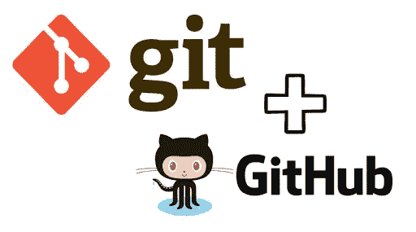

Git 这个词是一个用来侮辱人的俚语，表示一个令人讨厌的、幼稚的、令人讨厌的傻瓜。好吧，我们今天要说的 git 没有那个意思。

在我看来，学习 **Git 对程序员来说是必不可少的，尤其是对开发人员来说**。我从 2019 年开始使用 Git，这让我节省了很多时间。

在使用 Git 之前，我习惯于将我写的代码复制到 u 盘中，并与我的团队成员的代码合并。这是一场灾难。在合并每个人的项目时会有很多冲突，你会感到沮丧。

**所以让我们开始讨论 Git。**

# **什么是饭桶？—简介**

Git 是一个免费的开源分布式版本控制系统。它旨在快速高效地处理从小型到大型的项目。Git 的目的是跟踪项目和文件，因为它们会随着不同用户的操作而改变。

Git 将关于我们项目的信息存储在一个存储库中，并且它拥有我们所做的提交。

所有这些信息都存储在 ***中。git*** 文件在你的项目里面。大多数时候。在大多数系统中，默认情况下 git 文件是隐藏的。

当你作为一个学期工作时，每个人都可以有自己的分支，然后可以合并为一个单独的项目。

# **为什么 git 要命令行？**

我见过大多数人使用 GitHub 或 BitBucket，并使用 GUI 做所有必要的事情。使用它们会更容易，但是如果你遇到更大的错误或冲突，使用命令行会更容易解决。因此，git 今天最好使用命令行。

# **入门**

通过在命令行/终端上键入 **git version** 来检查您的机器上是否已经安装了 Git。

如果你还没有安装 git，可以查看安装 Git 的文档并下载到你的操作系统中。[https://git-scm.com/downloads](https://git-scm.com/downloads)

# **配置**

该命令分别设置提交时使用的作者姓名和电子邮件地址。(您的 GitHub 用户名和电子邮件地址)

> **git 配置— —全局用户名“your username”**
> 
> **git 配置--global user . emali " Your @ Email "**

# **初始化 git 存储库**

转到您的项目文件夹并打开 git bash。

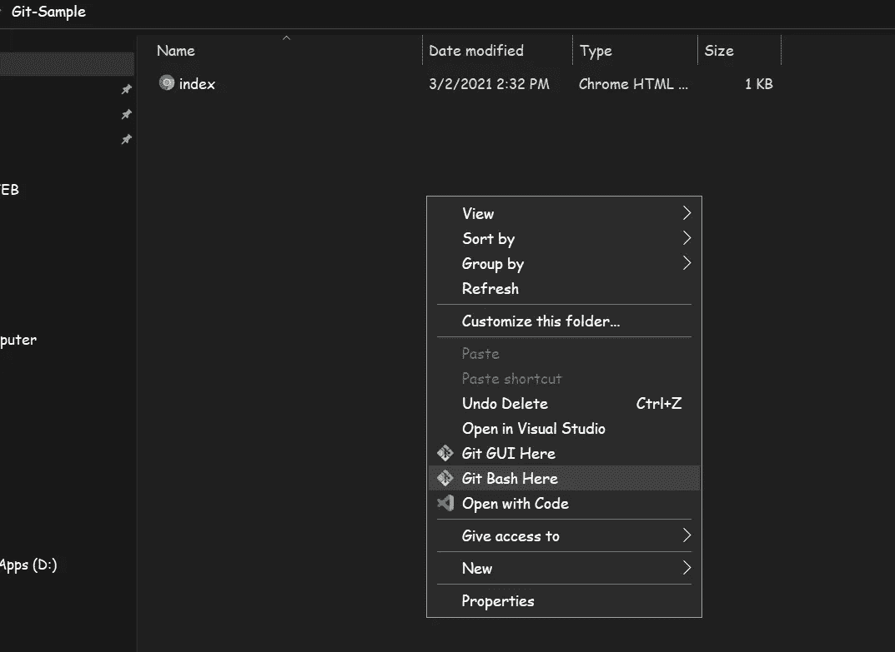

转到项目文件夹，右键单击并选择“Git Bash Here”

然后在 git bash 中键入 ***git init*** 来创建。git 文件。这个文件将存储和跟踪你所有的工作。

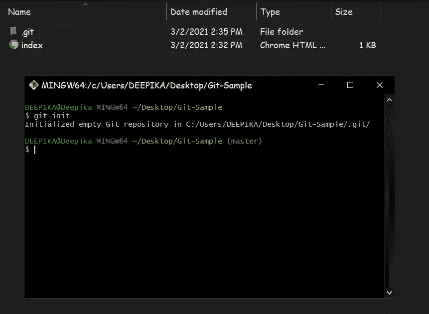

键入“git init ”,这将创建一个空的。git 文件

我已经创建了一个名为**index.html**的项目。使用“ **git status** ”命令检查哪些文件/文件夹未被跟踪(这些文件/文件夹存在于本地，但不是 Git 库的一部分)。

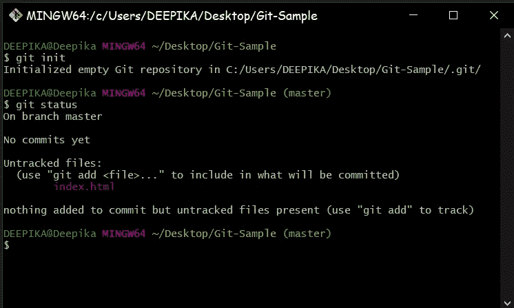

然后使用 add 命令添加您需要的文件。有三种方法可以做到这一点。

> **git 添加<文件名>—只添加一个特定文件**
> 
> **git 添加。** —(带点号)添加文件夹中的所有文件
> 
> **git add -A** —与“git add”相同

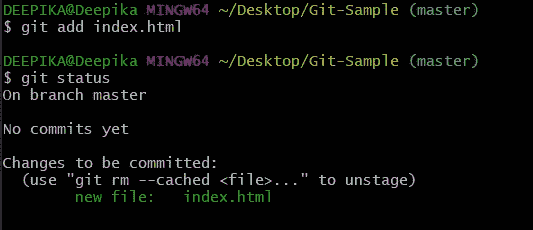

现在 index.html 的档案可以追踪了。如果我们想使它不可跟踪，我们可以使用“ ***git reset <文件名>*** ”命令或“ ***git reset*** ”使所有文件不可跟踪。

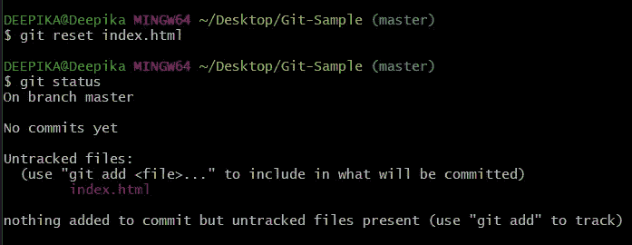

文件被更改为未跟踪。

# **提交文件**

要全面了解不同的承诺方式，请参考本页。[【https://chris.beams.io/posts/git-commit/】](https://chris.beams.io/posts/git-commit/)

*通常我们使用一行消息来提交。为此我们使用***git commit-m " Your message "***命令。但是有时候你需要用不止一行代码来提交。为了知道如何做，请参考上面的链接。*

*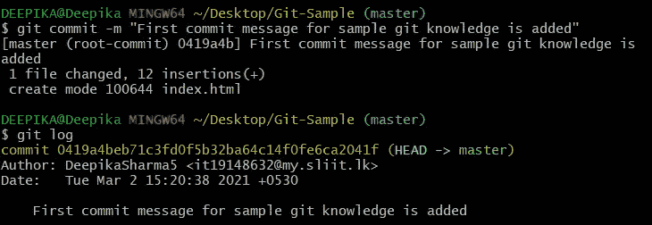*

*我们可以使用" **git log** "来检查我们的提交。*

*我们也可以使用"***git log--one line***"在一行中查看提交细节和提交号(SHA 1)。*

*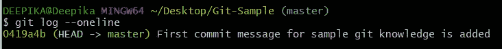*

# ***推送至 GitHub***

*提交消息后，我们可以将提交推送到 GitHub。创建一个存储库并复制该存储库的链接。*

*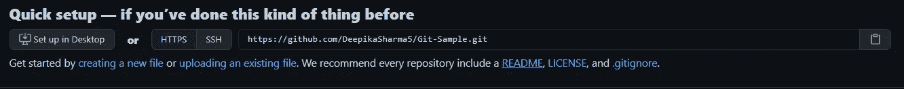*

*复制(您的存储库的)此链接*

*(要了解如何在 GitHub 中创建存储库，请参考文档。[https://docs . github . com/en/github/getting-started-with-github/create-a-repo](https://docs.github.com/en/github/getting-started-with-github/create-a-repo)*

*然后在 bash 中键入"***git branch-M master***"来创建 master branch。然后通过键入“***git remote add origin<your repo link>***”将 git 存储库添加为远程存储库。然后使用“***git push-u origin master***”命令将文件推送到 GitHub。*

*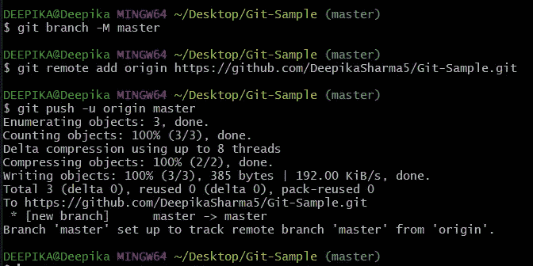*

*成功添加到 GitHub*

*如果我们检查 GitHub，所有的文件都会被添加到那里。*

**

# ***用树枝工作***

*我们可以创建分支，使我们的工作更容易，并防止更多的错误。使用 ***git 分支<分支名称>*** 创建一个分支。*

*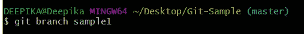*

*创建分支样本 1*

*然后签出到新分支。 ***git 结账<分店名称>****

*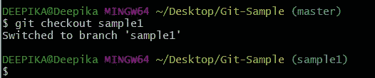*

*现在在你的项目中创建另一个文件/编辑当前文件，并使用 ***git 状态*** 进行检查。然后将提交推送到 sample1 分支。*

*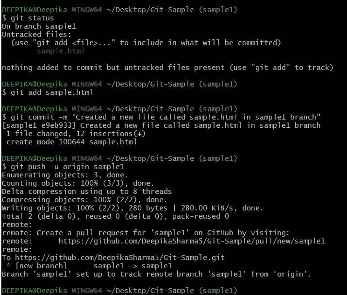*

*现在，如果我们去你的 GitHub 库，我们可以看到将有另一个分支。我们可以看到您通过键入“git branch”创建的分支和当前分支*

*现在，sample1 分支有一个不在主分支中的额外文件。所以现在我们需要将 sample1 分支合并到 master 中。因此，为了做到这一点，我们需要切换到主分支。*

*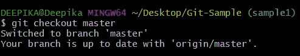*

*然后用“ ***git 合并<分支名称>*** ”来合并分支。然后将更改推送到 GitHub 主分支。*

*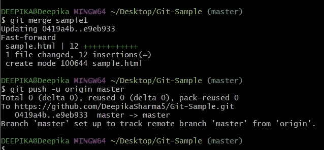*

*现在，如果你检查 GitHub 库，两个文件将被合并。sample.html 文件将被添加到主分支。*

**

# ***合并冲突***

*有时当我们试图合并分支时，我们会遇到一些冲突。*

*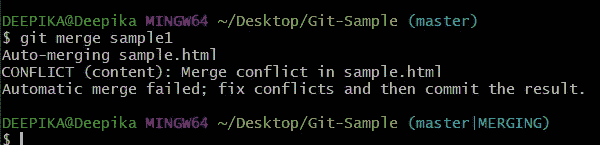*

*如果发生这样的事情，我们需要去 IDE。它会显示哪些是冲突。你可以在 IDE 中编辑并且能够很容易地合并。*

*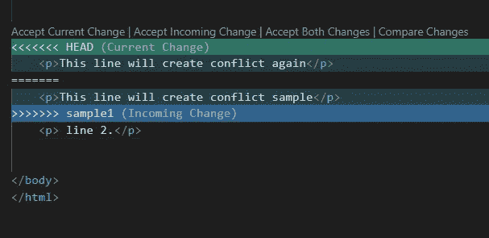*

*您可以从顶部选择并更改，也可以自行编辑。*

*在 IDE 中编辑后，您可以简单地添加文件并提交。然后就自动解决了。对另一个分支也做同样的操作。然后查 GitHub。*

*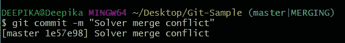**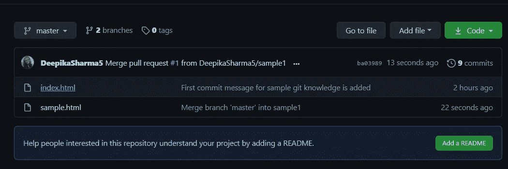*

# ***删除分支***

*所以现在两个分支合并成功。我认为我们不再需要 sample1 分支了。所以我们要删除它。*

*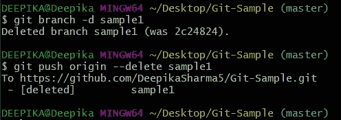*

*命令"***git branch-d<branch name>***"将删除本地存储库中的分支。为了从远程库中删除你需要使用，"***git push origin--删除<分支名称>*** "命令。然后，如果我们检查 GitHub 库，将只有主分支。*

*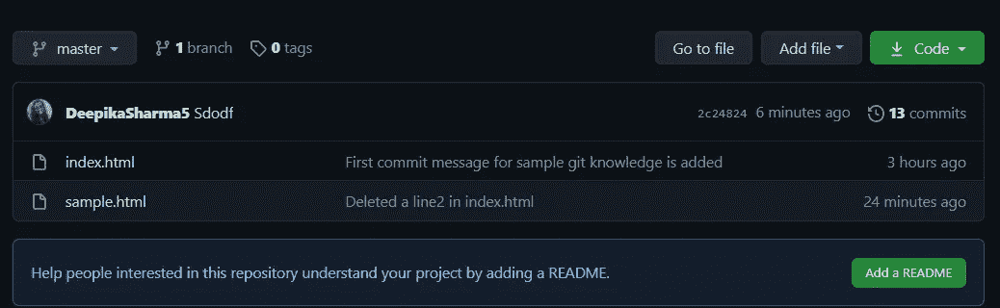*

# ***创建标签***

*Git 标签在你的开发工作流程中被用作参考点。**你**可能想要**创建**新的 **Git 标签**以便引用你软件的给定版本。*

*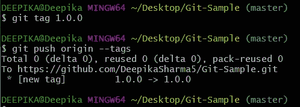**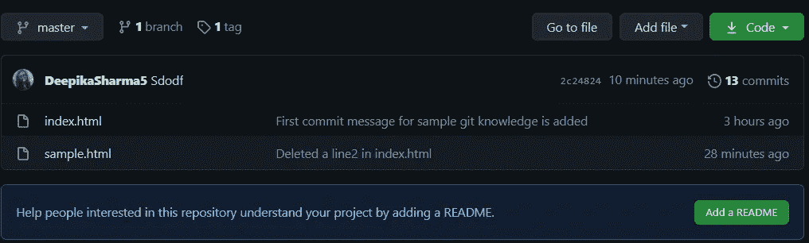*

*你可以看到，在树枝附近有一个标签。您可以添加任意数量的标签。*

*除此之外，还有一些其他基本命令:*

*   ***git pull** :-从远程仓库中提取变更*
*   ***git 克隆<链接>** :-克隆一个项目*
*   ***git remote -v** :-检查克隆库的起源在哪里*
*   *git 分支-a :-我们正在工作的分支*
*   ***git diff** :-显示尚未暂存的文件差异*
*   ***git rm** :-从您的工作目录中删除文件，并准备删除*

# ***结论***

*对 git 使用命令行总是更好。它并不像看起来那么可怕。如果你开始在命令行中做任何事情，它将使你的工作更容易和有趣。*

# ***参考文献***

*   *https://git-scm.com/downloads*
*   *[https://Git-SCM . com/book/en/v2/Customizing-Git-Git-Configuration](https://git-scm.com/book/en/v2/Customizing-Git-Git-Configuration)*
*   *[https://chris.beams.io/posts/git-commit/](https://chris.beams.io/posts/git-commit/)*