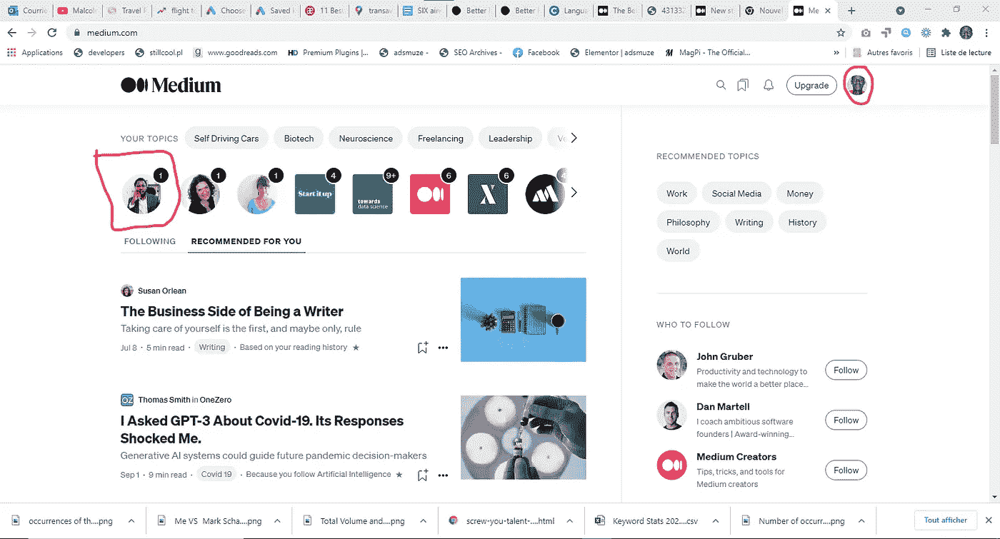
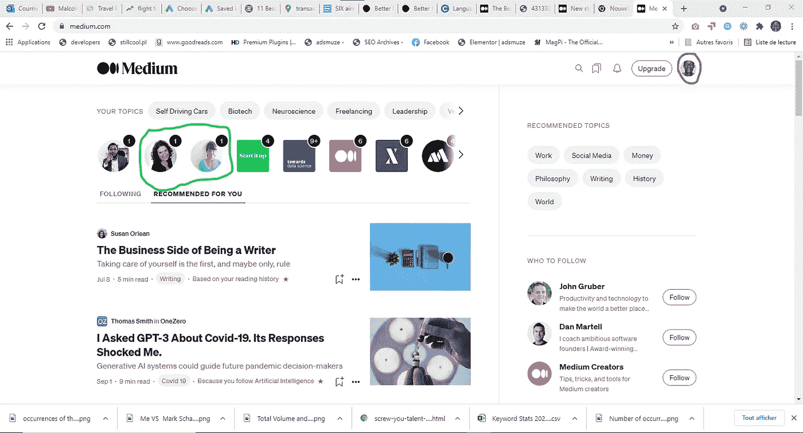
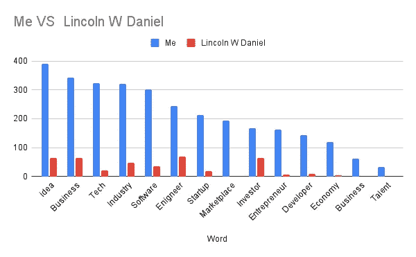
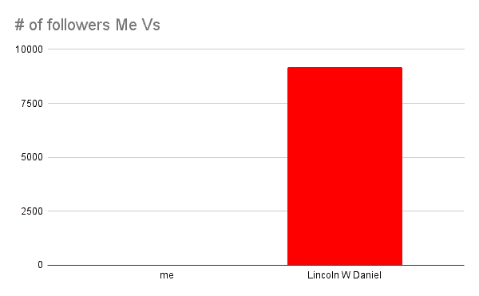
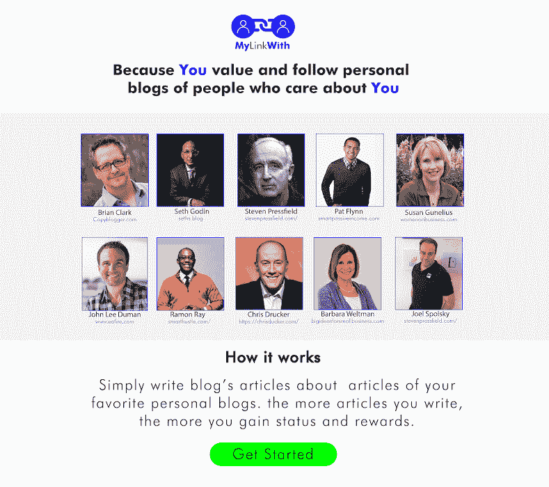

# 多样性和基于位置的内容过滤

> 原文：<https://medium.com/nerd-for-tech/diversity-and-location-based-content-filtering-b4ce2b00b0e4?source=collection_archive---------8----------------------->

## Mbenda 真的配得上她的搜索引擎，为什么其他平台没有呢

是的，考虑到出版平台推荐系统的技术水平和搜索引擎排名因素，当你在非洲写作和在线出版时，你不太可能被其他国家的读者阅读。像你这样的人阅读这样的东西是咒语，这就是机器学习系统的设计方式，如果位置数据是机器学习算法功能的一部分，那么更有可能的是，你会被建议更少的来自非洲的文章，因为像我这样在非洲写作和发表的文章更少。同样显而易见的是，如果机器学习算法将个人资料图像作为一个特征，你更有可能得到像你这样的人的建议，但我不知道比例，以及出版平台和搜索引擎是否真的实现了这一功能，但我真的相信几乎所有的互联网出版，搜索和社交媒体平台都实现了这一功能。

例如，这是我在 medium 上获得的登录页面

我从未要求了解林肯·W·丹尼尔的情况，但当我打开媒体时，他的简介就在这里，我真的发现了他的一些文章，我觉得非常有趣，值得一读，即使我应该同意我不是在读他说的推荐系统的不当行为没有抹去互联网的这一重要特征，这是关于连接伟大的人，我们都是真诚的伟大的人。也许是因为我写了很多关于女性软件工程师的文章，比如[姆本达](https://www.youtube.com/channel/UCFvt89HObOCI_HcbqKHW5Ew)，这让我想到了[斯隆米勒](https://medium.com/u/4764034b55cf?source=post_page-----b4ce2b00b0e4--------------------------------)和[劳伦莫德](https://medium.com/u/b48fc50343aa?source=post_page-----b4ce2b00b0e4--------------------------------)，这两位伟大的女性是我渴望读到的。

我仍然隐藏着许多应该公开的作品，我分享的少数作品是我致力于阅读和追随像塞思·戈丁这样的人的结果，他们真正帮助我克服了写作障碍。但我渴望分享更多，因为如果我是，你应该已经知道，我在上面段落中强调的内容是很久以前在我起草的一些关于技术、营销、工程和想法多样性的书籍和笔记中思考和撰写的。像我们这样的人做这样的事情是我刚刚从 Seth 那里学到的，这是一个非常强大的营销概念，也是一个社区生活方式的真正引擎，它让我们保持联系，不是因为我们是一样的，而是因为我们都是不同的，而是因为我们如此感同身受，以至于我们看到别人就像我们看到自己一样。

这篇文章的灵感来自这条推文

马克·谢弗的精彩回复

在写这篇文章之前，我已经回答了这个问题，以便更详细地了解我在这篇推文中强调的内容

如果我在这条推文中提到的这些科技平台

在制作过程中，我会更多地参与到夸夸其谈中，也就是写一些关于人们的好话，就像我正在做的 [Greyio 心脏实验](https://mkrdiop.medium.com/list/greyio-heart-experiement-6676cc9f1f96)。

但是我会做另一个“比较”(学习)，就像我和[马克·谢弗](https://medium.com/u/3340d9dd0981?source=post_page-----b4ce2b00b0e4--------------------------------)做的那样，但是和[林肯·W·丹尼尔](https://medium.com/u/1e510272a792?source=post_page-----b4ce2b00b0e4--------------------------------)做的那样

拥有媒体是很重要的，我已经写了这个事实。

 [## 拥有平台！拥有媒介

### 因为如果你没有自己的平台，你就是产品，你必须符合准则，并希望挑选…

mkrdiop.medium.com](https://mkrdiop.medium.com/own-the-platform-own-the-medium-262a79aa8c04) 

然后，我认为是时候让你和我建立和拥有我们自己的，并与世界分享我们的伟大作品，同时与人们联系并与他们一起取得成就。

我就是这么看一本书的，像一个能写的人都能拥有的媒介。坐下来写下我们的想法并不容易，这就是为什么我们许多人害怕写作，因为写作是出书旅程的第一步。像你一样，我经常与我的写作障碍作斗争，这是一个神话，并避免将我的作品藏在这些硬盘和云存储的深处，就像这本书一样，我从 2021 年 7 月 25 日开始就没有编辑过，这是一份关于技术多样性的 24 页宣言。我在这篇文章中写的主要想法都在这里，我愿意成为一本值得出版的 99 页的书。

**PS:** 本着这种想法下面

我还没有找到关于这种技术支持的想法的文章

我曾在心里许下承诺，每当她在 youtube 上发布一个视频博客(上面是关于博客的)，我就写一篇关于她的文章。那么这篇文章可以成为实现这一承诺的手段。希望我遵守了我内心的承诺，并将永远遵守。**这一切不都是关于科技的多样性吗**

这是门达的最后一段视频

我真的很纠结于所有这些要编码的想法和要评审的代码。似乎我只是为了不编码而躲在文章后面。