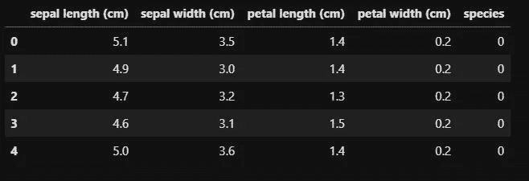
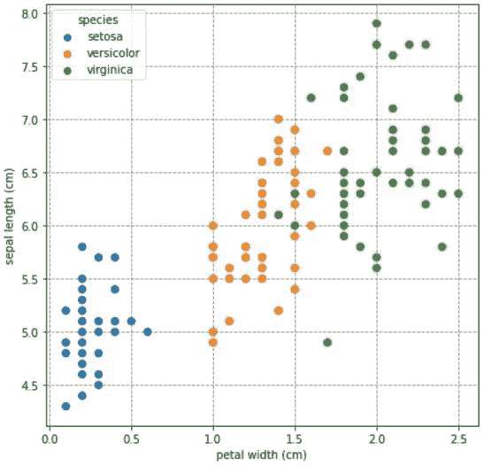
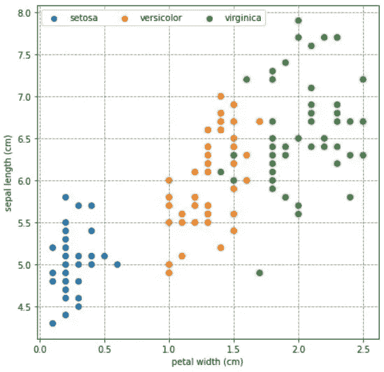
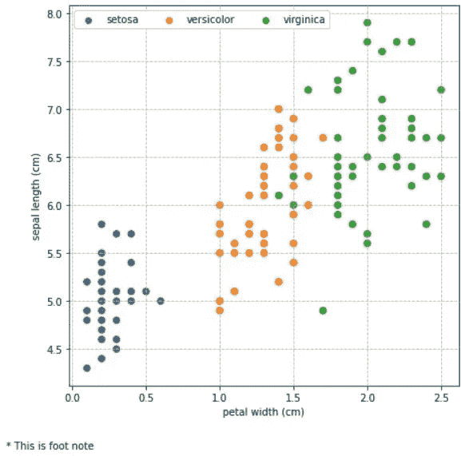
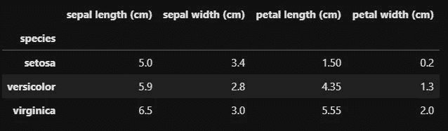
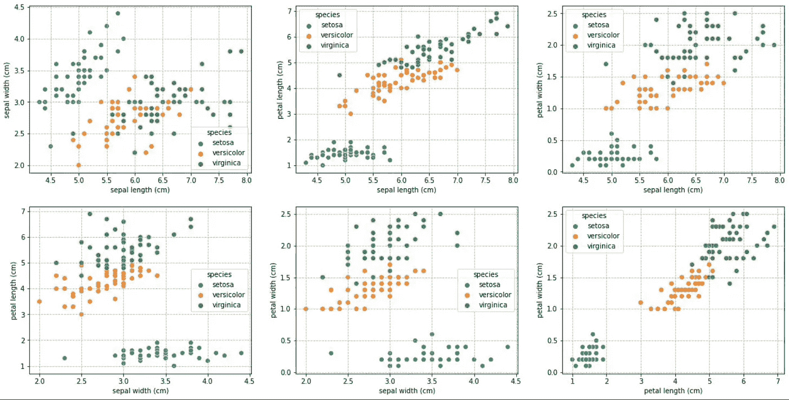
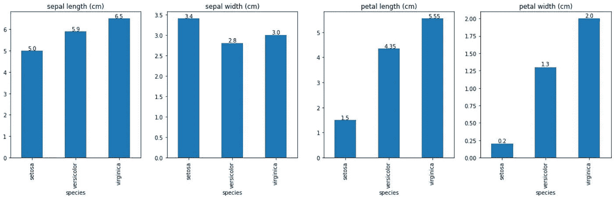
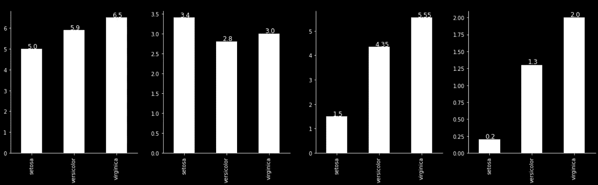
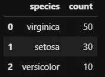
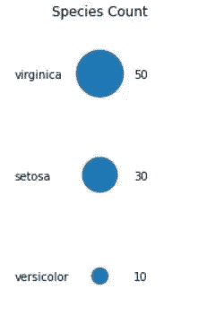

# 深入 Python 绘图

> 原文：<https://medium.com/nerd-for-tech/diving-deep-into-python-plotting-6d2baae4fde1?source=collection_archive---------8----------------------->

> 本文讨论了一些使用“matplotlib”和“seaborn”的高级绘图技术。本文假设读者具备使用“matplotlib”和“seaborn”绘图的工作知识。

图片由[卢克·切瑟](https://unsplash.com/@lukechesser?utm_source=medium&utm_medium=referral)**上的 [Unsplash](https://unsplash.com/?utm_source=medium&utm_medium=referral)**

在本文中，我将使用 Scikit-Learn 包的 ***虹膜数据集。开始之前先准备好资料。***

数据集的前五条记录(作者提供的图片)

# 向绘图添加网格线

我们可以使用 pyplot 的 grid 方法在绘图中添加网格线。“linestyle”参数指定网格线的线条样式。这里它被设置为虚线(“-”)。“color”参数设置网格线的颜色。

作者图片

# 编辑图例

在上面的图中，图例占据了很大的空间，我们可以修改图例的参数，如下所示。可以使用 pyplot 的“legend”方法调整图例。“loc”参数设置图例的位置，“ncol”设置图例的列数，“framealpha”设置图例的透明度，“fontsize”设置图例的字体大小。

作者图片

# 为情节添加脚注

脚注对于传达关于数据的基本细节和假设是必不可少的。可以使用 pyplot 的“figtext”方法将脚注添加到绘图中。

作者图片

# 支线剧情

我们将绘制这三个物种的萼片长度、萼片宽度、花瓣长度和花瓣宽度的中值的四个柱状图。支线剧情可以使用 pyplot 的“支线剧情”方法来绘制。“支线剧情”方法的前两个参数设置支线剧情网格的行和列。“图形大小”设置绘图的大小。

作者图片

作者图片

以上支线剧情分布在单行多列。现在我们来看看分布在多行多列的支线剧情。

作者图片

我们可以向上面的条形图添加数据标签，如下所示。可以使用“文本”方法将数据标签添加到绘图中。在“text”方法中，参数“x”是 x 坐标，“y”是 y 坐标，“s”是要在坐标“x”和“y”处显示的文本。

作者图片

如下所示，我们可以更改绘图的背景和字体颜色。

作者图片

# 使用气泡图显示类别频率

Seaborn 的散点图可用于绘制气泡图，气泡大小随类别计数而变化。以下是 Iris 数据集的物种计数示例。Iris 数据有相同数量的物种，对于这个例子，我修改了物种计数，如下所示。

作者图片

作者图片