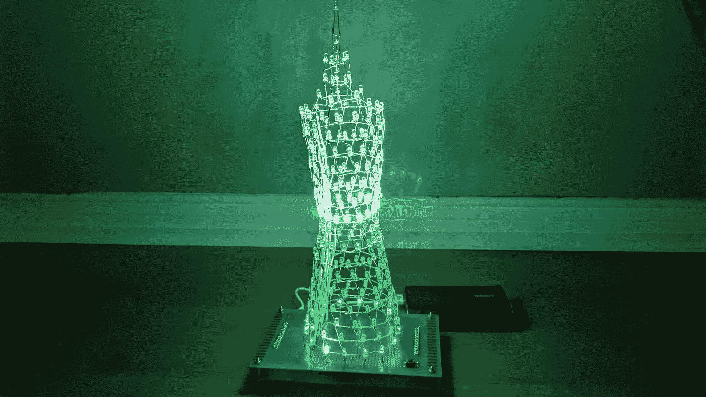

# DIY LED 广州塔

> 原文：<https://medium.com/nerd-for-tech/diy-led-canton-tower-b48b27b52413?source=collection_archive---------7----------------------->

几个月前，我无意中买了 400 个自动闪光的发光二极管，以为它们是白色发光二极管。自动闪烁功能很神奇，但也很烦人，因为没有办法控制动画。但好的一面是，这种 LED 只有两个端子，可以很容易地用在任何 LED 项目中，同时仍能产生奇特的效果，不像常规的 RGB LED 有四个端子，这将使硬件连接更加…