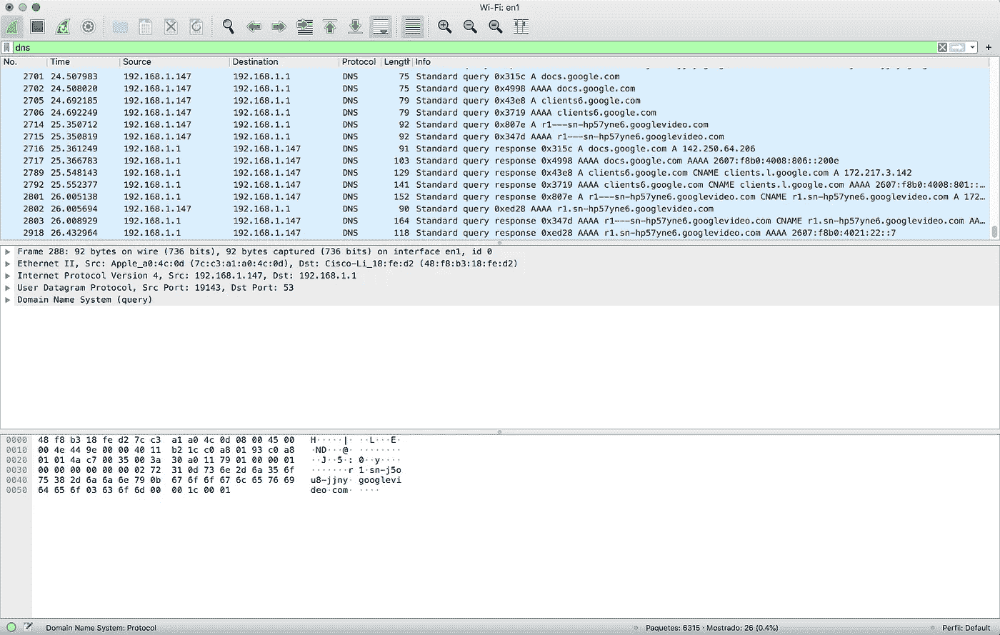
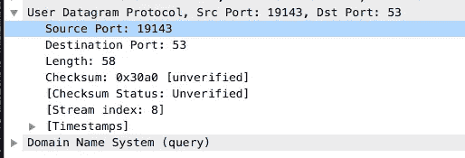

# 简而言之，DNS 分析

> 原文：<https://medium.com/nerd-for-tech/dns-analysis-in-a-nutshell-cbf4ce1926a7?source=collection_archive---------1----------------------->

**DNS** 或域名系统被认为是互联网的电话簿，它是一个以记录形式存储域设置的地方，在这里您可以管理域在 IP 解析、别名、电子邮件服务器和更多高级功能方面的行为。

如果您不熟悉 **DNS** ，您可以在访问服务时看到它们的运行。大多数情况下，会进行递归请求(反向 DNS 查找),因为您很少在浏览器搜索栏中键入 IP 地址。

> 写 davidlares.com 比打 76.76.21.21 容易

此时，许多事件在内部执行，只是为了弄清楚如何访问互联网上的特定服务器。浏览器必须找到哪个是资源的 IP 地址，然后执行适当的 **HTTP** 请求。

**DNS** 解析可以出现在很多地方。下面是浏览器如何解决你的请求。

首先，浏览器检查对应于该特定域的 IP 地址是否存储在**本地缓存**中。

其次，浏览器检查对应于该特定域的 IP 地址是否存储在**系统主机表**中，以防存在静态映射。

*请参考* [*这个*](https://en.wikipedia.org/wiki/Hosts_(file)#Location_in_the_file_system) *资源，它列出了那个主机的表在你的 OS 中的位置。*

如果什么也没找到，它向**本地 DNS 服务器、**和生成一个递归请求。如果还是什么也没找到，该请求将转到一个根服务器，根服务器将该请求递归地重定向到一个更高的服务器，直到找到一个响应。

当找到响应时，会临时缓存在请求流程中交互的每个 **DNS** 服务器实例中。所有可能的 **DNS** 记录也是如此，如:`AAAA`、`CNAME`、`NS`、`MX`、`TXT`等。

上面解释的过程只是一个简单的 web 请求的例子。但是比这更复杂的是，在安全方面, **DNS** 流量以纯文本形式传输。

**DNS** 流量在 **OSI** 模型的传输层中使用 **UDP** 协议，但在应用层中被发现为 **DNS** 流量，可通过端口 53 访问。因为是 UDP**没有会话，所以不考虑该层，数据包是独立的。**

## 快速动手演示

请下载、安装并打开 [Wireshark](https://www.wireshark.org/) 。

1.  选择您想要的实例
2.  在过滤栏中设置一个 DNS 过滤:添加`dns`作为标准。类似这样的东西



分析数据包细节部分，你会发现有一个用户数据报协议部分。



UDP 数据包信息

和上面一样，你可以找到 Ipv4 找到通讯细节。下面，是 DNS 查询的详细信息。

另一种解决了解 DNS 记录的方法是执行一个`nslookup`命令。您可以执行以下操作:

`nslookup gmail.com`或者:

```
nslookup
> gmail.com
```

或者:

```
nslookup
> set type=MX gmail.com
```

## 由此可以得出什么结论？

如果由于任何原因，一个 DNS 服务器暴露在互联网上，很容易看到流量表，导致任何可能的攻击或记录注入(DNS 中毒)。

保护 DNS 服务器是必需的，它们不是为安全连接设计的。

快乐编码:)