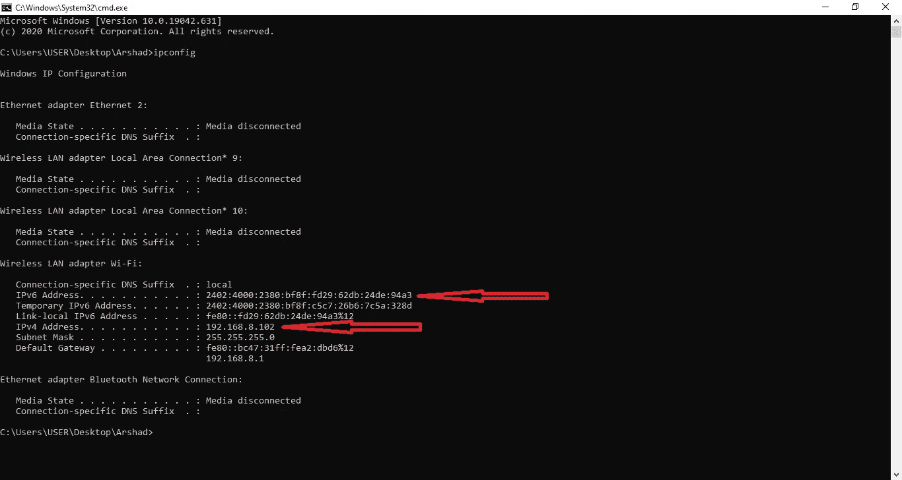
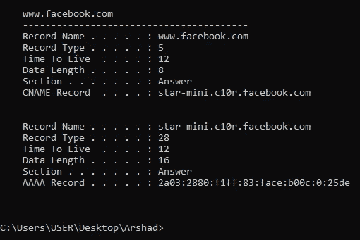
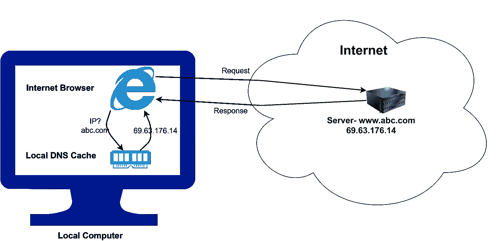
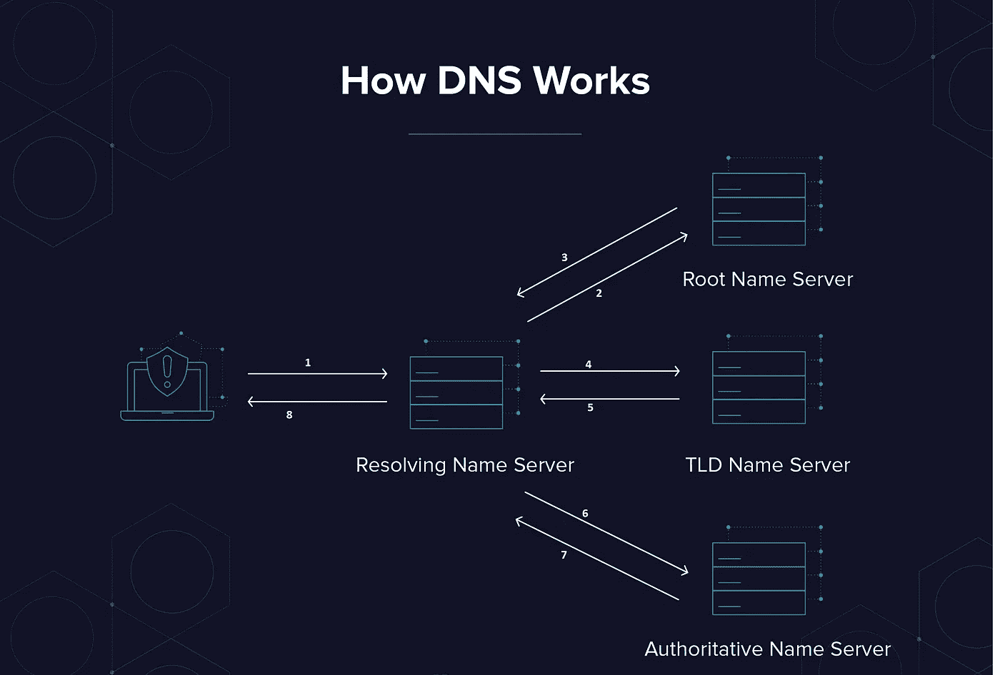
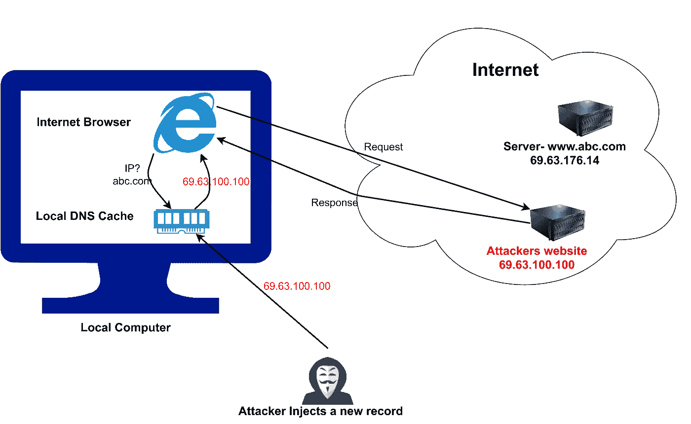

# DNS 与 DNS 欺骗

> 原文：<https://medium.com/nerd-for-tech/dns-vs-dns-spoofing-d8a7c2628379?source=collection_archive---------20----------------------->


图片由- [谷歌](https://www.google.com/search?q=hacking+hd+wallpapers+1080p&tbm=isch&ved=2ahUKEwiVz4rHi9PwAhURBXIKHWQUC3IQ2-cCegQIABAA&oq=hacking+hd+wallpapers+1080p&gs_lcp=CgNpbWcQAzIECCMQJ1DoxwRY6McEYKTNBGgAcAB4AIABuwGIAbsBkgEDMC4xmAEAoAEBqgELZ3dzLXdpei1pbWfAAQE&sclient=img&ei=DKCjYJWZDpGKyAPkqKyQBw&bih=657&biw=1366&rlz=1C1CHWA_enCA615CA615#imgrc=CKmizzLvn1YG3M)

要理解 DNS 欺骗，我们必须对 DNS 服务器及其工作原理有足够的了解。

# 互联网是如何工作的？(概述)

世界上每一台连接到互联网的设备都将拥有一个唯一的 IP 地址。IP 地址是在互联网或本地网络上标识设备的唯一地址。术语 IP(互联网协议)指的是一组规则的集合，这些规则规定了通过互联网或本地网络传输的数据的格式。

如果您目前连接到互联网，您也有一个唯一的 IP 地址。在命令提示符(CMD)中输入以下命令，在 Windows 计算机上查找您的 IP 地址。

```
ipconfig
```



ipconfig 命令的输出

和我们一样，为客户端提供服务的服务器也拥有自己唯一的 IP 地址。

> 因此，例如，当我们试图通过互联网访问脸书时，我们的本地机器将我们的请求发送到脸书的 IP 地址，而脸书将它的响应发送到我们设备的 IP 地址。

这是两台设备通过互联网或本地网络相互通信的方式。

**现在你可能会想到以下问题，**

1.  为了访问服务器，是否需要记住每台服务器的 IP 地址？
2.  我们可以通过简单地输入网址来访问一个网站，即使我们不知道它 IP 地址。它是如何发生的？

为了解决上述问题，我们必须将注意力集中在域名、DNS 和 DNS 服务器上。所以，让我们来看看每一个，

## 域名

IP 地址由域名表示，域名是一个**文本串**。

> 代表前任:www.facebook.com

人类使用域名来记忆、识别和连接特定的网站服务器，因为 IP 地址很难记忆。

> 例如，域名“[www.facebook.com](http://www.facebook.com)”用于表示 69.63.176.13 脸书的 IP 地址。

## 域名系统(DNS)

DNS 用于将域名转换成由域名表示的特定 IP 地址。

## **域名系统服务器(DNS 服务器)**

DNS 服务器是一组四种服务器类型，它们一起执行 DNS 查找。解析名称服务器、根名称服务器、顶级域名(TLD)服务器和权威名称服务器是包含在 DNS 服务器中的服务器。

# DNS 是如何工作的？

解析域名的过程经历了几个阶段。我们通过一个例子来理解这一点。

假设你需要访问 www.abc.com。结果，你将在浏览器的地址栏中输入 www.abc.com 的 T2 并运行搜索。

## 第一步

在进入外部之前，你的计算机检查它的本地 **DNS 缓存**数据库，看看 abc.com 的 IP 是否已经被请求。

> 什么是 DNS 缓存？
> 
> 每台计算机都有一个存储最新 DNS 请求的 DNS 缓存。我们最近访问的服务器的 IP 地址将存储在这里，与它的域名相对应。此处存储的记录是临时的，一旦记录的 TTL(生存时间)期限到期，特定的记录将被删除。

要在 windows 计算机中查看本地 DNS 缓存中的记录，请在 CMD 中输入以下命令

```
ipconfig/displaydns
```



iponfig/displaydns 命令的输出

要删除本地 DNS 缓存中的全部记录，请使用以下命令

```
ipconfig/flushdns
```

现在让我们回到我们的例子，



从本地缓存中查找 DNS

当 DNS 缓存包含 abc.com 的 IP 地址时，浏览器从那里获取 IP 地址，并通过向服务器的 IP 地址发送数据直接连接到 abc.com。

如果在本地 DNS 缓存中找不到 abc.com 的 IP 地址，浏览器会向解析名称服务器发送请求，询问 abc.com 的 IP 地址。解析名称服务器通常由您的 ISP(互联网服务提供商)提供

## 第二步

当**解析名称服务器**接收到请求时，它在记录中搜索所请求的 IP 地址。当在解析名称服务器的缓存记录中找到 IP 地址时，浏览器从那里检索 IP 地址并连接到网站，并且浏览器还将记录保存在其 **DNS 缓存**中以备将来请求。

如果找不到 IP 地址，需要执行一些步骤

## 第三步

当**解析服务器**没有 IP 地址时，它向**根域名服务器**发送请求。

> 什么是根域名服务器？
> 
> IP 地址没有映射到根服务器中的域名。相反，根服务器跟踪所有顶级域名(TLD)服务器的信息，并指向它们的位置。

根据我们的例子，“abc.com”的顶级域名是“.”。com”。因此，我们的根服务器返回负责“的 **TLD 服务器**的信息。com”域转换为解析名称服务器。

当解析名称服务器找到合适的 TLD 服务器时，它向该 TLD 服务器发送一个请求。

> 什么是 TLD(顶级域名)服务器？
> 
> 二级域名的信息存储在 TLD 服务器上。TLD 服务器将返回适当的权威域名服务器的信息，其中可能包含我们试图访问的网站的 IP 地址。

结果，在我们的例子中，TLD 服务器返回了可能具有 abc.com IP 地址的权威域名服务器的信息

当解析名称服务器找到合适的权威名称服务器时，它向该权威名称服务器发送请求，询问 abc.com 的 IP 地址。

> 什么是权威名称服务器？
> 
> 权威服务器是 DNS 查找请求的最终目的地。它们存储与域名对应的 IP 地址。因此，它们将我们试图访问的网站的 IP 地址返回给解析名称服务器。

根据我们的示例，如果权威名称服务器找到 abc.com 的 IP 地址，它将该 IP 地址发送到解析名称服务器。然后，解析名称服务器将 IP 地址保存在其缓存数据库中，并将该 IP 地址发送到我们的本地计算机。然后，我们的计算机也将 IP 地址保存在其 DNS 缓存中，并通过直接连接到接收到的 IP 地址来显示 abc.com。



DNS 如何工作

# 什么是 DNS 欺骗？

DNS 欺骗是一种将在线流量转移到欺诈网站的网络攻击形式。攻击者通过修改 DNS 记录来实现这一点。攻击者可以访问 DNS 服务器或 DNS 缓存，并通过用虚假网站的 IP 地址替换真实 IP 地址来修改 DNS 记录。因此，当用户试图使用其域名访问网站时，用户将登录攻击者的欺诈网站，而不是登录实际的网站。

DNS 欺骗非常难以检测，因为攻击者的假冒网站看起来与用户试图访问的原始网站完全相同。

# DNS 欺骗攻击的类型

## DNS 缓存中毒

DNS 缓存中毒是 DNS 欺骗的一种用户端方法，在这种方法中，您的系统会将欺诈性 IP 地址记录在本地内存缓存中。因此，它将只针对你，并推动你登陆欺诈网站，即使问题得到解决或从未存在于服务器端。



DNS 缓存中毒

## DNS 服务器劫持

在 DNS 服务器劫持中，攻击者直接修改 DNS 服务器的记录，以便将所有请求用户重定向到恶意网站。一旦一个伪造的 DNS 条目被注入到 DNS 服务器上，任何对欺骗域名的 IP 请求都将登陆到欺诈网站。


DNS 服务器劫持

# DNS 欺骗的影响

*   **用户的机密数据可能会被攻击者**窃取，因为用户可能会相信虚假网站是真实网站而提供他们的机密数据。
*   另一个与 DNS 欺骗相关的常见威胁是**恶意软件感染**。攻击可能会将您重定向到一个会自动开始恶意下载的站点。下载是感染计算机的一种快速简单的方法。最后，如果你不使用互联网保护，你很容易受到威胁，如间谍软件，键盘记录器和蠕虫。

# 如何防止 DNS 欺骗

## 网站所有者和 DNS 服务器提供商的防范技巧

*   **使用 DNS 欺骗检测工具:**这些工具会在发送响应之前持续扫描所有收到的数据。
*   **使用域名系统安全扩展(DNSSEC):** DNSSEC 是一个协议集合，它为域名系统(DNS)查找和交换流程增加了一层额外的保护，使 DNS 查找可信且无欺骗。
*   **使用端到端加密:**由于攻击者无法解密数据，他们就无法更改数据。

## 针对用户的预防提示

*   **清空您的 DNS 缓存(如果您怀疑自己是受害者):**在您清除受感染的文件之前，缓存中毒可能会在您的设备中持续很长时间。要刷新 windows 计算机中的 DNS 缓存，请在 CMD `ipconfig/flushdns`中使用以下命令。
*   **使用虚拟专用网络(VPN):** VPN 将为您提供使用端到端加密请求的专用 DNS 服务器。换句话说，它可以为您提供欺骗免费 DNS 查找

# 继续学习❤️

# 参考

[](https://www.kaspersky.com/resource-center/definitions/dns) [## 什么是 DNS 缓存中毒和 DNS 欺骗？

### 域名系统(DNS)中毒和欺骗是利用 DNS 服务器漏洞进行攻击的网络攻击类型…

www.kaspersky.com](https://www.kaspersky.com/resource-center/definitions/dns) [](https://www.namecheap.com/support/knowledgebase/article.aspx/9717/2232/what-is-dnssec/) [## 什么是 DNSSEC？-域名-Namecheap.com

### 了解什么是 DNSSEC？。在 Namecheap 知识库中找到您的答案。

www.namecheap.com](https://www.namecheap.com/support/knowledgebase/article.aspx/9717/2232/what-is-dnssec/) [](https://phoenixnap.com/kb/what-is-domain-name-system-works) [## 什么是域名系统&它是如何工作的？| PhoenixNAP KB

### 域名系统(DNS)最早出现于 20 世纪 80 年代初。它代表了一个互连的服务器系统…

phoenixnap.com](https://phoenixnap.com/kb/what-is-domain-name-system-works) [](https://www.kaspersky.com/resource-center/definitions/what-is-an-ip-address) [## 什么是 IP 地址-定义和解释

### IP 地址是在互联网或本地网络上标识设备的唯一地址。IP 代表“互联网…

www.kaspersky.com](https://www.kaspersky.com/resource-center/definitions/what-is-an-ip-address)