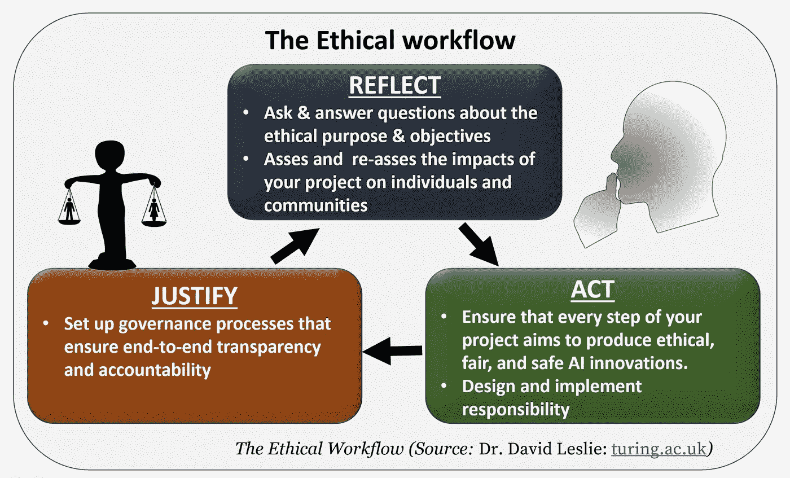
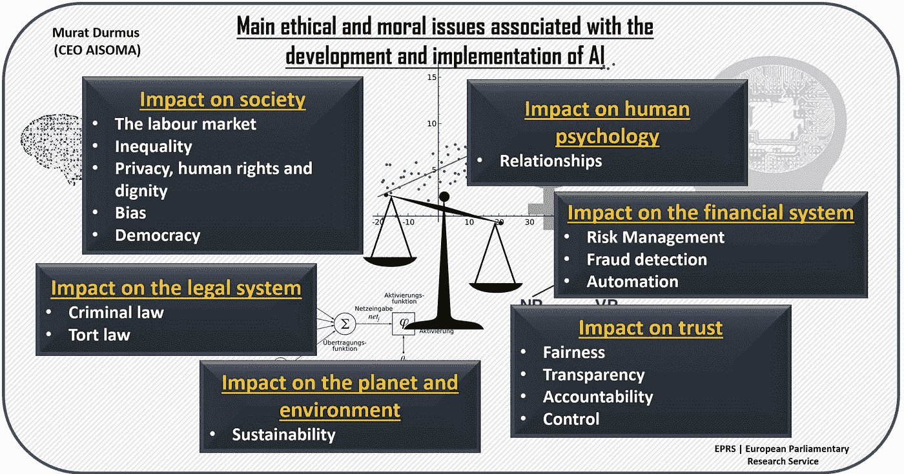
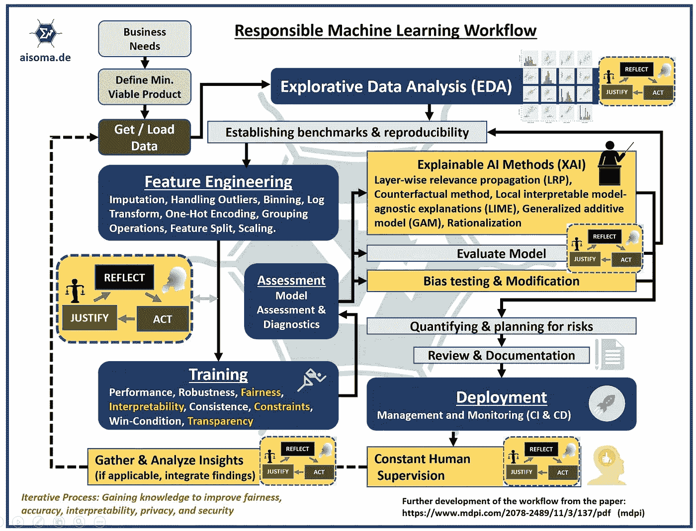

# 公司需要首席人工智能道德官吗？

> 原文：<https://medium.com/nerd-for-tech/do-companies-need-a-chief-ai-ethics-officer-912b2f7c5d0?source=collection_archive---------6----------------------->

快门架

一些快速的想法。

我们生活的世界正变得越来越由数据驱动。这导致公司越来越多地使用机器学习和深度学习等人工智能技术。这似乎是相对快速地控制数据并为公司创造价值的唯一“有效”方式。当然，未来的竞争力也起着重要的作用。

首席 AI 道德官(CAIEO)的任务不应该主要是技术性的。相反，它应该让数据科学家、机器学习工程师和开发人员对伦理问题保持敏感。宣传的整个过程应该是每个数据驱动项目的一部分。我的意思是，道德工作流应该被牢固地整合到各自的过程模型和阶段中。

道德工作流程

*底层纸张。强烈推荐:* [*理解人工智能伦理与安全*](https://arxiv.org/ftp/arxiv/papers/1906/1906.05684.pdf) *作者大卫·莱斯利博士(艾伦·图灵研究所)*

从长远来看，人工智能可能会在许多领域带来“突破”。从基础科学和应用科学到医学和高级系统。然而，越来越强大的智能系统在带来巨大希望的同时，也带来了重大的伦理挑战。讨论的问题涉及对人类社会的影响；人类心理学；金融体系；法律制度；环境和地球；以及对信任的影响。

下面列出了一些人工智能道德官员在工作中应该考虑的要点(根据 [EPRS |欧洲议会研究服务](https://www.europarl.europa.eu/portal/en))。

**社会影响:**人工智能对劳动力市场和经济的潜在影响，以及不同人口群体可能受到的影响。它解决了不平等的问题，以及人工智能将权力和财富进一步集中在少数人手中的风险。与隐私、人权和尊严有关的问题得到了解决，因为人工智能将使现有社会系统或其创造者的偏见永久化，无论是有意还是无意。这一部分还提出了关于人工智能技术对民主的影响的问题，表明这些技术可能有利于国家控制的经济。

**心理影响:**人机关系可能会产生什么影响？我们如何解决依赖和欺骗？我们是否应该考虑机器人是否应该被赋予“人”的地位，这样做的法律和道德含义是什么？

**金融系统影响:**考虑人工智能对金融系统的潜在影响，包括操纵和勾结的风险以及建立问责制的需要。

**法律系统影响:**AI 可以通过多种方式影响法律系统，包括:与犯罪有关的问题，例如如果 AI 被用于犯罪活动的责任，以及 AI 可能在多大程度上支持贩毒等犯罪活动。在人工智能涉及人身伤害的情况下，例如在涉及自动驾驶汽车的碰撞中，那么围绕索赔的法律方法就会出现问题(无论是疏忽，这通常是涉及车辆事故的索赔的基础，还是产品责任)。

**环境影响:**人工智能的使用越来越多，随之而来的是自然资源的使用增加、能源需求增加和废物处理问题。然而，人工智能可以改善我们管理废物和资源的方式，从而带来环境效益。

**对信任的影响:**社会依赖信任。要让人工智能承担手术等任务，公众需要信任这项技术。信任包括公平(人工智能将是公正的)、透明(我们将能够理解人工智能如何做出特定决定)、问责(有人可以对人工智能犯下的错误负责)和控制(我们可能如何‘关闭’变得过于强大的人工智能)等方面。

与人工智能的开发和实施相关的主要伦理和道德问题:

主要伦理和道德问题

在下图中，我试图展示一个负责任的机器学习工作流程(包括道德工作流程)可能是什么样子。

负责的 ML 工作流程

它主要是关于识别和理解道德风险，并培训经理和员工如何做同样的事情。

# 首席人工智能伦理官:未来的工作？

关于 AI 伦理的讨论，目前仍多在学术界进行。但人们已经可以看到，许多公司都在认真处理这个问题。有一件事对我来说很清楚:

> 未来将非常需要哲学和伦理学的毕业生来通过人类的镜头研究人工智能相关的过程。
> 
> **~(正念 AI)**

(文字摘自我的新书《[用心的人工智能——关于人工智能的思考](https://www.amazon.com/dp/B0BKLCKM22)》)

新版——亚马逊上有售:[用心 AI](https://www.amazon.com/dp/B0BKLCKM22)

[正念 AI](https://www.amazon.com/dp/B0BKLCKM22)