# 手臂越长的 MMA 拳手是否会赢得更多的打斗？Python 中的端到端分析

> 原文：<https://medium.com/nerd-for-tech/do-mma-fighters-with-longer-arms-win-more-fights-an-end-to-end-analysis-in-python-a688ed52179?source=collection_archive---------4----------------------->

今年早些时候，我发表了一个由 3 部分组成的博客系列，讲述如何在 R 语言中收集、清理和分析 MMA 格斗家的数据。从那以后，我离开了学术界(R 语言很常见)，进入了数据科学领域，在那里 Python 语言更为常见。因此，我开始每天使用 Python。所以我想为喜欢 MMA 数据但想学 Python 而不是 r 的人提供一个翻译。

我已经完成了 MMA in R 三部曲的第 2 部分和第 3 部分，并在下面为您将代码翻译成 python。我打算以后翻译网页抓取教程。下面的代码将允许你从我的 Github 下载原始数据，并带你通过清理和分析它。你不需要看 R 版就能明白这一点；它应该是独立的。

# 手臂越长的 MMA 拳手是否会赢得更多的打斗？

清理数据是数据科学家日常工作的很大一部分，所以最好练习并寻找有效的方法。如果你能想到任何改进我的代码的方法，我很乐意听听！

## 我们开始吧

使用下面的代码从我的 Github 读入您的数据。我们将数据复制到新的数据帧 *data_clean* **。**我们这样做是为了当我们在清理过程中搞砸了一些事情(比如不小心删除了一列)时，我们总是有原始数据可以参考。

```
import pandas as pd
import numpy as np
import matplotlib.pyplot as plt
import seaborn as snsdata_raw = pd.read_csv(‘https://github.com/Thomas-Richardson/Blog_post_data/blob/main/UFC_data_raw_2021-03-11.csv?raw=true')data_clean = data_raw
```

库:我们需要 pandas 来处理数据，需要 numpy 来处理丢失的数据，需要 matplotlib 和 seaborn 来生成好看的图形。

## 看数据

```
data_clean.head(20)
data_clean.info()
```

**。head()** 显示了前 20 行(如果没有提供数字，则给出 5 行)。

**。info()** 告诉我我的数据有 3598 行和 12 列。每排是一架战斗机，所以我们有 3598 架战斗机。

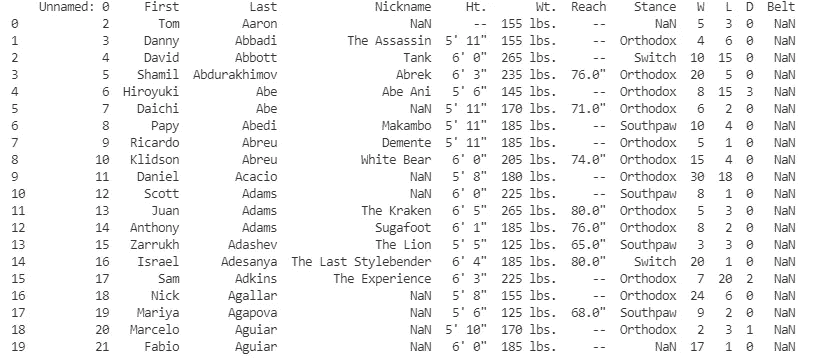

data_clean.head(20)

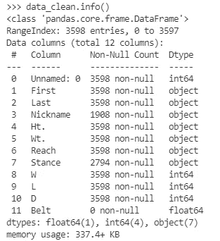

data_clean.info()

我们可以进行一些观察，并勾画出一个粗略的数据清理计划:

*   第一列称为“未命名:0 ”,似乎只包含行号。我们可能会摆脱它。*带*栏里好像也没什么东西。
*   *Ht* 。以及 *Wt* 。显然是身高和体重。它们已经作为“对象”被读入，这不是我们想要的。身高和体重都是数字，所以应该编码为‘int’。因为 Wt。列显示“170 磅”而不仅仅是“170”，Python 认为它们是字符串。
*   更惨: *Ht* 。似乎以英尺和英寸为单位，两者都在**相同的**栏中编码。我们将把这两者都转换成仅用英寸表示的高度。
*   *Reach* (臂展的格斗俚语说法)也是一个角色，对一些格斗家来说是缺失的。我们记下检查我们有多少，因为这是我们项目中的一个关键变量。
*   对于 *reach，ht* 和 *wt，*。info 说它们没有“非空值”,这表明我们有完整的数据。然而，看看标题中的这些列，我们肯定有缺失的数据！这里的问题是这些列的缺失数据被编码为“-”，Python 认为这是文本数据的有效选择。我们需要将这些值改为空值。
*   对于一个拳手的*姿态*，。 **head()** 显示‘正统’、‘左撇子’、‘开关’，虽然可能还有其他。

# 开始清洗

首先可以去掉第一列 *X* 和*带*列。

```
data_clean = data_clean.drop(['Unnamed: 0', 'Belt'], axis = 1)
```

我们*删除*不想要的列。Axis = 1 表示我们删除的是列而不是行(对于删除行，我们使用 axis = 0)

然后，我们重命名这些列，使其更容易操作，并提供更多信息。您应该始终考虑您得到的列名对您和任何可能阅读您的代码的人是否有意义。我已经盯着这些数据看了几个小时了，所以我知道体重是以磅为单位的，但一位同事可能不知道，所以为了他们的缘故，我把体重也以磅为单位。

```
data_clean.columns = [‘first_name’, ‘last_name’, ‘nickname’, ‘height’, ‘weight_lbs’, ‘armspan_inches’, ‘stance’, ‘wins’, ‘losses’, ‘draws’]
```

## 清洁臂展

先说臂展。我们首先将'-'转换成 NaNs，它代表“不是一个数”。将数据编码为 NaNs 意味着 Python 会将其识别为缺失数据，从而更容易将列转换为数字。然后我们必须删除“臂展之后的”表示英寸。我们这样做的方法是使用 **.str.replace()** 将其替换为空。我们将数据转换为浮点类型。在这个上下文中，Float type 基本上表示数字。

然后我们制作一个直方图，它会给我们一个分布、平均值、分布以及是否有任何奇怪值的感觉。

```
data_clean.loc[data_clean.armspan_inches =='--','armspan_inches'] = np.nandata_clean.armspan_inches = data_clean.armspan_inches \
.str.replace('\"','') \
.astype('float')sns.histplot(data = data_clean,
x = 'armspan_inches',
color = 'navy')plt.xlabel('fighter armpan in inches')
plt.show()
```

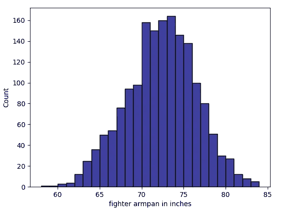

我们有一个很好的正态分布，似乎没有异常值。这是理想；当数据像这样分布时，一切都变得容易了！

## 清洁高度

下一个高度，这有点困难，因为它需要将包含英尺和英寸的单个字符变量转换为只包含英寸的单个列。我们可以把它分解成一栏代表英尺，一栏代表英寸，然后再把它们组合起来。

```
data_clean.height = data_clean.height.str.replace('\"','')data_clean.loc[data_clean.height == '--','height'] = np.nandata_clean.loc[:,'height_split'] = data_clean.height.str.split('\' ')data_clean.loc[:,'height_split']
```

就像臂展一样，我们去掉了“并把“-”变成了“NaNs”。然后我们使用 **.str.split()** 将英尺和英寸拆分成 2 个独立的数据位，并将其放入一个名为“height_split”的新列中。让我们来看看那一栏:

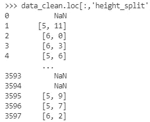

所以现在每一行包含两个项目的列表:英尺和英寸。我们需要把这些分成两个独立的栏目，我们用列表理解来完成。如果你不知道什么是列表排版，一定要去了解一下，它们是非常宝贵的。

```
data_clean.loc[:,'height_ft'] = [row[0] if isinstance(row,list) else np.nan for row in data_clean.height_split]data_clean.loc[:,'height_inches'] = [row[1] if isinstance(row,list) else np.nan for row in data_clean.height_split]
```

现在我们有了一个高度 _ 英尺和高度 _ 英寸的列。我们现在将 height 列设置为等于 inches 列+height 列乘以 12(因为一英尺中有 12 英寸)。当我们进行时，我们把它们转换成浮点数。然后，我们放弃旧的英寸，英尺和分裂列，因为他们已经达到了目的。我们还将最终身高列重命名为 height_inches，以符合我们的其他变量(例如 weight_lbs，armspan_inches)。然后我们制作一个直方图来检查我们做了什么:

```
data_clean.loc[:,'height'] = data_clean.loc[:,'height_inches'].astype('float')+ (data_clean.loc[:,'height_ft'].astype('float')*12)data_clean = data_clean.drop(columns = ['height_inches','height_ft','height_split']).rename(columns = {'height':'height_inches'})sns.histplot(data = data_clean, x = 'height_inches', color = 'navy',bins = 15)plt.xlabel('fighter height in inches')
plt.show()
```

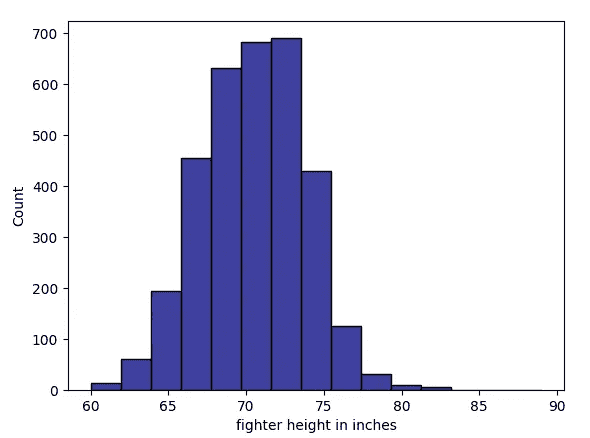

再一次，我们有一个很好的正态分布。

## 清洗重量:

在这之后，清洗重量是在公园散步！

```
data_clean.loc[data_clean.weight_lbs =='--','weight_lbs'] = np.nandata_clean.weight_lbs= data_clean.weight_lbs.str.replace(' lbs','').astype('float')sns.histplot(data = data_clean, x = 'weight_lbs', color = 'navy', bins = 30)plt.xlabel('fighter weight in lbs')
plt.show()
```

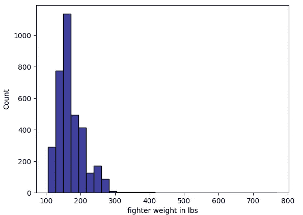

嗯……这里发生了什么事？似乎只有极少数战斗机的重量接近 800 磅。我们来调查一下！

```
data_clean.weight_lbs.sort_values(ascending = False)
```

我们首先打印出重量排序最重的战斗机。从这里我们可以看到有一架战斗机重达 770 磅？！让我们通过过滤所有体重等于 770 的战士来将他们从数据集中取出:

```
data_clean.loc[data_clean.weight_lbs==770,:]
```

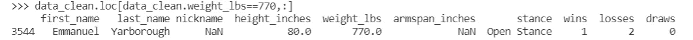

我们得到的名字是“伊曼纽尔·亚伯勒”。我谷歌了他，然后:

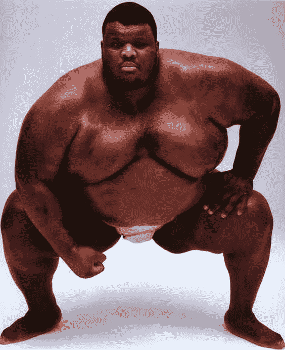

显然这里没有错误。他是存在的，而且确实是 770lb！或者曾经是，因为他死于 51 岁，而他的 3 场 MMA 比赛是在一段时间以前。让我们在没有他的情况下制作直方图，看看是否还有其他情况:

```
without_emmanuel = data_clean.loc[data_clean.weight_lbs <770,:]sns.histplot(data = without_emmanuel, x = 'weight_lbs', color = 'navy', binwidth=12)
plt.xlabel('fighter weight in lbs')
plt.show()
```

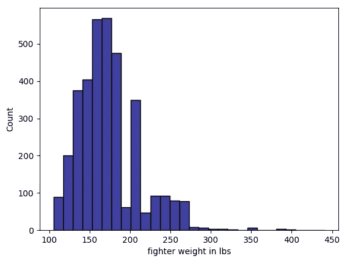

这个剧情有一些奇怪的空白，大概是因为拳手在限制重量级比赛。因此，拳手会试图达到重量级极限的顶端，这意味着在重量级极限之间的拳手会很少。数据也是高度正偏的，有很长的右尾巴，但这也是有道理的，因为一旦你到了重量级，你或多或少可以像你喜欢的那样重，一些家伙选择战斗*重。*

## 立场

这与我们对手臂长度的分析并不相关，但是站姿很有趣([我也发表了一篇关于这个的论文](https://www.nature.com/articles/s41598-019-51975-3))。所以让我们也清理立场。把分析这些数据当作你的家庭作业，告诉我你发现了什么！首先，让我们做一个表格:

```
data_clean = data_clean.fillna('Missing')
data_clean.value_counts('stance')
```

我们用“失踪”这个词来填 Na。该表显示，我们有 7 个“开放姿态”的人，3 个“侧身姿态”的人和 126 个“转换姿态”的战士。我们有 804 架战斗机的姿态不见了。

我们还可以使用 seaborn 中的 **countplot()** 函数制作一个柱状图:

```
sns.countplot(y = 'stance', data = data_clean, order = ['Orthodox', 'Southpaw','Switch','Open Stance','Sideways','Missing'])
plt.show()
```

请注意我们如何指定条形的顺序。

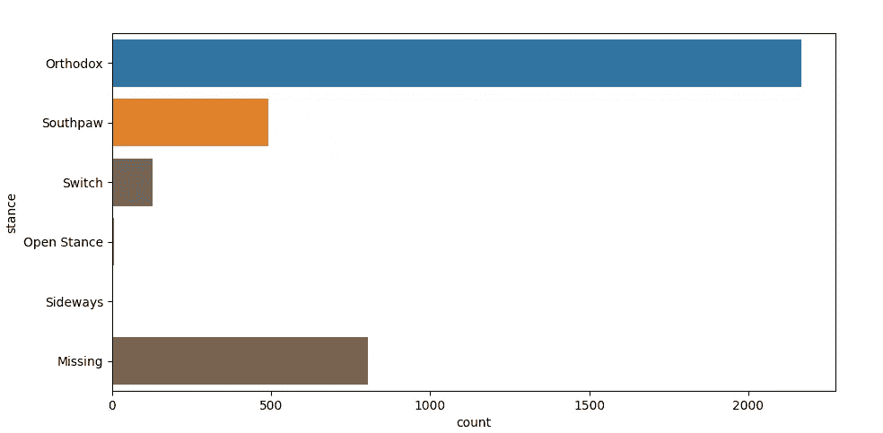

# 特征工程

现在我们已经清理了很多数据，我们可以从现有的变量中产生一些新的有用的变量。或者如数据科学家所说:“特征工程”。让我们从计算每一个战士的总战斗次数开始:

```
data_clean.loc[:,'total_fights'] = data_clean.loc[:,['wins','draws','losses']].sum(axis = 1)
```

我们选择赢、输和平的列，然后使用。 **sum()** 将它们相加，再次将 axis 设置为 1，对列而不是行执行求和。

由于很少有拳手有像“开”和“侧身”这样的小众姿态，我们也将制作一个新的*姿态 2* 变量，我们将“开”、“侧身”和“转换”姿态的拳手归为一类“混合”姿态。我们创建一个新值映射到旧值的字典，并将该字典提供给**。替换()**。

```
mapping = {'Open Stance':'Mixed','Sideways':'Mixed','Switch':'Mixed'}data_clean.loc[:,'stance2'] = data_clean.loc[:,'stance'].replace(mapping)sns.countplot(y = 'stance2', data=data_clean, order = ['Orthodox','Southpaw','Mixed','Missing'])plt.show()
```

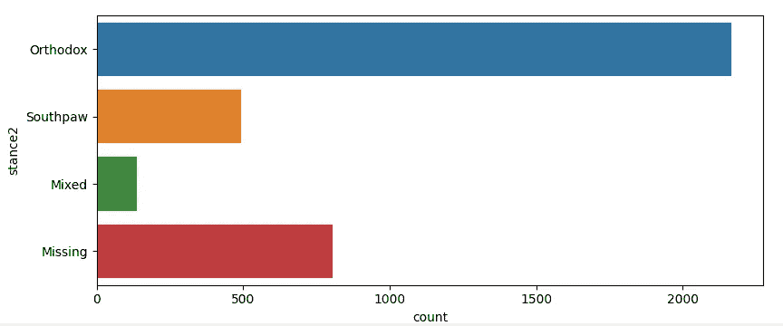

最后，让我们保存清理后的数据:

```
write.csv(data_clean, ’UFC_data_cleaned.csv’)
```

上半场到此结束！我们已经清理了用于分析的杂乱数据。

# 分析干净的数据

最后，我们准备开始分析。

我建议重新加载 Python 并读入您刚刚保存的数据。或者用我的。

```
import pandas as pd
import numpy as np
import matplotlib.pyplot as plt
import seaborn as sns
import statsmodels.api as smdata = pd.read_csv('https://raw.githubusercontent.com/Thomas-Richardson/Blog_post_data/main/UFC_data_cleaned.csv')
```

我们像以前一样在同一个图书馆里阅读，因为它们在分析数据和清理方面很有用。此外，我们加载 **statsmodels** ，稍后我们将使用它来拟合我们的回归模型。

注意！大多数数据科学家使用 [Scikit-Learn](https://scikit-learn.org/stable/index.html) 来拟合回归等模型。然而，sklearn 的设计旨在使其易于适应*预测模型*，而我们今天所做的更多的是关于*解释模型*。这个区别我们以后再说，但是请相信我，用 statsmodels 做我们需要做的事情要比 sklearn 容易得多。

就像之前一样，我们放弃了在保存数据帧时引入的随机行号列:

```
data.head(20)
data.info()data = data.drop(axis = 1, columns = ['Unnamed: 0'])
```

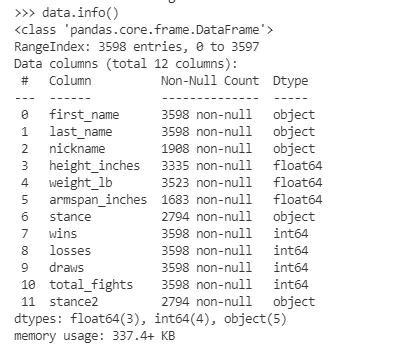

data.info()

**。info()** 告诉我我们有 12 个变量和 3598 个战士，还有。 **head(20)** 让我们快速看一下数据的样子:

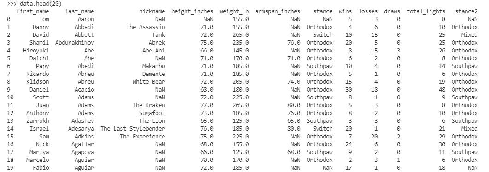

data.head(20)

## 探索性分析:直方图

我建议每个数据科学家在第一次接触数据时做的第一件事就是**制作直方图。他们会告诉你很多关于你的变量。正如我们前面看到的，他们可以捕捉异常值(如 770 磅艾曼纽)，但他们也可以向我们展示我们的数据分布，这是均值，均值是否有用，方差…许多事情！**

幸运的是，python 使得用**绘制数据帧中每个数值变量的直方图变得很简单。历史()。**

```
data.hist(grid = False, bins = 15)
plt.show()
```

我们设置网格为假，因为网格看起来有点垃圾。根据您的数据，您可能需要调整条柱的数量，以获得能告诉您一些信息的直方图。它们不应该太块状，也不应该有很多空隙。

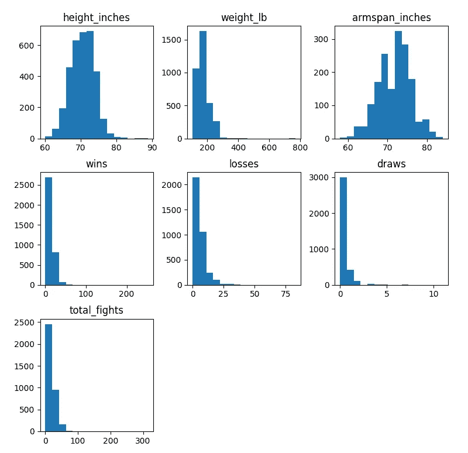

所以看起来非常大的值给了我们非常倾斜的直方图！少数拳手有很高的胜率，输球率，结果是总胜率。让我们看看这些:

```
data.loc[data.total_fights > 100,:]
```

我们过滤所有拥有 100 场或以上战斗的战士。

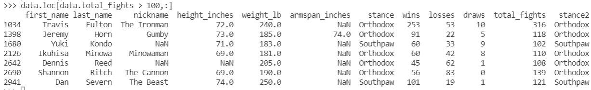

有些拳手的战斗次数非常多！

## 探索性分析:相关性分析

让我们探索我们的变量如何与相关矩阵相关，相关矩阵计算每对变量之间的相关性。为了更容易看到发生了什么，我们使用这个矩阵来制作一个 **heatplot():**

```
correlation_matrix = data.loc[:,['height_inches', 'weight_lb', 'armspan_inches', 'losses', 'wins','total_fights']].corr(method = 'spearman').round(2)mask = np.zeros_like(correlation_matrix)
mask[np.triu_indices_from(mask)] = Truesns.heatmap(correlation_matrix, annot=True,vmin = -1, vmax=1,mask=mask, square=True, cmap="BuPu")plt.xticks(rotation = 60)
plt.yticks(rotation = 0)
plt.show()
```

为了制作我们的相关矩阵，我们使用**。loc[]** 来获取我们感兴趣的列，然后**。corr()** 计算相关矩阵和**。round(2)** 给出小数点后两位的相关性，因为我们不需要比这里更高的精度。

我们创建了一个零掩码，我们可以用它来消除相关矩阵的上半部分，因为它只是底部的重复。

然后我们将关联矩阵传递给 seaborn 热图。不能意味着把我们的相关性放在方块上。vmin 和 vmax 允许我们指定颜色的最大值和最小值，而不是让 python 从数据本身中计算出来。这是因为我们知道相关性只能在-1 和 1 之间。我选择了*“布普”*调色板。这有点过分，但确实管用，而且默认是*丑。*

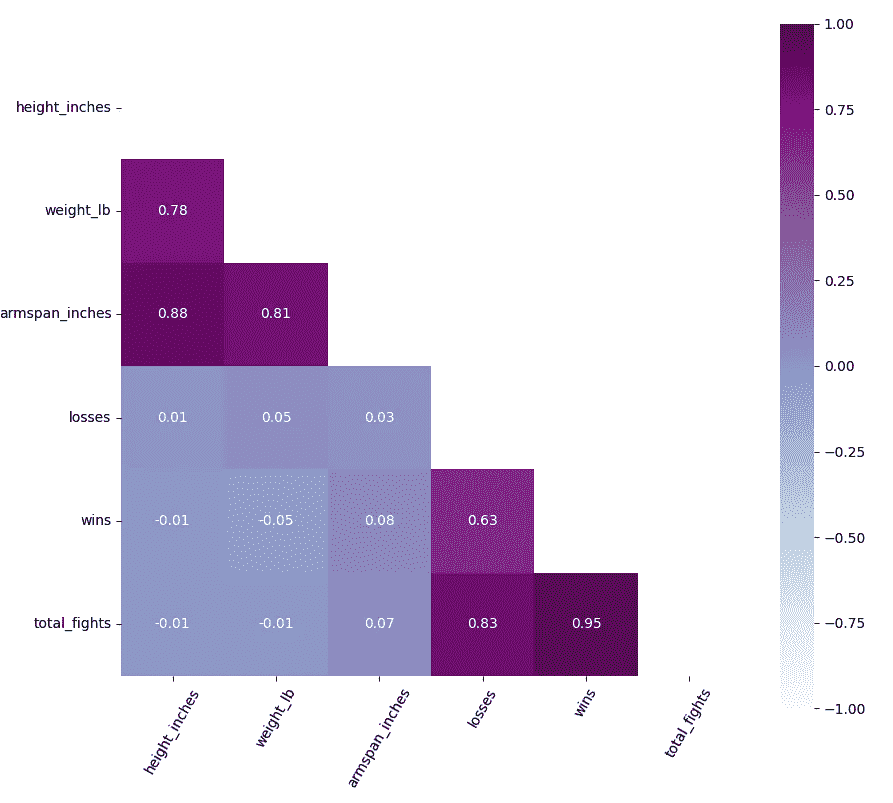

两件事引起了我的注意:

首先，身高、体重和臂展(左上角的方块)都是高度相关的。这是有道理的:高个子通常更重，手臂也更长。这些都是某种“大”的量度。这意味着，如果我们想知道臂展是否影响获胜的数量，我们不能只看相关性，因为臂展与身高和体重是相互混淆的。我们需要建立模型来观察臂展的影响，同时消除身高和体重的影响，我们在下面用多元回归来做。

第二，赢的次数和输的次数在 r = 0.63 时高度相关。这是因为打架次数多的拳手，日积月累，输赢都会累积。这可能会给我们的分析带来一个问题:战士们可能会因为打了很多场比赛而获得很多胜利。我们想看看胜利的数量，同时考虑战斗的数量。

## 特征工程:创建 win_percentage 作为战斗能力的度量

看来我们得进行另一轮功能工程了。这是典型的数据科学:你了解数据，构建一些功能，进一步了解数据，并提出新的功能。你迭代。

一个很好的衡量战斗能力的方法是计算一个战士赢得战斗的百分比。我们定义了一个叫做 *win_percentage* 的新变量，它是赢的次数+平局次数的一半，除以总的比赛次数。这样平局也算半个赢。

```
data.loc[:,'win_percentage'] = (data.loc[:,'wins']+ (0.5*data.loc[:,'draws']) )/data.loc[:,'total_fights']sns.histplot(data = data, x = 'win_percentage', color = 'navy', bins = 20)
plt.show()
```

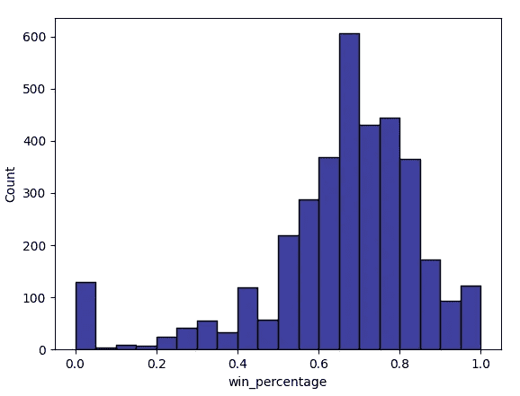

看起来获胜的百分比大部分是正态分布的，但有 0(即输掉所有战斗的战士)和 1(赢得所有战斗的战士)的起伏。

## 臂展、身高和体重

从上面的相关性中我们可以看出，臂展、身高和体重都是相互关联的。我们可能想知道的一件事是，身高和体重是否分别与臂展相关。可能身高和臂展有联系，身高和体重有联系，但是臂展和体重没有联系。我不清楚为什么考虑到身高，更重也意味着更长的手臂。换句话说，如果我们有一群身高完全相同的人，我们会期望较重的人有更长的手臂吗？我不会这么说。也许体重和臂展之间的相关性是*虚假的*，仅仅是因为它们与身高的共同关系。为了区分这些，我们进行了多重回归测试，看身高和体重是否能预测臂展。

首先，我们创建一个名为 *data_model* 的新数据框架，它只包含我们需要的列，并删除所有 NaN 值，因为多元回归不能处理缺失值。

```
data_model = data.loc[:, [‘armspan_inches’, ’height_inches’, ’weight_lb’]].dropna()
```

然后，我们拟合普通最小二乘(OLS)模型，指定我们的 X 变量和 y 变量，并添加一个截距。add_constant()。

```
X = data_model.loc[:,['height_inches','weight_lb']]
X = sm.add_constant(X)y = data_model.loc[:,'armspan_inches']sm.OLS(y, X).fit().summary()
```

我们得到这个(我用黄色突出了重要的部分):

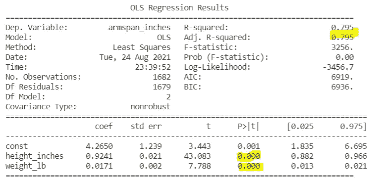

当四舍五入到 3 个小数位时，p 值为 0(但是请注意，在这种类型的分析中，它们不可能恰好为 0)。在科学上，我们通常会说，如果一个 p 值是<0.05 then the effect is **统计显著的**。这表明身高和体重都与臂展有独特的关系。这意味着，如果我们让所有人都一样高，较重的人可能会有更长的手臂，如果我们让一群体重相同的人，较高的人会有更长的手臂。我错了！没关系，在数据科学中，你经常是错的。犯错最大的好处是你可以学到新东西！

正如系数(coef 栏)所示:身高增加 1 英寸，臂展增加 0.92 英寸。体重每增加 1 磅，臂展就会增加 0.017 英寸。调整后的 R 平方告诉我们，身高和体重一起解释了臂展变化的 80%,这是一个很大的数字！如果我们知道某人的身高和体重，我们就能相当准确地说出他们的臂展。如果我们想知道身高和体重对臂展的预测有多准确，我们可以使用 scikit-learn 建立一个预测模型。但这不是我们今天要做的。

这个分析也告诉我们，要确定臂展真的与战斗能力有关，我们需要控制身高和体重。否则，我们可能会得出结论，臂展与战斗能力有关，而实际上是身高和/或体重造成了这种影响。

# 手臂较长的拳手会赢得更多比赛吗？

我们准备解决我们的主要问题。我们拟合多元回归，其中响应变量(或因变量，它们的意思基本相同)是 *win_percentage* ，我们的预测因子(或自变量)是*臂展、身高*和*体重。*

我们必须控制体重的另一个原因是因为拳手在重量级比赛。如果康纳·麦格雷戈有 81%的胜率，那只能告诉我们，与同等重量的拳手相比，他是个好拳手。目前还不知道(也不太可能)他是否有能力对抗重量级选手。因此，将战斗机与和他们体重相近的其他战斗机进行比较才有意义。控制体重使得臂展的效果代表了更长手臂的效果*假设所有的拳手体重相等*(嗯，有点复杂)。

```
data_model2 = data.loc[:,['armspan_inches','height_inches','weight_lb', 'win_percentage']].dropna()X = data_model2.loc[:,['height_inches','weight_lb','armspan_inches']]
X = sm.add_constant(X)y = data_model2.loc[:,'win_percentage']sm.OLS(y,X).fit().summary()
```

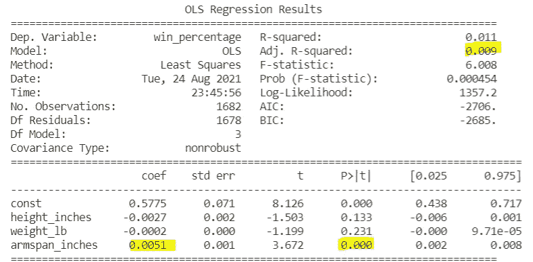

你应该得到这样的东西。我们查看 p 值部分，发现只有臂展的影响是< 0.05\. Height and weight are not. This suggests that only armspan has a statistically significant effect on win percentage: height and weight do not have independent effects on the percentage of fights a fighter wins. You can also see this in that the confidence intervals for the effect of armspan do not contain 0, whereas the confidence intervals for the other effects do contain 0.

However, looking at the coefficient, it seems that the effect of armspan is small. Indeed, looking at the adjusted R² suggests that all 3 factors, height weight and armspan explain very little of the variance in % of fights won. Increasing armspan by 1 inch increases the percentage of fights won by 0.005 or 0.5%. Still, that might be big if fighters vary by 10 or 20 inches in their armspan. To get a feel for the real-world size of the effect, let’s take all the fighters with a weight of 155lb and find the longest and shortest armspan.

```
data.loc[data.weight_lb == 155,'armspan_inches'].agg(['min','max'])
```

**。agg()** 允许我们对一个数据集应用多个函数，在本例中是 **max** 和 **min** 。

我们发现 155 磅的人最长的臂展是 80 英寸，最短的是 64 英寸，差别相当大。我们预计长臂战斗机的胜率为 16 x 0.005 = 0.08 或高 8%！因此，虽然对于大多数拳击手来说，臂展对他们职业生涯的影响很小，但那些臂展很高或很低的人可能会看到对他们成功的长期影响。

# 结论

所以看起来手臂更长的拳手确实赢得了更多的比赛！这不仅仅是因为它们更大。事实上，看起来高个子战士赢得更多战斗的唯一原因是因为他们的手臂更长:当臂展也在模型中时，身高对胜率没有独特的影响。

谢谢你跟了我这么久！我希望你已经从中学到了一些东西，无论是数据清理、数据分析还是制作图表。如果你对这些数据做了其他分析，请告诉我！我很想看看你在做什么。谢谢！

# 完整的代码

为了避免您将所有代码复制并粘贴到一个文档中的麻烦，我收集了以下所有代码:

```
import pandas as pd
import numpy as np
import matplotlib.pyplot as plt
import seaborn as snsdata_raw = pd.read_csv('https://github.com/Thomas-Richardson/Blog_post_data/blob/main/UFC_data_raw_2021-03-11.csv?raw=true')data_clean = data_rawdata_clean.head(20)
data_clean.info()# onto cleaningdata_clean = data_clean.drop(['Unnamed: 0', 'Belt'], axis = 1)data_clean.columns = ['first_name', 'last_name', 'nickname', 'height', 'weight_lbs', 'armspan_inches', 'stance', 'wins', 'losses', 'draws']# cleaning armspandata_clean.loc[data_clean.armspan_inches =='--','armspan_inches'] = np.nandata_clean.armspan_inches = data_clean.armspan_inches \
.str.replace('\"','') \
.astype('float')sns.histplot(data = data_clean, x = 'armspan_inches', color = 'navy')plt.xlabel('fighter armpan in inches')
plt.show()# cleaning heightdata_clean.height = data_clean.height.str.replace('\"','')data_clean.loc[data_clean.height=='--','height'] = np.nandata_clean.loc[:,'height_split'] = data_clean.height.str.split('\' ')data_clean.loc[:,'height_split']data_clean.loc[:,'height_ft'] = [row[0] if isinstance(row,list) else np.nan for row in data_clean.height_split]data_clean.loc[:,'height_inches'] = [row[1] if isinstance(row,list) else np.nan for row in data_clean.height_split]data_clean.loc[:,'height'] = data_clean.loc[:,'height_inches'].astype('float')+ (data_clean.loc[:,'height_ft'].astype('float')*12)data_clean = data_clean.drop(columns = ['height_inches','height_ft','height_split']).rename(columns = {'height':'height_inches'})sns.histplot(data = data_clean, x = 'height_inches', color = 'navy',bins = 15)plt.xlabel('fighter height in inches')
plt.show()# cleaning weightdata_clean.loc[data_clean.weight_lbs =='--','weight_lbs'] = np.nandata_clean.weight_lbs= data_clean.weight_lbs.str.replace(' lbs','').astype('float')sns.histplot(data = data_clean, x = 'weight_lbs', color = 'navy', bins = 30)plt.xlabel('fighter weight in lbs')
plt.show()data_clean.weight_lbs.sort_values(ascending = False)data_clean.loc[data_clean.weight_lbs==770,:]without_emmanuel = data_clean.loc[data_clean.weight_lbs <770,:]sns.histplot(data = without_emmanuel, x = 'weight_lbs', color = 'navy', binwidth=12)plt.xlabel('fighter weight in lbs')
plt.show()# stancedata_clean = data_clean.fillna('Missing')data_clean.value_counts('stance')sns.countplot(y = 'stance', data = data_clean, order = ['Orthodox', 'Southpaw','Switch','Open Stance','Sideways','Missing'])plt.show()# feature engineeringdata_clean.loc[:,'total_fights'] = data_clean.loc[:,['wins','draws','losses']].sum(axis = 1)mapping = {'Open Stance':'Mixed','Sideways':'Mixed','Switch':'Mixed'}data_clean.loc[:,'stance2'] = data_clean.loc[:,'stance'].replace(mapping)sns.countplot(y = 'stance2', data=data_clean, order = ['Orthodox','Southpaw','Mixed','Missing'])plt.show()data_clean.to_csv("UFC_data_cleaned.csv") # save/write csv# ============== Analysis =======================================import pandas as pd
import numpy as np
import matplotlib.pyplot as plt
import seaborn as sns
import statsmodels.api as smdata = pd.read_csv('https://raw.githubusercontent.com/Thomas-Richardson/Blog_post_data/main/UFC_data_cleaned.csv')data = data.drop(axis = 1, columns = ['Unnamed: 0'])
data.head(20)
data.info()data.hist(grid = False, bins = 15)
plt.show()data.loc[data.total_fights > 100,:]correlation_matrix = data.loc[:,['height_inches', 'weight_lb', 'armspan_inches', 'losses', 'wins','total_fights']].corr(method = 'spearman').round(2)mask = np.zeros_like(correlation_matrix)
mask[np.triu_indices_from(mask)] = Truesns.heatmap(correlation_matrix, annot=True,vmin = -1, vmax=1,mask=mask, square=True, cmap="BuPu")plt.xticks(rotation = 60)
plt.yticks(rotation = 0)
plt.show() data.loc[:,'win_percentage'] = (data.loc[:,'wins']+ (0.5*data.loc[:,'draws']) )/data.loc[:,'total_fights']sns.histplot(data = data, x = 'win_percentage', color = 'navy', bins = 20)plt.show()data_model = data.loc[:,['armspan_inches','height_inches','weight_lb']].dropna()# regression 1: is armspan related to height and weight?X = data_model.loc[:,['height_inches','weight_lb']]
X = sm.add_constant(X)y = data_model.loc[:,'armspan_inches']sm.OLS(y,X).fit().summary() # regression 2: is armspan related to fighting success controlling for height and weight?data_model2 = data.loc[:,['armspan_inches','height_inches','weight_lb', 'win_percentage']].dropna()X = data_model2.loc[:,['height_inches','weight_lb','armspan_inches']]
X = sm.add_constant(X)y = data_model2.loc[:,'win_percentage']sm.OLS(y,X).fit().summary()data.loc[data.weight_lb == 155,'armspan_inches'].agg(['min','max'])
```