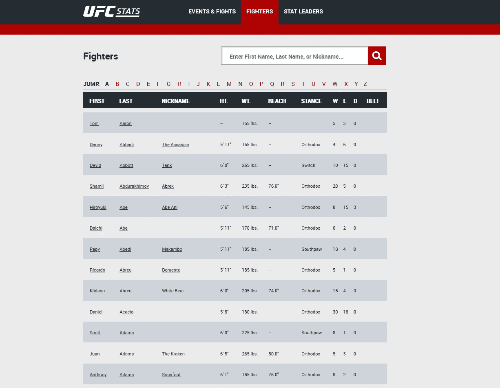
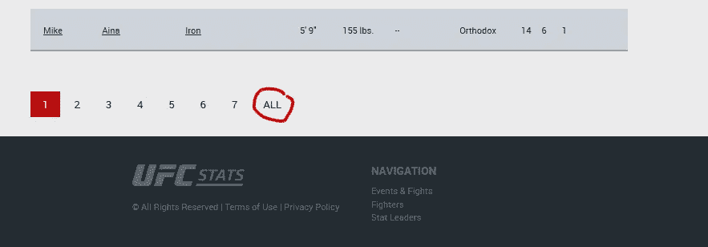

# 手臂越长的 MMA 拳手是否会赢得更多的打斗？(第一部分)

> 原文：<https://medium.com/nerd-for-tech/do-mma-fighters-with-longer-arms-win-more-fights-part-1-963dfca02a3a?source=collection_archive---------20----------------------->

# 一个完整的 R 分析项目

我去年发表了一篇关于职业拳击手手臂长度的论文。我发现臂展(两条伸展的手臂之间的距离)越大的拳手赢得的比赛越多。在论文中，我认为这(以及其他研究)可能表明，人类进化出了相对更长的手臂，因为它在战斗中帮助了祖先。有趣的东西。

虽然我把论文[的代码贴在了我的 github 上，](https://github.com/Thomas-Richardson/Is-Arm-Length-a-Sexually-Selected-Trait-in-Humans-Evidence-From-Mixed-Martial-Arts)我想我应该做一个多部分的教程，教你如何收集、清理和分析数据，这样你就可以自己看到结论了。第 1 部分(这里)将处理从 ufcstats.com 收集数据。[第 2 部分将涉及清理/处理杂乱的数据](/nerd-for-tech/do-mma-fighters-with-longer-arms-win-more-fights-part-2-d08dbf13e5ca)，第 3 部分将向您展示如何分析数据，主要使用回归分析。


摘自 Unsplash

# 抓取数据

我们需要用于 web 抓取的 rvest 包和用于管道的 magrittr 包(这使得代码更容易阅读)。如果没有，请使用 install.packages()

```
library('rvest')
library('magrittr')
```

首先，我们将了解如何收集数据。看着 UFCstats.com，我们可以看到战斗机的数据整齐地排列在一个表格里。完美！有 rvest 函数可以直接从网站拉表。



截图自[http://ufcstats.com/statistics/fighters?char=a](http://ufcstats.com/statistics/fighters?char=a)

让我们写一段代码来刮这个表:

```
link <- ‘[http://ufcstats.com/statistics/fighters?char=a'](http://ufcstats.com/statistics/fighters?char=a')link %>% 
 read_html() %>% 
 html_nodes(‘.b-statistics__table’) %>%
 html_table(fill = T) %>% 
 data.frame()
```

首先，我们给 R 一个 http://地址来查找数据，并保存为一个名为 *link* 的变量。然后是这条代码管道，将它转换成 R 数据帧来查看。我来给你分解一下:

read_html 做它在 tin 上所说的:它从你提供的链接中读取 html 代码。页面有很多 html 代码，我们只想要包含表格的部分，所以我们使用 **html_nodes** 来获取它。我们需要组成表格的元素，在这种情况下被称为**。“b 统计 _ _ 表”。**我是通过使用网站上的 S [选举人小工具](https://selectorgadget.com/)并点击表格来解决这个问题的。使用 Selector gadget，您只需点击网页的一部分，它就会告诉您可以使用哪些 css 代码来引用它(网站通常同时涉及 html 和 css 代码)。

因为是表格，我们可以用 **html_table** 转换成 R 理解的表格。 **fill = T** 参数意味着如果一个表的特定单元格中没有数据，就用 NAs 填充它。我们需要这样做，因为我们没有战斗机的完整数据。最后，我们将新表转换成一个 **data.frame()**

看看网页抓取有多简单！

# 抓取多个页面

再看看网站，似乎每个字母都有一页。因此，一个直观的策略是编写一个循环，一个字母一个字母地遍历字母表，重复上面的代码，并将数据帧一个接一个地堆叠起来，直到我们有一个所有战斗机的巨大数据帧。我们在下面这样做:

```
data_full<- data.frame()
```

我们创建一个名为 *data_full* 的空白数据帧来存储所有抓取的数据。然后，我们将上面的代码放在一个遍历字母表的“for 循环”中:

```
**for (letter in letters){ 

    print(letter) 

    link <- paste0(‘**[**http://ufcstats.com/statistics/fighters?char=',letter,'&page=all'**](http://ufcstats.com/statistics/fighters?char=',letter,'&page=all')**)** 

    link %>% 
     read_html() %>% 
     html_nodes(‘.b-statistics__table’) %>%
     html_table(fill = T) %>% 
     data.frame **-> 
     temp_data 

    temp_data <- temp_data[2:nrow(temp_data), ]
    data_full <- rbind(data_full, temp_data)** Sys.sleep(1)}
```

我把最后一节没有的代码都加粗了。

首先，每次打印出*字母*。这只是为了让你能看到循环有多远。

我们改变了定义变量 *link* 的方式。我们使用 paste0 创建一个链接，它添加了循环所在的字母表中的任何一个字母。所以当循环在字母' c '上时，*链接*变成了[http://ufcstats.com/statistics/fighters?char=**c**page = all '](http://ufcstats.com/statistics/fighters?char=',letter,'&page=all')。

然后我们有我们的刮代码。我们将数据帧保存为 *temp_data* 。最后，我们去掉了第一行 *temp_data* ，因为出于我不明白的原因，它都是 NAs。然后我们使用 rbind 将 *temp_data* 添加到我们的完整数据帧 *data_full* 中。

Sys.sleep(1)表示“在继续之前等待 1 秒钟”。我们这样做是因为我们不想让 R 因为重复调用而给网站带来太大压力。对于网站所有者来说，这是一件好事，但当我们只抓取 26 页时，这并不是真正必要的。对于更大的擦伤，出于礼貌这样做是个好主意。

另外需要注意的是:在*链接*的末尾我们添加了[**'&page = all '**](http://ufcstats.com/statistics/fighters?char=',letter,'&page=all')**。**这是因为对于某些信件来说，有多页的战斗机。我们想要的不仅仅是姓氏以 A 开头的拳手第一页！我发现，当我点击“所有”按钮(如下图)时，它显示了所有以给定字母开头的姓氏的战士，并且网页链接变为上面有 **& page=all** 。如果这是不可能的，我们必须遍历所有的页面，这可能需要更多的代码。



最后，让我们保存我们的 *data_full* ，这样我们的计算机上就有了原始数据。拥有原始(即未清理的)数据文件是一种良好的做法。一旦我们保存了这些数据，就不能再修改了。任何修改都应保存为新的数据文件。这样我们总是有原始数据。我们把它保存在。csv 格式，因为它是一种易于使用的通用数据格式，可以在 Excel 中打开。

```
name = paste0(‘UFC_data_cleaned_’, Sys.Date(),’.csv’) write.csv(data,name)
```

我们使用 Sys。Date()来获取今天的日期(无论何时运行代码),并将其插入到文件名中。这是因为你今天收集的数据明天可能会有所不同，因为有些拳手会赢或输！如果你在不同的日子刮几次，这样命名也会使生活更容易。

# 这是一个总结！

有多简单？老实说，网络抓取通常比这要困难得多。我们很幸运，UFCstats.com 的人对网站进行了编码，使其易于抓取，并且没有主动试图屏蔽抓取工具(他们有权这样做)。

所以现在我们有了拳手的名字、胜败、平局、身高、体重和臂展。在第 2 部分的[中，我们清理数据进行分析](https://thomas-richie-richardson.medium.com/do-mma-fighters-with-longer-arms-win-more-fights-part-2-d08dbf13e5ca)！