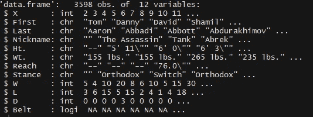
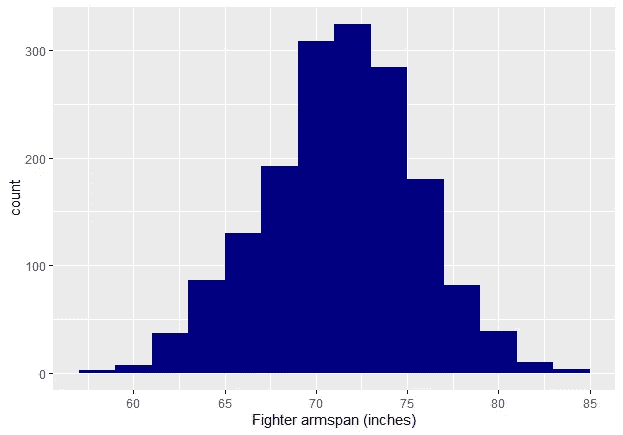
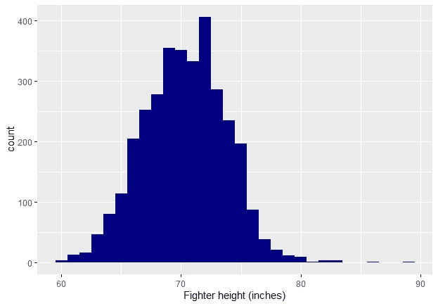
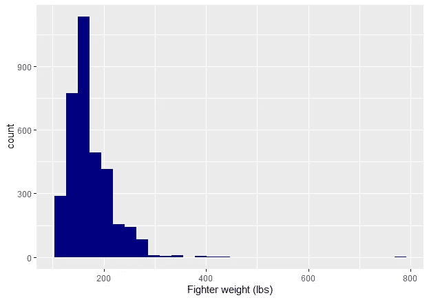
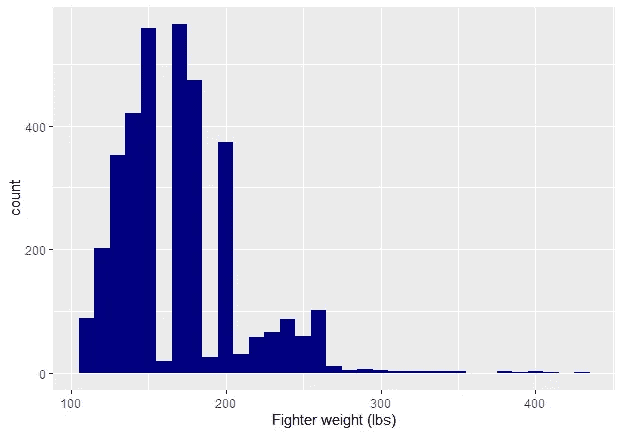
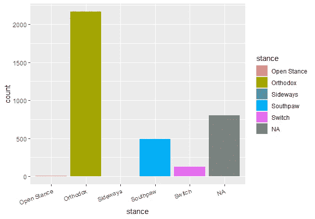

# 手臂越长的 MMA 拳手是否会赢得更多的打斗？(第二部分)

> 原文：<https://medium.com/nerd-for-tech/do-mma-fighters-with-longer-arms-win-more-fights-part-2-d08dbf13e5ca?source=collection_archive---------21----------------------->

# 正在清除 R 中的网页抓取数据

在这个三部曲的第一部分中，我向您展示了如何从 UFCstats.com 抓取 R 中的 MMA 数据。我们最终得到了一个. csv 格式的 MMA 拳手原始数据文件。这篇文章将告诉你如何清理它进行数据分析。

清理数据是数据科学家日常工作的很大一部分，所以最好练习并寻找有效的方法。如果你能想到任何改进我的代码的方法，我很乐意听听！

## 我们开始吧

使用下面的代码读入数据。请注意，您的文件将以刮擦日期命名。我们将数据复制到一个新的数据帧 *data_clean* **。**我们这样做是为了当我们在清理过程中搞砸了一些事情(比如不小心删除了一列)时，我们总是有原始数据可以参考。

```
library('magrittr')
library('dplyr')
library('readr')
library('stringr')
library('ggplot2')data_raw <- read.csv(“UFC_data_raw_DATE_SCRAPED.csv”)
data_clean <- data_raw
```

软件包:我们需要 magrittr 用于管道，dplyr 用于数据操作，readr 用于解析函数，stringr 用于操作字符串，ggplot2 用于制作漂亮的图形。

## 看数据

```
data_clean %>% head(20)
data_clean %>% str()
```

**head()** 显示前 20 行(如果没有提供数字，则给出 6 行)。您的具体数据将根据您的刮除时间而有所不同，因为您可能与我不是在同一天刮除的。str() 告诉我我的数据有 3598 行 12 列。每排是一架战斗机，所以我们有 3598 架战斗机。



您的数据应该看起来有点像这样。我用的是黑色背景的 R 色屏幕。

我们可以进行一些观察，并勾画出一个粗略的数据清理计划:

*   第一列称为 *X* ，似乎只包含行号。我们可能会摆脱它。
*   *Ht* 。以及 *Wt* 。显然是身高和体重。它们被作为“chr”字符读入，这不是我们想要的。身高体重都是数字！
*   更惨: *Ht* 。似乎以英尺和英寸为单位，两者都在**相同的**栏中编码。有时数据不是以易于分析的方式呈现的。我们将把这两者都转换成仅用英寸表示的高度。
*   Reach (格斗俚语，指臂展)也是一个角色，一些拳手缺少它。我们记下检查我们有多少，因为这是我们项目中的一个关键变量。
*   对于一个拳手的*姿态*，**头()**显示的是‘正统’、‘左撇子’、‘开关’，虽然可能还有其他。

# 开始清洗

首先可以去掉第一列 *X* 和*带*列。

```
data_clean %<>% select(-X,-Belt)
```

这种翻译为“选择变量是**不是** X 和**不是**带”。这比写出我们想要保留的所有列更不直观，但是这样做将花费时间来写出它们，并且冒着人为错误的风险(例如，我忘记写出所有的列名)。使用双面管道**%<%>%**用新版本覆盖变量。

然后，我们重命名列，使之更容易操作，并提供更多信息。您应该始终考虑您得到的列名对您和任何可能阅读您的代码的人是否有意义。我盯着这些数据看了几个小时，所以我知道身高是以英寸为单位的，但一位同事可能不知道，所以为了他们的缘故，我把身高也以英寸为单位。

```
colnames(data_clean) <- c(‘first_name’, ’last_name’, ’nickname’, ’height_inches’, ’weight_lb’, ’armspan_inches’, ’stance’, ’wins’, ’losses’, ’draws’)
```

## 清洁臂展

让我们从 armspan 开始，我们用 **parse_number** ()来清理它。然后我们制作一个直方图，这将让我们对分布有一个感觉，以及是否可能有任何奇怪的值(例如，如果丢失的数据被输入为 9999，这种情况我遇到过很多次)。

```
data_clean$armspan_inches %<>% parse_number()data_clean %>% 
ggplot(aes(x = armspan_inches))+
geom_histogram(fill = 'navy', binwidth = 2)+
xlab('Fighter armspan (inches)')
```



看起来不错，尽管 **parse_number()** 未能解析 3598 个跨距中的 1915 个，因为它们是 NAs！看起来我们没有想象中的那么多数据，但是超过 1000 个仍然是好数据。

## 清洁高度

下一个高度，这有点困难，因为它需要将包含英尺和英寸的单个字符变量转换为只包含英寸的单个列。我们可以把它分解成 1 列英尺和 1 列英寸，然后把它们组合起来。

```
data_clean$height_inches %>% 
str_split(‘ ‘, simplify = T) %>% 
data.frame() %>% 
rename(feet = X1, inches = X2) -> data_heightdata_height$feet %<>% parse_number() 
data_height$inches %<>% parse_number() data_clean$height_inches <- (data_height$feet*12) + data_height$inchesdata_clean %>% ggplot(aes(x = height_inches))+geom_histogram(fill = 'navy')+ xlab('Fighter height (inches)') 
```

我们使用 **str_split** 来拆分字符串，顾名思义。从高度来看，它有以下图案:“x' y”。我们希望在数字之间的空间上分割它，这就是为什么 **str_split** ()的第一个参数是“”。注意这里有一个空格！ **simplify** = T 表示将所有数字拆分成新列，因此，如果它将“5' 7\ "”拆分成“5 '”和“7\ "”，那么它将为每个数字指定自己的列。

然后，我们将这些新列保存为一个单独的数据框，将这些列重命名为英尺和英寸，并将其命名为 *data_height* **。**然后我们在两列上使用 **Parse_number()** 将它们转换成数字。然后我们返回到我们的主数据帧 *(data_clean)* 并将*height _ inches***列重新定义为来自 *data_height* 的 **feet** 列，乘以 12 得到 inches，+ the *inches* 列。我们制作一个直方图来检查我们做了什么:**

****

## **清洗重量:**

**在这之后，清洗重量是在公园散步！**

```
data_clean$weight_lb %<>% 
parse_number()data_clean %>% 
ggplot(aes(x = weight_lb))+
geom_histogram(fill = 'navy')+ 
xlab('Fighter weight (lbs)')
```

****

**嗯……这里发生了什么事？似乎只有极少数战斗机的重量接近 800 磅。我们来调查一下！**

```
data_clean$weight_lb %>% 
table(useNA = ‘always’)
```

**我们制作一个表，并告诉它包括 NAs。从这里我们可以看到有一架战斗机重达 770 磅？！让我们通过过滤所有体重等于 770 的战士来将他们从数据集中取出:**

```
data_clean %>% 
filter(weight_lb==770)
```

**我们得到的名字是“伊曼纽尔·亚伯勒”。我谷歌了他，然后:**

****

**显然这里没有错误。他是存在的，而且确实是 770lb！或者曾经是，因为他死于 51 岁，而他的 3 场 MMA 比赛是在一段时间以前。让我们在没有他的情况下制作直方图，看看是否还有其他情况:**

```
data_clean %>% 
filter(weight_lb < 770) %>% 
ggplot(aes(x = weight_lb))+
geom_histogram(fill = 'navy', binwidth = 10)+ 
xlab('Fighter weight (lbs)')
```

****

**这个剧情有一些奇怪的空白，大概是因为拳手在限制重量级比赛。因此，拳手会试图达到重量级极限的顶端，这意味着在重量级极限之间的拳手会很少。**

## **立场**

**这与我们对手臂长度的分析并不相关，但是站姿很有趣([我也发表了一篇关于这个的论文](https://www.nature.com/articles/s41598-019-51975-3))。所以让我们也清理立场。首先，让我们做一个表格:**

```
data_clean$stance %>% table(useNA = 'always')
```

**该表显示，我们有 7 个“开放姿态”的人，3 个“侧身姿态”的人和 126 个“转换姿态”的战士。我们有 804 架战斗机，它们的姿态是“空的”。这很可能是丢失的数据，因此我们将它们转换为 NAs:**

```
data_clean$stance[data_clean$stance==’’] = NA
```

**我们也可以做一个柱状图:**

```
data_clean  %>% ggplot(aes(x = stance, fill = stance))+
geom_bar()+
theme(axis.text.x = element_text(angle = 20, hjust = 1))
```

****

# **特征工程**

**现在我们已经清理了很多数据，我们可以从现有的变量中产生一些新的有用的变量。或者如数据科学家所说:“特征工程”。让我们从计算每一个战士的总战斗次数开始:**

```
data_clean$total_fights <- data_clean %>% 
select(wins, losses, draws) %>% 
rowSums()
```

**我们选择赢、输和平这几列，然后使用 **rowSums()** 将它们加起来。**

**由于很少有战士有像开放和侧身这样的小众姿态，我们也将制作一个新的*姿态 2* 变量，我们将开放、侧身和转换姿态的战士归为一类“混合”姿态。**

```
data_clean$stance2 = data_clean$stance
data_clean$stance2[data_clean$stance2 %in% c(‘Open Stance’,’Sideways’,’Switch’)] <- ’Mixed’
data_clean$stance2 %>% table(useNA = ‘always’)
```

****

**最后，让我们保存清理后的数据:**

```
write.csv(data_clean, ’UFC_data_cleaned.csv’)
```

# **结论**

**这就是如何在 r 中清理 MMA 数据的情况。我希望你已经掌握了一些技巧。这个清理步骤是至关重要的，它真的可以让您了解您的数据，这可以让您在今后省去各种各样的麻烦。**

**在第 3 部分中，我们将开始分析！我们将最终解决我们最初的问题:**手臂越长的拳手赢得的比赛越多吗？****

# **完整的代码**

**为了避免您将所有代码复制并粘贴到一个文档中的麻烦，我收集了以下所有代码:**

```
# cleaning MMA data in R, by Thomas 'Richie' Richardsonlibrary('magrittr')
library('dplyr')
library('readr')
library('stringr')
library('ggplot2')data_raw <- read.csv(“UFC_data_raw_DATE_SCRAPED.csv”)
data_clean <- data_rawdata_clean %>% head(20)
data_clean %>% str()data_clean %<>% select(-X,-Belt)colnames(data) <- c(‘first_name’, ’last_name’, ’nickname’, ’height_inches’, ’weight_lb’, ’armspan_inches’, ’stance’, ’wins’, ’losses’, ’draws’)data_clean$armspan_inches %<>% parse_number()data_clean %>% 
ggplot(aes(x = armspan_inches))+
geom_histogram(fill = 'navy', binwidth = 2)+
xlab('Fighter armspan (inches)')data_clean$height_inches %>% 
str_split(‘ ‘, simplify = T) %>% 
data.frame() %>% 
rename(feet = X1, inches = X2) -> data_heightdata_height$feet %<>% parse_number() 
data_height$inches %<>% parse_number()data_clean$height_inches <- (data_height$feet*12) + data_height$inchesdata_clean %>% ggplot(aes(x = height_inches))+geom_histogram(fill = 'navy')+ xlab('Fighter height (inches)')data_clean$weight_lb %<>% 
parse_number()data_clean %>% 
ggplot(aes(x = weight_lb))+
geom_histogram(fill = 'navy')+ 
xlab('Fighter weight (lbs)')data_clean$weight_lb %>% 
table(useNA = ‘always’)data_clean %>% 
filter(weight_lb==770)data_clean %>% 
filter(weight_lb < 770) %>% 
ggplot(aes(x = weight_lb))+
geom_histogram(fill = 'navy', binwidth = 10)+ 
xlab('Fighter weight (lbs)')data_clean$stance %>% table(useNA = 'always')data_clean$stance[data_clean$stance==’’] = NAdata_clean  %>% ggplot(aes(x = stance, fill = stance))+
geom_bar()+
theme(axis.text.x = element_text(angle = 20, hjust = 1))data_clean$total_fights <- data_clean %>% 
select(wins, losses, draws) %>% 
rowSums()data_clean$stance2 = data_clean$stance
data_clean$stance2[data_clean$stance2 %in% c(‘Open Stance’,’Sideways’,’Switch’)] <- ’Mixed’
data_clean$stance2 %>% table(useNA = ‘always’)write.csv(data_clean, ’UFC_data_cleaned.csv’)
```