# 你知道这些基本的图像处理操作吗？

> 原文：<https://medium.com/nerd-for-tech/do-you-know-these-basic-image-processing-operations-2bac0e3363e8?source=collection_archive---------1----------------------->

Python 中的图像处理基础

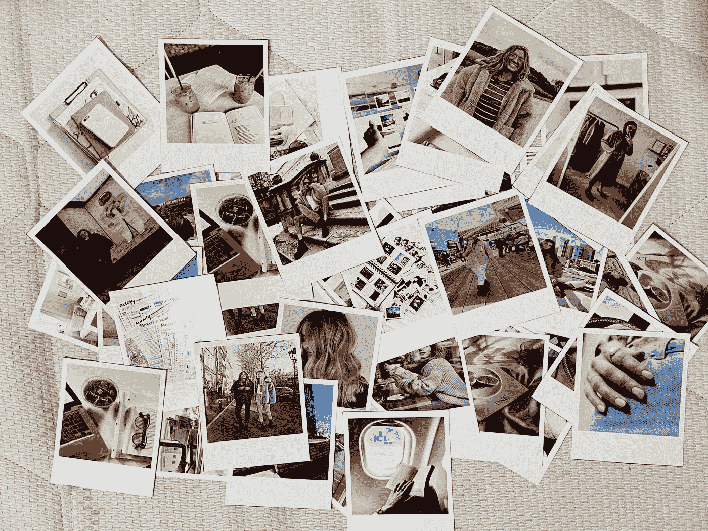

妮可·萨维德拉在 [Unsplash](https://unsplash.com?utm_source=medium&utm_medium=referral) 上的照片

我喜欢玩图像和滤镜。有趣的是，不同的技术组合可以改变图像的整个场景。图像处理是一种对图像进行操作以**从中提取信息**或增强信息的方法。图像处理是当今计算机视觉中最热门的话题之一，因为它被认为是计算机视觉、OCR 和其他相机相关领域的基础。

没有任何进一步的原因，让我们开始实际工作的图像。

**提示**:

1.  我只是在这里给你展示一段代码，但是在博客的最后，我提供了我的 git repo，你可以在这里找到博客中的所有代码。你可以直接复制粘贴，享受！！
2.  我正在免费使用许可下拍摄一个可爱男孩的照片。[ [来源](https://www.pexels.com/photo/positive-boy-with-balloon-on-footpath-in-park-8115603/) ][ [牌照](https://www.pexels.com/license/)。

让我们从，

# **如何读取图像？**

有三种类型可以阅读图像。

1] **带开放式 cv**

> OpenCV(开源计算机视觉库)是一个开源的计算机视觉和机器学习软件库。OpenCV 旨在为计算机视觉应用提供一个公共基础设施，并加速机器感知在商业产品中的应用。

这是最常见的读取图像的方法。

cv2 读图[图片由作者提供]

运行代码后，将打开一个单独的窗口，您将看到您的图像。

*   Waitley 代表时间，表示你希望图像在屏幕上停留多长时间。
*   destroyAllWindows()是一个在时间结束后删除图像的命令。
*   输出图像是一个**数组**的形式。

**2】同枕【PIL】**

> PIL (Python 图像库)为 Python 添加了许多图像处理功能。枕头是 PIL 的一个分支，增加了一些用户友好的功能。

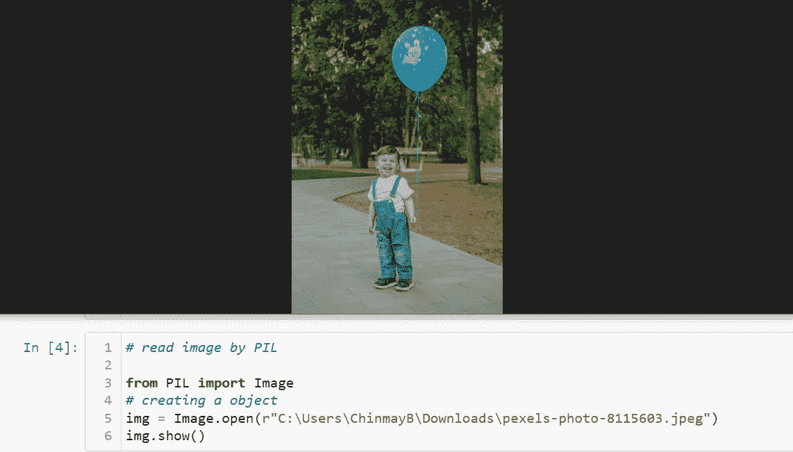

PIL 的读图[作者图片]

*   输出的形式是 **JPG 格式【PIL。JpegImagePlugin.JpegImageFile]。**

**3】用 matplotlib**

> matplotlib 库中的图像模块用于处理 Python 中的图像。

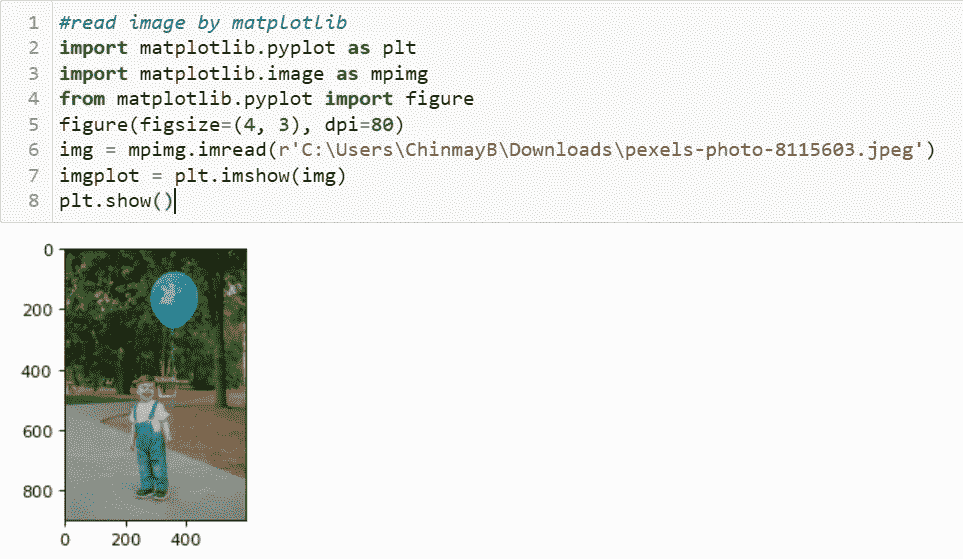

matplotlib 的图片阅读[图片由作者提供]

*   输出图像是一个**数组**的形式。

# 想让图像模糊吗？

**1】高斯模糊**

使图像模糊的最简单的方法是使用高斯滤镜。高斯模糊只是一种借助高斯函数模糊图像的方法。模糊图像使边缘更强。

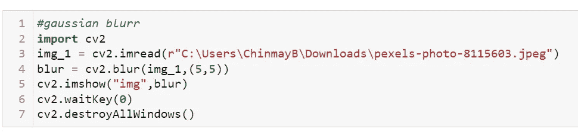

高斯模糊[图片由作者提供]

模糊图像[[作者图片]]

**2】内核模糊**

你可以自定义你的模糊比例和其他东西。

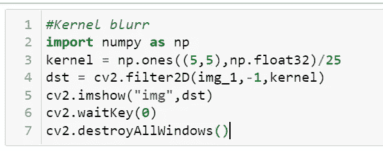

[图片由作者提供]

**3】中值模糊**

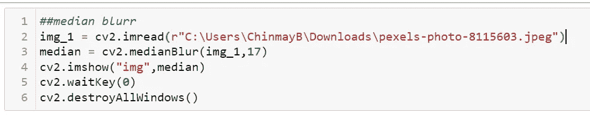

[图片由作者提供]

*   这些方法可以让你的图像变模糊，也可以改变模糊强度。

# 想把图像转换成黑白的吗？

*   我们阅读 RGB 三种颜色的图像。很多时候我们想使用它的基本版本，比如黑色和白色。

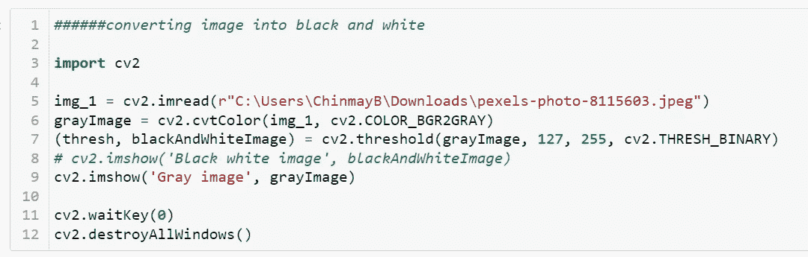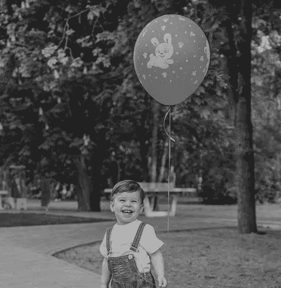

[图片由作者提供]

*   你可以通过上面的代码改变灰度的强度。

# 想要裁剪图像吗？

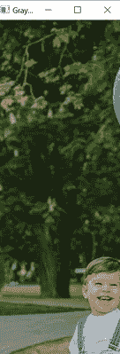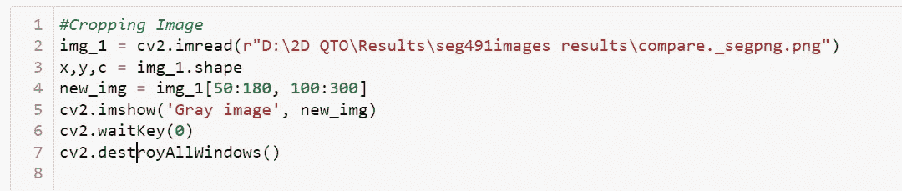

[图片由作者提供]

*   裁剪是非常容易的，因为你只需要知道从哪里开始到哪里结束的坐标。
*   您可以使用 cv2.imwrite 来存储裁剪后的图像以供进一步处理。

# 想要编辑应用程序那样的对比效果？

*   对比度决定了图像中阴影的数量。
*   基于图像特征中的灰度的区分基本上是一种对比。

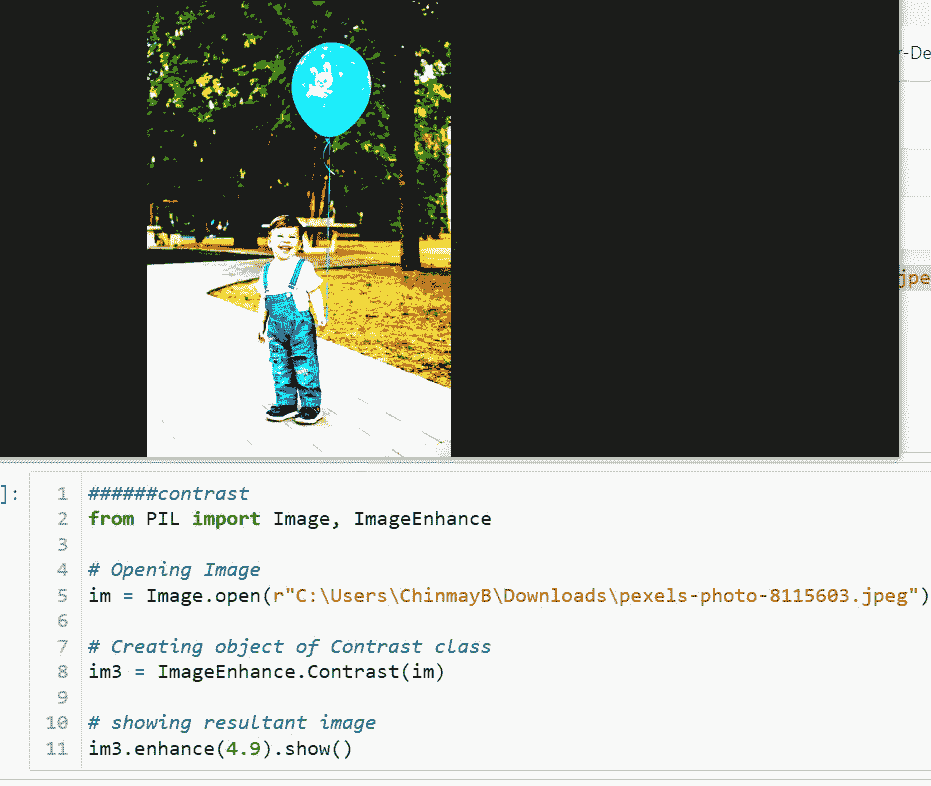

[图片由作者提供]

# 想锐化图像？

*   很多时候，由于相机镜头焦距不够，图像会变得模糊。锐化效果锐化边缘以获得更好的外观。

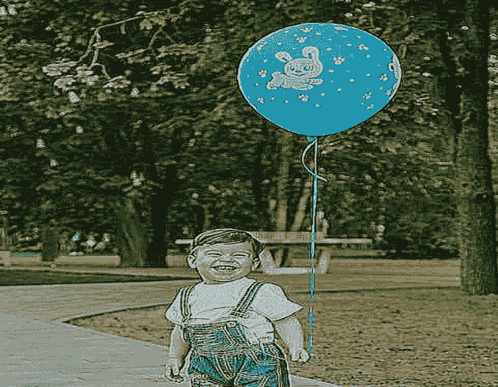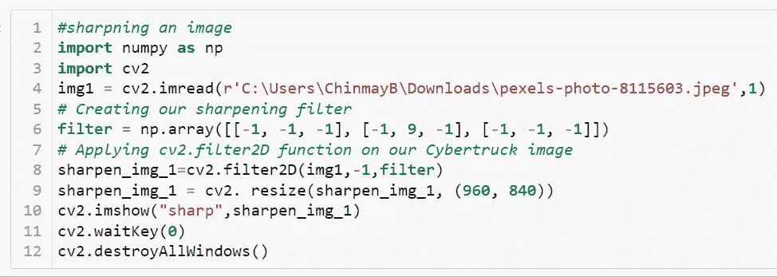

[图片由作者提供]

# 想浮雕滤镜？

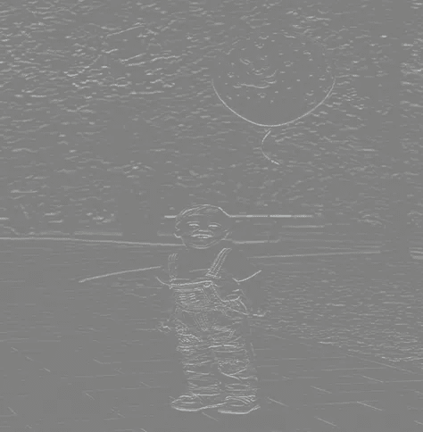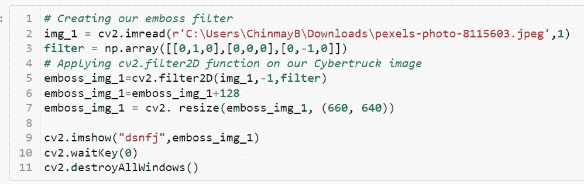

[图片由作者提供]

## 有趣的事实:内核中这些不同价值的组合是生成许多过滤器的基础，这些过滤器目前正在 Instagram、Snapchat 和其他社交媒体上使用。

# 想要以任意角度旋转图像吗？

*   这种简单的 cv2 方法可以实现所有图像数据的放大，如旋转、翻转、垂直和水平。

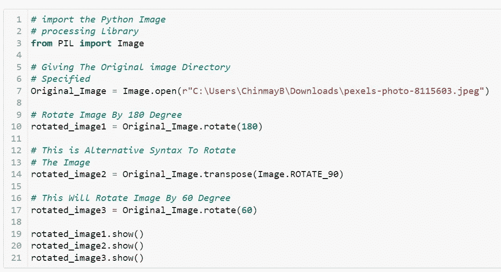

[图片由作者提供]

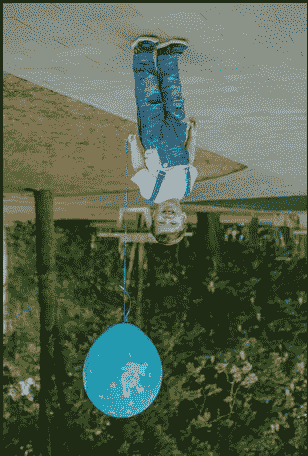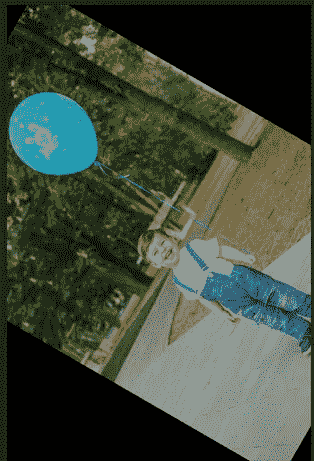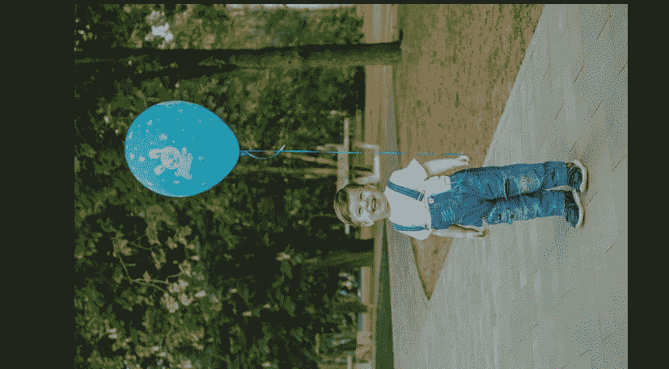

[图片由作者提供]

# 想要缩小/调整图像大小？

*   对于更大尺寸的图像，数据要求更多。所以缩小有时候可以提高它的知名度和特色。

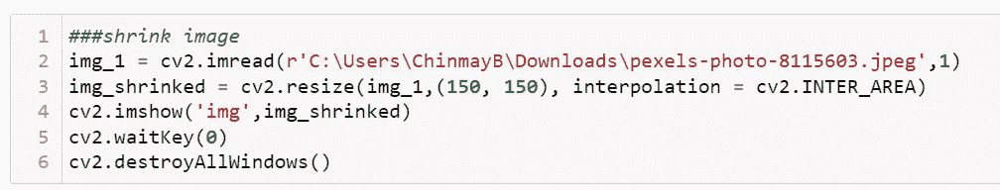

[图片由作者提供]

# 想在图像上写文字？

*   水印或任何其他文本是图像内部的重要因素之一。下面的程序将告诉你如何在图片上书写文字。

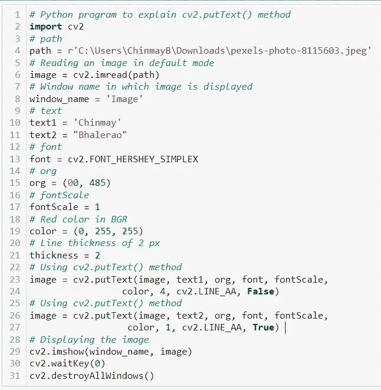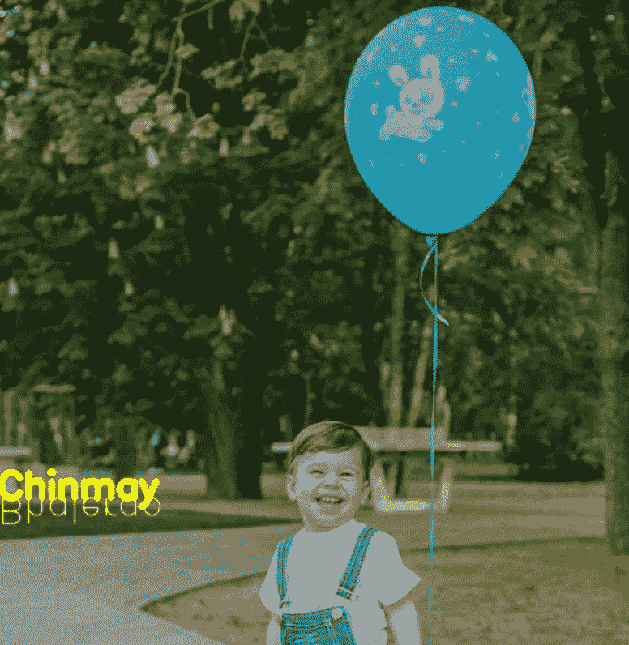

[图片由作者提供]

这些是我觉得有趣的图像处理操作。这些都是基于很多图片编辑 app 的操作。你可以通过结合所有技术来创建相同的应用程序。这些操作足以创建一个强力的图像编辑应用程序。好吧，如果你认为我应该添加任何其他图像处理技术，那么你可以自由地告诉我。我计划将这个博客作为所有基本图像处理技术的参考。

// Fact//: **保存这篇文章，当你需要这些操作时，以此为参考。**

这篇文章中提到的所有代码都被添加到我的 GitHub 中。

更多精彩故事可以关注我 [**LINKEDIN**](https://www.linkedin.com/in/chinmay-bhalerao-6b5284137/) 和 [**MEDIUM**](/@BH_Chinmay) 。

**谢谢！！**