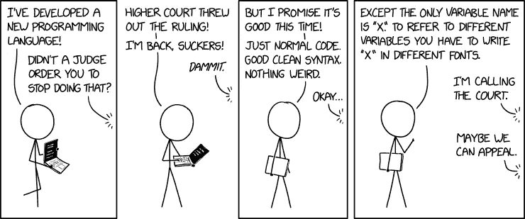

# 帮自己一个忙——多读一些代码

> 原文：<https://medium.com/nerd-for-tech/do-yourself-a-favor-read-more-code-b9fe33269bb4?source=collection_archive---------25----------------------->

为了学习如何写作，你首先需要学习如何阅读。提高写作水平的最好方法之一就是多阅读不同作者的作品。

为什么在编码上要不一样？

你见过实际上在你写代码之前教你如何阅读代码的编码课程吗？

答案是否定的。也许是因为它很难做好，或者只是因为工程师更专注于让事情工作，迫使计算机做他们想让它做的事情，而不考虑其他任何事情。

这种对短期执行的关注使得很难找到好的开发者。归根结底——周围许多所谓的开发人员专注于编写代码和运行代码。不理解。不去想它。不了解它。

# 学习阅读代码的好处

有几种方法可以学习如何更好地编码。我们可以读一些书，比如《干净的代码》、《实用程序员》和《干净的架构》,这些书会教你理论。我们可以阅读软件工程博客，这些博客将在具体案例中为我们提供指导。

另一方面，阅读代码会让你更有效率。

## 它让你更快

作为软件工程师，我们倾向于大量使用他人的代码。这在大型代码库中大多是正确的。能够快速阅读他人的代码并很好地理解它——是有效集成的关键。大多数情况下(尤其是当代码是内部代码时)，您不能假定文档是正确的。另一方面，代码总是正确的。

## 它建立了对好代码的直觉

书本上写的东西很难实现。它非常理论化，几乎总是与我们的日常生活无关。直到你看到你在现实生活中读到的概念，事情才开始变得有意义。

阅读大量代码实际上会让你熟悉更多的概念，并使你能够发展批判性思维。它不仅会让你成为更好的代码作者，还会让你对周围的环境产生更好的影响。

至少我不是让你看这个(来源:xkcd)

# 从哪里开始

浏览代码不是一项简单的任务，它本身可能值得一贴。不过，我会试着对我发现最有效的方法做一个简短的概述。

最终，你需要**正确的心态**和**正确的工具。**

## 正确的心态

*   **不要试图理解一切—** 不可能理解你所阅读的所有代码，所以请不要试图阅读和理解每一行。专注于特定领域。最好的方法是问自己一个你想回答的特定问题。类似于“这个数据提取库支持数据缓存吗？这个的 API 是什么？”。专注于回答这个问题，不要试图给自己过多的信息。你不可能面面俱到，而且会花太多时间。
*   **设身处地为作者着想** —这样做将帮助你理解他们为什么选择写他们所写的代码，而不仅仅是那里正在做什么。它可以帮助你回答上面提到的那些问题。问问你自己“如果我现在写这篇特写，我会怎么做？”。这也会帮助你检查自己的直觉。
*   **处于成长模式**——在这个过程中关注自己的成长。当你阅读这段代码时，想想你能从中获得什么。批判性地思考模式，思考作者在那里实现的好的和坏的东西。想想你和开发者自己的机会。

## 合适的工具

*   **“g ripping”**—g ripping 代表快速浏览代码**的所有可能方式。它来自“grep”，这是一个命令行工具，可以在一个大的输入中搜索特定的字符串。我发现“grep”对大多数用途来说都很棒，但是更复杂的工具，比如 ide 中的符号、引用搜索、层次结构等等，在这方面非常非常有用。快速完成是关键，所以找到最适合你的工具(老实说我通常只用 grep)。**
*   ****调试器** —如果没有活动的调试器，将很难理解复杂的流程。设置环境，能够连接调试器，并在尝试理解某些事情为什么会这样的时候使用它。使用调试器，您可以在执行的某些区域看到调用堆栈，您可以看到变量值，通常这有助于您更好地理解和控制流程。**
*   ****日志** —日志给你很好的指示，告诉你为什么事情会发生，以及执行的流程是什么样子。使用“grepping”定位日志出现的具体位置。从那里开始。**

****从代码中的一个特定点开始，调试/读取代码—** 这并不总是正确的，但作为一般的经验法则，这是非常有用的，它使用了上述所有工具。**

**找一个你想入手的具体点。查看日志，找到代码指针开始阅读。不要害怕调试代码。专注于特定的问题，找到理解更大图景的方法。**

**经常做，机会就在那里。我保证你们会因此成为更好的工程师。**