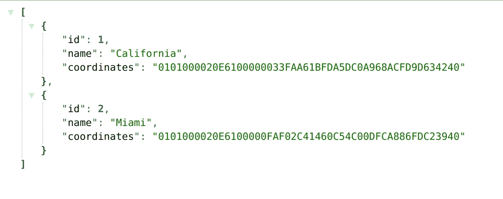

# 如何使用 Docker Compose 创建包含地理空间的环境

> 原文：<https://medium.com/nerd-for-tech/docker-compose-with-nodejs-express-and-postgresql-384c59d6871a?source=collection_archive---------2----------------------->

照片由[vini cius“amnx”Amano](https://unsplash.com/@viniciusamano?utm_source=medium&utm_medium=referral)在 [Unsplash](https://unsplash.com?utm_source=medium&utm_medium=referral) 上拍摄

> 在本教程中，我们将探索如何在 Docker 的帮助下创建一个可以在任何操作系统上工作的封闭环境。

Docker 是一个包含的环境，它使得一个应用程序可以在不同的操作系统上运行。它有多种优势，比如通过使用容器消除管理版本冲突或服务器配置的痛苦。

有了容器，应用程序是可移植的，可以很容易地从一个操作系统转移到另一个操作系统，因为其中有所有必要的依赖和配置。不用说，它让应用程序的部署变得轻而易举💨。

> 在开始之前，我们必须了解 Docker 图像和 Docker 容器之间的区别。例如，Docker 映像是包含配置和脚本的包。另一方面，Docker 容器是您的映像的运行环境。

在本教程中，我们将使用 **Docker Compose** ，这是一种通过在单个配置文件中定义所有服务来运行多个容器的方法。

我们首先在与主 js 文件相同的目录中创建一个 Dockerfile，以便能够启动包含所有必需包的 Nodejs 映像:

我们首先定义我们想要的 Nodejs 版本。您可以在此处查看所有可用版本:

 [## 节点对接集线器

### Node.js 是一个基于 JavaScript 的服务器端和网络应用程序平台。

hub.docker.com](https://hub.docker.com/_/node) 

工作目录是节点应用程序的工作目录。然后我们添加 copy 以将 package.json 文件添加到映像中，然后我们运行 npm install。副本。。命令将所有内容复制到当前文件夹。最后，npm start 是启动应用程序的命令。

下一步是在 docker-compose.yml 中定义我们所有的图像，我们在主目录中创建它:

如您所见，我们有两个服务，分别是 Nodejs 应用程序(**节点**)和 postgreSQL 服务(**postgreSQL**)。然后，我们可以定义容器的名称(这是可选的。)postgreSQL 的图像是 **postgis/postgis** 因为我们将使用地理数据填充数据库。你可以在这里阅读更多关于这张图片的细节:

 [## 码头枢纽

### 编辑描述

registry.hub.docker.com](https://registry.hub.docker.com/r/postgis/postgis) 

build 命令允许我们基于 Dockerfile 文件构建 Nodejs 映像。卷是容器的路径。

如您所见，我们在每个服务中定义了两个端口。右边是容器的端口，左边是可从本地主机访问的端口。

因为我们希望即使容器停止，数据库中创建的数据也是持久的，所以我们在服务**PostgreSQL**中创建一个卷，并在末尾添加另一个同名的卷( **db_persdata** )。

下一步是创建一个简单的 Nodejs/Express 应用程序，它使用 PostgreSQL 来公开地理数据。这是它的样子:

所以这里没什么特别的。如您所见，我们使用 pg 包来连接数据库，我们使用端口 5432，因为我们在网络内部，主机是服务的名称。现在我们的 main.js 文件已经创建，让我们通过运行以下命令来启动容器:

> docker-撰写向上-d

这个命令将启动我们的容器。d 是可选的，它告诉 Docker 在终端的后台运行容器。要测试容器是否启动并运行，请使用以下命令显示所有正在运行的容器:

> docker ps

你可以在这个命令中添加**-a** 来查看所有的容器是否正在运行。

> 此时，您应该在终端 Docker 的 names 列中看到您的容器名 **nodejspost** 和 **postgresqlpostgis** 。

在我们打开端口 3150 上的本地主机之前，我们必须添加一些数据，以便能够在浏览器窗口中显示它。当我们想要向数据库添加数据时，我们必须进入 postgresqlpostgis 容器内部，该容器包含一个带有 postgis 扩展的 PostgreSQL 数据库。要进入容器内部，请运行以下命令:

> docker exec-it postgresqlpostgis bash

如你所见，我们在其后使用容器的名称。现在，我们将使用 psql 命令在数据库 bdtuto 中创建表，该表是我们在 yml 文件中使用用户名(postgres)定义的:

> psql -U postgres

我们用这个命令进入我们的数据库:

> \c bdtuto

现在我们可以创建表 dockerpoint:

我们现在可以将一些数据插入表 dockerpoint:

然后，您所要做的就是按照。yml 文件，并像这样在 json 中可视化您的数据:

如果你做到了这一步，恭喜你🎉。这就是本教程，我希望你喜欢它。当然，如果你有任何问题，我会很乐意回答。最后，我希望这篇教程至少能帮助你学到一两件事😃。