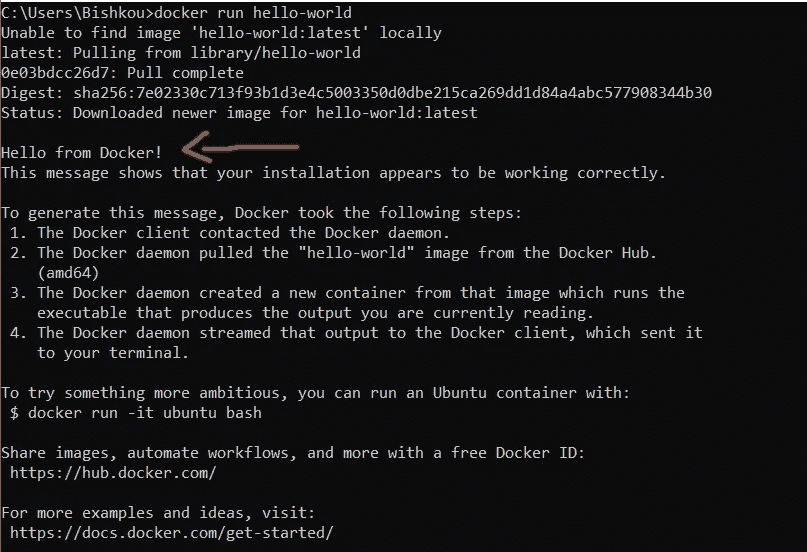
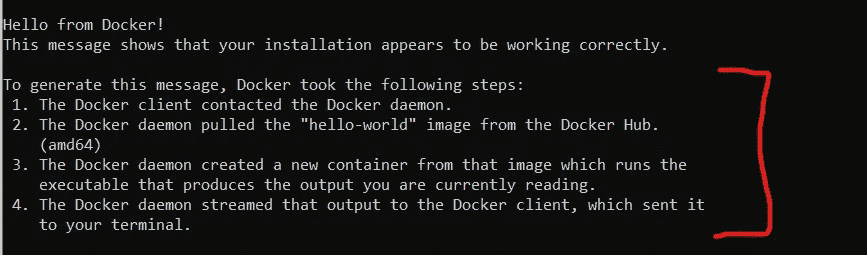
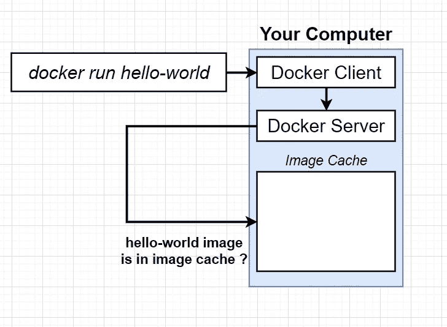
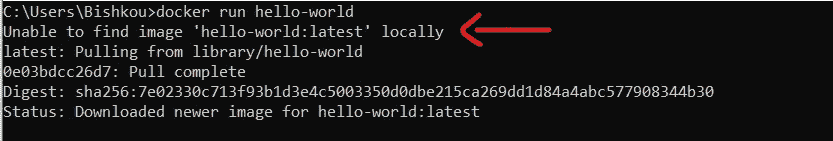
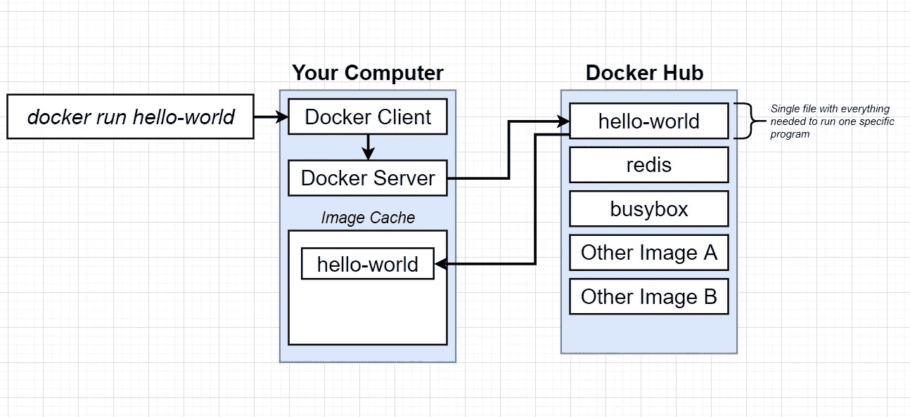

# Docker Hello-World

> 原文：<https://medium.com/nerd-for-tech/docker-hello-world-5fd08f2d7e68?source=collection_archive---------5----------------------->

这是给刚刚安装 docker 并且不知道如何使用它或者想以有趣的方式了解它是如何工作的 Docker 新手。

> 因此，您已经成功地在您的机器上安装了 Docker，并准备开始探索 Docker 世界


**HELLO-WORLD** 程序是你在学习新事物时要做的第一件事，对吗？嗯，对 docker 来说也是一样的。

> 您将先睹为快**docker 是如何工作的，如果您不知道什么是容器或图像，也不用担心。**

# docker 运行 hello-world:

打开您的终端并键入:

```
docker run hello-world
```

你的命令行应该是这样的，现在你可以开始了，你刚刚在 Docker 中创建了你的 Hello-world，你正式迈出了进入 Docker 的第一步。



就在你终端上的 **Hello World** 消息下面，你可以看到 docker 在你终端上获取消息的步骤:



# 让我们来理解这些步骤:

于是你执行了命令***【docker run hello-world】***。即启动那个 ***docker 客户端*** 或者所谓的 ***docker 客户端*** 。

> ***docker CLI*** 负责从你那里接受命令，对它们做一点处理，然后将命令传递给真正负责繁重工作的 ***Docker 服务器*** 。

当您运行"***docker run hello-world***"时，这意味着您想要使用名为 **hello-world 的*映像启动一个 ***新容器*** 。***

***hello-world** 图像中有一个很小的程序，它的唯一目的是打印出你在终端中看到的信息。*

*现在，当您运行该命令并将其发送到 docker 服务器时，一系列操作会在后台快速发生。*

**

****docker 服务器*** 做的第一件事是检查它是否已经在你的个人机器上有了 **hello-world** 映像或 hello world 文件的本地副本。*

*所以 docker 服务器研究了一种叫做**图像缓存**的东西。*

*现在，因为您刚刚在我们的个人电脑上安装了 docker，图像缓存目前是空的。*

*这可以在您终端的第一行看到:*

**

*因此，由于图像缓存是空的，docker 服务器决定提供一个名为 ***docker hub*** 的免费服务，以便下载 hello-world 图像。*

> *docker hub 是一个免费公共图像库，你可以免费下载并在你的电脑上运行*

*现在 **hello-world** 镜像被下载到你的机器上，并存储在镜像缓存中，现在可以在未来的某个时间点非常快速地重新运行，而不必从 ***docker hub*** 重新下载。*

**

*之后， ***docker 服务器*** 接着说，好的，我已经得到了这个映像，现在该用它来创建一个容器的实例了，然后将这个文件加载到内存中，创建一个容器，然后在其中运行一个程序，这个程序的目的是打印出您在终端中看到的消息。*

*现在，如果我们第二次运行 docker run***hello-world***命令，您会注意到一件有趣的事情。*

*你会注意到，你不会再看到下载或图像未在本地找到的消息。*

*因此，这里最大的教训是，当你第一次尝试使用这些公开图片时，你必须做一点点 ***下载。****

> ***但是在未来，你可以更快地使用那个图像启动一个容器，因为图像已经下载到你的电脑上了。***

***在[***Linkedin***](https://www.linkedin.com/in/chedyhm/)上与我联系，了解更多有趣的科技内容！***

***非常感谢您的关注。***