# Docker —“但它在我的机器上可以工作…”然后我们会运送您的机器！

> 原文：<https://medium.com/nerd-for-tech/docker-in-a-nutshell-but-it-works-on-my-machine-well-then-lets-ship-your-machine-81c6df27ade5?source=collection_archive---------0----------------------->

我可以让你把你的电脑带到所有客户的家里，在上面为他们运行你的应用程序。

**Github 链接到应用代码**:[https://github.com/adisingh007/works-on-my-machine](https://github.com/adisingh007/works-on-my-machine)


码头迷因

不会占用你太多时间。只需 5 分钟。

1.  一个带有 1 个 rest 端点的快速 nodejs 应用程序。
2.  1 验证响应的 e2e 测试。

**执行上述 2 个步骤进一步扩展为以下 15 个步骤。这将包括配置依赖项、运行测试，然后启动应用程序。**

> 我们不希望我们的客户经历那些痛苦的步骤。我们只是想让他们下载应用程序并直接运行它。因此，我们将在以后对应用程序进行 dockerize，使我们的客户能够在他们的机器上运行它，就像是您在自己的机器上运行它一样。

令人愉快的事情:

0.让我们快速创建一个名为`works-on-my-machine`的项目目录

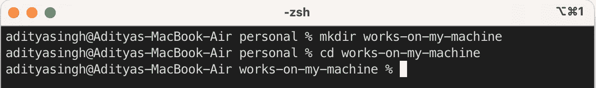

创建了项目目录

让我们为客户解决一些问题，构建一个应用程序，下载依赖项，编写测试，运行测试，启动应用程序并使用应用程序:

1.  `npm init`

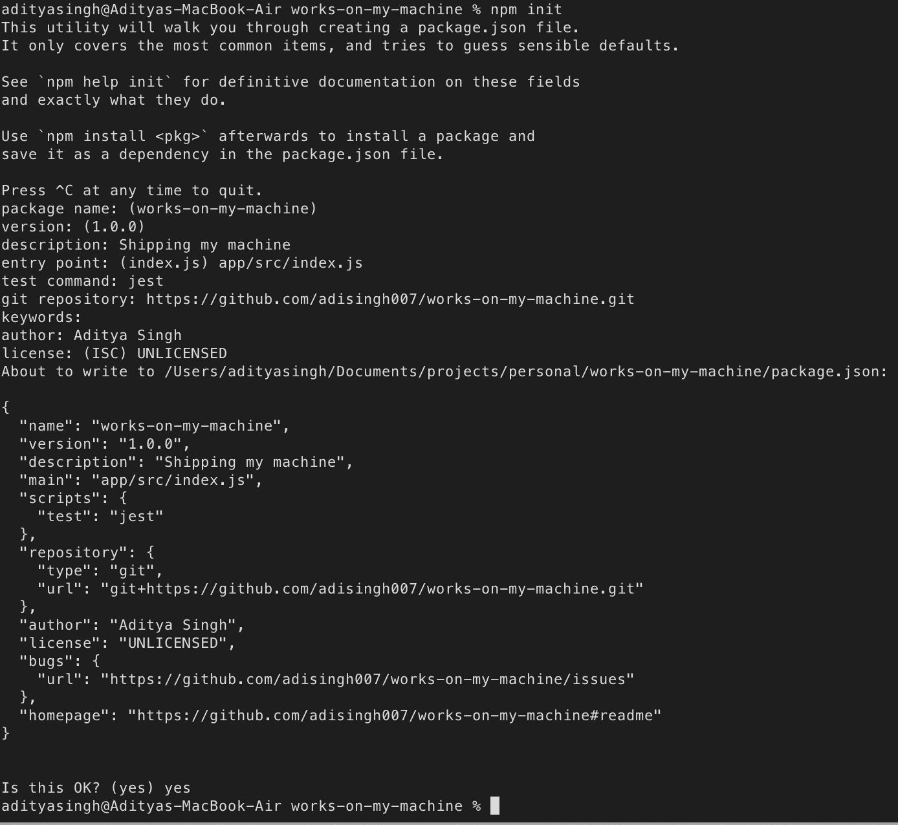

只需填写细节…常规的政府事务…

2.`npm i express`

3.`npm i --save-dev supertest jest`

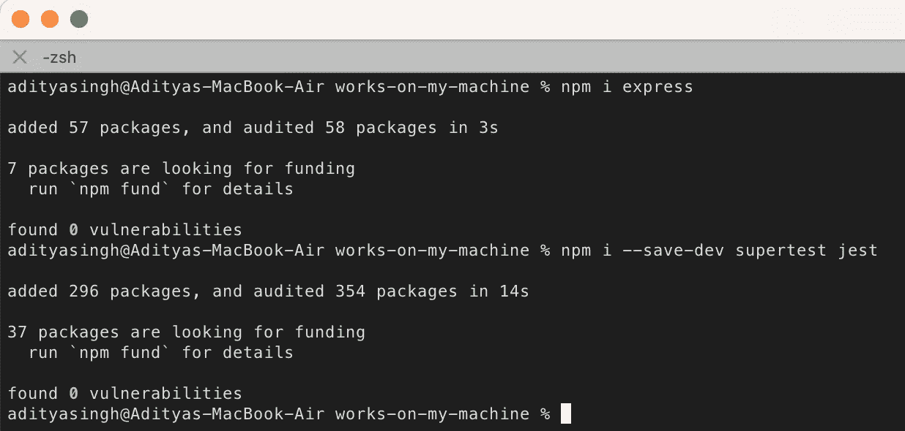

下载 express、supertest 和 jest

4.`mkdir -p app/src app/test`在`app`目录中递归创建`src`和`test`。

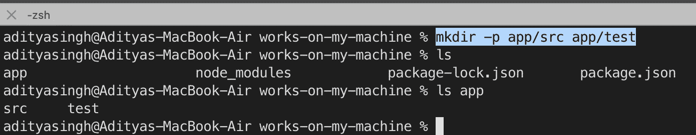

目录已经创建并列出

5.确保您在`package.json`中创建了 2 个脚本

```
"scripts": {
    "start": "node app/src/index.js",
    "test": "jest"
}
```

6.在步骤 1 后生成的`package.json`文件中添加以下内容。

```
"jest": {
    "testMatch": [
      "**/*.test.js"
    ]
}
```

上面的只是一个正则表达式，它说`jest`将在任何目录中查找以后缀`.test.js`结尾的测试文件

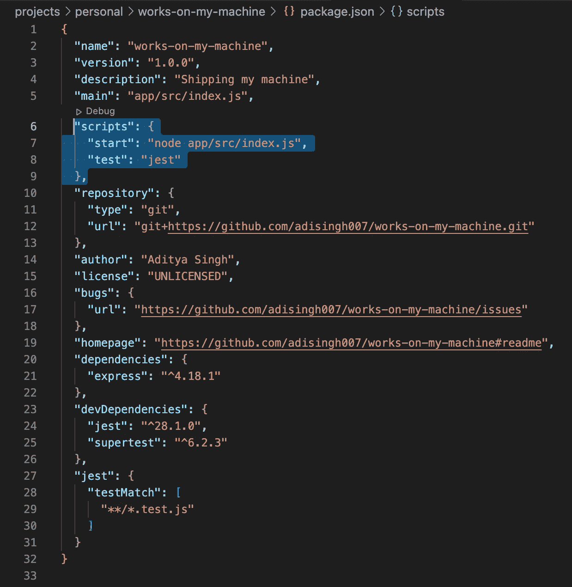

这是第 5 步和第 6 步之后 package.json 的样子

7.创建文件`app/src/app.js`:

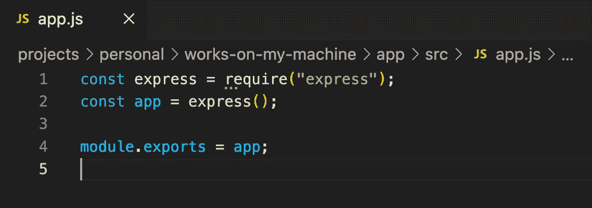

创建快速应用程序

8.创建另一个文件`app/src/index.js`:

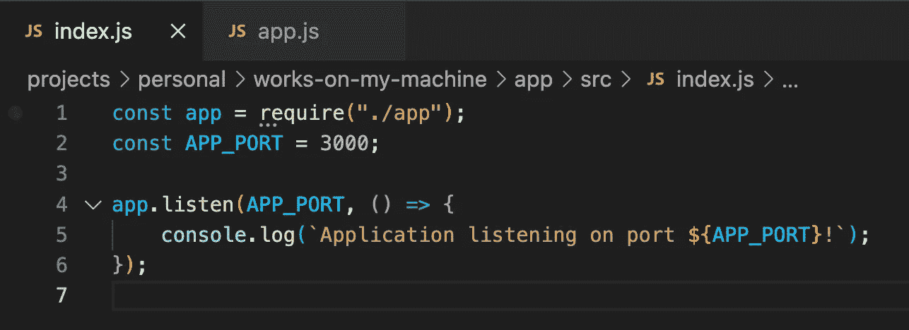

在端口 3000 上启动应用程序

9.`npm start`


运行应用程序

10.按下`control+C`停止上述应用程序。

11.快速创建一个文件`app/test/e2e/works-on-my-machine.test.js`并编写下面的 e2e 测试:

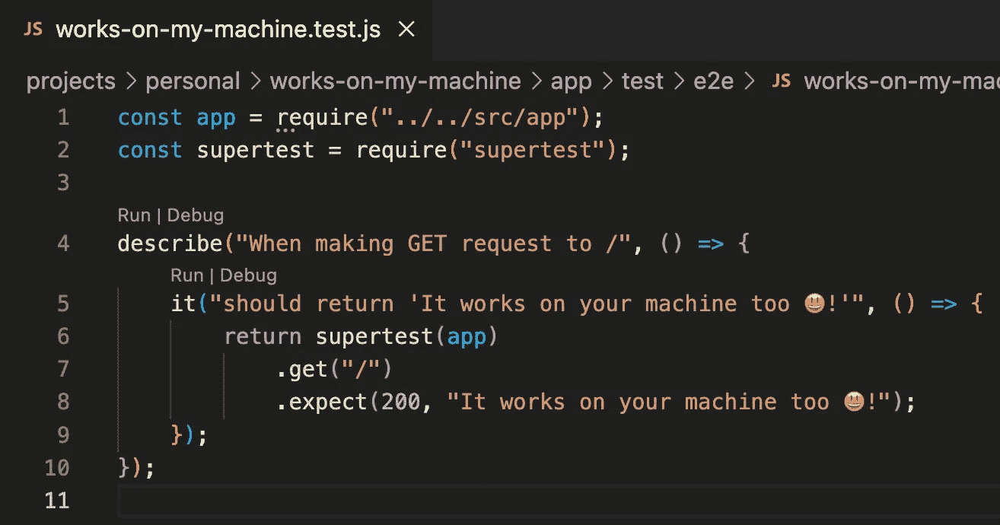

创建一个 e2e 测试，展示我们希望我们的预期端点如何工作

12.`npm test`

运行上面的测试，您会发现它失败了:


测试用例失败

这是因为我们还没有创建端点`/`。

13.在`app/src/app.js`中，让我们添加一个端点`/`。

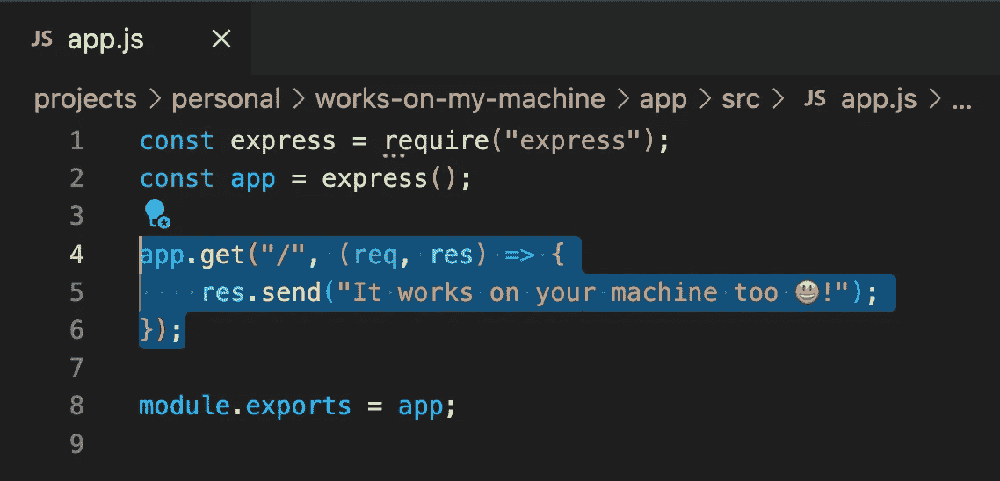

创建带有 1 个端点“/”的快速应用程序。当在“http://localhost:3000/”上发出 GET 请求时，它将返回“它在您的机器上也有效😃!"

14.再次运行`npm test`，测试用例成功。

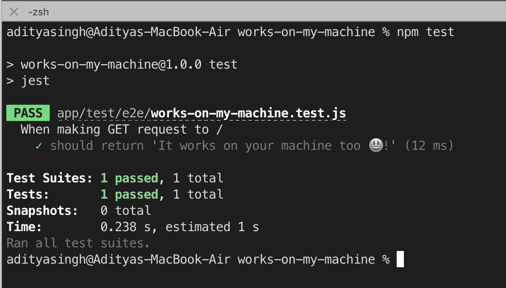

这次测试用例成功了

15.再次运行`npm start`,从浏览器点击终点`[http://localhost:3000/](http://localhost:3000/)`。


再次运行应用程序

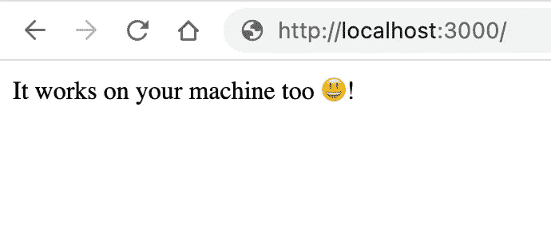

它在你的机器上也能工作😃！

**太好了！该应用程序经过了良好的测试，已经启动并运行。该装船了。**😃

但每次我们的客户试图运行该应用程序时，他们都需要执行上述所有 15 个步骤。他们可能会把事情搞砸。他们不支持的下载依赖项是什么？此外，它占用了我们客户太多的宝贵时间。**不太好用**。是吗？😏

*如果您可以将您的机器带到客户家中并为他们运行，会怎么样？很简单，对吧？你可以为一个顾客这样做。但是如果你有几千个呢？还是几百万？你要去多少家？*

> *让我们的客户能够像在您的机器上运行应用程序一样使用应用程序，而不必让他们经历安装依赖项和做其他设置工作的痛苦……*

嗯，我冒昧地认为你已经有了 Docker 设置。

所以我会直接跳到必要的步骤:

D **奥克——你可以把你的电脑带到一百万个用户家中，为他们运行应用程序:**

1.  在项目根目录中快速创建一个名为`Dockerfile`的简单文件，并添加以下代码。添加了解释注释:

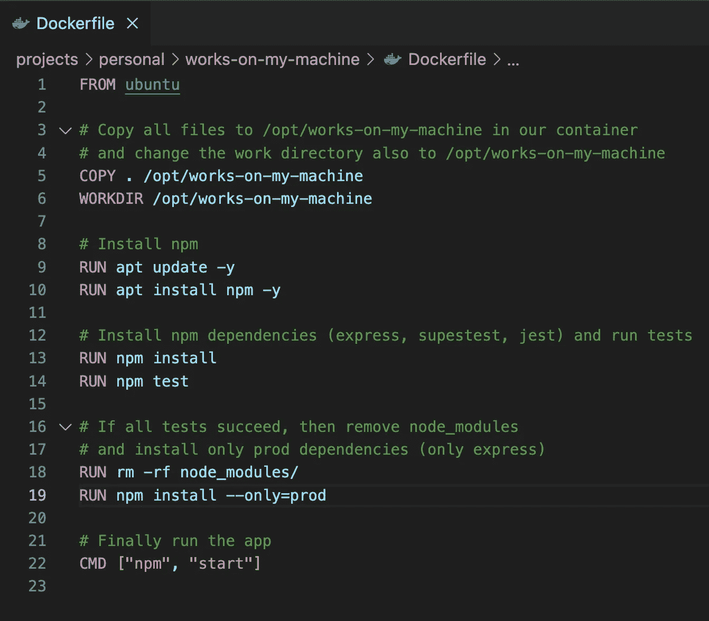

Dockerfile 文件

2.`docker build -t works-on-my-machine-image .`

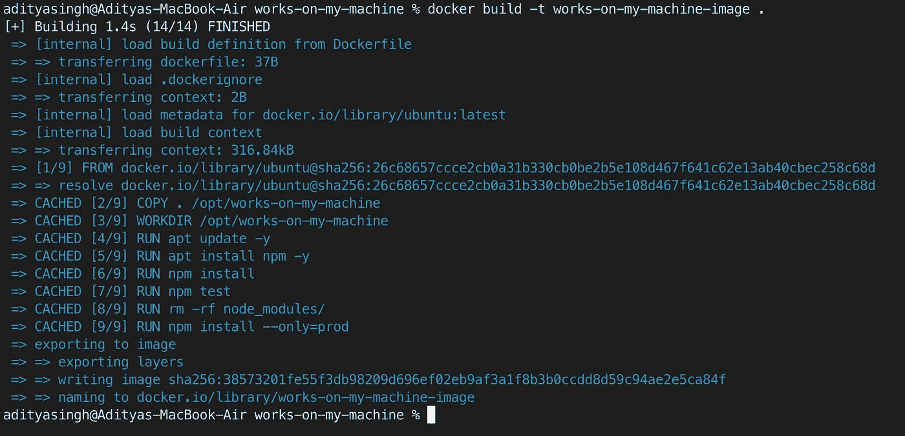

构建成功

第一次运行时，该步骤通常需要一些时间。需要一些耐心。

上面的构建是成功的。如果任何一步出错了，让我们假设某个测试用例失败了，构建就会失败。尝试打乱我们上面写的 e2e 测试，并重新运行构建。注意上面的构建是如何失败的。

3.`docker images`

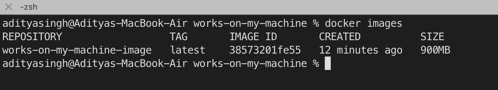

创建了一个名为“在我的机器上工作的图像”的图像

4.`docker run -p 3000:3000 --name works-on-my-machine-too works-on-my-machine-image`

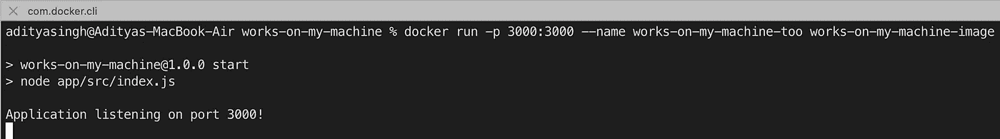

从我们构建的映像运行 docker 容器

5.再次从浏览器点击`http://localhost:3000/`。

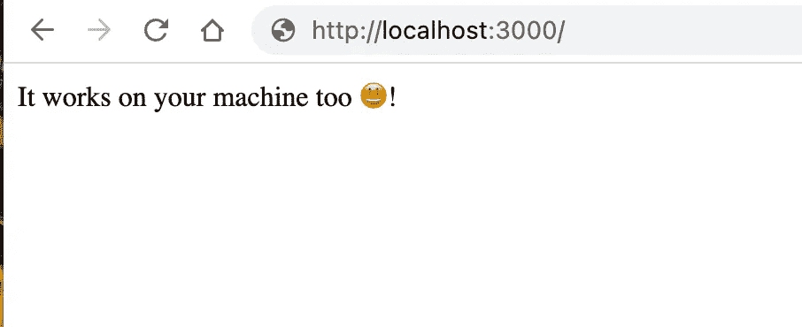

有用！

> ***跑 6 步也可以太多。没有吗？*😛**

首先，让我们停下来，删除上面创建的容器和图像:

1.  `docker stop works-on-my-machine-too`停止容器。
2.  `docker rm works-on-my-machine-too`除去容器。
3.  `docker rmi works-on-my-machine-image`清除图像。

> 现在，让我们让客户能够以更少的步骤运行应用程序。

D

1.  在项目根目录下创建一个名为`docker-compose.yml`的文件:

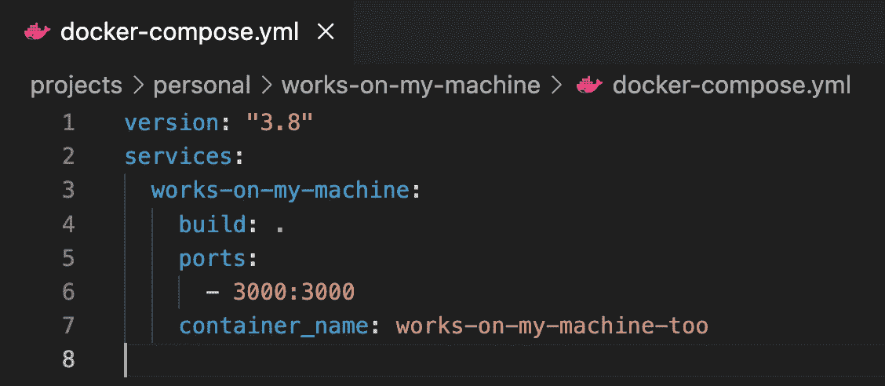

2.`docker-compose up`

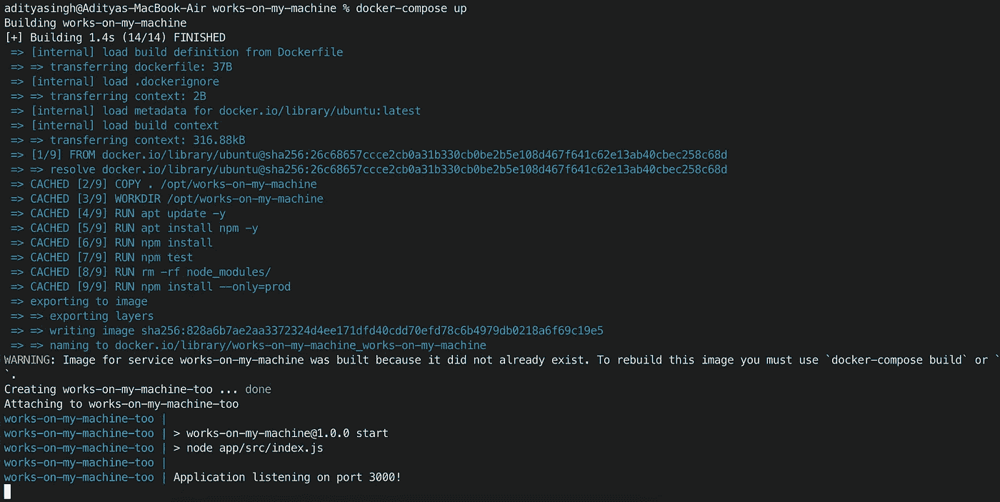

如果图像不存在，则构建图像并启动应用程序。

应用程序启动，只需点击`control+C`即可停止。

3.再次点击 api:

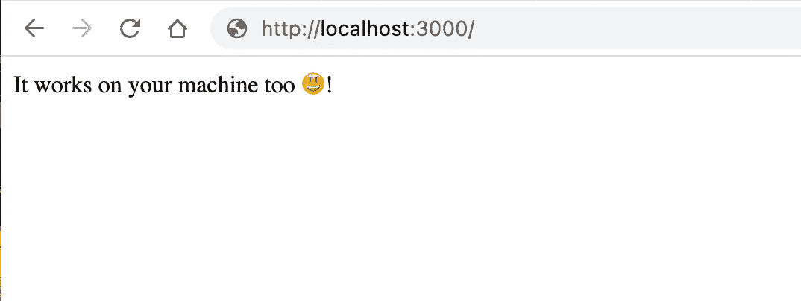

还能用！

**我们的客户现在只需执行*步骤 2*** 就可以使用该应用程序。

他们可以下载你的应用程序，然后直接运行它。乱七八糟地删除容器。

快乐的客户…满意的客户…😉。