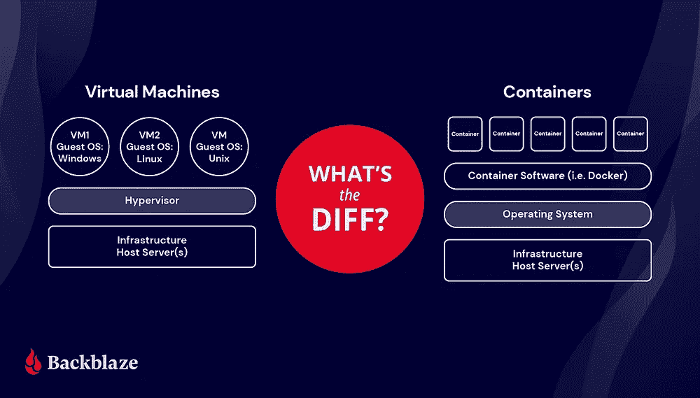

# Docker 先决条件

> 原文：<https://medium.com/nerd-for-tech/docker-pre-requisites-ea77ce55596?source=collection_archive---------3----------------------->

来源:Backblaze

通常，任何 web 应用程序都由一个**前端**、**后端**和**数据库**组成。作为开发人员，我们可能会使用不同的语言或框架，如 React、Node js、Angular、Django 等。开发一个应用程序。

说到底，我们需要像**内存**、**处理器(CPU)** 和**存储器**这样的硬件来运行我们的应用程序。有两个软件——**系统软件**像 *OS、杀毒*等。还有**应用软件**比如*我们用框架/语言开发的东西，Word，Excel，*等等。我们的目标是在不考虑系统软件(OS)和硬件设置的情况下运行我们的应用。我知道我把事情看得过于简单，但这是值得的。

我们开发的应用程序必须被所有人使用，不管他们的环境如何，如操作系统、内存和规格。因此，我们将应用程序托管在世界上某个地方的服务器上。这就是所谓的 T20 云’。所以云解决了从用户端安装所有需要的设置的问题。这节省了用户端的空间和内存。

从开发-部署的角度来看，我们需要优化服务器。毕竟，服务器是带有操作系统和硬件的更大版本的计算机。当我们只拆分服务器中的硬件时，这被称为'**虚拟化**。分割内存和存储等硬件使用的软件称为“**虚拟机管理程序**”。因此，当我把我的应用程序放在服务器(云)上时，我需要在服务器上安装我的操作系统(我就是从它开始开发的)、依赖项、库等。这实际上在服务器内部创建了另一台机器，这台机器称为**虚拟机(VM)。**这里我们有**主机操作系统**(服务器)和**客户操作系统**(我们在服务器上为应用程序安装的东西)

假设我们在同一台服务器上托管了许多应用程序，因此我们应该在服务器上安装许多来宾操作系统，即使所有应用程序都需要相同的操作系统，因为每个应用程序都是由我们开发的。还有，会有很多**虚拟机。**这里的主要问题是**来宾操作系统**，因为它在服务器中占用更多空间，并且与服务器托管的应用数量成比例。通常，任何操作系统都至少占用 500 MB 的存储空间。除了主机操作系统之外，还添加了此来宾操作系统。

## 如果我们找到一种高效使用主机操作系统的方法会怎么样？

让我们找到出路。我们知道操作系统是系统软件，一旦系统启动，它将管理所有的进程。OS 中有一个核心组件叫做**内核**，它实现了软件和硬件之间的通信。所以基本上**内核**管理内存和 CPU。

> *利用主机 OS 内核调用* ***容器技术***

这个概念也被称为**操作系统级虚拟化。**让我们能够做到这一点的平台叫做“ **Docker**

*原载于 2022 年 4 月 26 日 https://www.pansofarjun.com***。**