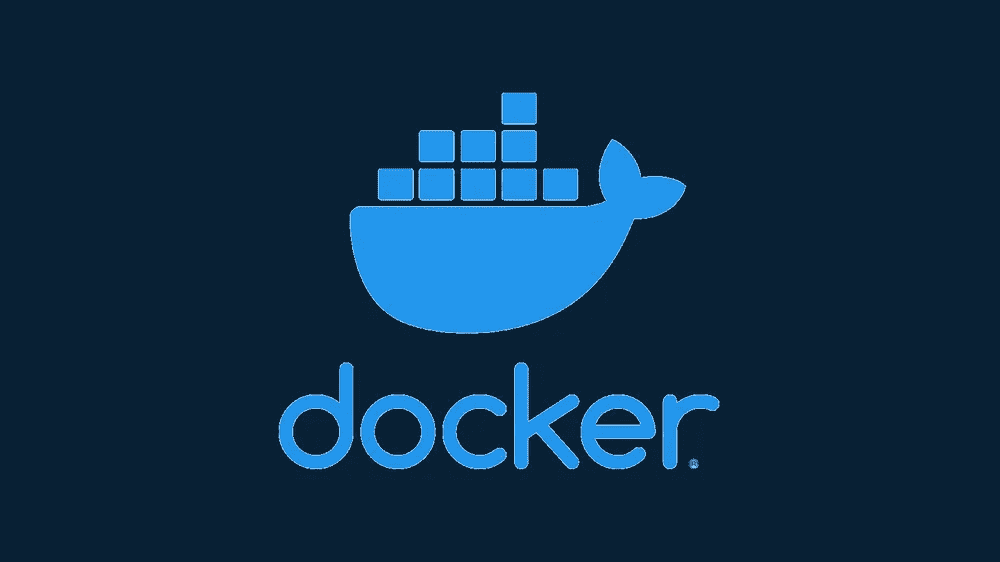

# Docker 摘要

> 原文：<https://medium.com/nerd-for-tech/docker-recap-caf77c904de6?source=collection_archive---------5----------------------->

如果许多开发人员在他们的本地机器上使用不同的操作系统和版本会怎样？

如果一个开发人员和其他开发人员使用的依赖项和库是不同的怎么办？

开发团队和测试团队环境不一样怎么办？

你仍然可以提出上述问题的不同排列和组合，但中心部分保持不变— **环境一致性。**

我们开发的环境在所有开发人员和测试团队中必须是相同的，这样我们就不会遇到任何问题或错误。

任何应用程序都包括源代码、选择的语言、解释器或编译器、依赖项、库等。从开发到部署，对环境的任何更改都必须在应用程序的所有团队中进行。提供这种功能的技术被称为“T2 集装箱化”实现这项技术的平台叫做 **Docker。**

> **不要把它和 GIT** 混淆，后者的主要目的是在*开发*期间拥有源代码版本**。**
> 
> **Docker 在所有团队中更注重基础设施的一致性，以使*部署*更容易。**

我们将运行一个应用程序所需的所有东西打包到一个名为“**容器**”的单元中无论主机环境如何，该容器都可以在不同的机器上移动和运行。这证明容器与本地机器完全隔离。

> *Docker 的实现与 OOP 程序相同，*
> 
> ***类*** *=* ***图片***
> 
> ***对象*** *=* ***容器***

我们使用命令来创建图像和容器。Docker 执行这个。

这些问题在文章中有深入的解释。

***图像是如何构建的？***

***容器是如何运行的？***

***我们为什么需要网络？***

***Docker 作曲是什么？***

***多重容器的本质是什么？***

***多容器应用如何执行？***

> *我们在 Docker 所做的一切都是为了* **环境的一致性。**

*原载于 2022 年 6 月 19 日 https://www.pansofarjun.com***。**