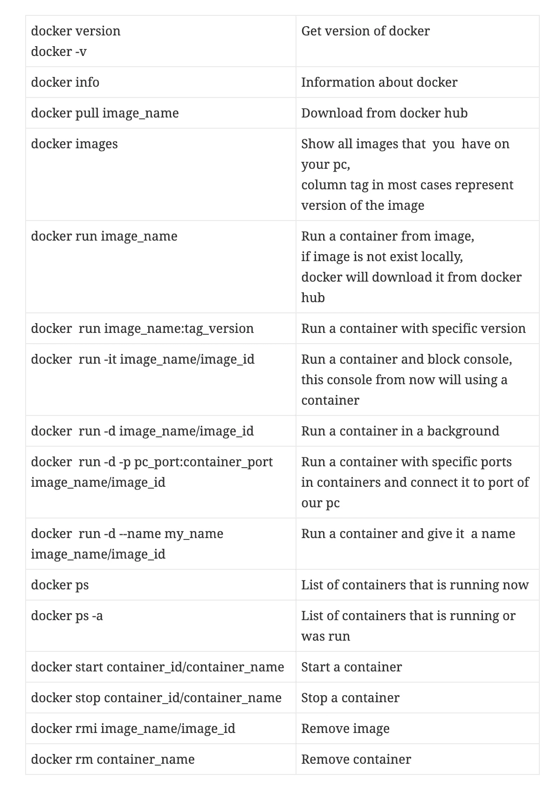

# Docker 教程。迈出第一步。

> 原文：<https://medium.com/nerd-for-tech/docker-tutorial-making-first-steps-c559f670e322?source=collection_archive---------13----------------------->

## 持续集成。

开始新的东西总是很难的。在这篇文章中，我将介绍 docker 的一个主要概念，并给你一些你需要知道的命令。

当我们在 linux 或 windows 上运行服务器时，我们不需要这个操作系统(OS)中的所有服务。我们需要一个没有用户界面的小版本的操作系统，里面有一些服务。这个小版本的操作系统是可移植的，需要更少的电脑资源。

基本上 docker 是那些微型虚拟机的管理者。使用 docker，我们可以运行许多虚拟机，停止，更新等。

**码头工人组件**

Docker 引擎是一个安装在你的电脑上的 docker。【https://docs.docker.com/engine/install/ 

**Docker 图像**

假设你需要在电脑上安装 windows，你需要什么？您需要在 CD 或闪存驱动器上有一个您想要的窗口系统的映像。你可以使用不同的 windows 7、10 或 vista。它们都在不同的 CD 上。这是一个码头工人的形象。

**码头集装箱**

你现在有一张光盘，你可以在你的电脑上安装操作系统。你可以在你的电脑上安装几个不同的操作系统，也可以多次安装同一个版本的操作系统。那是一个容器。

**Docker 文件**

Docker 文件是包含特定操作系统和不同程序的映像。

**码头中心**

在大多数情况下，我们可以使用现有的图像。我们只需要继续在 https://hub.docker.com/寻找合适的图像。您需要有一个使用 docker hub 的帐户。

我们完成了理论，是时候安装 docker 并运行一些命令了。

**Docker app**

Docker 桌面拥有我们需要的一切。[https://www.docker.com/products/docker-desktop](https://www.docker.com/products/docker-desktop)

**命令列表**

*原载于 2021 年 3 月 4 日*[*http://tomorrowmeannever.wordpress.com*](https://tomorrowmeannever.wordpress.com/2021/03/04/docker-tutorial-making-first-steps/)*。*