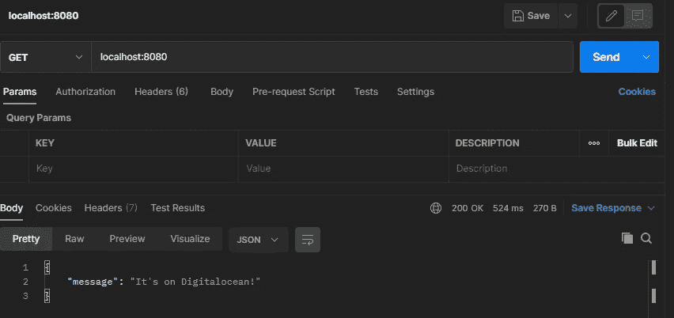
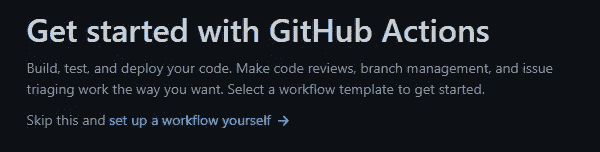
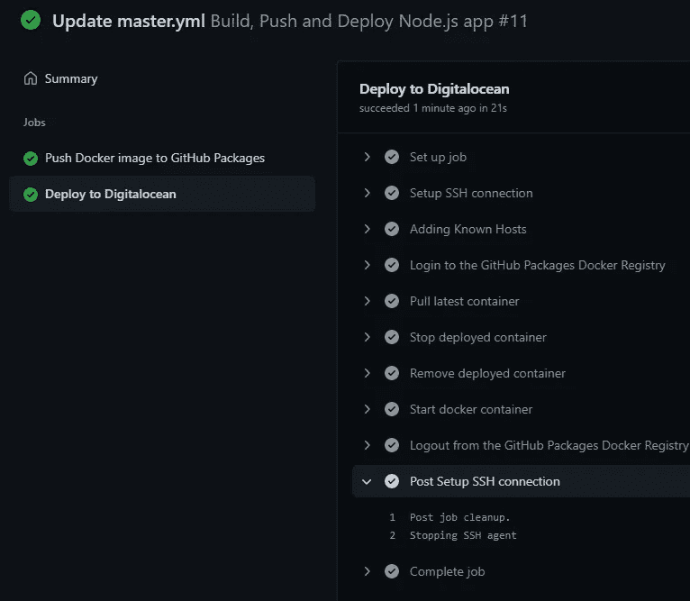
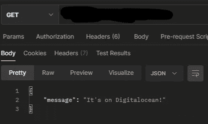

# 使用 GitHub 操作和包来整理和部署 Node.js 应用程序

> 原文：<https://medium.com/nerd-for-tech/dockerize-and-deploy-node-js-applications-using-github-actions-and-packages-a523daf587a0?source=collection_archive---------6----------------------->

# 先决条件

*   已安装 [Node.js](https://nodejs.org/en/) 和 npm
*   安装和配置 [Docker](https://www.docker.com/)
*   [Github](https://github.com/) 上的现有存储库
*   在[数字海洋](https://www.digitalocean.com/)上配置液滴

## 什么是 Github 动作？

*   **GitHub Actions** 是 GitHub 上的一个因果 API:编排任何工作流，基于任何事件，而 GitHub 管理执行，提供丰富的反馈，并保护过程中的每一步。

## Docker 是什么？

*   Docker 是一个开发、发布和运行应用程序的开放平台。Docker 使您能够将应用程序从基础设施中分离出来，这样您就可以快速交付软件。使用 Docker，您可以像管理应用程序一样管理基础设施。

## 什么是数字海洋水滴？

*   数字海洋水滴是基于 Linux 的虚拟机，运行在虚拟化硬件之上。您创建的每个 Droplet 都是一个新的服务器，可以单独使用，也可以作为更大的基于云的基础架构的一部分。

在本教程中，我们将使用 Github 包作为 docker 映像的容器注册表。

> *注意:GitHub 容器注册中心目前处于公开测试阶段，可能会有变化。在测试期间，存储和带宽是免费的。要使用 GitHub 容器注册表，您必须启用功能预览。有关更多信息，请参见“关于 GitHub 容器注册表”和“启用改进的容器支持”*

# 准备我们的 Node.js 应用程序

## 安装依赖项

首先，我们需要创建一个`package.json`文件。

`package.json`文件定义了应用程序应该安装的依赖项。要为应用程序创建 package.json 文件，请在应用程序的根目录中运行 npm init 命令。它将引导您创建 package.json 文件。您可以通过将提示留空来跳过任何提示。

生成的 package.json 文件如下所示:

要安装依赖项，请使用`npm install <pkg>`。它安装这个包，并把它作为一个依赖项添加到`package.json`文件中。例如，要安装`express`，你可以输入`npm install express`。

现在您的`package.json`文件应该是这样的:

## 创建`server.js`文件

正如您可能看到的，我们声明我们的入口点是一个`server.js`文件。让我们创建一个。

这个文件将包含一个带有简单的`GET`端点的`express`应用程序，这将允许我们测试部署。

首先，让我们导入`express`并声明我们的端点:

现在让我们通过访问 [http://localhost:8080](http://localhost:8080) 来检查我们的应用程序是否正在监听请求。为此，我将使用[邮递员](https://www.postman.com/)。

而且很管用！

现在我们可以开始整理我们的申请了。

# Dockerize Node.js 应用程序

为了实现我们的目标，首先，我们需要创造出`Dockerfile`。根据该文档，Dockerfile 是一个文本文档，它包含用户可以在命令行上调用的所有命令来组合一个图像。

## 简单 Dockerfile 文件

你已经可以构建并运行你的容器，它会工作，但也许我们可以做得更好？当然啦！

让我们指定基础映像的版本:

然后我们来看看依赖安装。我们正在准备应用程序的生产版本，所以我们不需要安装开发依赖项。我们可以通过将`RUN npm install`改为:

另一个步骤是确保所有的框架和库都使用最佳的生产配置。我们可以将这一行添加到我们的`Dockerfile`中:

## [不要以根用户身份运行容器](/@mccode/processes-in-containers-should-not-run-as-root-2feae3f0df3b#:~:text=Containers%20are%20not%20trust%20boundaries,a%20container%20on%20your%20server.)

保持您的流程没有安全风险真的很重要！

**朋友不让朋友以 root 身份运行容器！**

所以，让我们在我们的`Dockerfile`中多修改几行:

我们的应用程序正在监听端口 8080，因此我们需要从容器中公开这个端口:

此时我们的`Dockerfile`看起来是这样的:

让我们建立并运行我们的形象:

您可以通过键入以下命令来检查它是否正在运行:

您可以使用以下命令查看容器的日志:

# 正常关机

Node.js 集成了 web 服务器功能。另外，有了 Express，这些可以扩展得更多。

不幸的是，Node.js 不能很好地处理开箱即用的自我关闭。这导致了集装箱系统的许多问题。

当 Node.js 应用程序收到一个中断信号(也称为`SIGINT`或`CTRL+C`)时，它将导致突然的进程终止，当然，除非设置了任何事件处理程序来以不同的行为处理它。这意味着连接到 web 应用程序的客户端将立即断开连接。

让我们通过创建另一个具有延迟响应的端点来模拟这个问题:

运行这个应用程序，一旦它开始运行，就向这个端点发送一个简单的 HTTP 请求。

在正在运行的 Node.js 控制台窗口中点击`CTRL+C`,您会看到 curl 请求突然退出。这模拟了当容器拆除时，用户将会得到的相同体验。

## 第一部分

要解决这个问题，我们需要允许请求完成。让我们向 Node.js 服务器解释一下:

这将调用`server.close()`，它将指示 Node.js HTTP 服务器:

*   不再接受任何请求。
*   完成所有正在运行的请求。

它将在`SIGINT`(当您按下`CTRL+C`)或`SIGTERM`(一个进程终止的标准信号)上执行此操作。

你可能会有一个问题“如果一个请求花费太多时间怎么办？”。因此，如果容器没有停止，Docker 和 Kubernetes 将在几秒钟(通常是 30 秒)后运行一个`SIGKILL`，这是进程本身无法处理的，所以这不是我们所关心的。

## 第二部分

现在在我们的`Dockerfile`中，我们用命令`npm start`启动我们的应用程序。不幸的是，这有一个大问题:

如果`yarn`或`npm`收到一个`SIGINT`或`SIGTERM`信号，它们会正确地将信号转发给衍生的子进程(在本例中为`node server.js`)。但是，它不会等待子进程停止。相反，`yarn` / `npm`立即停止自己。

解决方案不是使用 npm 运行应用程序，而是直接使用`node`:

但是仍然有一个问题。Docker 作为`PID 1`运行我们的流程。根据 [Node.js Docker 工作组建议](https://github.com/nodejs/docker-node/blob/main/docs/BestPractices.md#handling-kernel-signals):

> *Node.js 没有被设计成以 PID 1 运行，这导致在 Docker 内部运行时出现意外行为。比如一个运行为 PID 1 的 Node.js 进程，不会响应* `*SIGINT*` *(* `*CTRL-C*` *)以及类似的信号。*

我们可以使用一种叫做`dumb-init`的工具来修复它。它将作为`PID 1`被调用，然后将生成我们的 node.js 流程作为另一个流程。让我们来补充一下我们的`Dockerfile`:

所以我们的`Dockerfile`的最终版本看起来是这样的:

现在我们可以继续我们的 Github 行动了！

# 配置 Github 操作

## 介绍

转到您的存储库，选择`Actions`选项卡。你会看到 GitHub 向你提出了不同的工作流程，但这不是我们的方法。点击`set up a workflow yourself`。

我们将被重定向到具有初始配置的页面，当我们完成配置时，它将被提交给`main` ( `master`)。

让我们来谈谈初始配置，它应该是这样的:

*   `name` -是我们工作流程的名称
*   `on` -是我们描述触发工作流的块。默认情况下，当对`master`分支执行`push`时(本例中为访问`master`分支)或对`master`分支执行`Pull Request`时(本例中为访问源分支，例如。`feature/TASK-1`)。而且我们可以手动触发，这是`workflow_dispatch`属性允许的。
*   `jobs` -是配置我们作业的模块。它们可以一个接一个运行，也可以同时运行(例如在 mono repo 中同时部署后端和前端)。
*   `runs-on` -运行作业的机器类型。该机器可以是 GitHub 托管的运行程序，也可以是自托管的运行程序。
*   `steps`——我们逻辑生活的地方。每个步骤都在 runner 环境中运行，并且可以访问工作区和文件系统。
*   `uses` -选择作为工作步骤的一部分运行的操作。动作是可重用的代码单元。在这种情况下，被 GitHub 调用的预定义动作`actions/checkout@v2`允许我们`checkout`源分支(`master`或另一个触发工作流的分支)
*   `name`——是这一步的名字。它将显示在工作流执行的进度中。
*   `run` -使用操作系统的外壳运行命令行程序。如果不提供`name`，步骤名称将默认为`run`命令中指定的文本。它可以执行单行命令，也可以执行多行命令。

您可以通过访问[工作流语法文档](https://docs.github.com/en/actions/reference/workflow-syntax-for-github-actions)找到更详细的文档

## 构建和推动

现在我们有足够的知识来开始我们的配置工作。让我们定义工作流的名称以及何时触发它。在我们的例子中，工作流应该只在`master`分支中的变更上执行，或者手动执行，所以我们的声明应该是这样的:

现在我们需要声明一些`env`变量，以便能够在我们的配置中重用它们，避免重复同样的事情:

是时候定义我们的工作了。在我们的例子中，将有两个作业，一个将构建图像并将其推送到注册表，另一个将在我们的 droplet 上拉出并运行容器。

为了构建容器并将其推送到注册表，我们将使用`docker/build-push-action@v1`动作，您可以在这里找到详细的文档[。](https://github.com/docker/build-push-action)

此时，我们的工作流配置应该如下所示:

如你所见，我们使用了`github.actor`和`secrets.GITHUB_TOKEN`，你可能会问，我们在哪里声明了这些变量。回答:我们没有。

这些变量是由 GitHub 预定义的。

*   `github.actor` -是启动工作流运行并参与`github`上下文的用户的登录。你可以在这里阅读更多信息
*   `secrets.GITHUB_TOKEN` -是 GitHub 提供的令牌。它是在每次工作流运行时创建的。您可以使用 GITHUB_TOKEN 在工作流运行中进行身份验证。点击了解更多[。](https://docs.github.com/en/actions/reference/authentication-in-a-workflow)

如果您只想构建和推送您的容器，这个操作已经可以使用了。如果你只是在一个 docker-image 上工作，它是合适的，它应该只存储在注册表中，当你需要它的时候，你需要能够取出它。

但是在我们的例子中，我们还需要部署它，所以让我们配置第二个作业。

## 部署:拉动并运行

我们的第二个任务负责通过 ssh 连接到我们的 droplet，拉容器并运行 docker 容器。它也将运行在`ubuntu-latest`亚军，它应该只在我们之前的工作称为`push_to_registry`后开始。因此，我们的工作宣言将是这样的:

在步骤配置之前，我们需要添加一些变量，即`SSH_KEY`、`SSH_USER`和`SSH_HOST`。这些变量将用于验证我们到 droplet 的 ssh 连接。但是像我们应用程序的其他秘密一样，将它们存储在存储库文件中是一个非常糟糕的主意，所以我们需要另一种更安全的方式来声明它们。GitHub 提供了一个——名为`Secrets`,你可以在 GitHub 的库的`Settings`标签中找到它们。

机密有两种类型:存储库和环境机密。你可以在[文档](https://docs.github.com/en/actions/reference/encrypted-secrets)中了解更多。在我们的例子中，我们将使用存储库机密，因此转到配置页面并单击`New repository secret`。

如前所述，我们需要三个变量:

*   `SSH_KEY` -这是您用来访问 droplet 的私人密钥。
*   `SSH_USER` -用于通过`ssh`访问 droplet 的用户名
*   `SSH_HOST` -你滴宿主

一旦它们被设置，您将会看到下面的结果。这些秘密甚至不能被仓库所有者再次看到，它们只能被**更新**或**删除**。

现在我们可以继续我们的`steps`配置。为了执行`SSH`连接，我们将使用`webfactory/ssh-agent`动作。更多细节和描述你可以在这里找到。

让我们配置`SSH`连接:

根据文档，这些操作不会为我们更新`.known-hosts`文件，所以让我们声明另一个使用`ssh-keyscan`更新该文件的步骤。

现在是时候添加一个命令，将我们的图像拖放到 droplet 中:

在这个命令中，我们指定需要使用我们的`user`和`host`通过`ssh`连接，并运行这个命令来获取最新版本的 docker 映像。

现在我们需要运行我们的容器:

在这一步，我们也通过`ssh`连接，但是让我们更仔细地看看 docker 命令

*   `docker run` -运行容器本身
*   `-p 8080:8080` -指定我们需要将从容器端口(`8080`)暴露的内容绑定到机器的本地端口(droplet)。
*   `-d` -标志用于在分离模式下运行容器
*   `--restart unless-stopped` -指定除非手动停止，否则应该重新启动容器。它也将在机器启动时启动。
*   `--name=${{env.CONTAINER}}` -指定启动容器的名称
*   `${{env.REGISTRY}}/${{env.REPO}}:latest` -指定我们需要将哪个图像作为容器运行

此时，我们的配置将如下所示:

现在看起来很好，不是吗？但是如果我们现在运行它，它有一些问题会使我们的工作流程失败。

为了从 GitHub 容器注册表中提取容器，我们需要对这个容器进行认证。我们也将使用`github.actor`和`secrets.GITHUB_TOKEN`变量。因此，让我们在拉集装箱之前再增加一个步骤:

但是出于安全原因，将 docker 的身份验证留给远程机器上的注册中心并不是一个好主意，因此我们需要在工作流的末尾添加从注册中心注销:

通过这些步骤，我们解决了认证问题，但是还有一个问题。在第二次运行时，我们的工作流将会失败。

**为什么？原因很简单，因为我们的容器的端口和名称已经在上次运行中使用过了。**

**怎么修？修复非常简单，我们只需要停止并移除之前的容器。让我们在启动容器之前再添加两个步骤:**

你大概有个疑问:“*为什么我们这里需要* `*continue-on-error*` *属性？*”。原因是，如果没有任何运行的或现有的容器与我们的容器同名，这些命令将抛出一个错误。这对我们的工作流来说不是问题，所以我们将跳过这些错误。

我们的工作流配置的最终版本将如下所示:

现在我们可以提交并推动您的工作流运行到`master`分支！

由于我们对`master`分支执行了`push`操作，工作流应该会自动触发。

如果你做的一切都是正确的，你将不会在执行中得到任何错误:

现在是时候检查我们在远程服务器上部署的应用程序的工作情况了。让我们对您的`host:8080`或域(如果它在您的机器上配置了)运行一个查询:

如你所见，一切都很好！

# 结论

在本教程中，我们创建了一个 Node.js，并根据最佳实践对其进行了 dockerized，然后使用 GitHub 操作、GitHub 包和 DigitalOcean droplet 对其进行了部署。

> *注意:* `*GitHub Packages*` *可以根据动作文档用另一个容器注册表代替，也可以用另一个* `*VPS*` *代替* `*DigitalOcean*` *。您可以根据需要自由定制这种配置。*

在 [GitHub](https://github.com/tfarras/nodejs-deploy) 上找到样板文件

在 [GitHub](https://github.com/tfarras) 和 [LinkedIn](https://www.linkedin.com/in/taimoor-farras/) 找到我