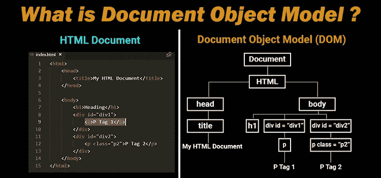
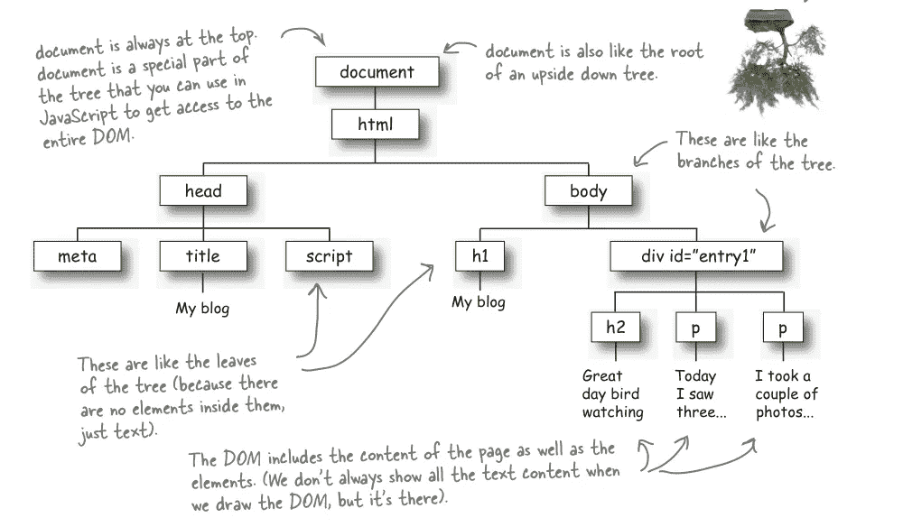
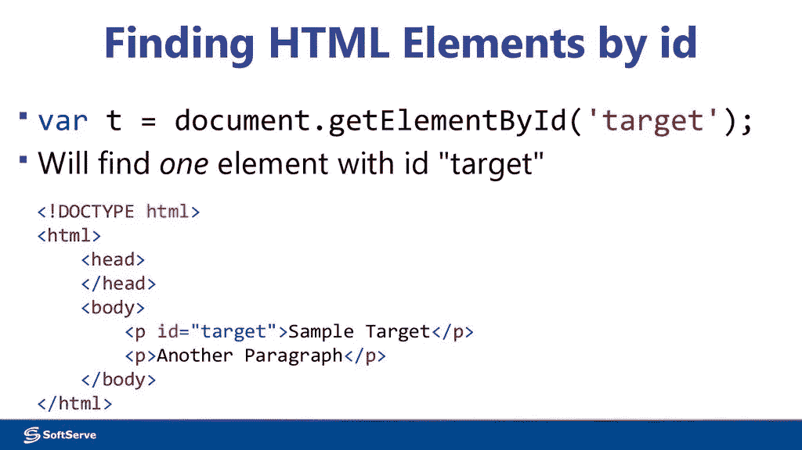
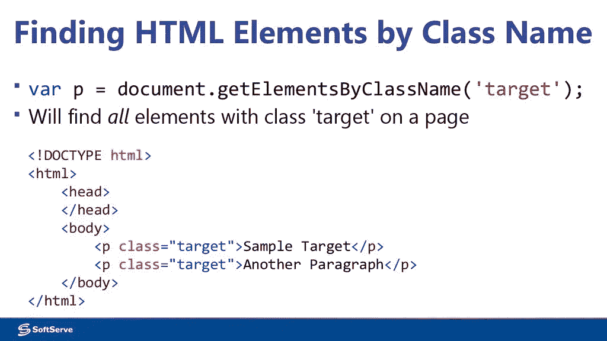
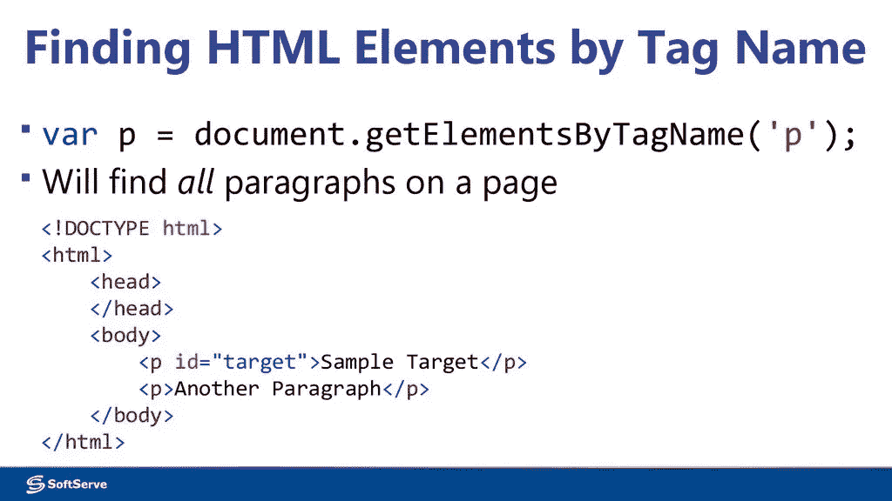

# 文档对象模型

> 原文：<https://medium.com/nerd-for-tech/document-object-model-a486023357f5?source=collection_archive---------20----------------------->

**HTML - DOM**

当你进一步深入前端世界时，你会想给你的网站增加一些活力和动力。这就是多姆来找你的地方。DOM 是一个**文档对象模型。**

文档对象模型是一个界面，帮助浏览器创建 HTML 元素的树型结构。树的每个分支代表 HTML 文档中存在的所有对象。这就是为什么称之为 DOM，即表示文档对象的模型。

**DOM 之树**

自从我投身这个领域以来，经营网站对我来说越来越好了。就像家谱一样。一个父节点，然后是子节点，然后是子节点的孙节点，依此类推。

DOM 是用 javascript 语言编写的。但是我们如何从 javascript 文件中访问 HTML 对象呢？使用多种方法，如 id、类、标签名称等。我将在这里讨论其中的一些。

# 使用> document.getElementBy…(' ')进行访问

> **1。id:**

Javascript 可以通过使用元素中使用的 id 来访问 HTML 文档中的元素。请参见下面的示例。

var t = document . getelement**ById**(' target ')；

写在括号内的**目标**将文件导向包含特定 ID 的特定元素，如下图所示。

*等等！你有多个身份证吗？哎呀，你可能会有麻烦！*👀

> **2。类别:**

与 Ids 类似，我们也可以使用类来访问元素。但是在这里，id 和类的使用区别与我们在 CSS 中的使用是一样的。也就是说，确保只对特定或特殊的元素使用 id，而您可以在多个地方使用类。因此，当我们说

**document . getelementbyclass(' target ')；**

这意味着我们正在调用所有在它们的类中使用了***target****的元素。*

**

> ***标签:***

*标签代表了我们的 HTML 文档的元素。因此，当我们使用标签调用时，例如，我们在下图中调用 **p** 即**段**标签，我们使用:*

***document . getelementbytagname(' p ')；***

*这意味着我们在对所有的段落标签说话。*

**

# *结论*

*DOM 的目的是用一点动画为网站添加更多的生命和创新。借助 JS，我们不仅可以定位基本的 Html 元素，还可以定位这些对象的 CSS。要更简要地了解 DOM，请查看:*

1.  *[*MDN 文档*](https://developer.mozilla.org/en-US/docs/Web/API/Document_Object_Model/Introduction)*
2.  *[*用 JavaScript 访问 DOM*](https://en.ppt-online.org/83335)*