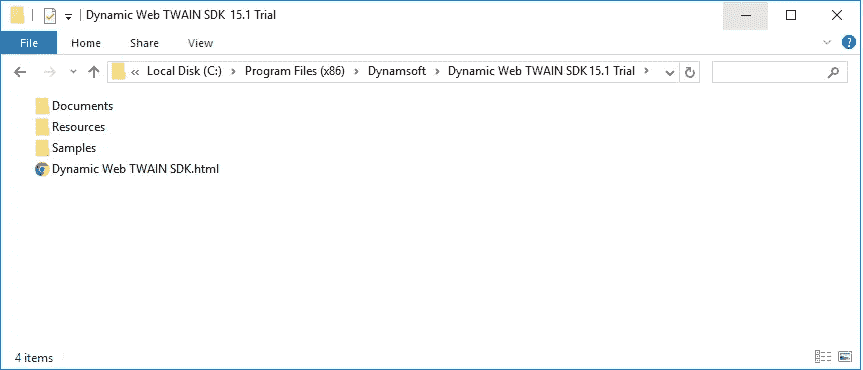
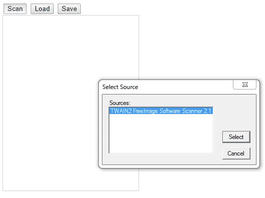
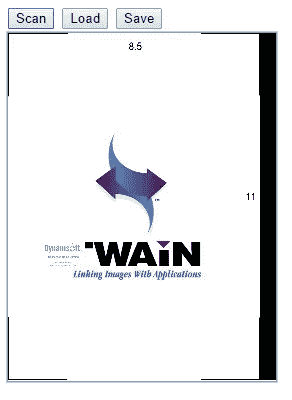

# 使用 JavaScript 和 jQuery 进行文档扫描

> 原文：<https://medium.com/nerd-for-tech/document-scanning-using-javascript-and-jquery-8484a61ca289?source=collection_archive---------0----------------------->

众所周知，web 客户端 JavaScript 代码不能直接与文档扫描仪交互。在 Dynamsoft 实现之前，没有 JavaScript API 可用。 [Dynamic Web TWAIN](https://www.dynamsoft.com/web-twain/overview/) SDK，基于浏览器的文档扫描 SDK，支持扫描仪和数码相机的 JavaScript 编程。有了 SDK，从 web 浏览器中捕获图像和文档变得很容易。

在本教程中，我们将解释如何构建一个简单的 HTML 页面来扫描文档，并使用动态 Web TWAIN SDK 将它们保存为 PDF 文件。我们还将讨论如何批量扫描多个页面并将它们保存为 PDF，以及如何在 web 应用程序中使用 OCR 将纸质文档扫描为可搜索的 PDF 文件。

# 动态 Web TWAIN SDK 的基本功能

*   兼容 ie 浏览器(32 位或 64 位)、Edge、Chrome、Firefox、Safari 两个窗口、 [macOS](https://www.dynamsoft.com/web-twain/features/scan-documents-mac-browsers/) 和 [Linux](https://www.dynamsoft.com/web-twain/features/web-document-scanning-sdk-linux/)
*   支持移动相机的图像捕捉和边框裁剪
*   支持 [TWAIN](https://www.dynamsoft.com/blog/insights/document-scanning-twain-wia-isis-sane/) 扫描仪、数码相机&其他 TWAIN 设备
*   支持基本的编辑操作，包括旋转、裁剪、镜像、翻转、擦除等。
*   将扫描的图像保存到本地磁盘、web 服务器、数据库、SharePoint 文档库等

[**了解更多动态网页 TWAIN >**](https://www.dynamsoft.com/web-twain/overview/)

# 用 JavaScript 实现文档扫描

1.  [启动网络应用](https://www.dynamsoft.com/blog/imaging/capture/jquery-web-document-scanning-management/#step-1-start-a-web-application)
2.  [将动态 Web TWAIN 添加到 HTML 页面](https://www.dynamsoft.com/blog/imaging/capture/jquery-web-document-scanning-management/#step-2-add-dynamic-web-twain-to-the-html-page)
3.  [使用动态 Web TWAIN 扫描或加载图像](https://www.dynamsoft.com/blog/imaging/capture/jquery-web-document-scanning-management/#step-3-use-dynamic-web-twain-to-scan-or-load-images)
4.  [将图像保存为 PDF 文件](https://www.dynamsoft.com/blog/imaging/capture/jquery-web-document-scanning-management/#step-4-save-images-as-a-pdf-file)

# 步骤 1:启动 Web 应用程序

下载[动态网页 TWAIN](https://www.dynamsoft.com/web-twain/downloads/) 并注册一个 [30 天免费试用许可](https://www.dynamsoft.com/customer/license/trialLicense?product=dwt)。

安装后默认可以在 **C: >程序文件> (x86) > Dynamsoft >动态 Web TWAIN SDK {版本号}试用**找到。

## 1.将 Dynamsoft 的 Resources 文件夹复制到项目中

通常可以从
`C:\Program Files (x86)\Dynamsoft\Dynamic Web TWAIN SDK {Version Number} {Trial}\`复制资源文件夹

## 2.创建一个空的 HTML 页面

请将空的 HTML 页面与资源文件夹放在一起，如下所示:

# 第二步。将动态 Web TWAIN 添加到 HTML 页面

## 2.1 —在标记中包含两个 Dynamsoft 的 JS 文件。

## 2.2.将动态 Web TWAIN 容器添加到标签中。

# 第三步:使用动态 Web TWAIN 扫描或加载图像

向页面添加扫描和加载按钮:

并添加函数 AcquireImage()和 LoadImage()的实现。

现在，我们有两个选项可以将文档加载到动态 Web TWAIN 中:

*   从扫描仪扫描文档(acquire image())；
*   或者加载硬盘文件(LoadImage())。

# 步骤 4:将图像保存为 PDF 文件

让我们在网页上添加一个保存按钮:

添加将文档保存到 PDF 的逻辑:

现在，保存文件。

就是这样。恭喜你。您在大约 5 分钟内就创建了一个网页，可以扫描或加载文档，并将其保存为 PDF 文件。

您可以在浏览器中打开 web 文档扫描应用程序并进行测试。这是单击“扫描”按钮时页面的外观:

请注意，只有 TWAIN 兼容的扫描仪会列在“选择源”对话框中。如果你手头没有真正的扫描仪，你可以[安装一个虚拟扫描仪](https://www.dynamsoft.com/codepool/windows-virtual-scanner-custom-images.html)进行测试，这就是我所做的。如果您有扫描仪，但它没有出现在列表中，请[与我们的技术支持](https://www.dynamsoft.com/company/contact/)讨论解决方案。

扫描样本页面后，它看起来像这样:

是的，你可以点击“保存”按钮将其保存为 PDF 文件。

# 更进一步

上面的例子很简单并且运行良好。但有时，你可能想更进一步。比如不用手动点击保存按钮，自动保存文档为 PDF 怎么样？

有了动态 Web TWAIN 的事件机制，这实际上很容易做到。

动态 Web TWAIN 提供了许多事件供用户订阅。当达到某些触发点时，事件被触发。例如，我们有一个用于鼠标点击的 [click](https://www.dynamsoft.com/web-twain/docs/info/api/WebTwain_Viewer.html?ver=latest#click) 事件，一个用于结束传输一个图像的[onpostfransfer](https://www.dynamsoft.com/web-twain/docs/info/api/WebTwain_Acquire.html?ver=latest#onposttransfer)事件，等等。

所以在函数 Dynamsoft_OnReady()的末尾，只需添加:

# 扫描文档并将条形码用作批次分隔符

如果要批量扫描文档，然后保存为 PDF 呢？或者说，如何一批自动分离不同的文件？

我们建议您首先尝试一下这个 web 演示。

[将多页扫描成 PDF 在线演示](https://demo.dynamsoft.com/Samples/dwt/Scan-Documents-and-Separate-them-by-Barcode/Scan-Separate-Barcode.html)

演示应用程序使用户能够扫描来自 TWAIN 扫描仪和 mfp(多功能打印机)的文档。他们可以将其保存为 PDF 文件，单页 PDF 或多页 PDF。此外，它利用条形码作为批次分隔符。如果在页面上检测到条形码，将以条形码值作为文件名创建一个新文件。

*原载于 2022 年 11 月 2 日 https://www.dynamsoft.com**[*。*](https://www.dynamsoft.com/blog/imaging/capture/jquery-web-document-scanning-management/)*