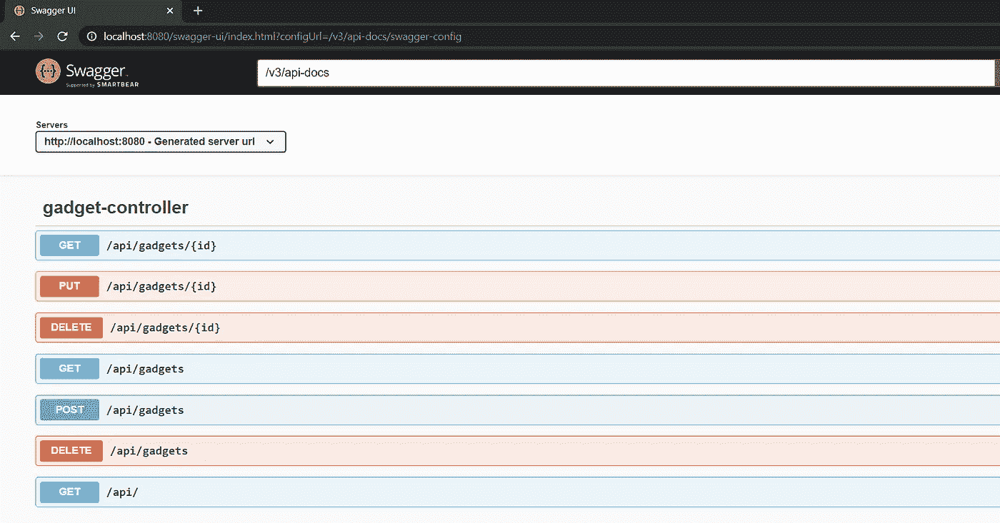
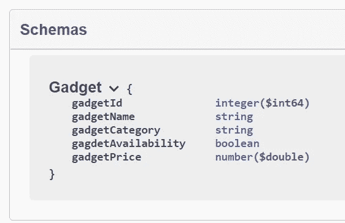
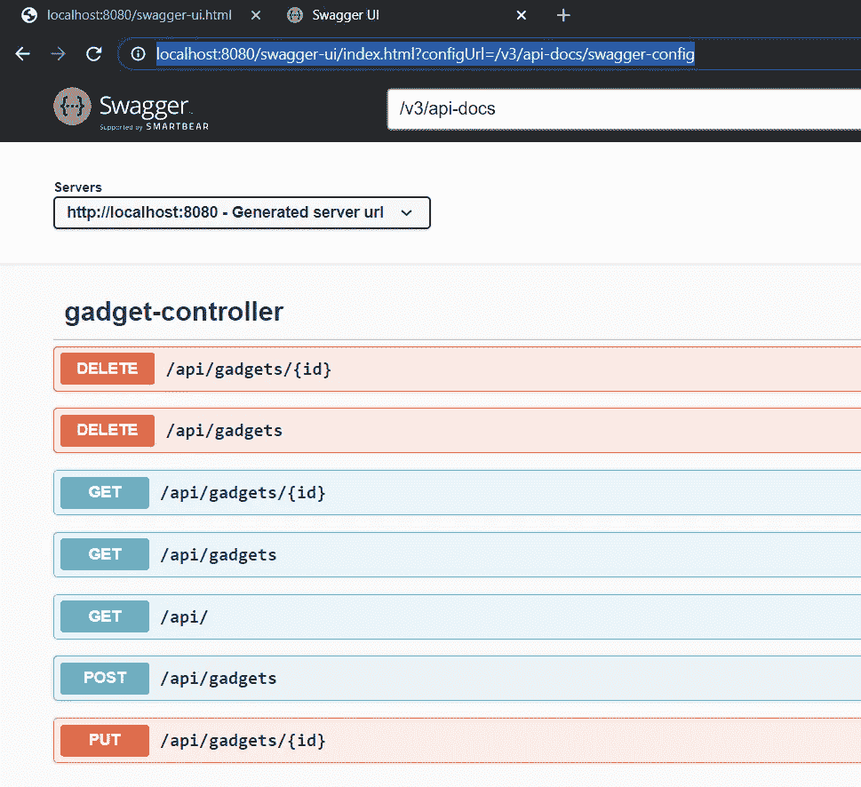
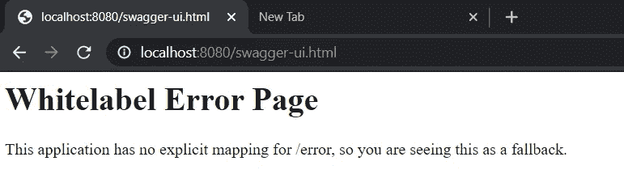
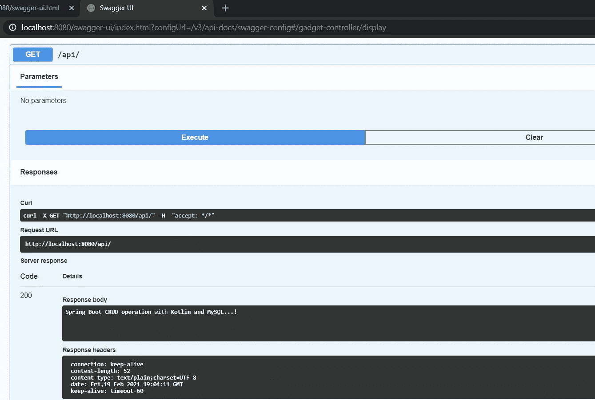
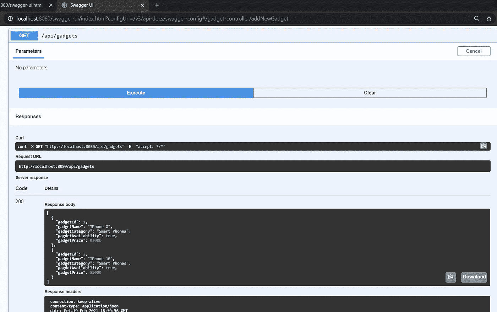

# 用 OpenAPI 3.0 记录 Spring Boot REST API

> 原文：<https://medium.com/nerd-for-tech/documenting-spring-boot-rest-api-with-openapi-3-0-220a5103f0a5?source=collection_archive---------5----------------------->

在本文中，我们将看到如何记录我上一篇文章中实现的 Spring Boot 应用程序(使用 Kotlin)。

[小工具图库 App: Kotlin + Sprint Boot +H2 数据库](https://techcolors.medium.com/implement-rest-api-with-kotlin-spring-boot-and-h2-database-9d0103064600)

OpenAPI 3.0 是一种描述和记录 API 的开源格式，以前称为 Swagger 规范。

**步骤 1** :让我们从添加 OpenAPI 3.0 [maven 依赖](https://mvnrepository.com/artifact/org.openapitools/openapi-generator/3.0.0)到我们的 pom.xml 开始

```
<**dependency**>
    <**groupId**>org.springdoc</**groupId**>
    <**artifactId**>springdoc-openapi-ui</**artifactId**>
    <**version**>1.5.4</**version**>
</**dependency**>
```

**Step-2** :通过在主类上添加@OpenAPIDefinition 来启用 openapi 文档，如下所示。

```
**package** com.shasr.gadgetgallery

**import** io.swagger.v3.oas.annotations.OpenAPIDefinition
**import** org.springframework.boot.autoconfigure.SpringBootApplication
**import** org.springframework.boot.runApplication

**@OpenAPIDefinition**
@SpringBootApplication
**class** GadgetgalleryApplication

**fun** main(args: Array<String>) {
    *runApplication*<GadgetgalleryApplication>(*args)
}
```

在步骤 1 和 2 中，我们为 Rest API 在默认 URI 配置了 OpenAPI 3.0 默认文档，如下所示

[http://localhost:<app-port>/swagger-ui . html](http://localhost:8080/swagger-ui.html)



**步骤-3** :让我们覆盖默认的 URI 和在打开的 API 控制台(application.yml)上显示的 HTTP 方法的顺序

```
**springdoc**:
  **swagger-ui**:
    **path**: /gadget-gallery
    **operationsSorter**: method
```

让我们试试[http://localhost:8080/gadget-gallery](http://localhost:8080/gadget-gallery)，它会被重定向到[http://localhost:8080/swagger-ui/index . html？configUrl =/v3/API-docs/swagger-config](http://localhost:8080/swagger-ui/index.html?configUrl=/v3/api-docs/swagger-config)

**注意** : HTTP 方法按字母顺序显示



默认 URI 显示错误页面如下:[http://localhost:8080/swagger-ui . html](http://localhost:8080/swagger-ui.html)



步骤 4 :让我们从 OpenAPI 控制台开始测试 API



去取所有的小器具



Github:

[](https://github.com/shashirl9/gadget-gallery-kotlin-springboot-mysql) [## shashirl 9/gadget-gallery-kotlin-spring boot-MySQL

### 简单的休息 API 与科特林，Spring Boot 和 MySQL-shashirl 9/小工具-画廊-科特林-springboot-mysql

github.com](https://github.com/shashirl9/gadget-gallery-kotlin-springboot-mysql) 

**总结**:

在本文中，我们通过在 pom.xml 中添加 OpenAPI 依赖项并使用@OpenAPIDefinition **注释主类，将 OpenAPI 3.0 配置添加到现有的 Sprint Boot Rest API 中。我们更新了自定义 URI，并在 OpenAPI 控制台上订购了 HTTP 方法**

*   **Part-1:** [用科特林、Spring Boot 和 H2 数据库实现 REST API](/nerd-for-tech/implement-rest-api-with-kotlin-spring-boot-and-h2-database-9d0103064600)
*   **Part-2** : [用 OpenAPI 3.0 记录 Spring Boot REST API](https://techcolors.medium.com/documenting-spring-boot-rest-api-with-openapi-3-0-220a5103f0a5)
*   **Part-3** : [在 Redhat Openshift 容器平台(OCP)上创建 MySQL 实例](/nerd-for-tech/create-mysql-instance-on-redhat-openshift-container-platform-ocp-482a7c3e6cb2)
*   **第 4 部分:**将 Spring Boot 应用程序部署到 OCP 集群，并连接到 MySQL 实例(步骤 3)(进行中)