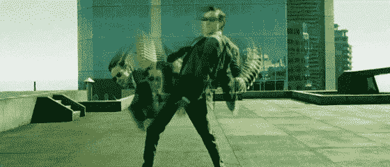
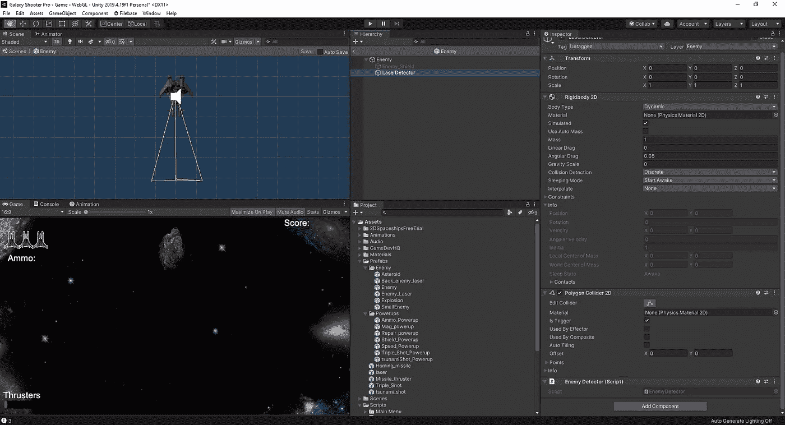
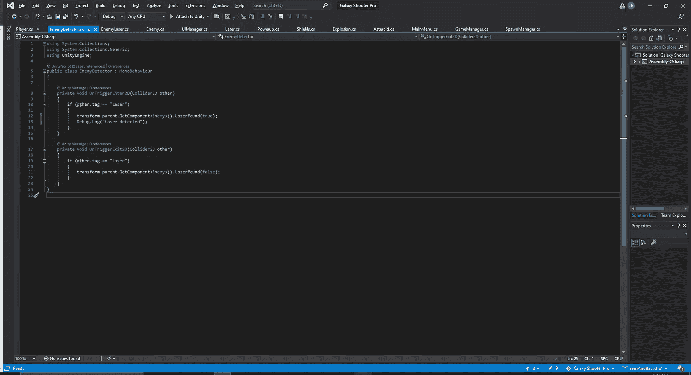
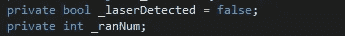
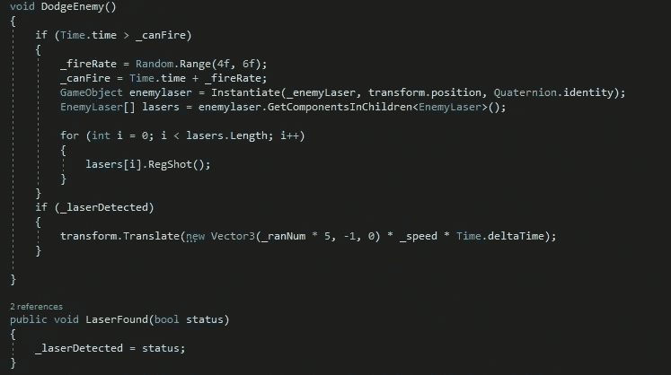
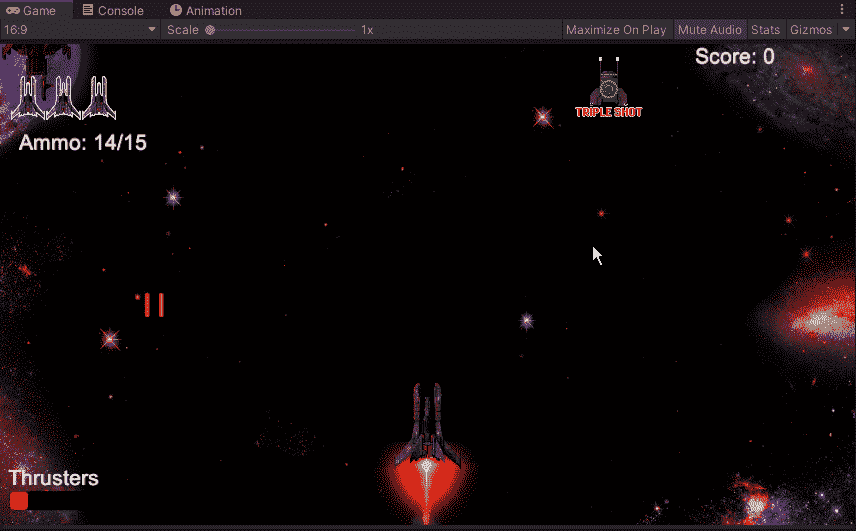

# 躲避敌人

> 原文：<https://medium.com/nerd-for-tech/dodging-enemies-787eadae9ca9?source=collection_archive---------20----------------------->

为了继续我们的敌人改造，我们打算创造一个可以躲避我们射击的敌人。一旦你弄明白了，这是一个相对简单的过程。在这个过程中，我遇到的一个问题是确保我所有的激光器都有一个正确的标签。因为我使用了一个玩家激光的副本作为敌人的激光，并将其中的两个连接到父激光，所以我必须进入父激光，将子激光改为一个新的激光标签，这样敌人就不会在他们产生激光的时候试图躲避他们自己的激光。首先，我们需要创建一个空的物体，并把它挂在我们的敌人身上。我们将为该对象附加一个刚体和一个多边形碰撞器:

多边形碰撞器的原因是，我们可以创建一个圆锥形状来模拟我们敌人的船的“眼睛”。在这里，我们可以为该检测器创建一个新脚本，并添加几个碰撞空洞:

这两个空位的目的是激活或者关闭我们在新敌人类型上建造的闪避机制。从这里，我们可以转移到新的敌人，并添加一些新的变量:

对于我们的 _ranNum，我们将把它添加到我们的 void start 中→ "_ranNum = Random。范围(0，2)* 2–1；"

至于我们新的敌人类型，我们将创造一个敌人和一个与之相伴的虚空:

我们附上我们的基本激光射击脚本以及我们的新道奇机械的 if 声明。只要这个说法是真的，这个新的机制将会让我们的敌人以一个随机的距离远离我们的激光。所有这些都准备好了，我们现在可以看看它是如何出现在游戏中的。作为一个临时措施，我刚刚在新的敌舰上创建了一个颜色变化，因为我可能会有一些新的模型出现。

现在我们有一个躲避的敌人，我们可以考虑在未来使用这个新的探测功能，让他们瞄准并摧毁我们的电源。