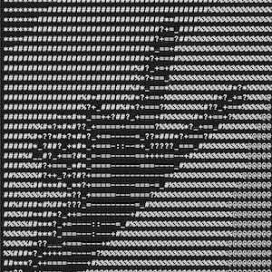

# 用 Python 做网络视频 ASCII 艺术

> 原文：<https://medium.com/nerd-for-tech/doing-networked-video-ascii-art-in-python-4725b3ee552b?source=collection_archive---------1----------------------->

## 今天我们将看到如何使用 Python 通过网络发送 ASCII 艺术风格的网络摄像头视频流！

几个月前，我偶然看到 Micode 的这个视频(法语),年轻的 youtuber 展示了他的 24 小时项目，内容是如何将来自网络摄像头的视频流转换成动画 ASCII 艺术——因此，与普通的视频流不同，你…