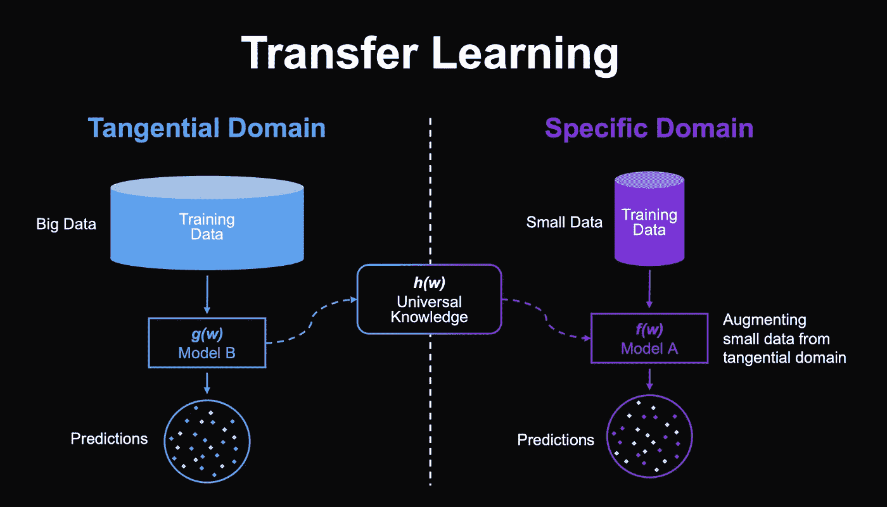
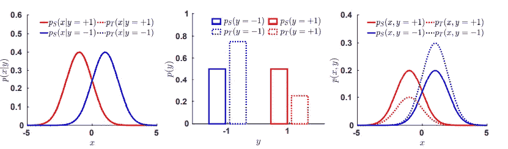
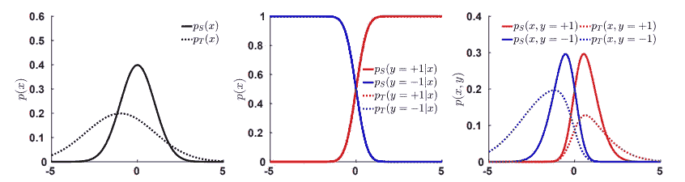
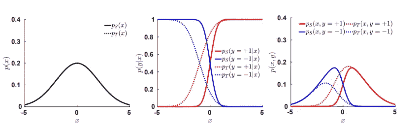

# 机器学习中的领域适应

> 原文：<https://medium.com/nerd-for-tech/domain-adaptation-problems-in-machine-learning-ddfdff1f227c?source=collection_archive---------3----------------------->

机器学习对于系统从数据中学习模式和预测的能力已经变得很流行。大量数据的可用性和系统计算能力的提高使它更容易访问，并且只需几行代码。训练/学习一个系统需要一组匹配的输入和相应的输出，我们称之为独立变量和目标变量，所有的建模都是理解它们之间的关系。预测新输入集的输出被称为泛化，我们的模型能够预测输出的程度取决于它在根据给定数据进行训练时执行的学习。但是，如果收集的数据不能准确反映人口数量，那么系统就不能很好地概括。

例如，从老年患者收集的数据相对于总人口而言是有偏差的。如果数据有偏差，那么系统会认为某些结果更有可能发生。例如，它可能会认为某些水平的血压是正常的，而实际上它们会对年轻患者产生健康风险。

# 领域适应

我们将域定义为输入空间 X、输出空间 Y 和相关概率分布 p 的组合。给定两个域，如果它们的至少一个组成部分(即输入空间、输出空间或概率密度函数)不同，我们称它们不同。

> **领域适配是将在一个或多个“源领域”中训练的算法应用于不同(但相关)的“目标领域”的能力。**

# 不同类型的域适配是

领域适应有几种情况。它们的不同之处在于为目标任务考虑的信息。

1.  **无监督的领域适应**:学习样本包含一组标记的源样本、一组未标记的源样本和一组未标记的目标样本。
2.  **半监督领域适应**:在这种情况下，我们也考虑一个“小”的标记目标例子集。
3.  **受监督的领域适应**:所有考虑的例子都应该被标记。

在使用机器学习的领域中，领域适应和转移学习的其他例子包括:在生物信息学中，适应性方法已经在序列分类、基因表达分析和生物网络重建中获得成功。通常，领域对应于不同的模式生物或不同的数据收集研究机构。识别活动的计算机视觉系统必须适应不同的环境以及不同的人群。在自然语言处理中，由于不同的上下文和作者表达方式的差异，来自不同发布平台的文本很难分析。例如，金融新闻文章使用的词汇不同于生物医学研究摘要中的词汇。同样，在线电影评论在语言上也不同于推文。情感分类也非常依赖于上下文；不同的词语被用来表达某人是否喜欢一本书或者一个电子设备。

# 常见数据移位

**数据转移**或**分布转移**，是算法的训练数据集和部署时遇到的数据集之间的数据分布的变化。这些领域转移在人工智能的实际应用中很常见。传统的机器学习算法通常很难适应领域转换。

## 1.先前班次

对于先验移位，类的先验概率是不同的，但是条件分布是等价的，pS(x|y) = pT(x|y)。这可能发生在例如故障检测设置中，其中新的维护策略可能导致较少的故障，或者在事件之前与之后的溢油检测中。

先前班次

上图显示了一个先前移位的例子。正类和负类的先验概率在源域中都是 1/2，但是在目标域中是 2/3 对 1/3。每个域中的数据和后验分布保持相等，这导致条件分布的变化。正面类在概率上超过负面类。

## 2.协变量移位

协变量移位是研究最多的数据集移位形式之一。当存在某种形式的样本选择偏差时，这种情况最常见。选择偏差被定义为被抽样的改变的概率。例如，假设您将访问一个大多数人居住在市中心的城市，其居住密度随着离市中心的距离而降低。你对人们是否认为城市人口过多感兴趣。如果你在主要的广场上取样，你会遇到大多数住在中心的人，你可能会得到很多“是”的答案。住得较远的居民会说“不”，他们在数据中的代表性不足。协变量偏移的另一个原因是缺少数据。实际上，由于测量设备故障或受试者退出，数据可能会丢失。

协变量移位

左上图显示了每个域中的数据分布。源分布以 0 为中心，而目标分布以 1 为中心。后验分布相同(中间)，但联合分布不同。

## 3 观念转变

在概念转移的情况下，数据分布保持不变，而后验概率发生变化。例如，考虑一种医疗环境，其目的是根据患者的年龄、流感的严重程度、总体健康状况和社会经济地位对患者进行预测。在 2000 年，这些疾病最初被定义为“缓解”和“并发症”。但是，在测试时，其他方面被算作一种“复杂”的形式，并被如此标注。正类和负类的构成，以及由此引申的后验分布，已经发生了变化。

观念转变

上图是一个观念转变的例子。(左)数据分布保持不变。(中间)目标后验分布被移动到源后验的左侧。(右)产生的联合分布也发生了移动。概念转移与数据漂移有关，分类器部署在非平稳环境中。

磁畴移动的一般情况更加复杂。多个因素同时变化，并不总是能够唯一识别。例如，如果数据分布和类别后验分布都有变化，那么没有一些目标标签就不能识别这些变化。由于畴变受到的限制较少，因此更难研究。在迁移学习器和领域自适应分类器成为实用工具之前，还有许多工作要做。

你可以在这里查阅更多关于域转移问题及其适应方法[。](https://arxiv.org/abs/1812.11806)

感谢阅读！！！