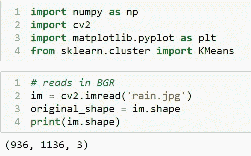
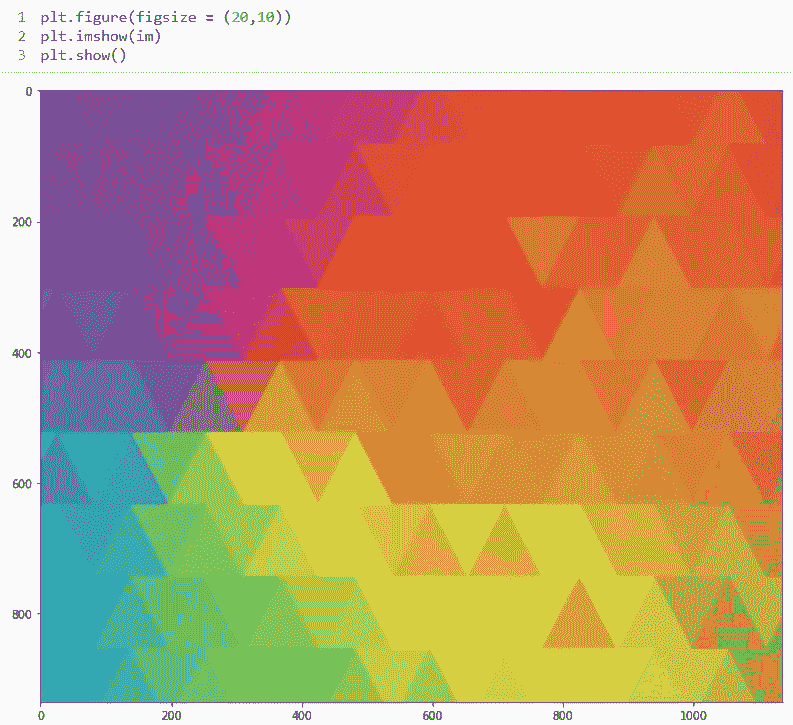
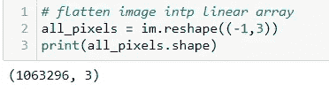
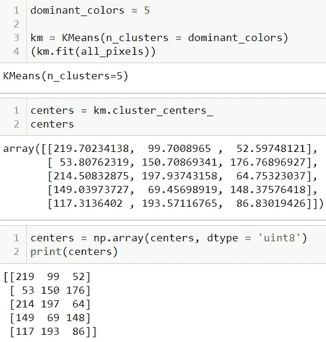
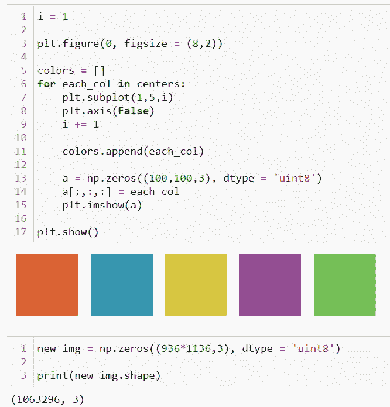
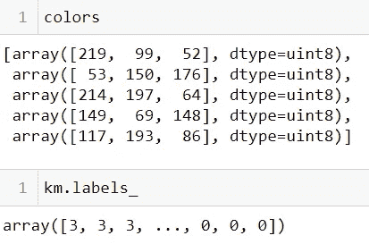
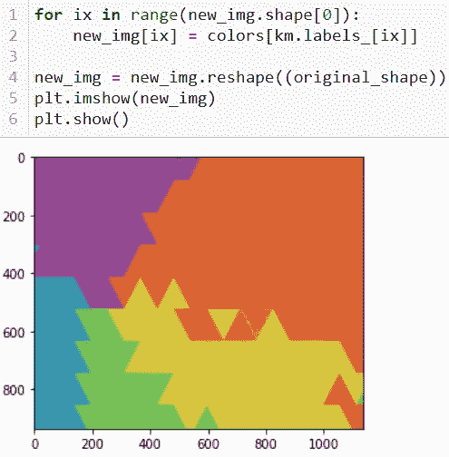
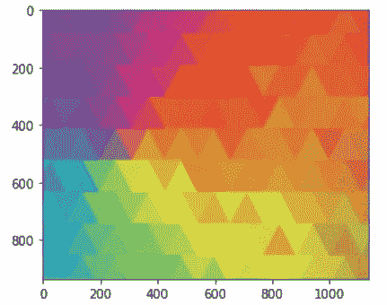

# 用于图像分割的主色提取

> 原文：<https://medium.com/nerd-for-tech/dominant-color-extraction-for-image-segmentation-2f30e9590889?source=collection_archive---------2----------------------->

图像分割是图像处理中的一个重要步骤，如果我们要分析图像内部的东西，它似乎无处不在。例如，如果我们试图找出室内图像中是否有椅子或人，我们可能需要图像分割来分离对象，并单独分析每个对象以检查它是什么。图像分割通常作为图像的模式识别、特征提取和压缩之前的预处理。

图像分割是将图像分类成不同的组。在使用聚类的图像分割领域中已经进行了多种研究。有不同的方法，最流行的方法之一是 **K 均值聚类算法**。

因此，在本文中，我们将探索一种读取图像并对图像的不同区域进行聚类的方法。但在此之前，我们先来谈谈:

1.  图象分割法
2.  图像分割的工作原理
3.  k-均值聚类 ML 算法

