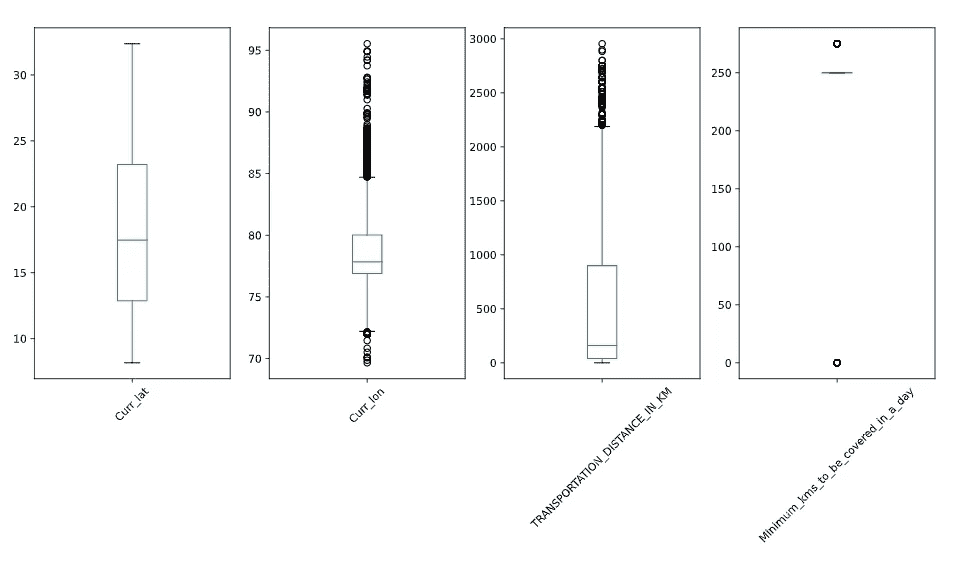
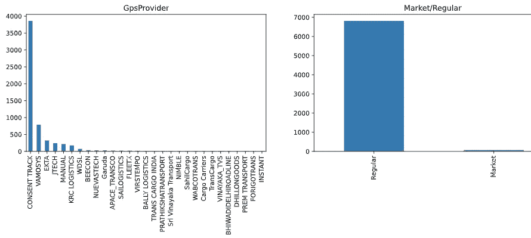
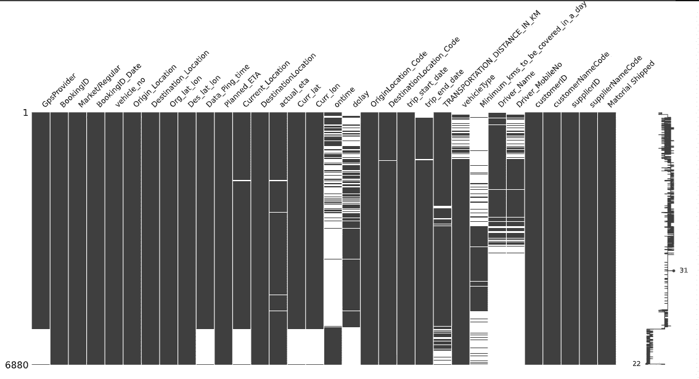
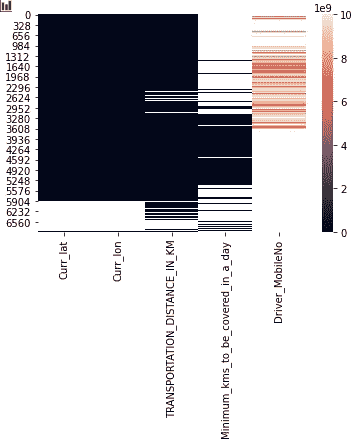
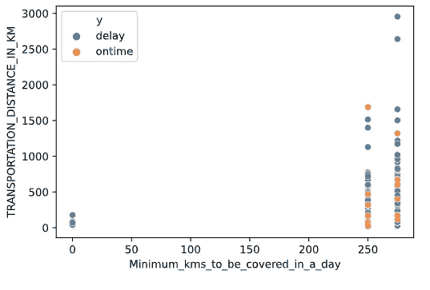

# 数据浏览器朵拉

> 原文：<https://medium.com/nerd-for-tech/dora-the-data-explorer-2e3c85b18654?source=collection_archive---------24----------------------->

厉害！你有了一个新的有趣的数据集，你想探索它。你首先做什么？数据探索是从特征、目标变量(如果可用)和变量之间的关系方面理解数据集的重要部分！我正在处理一个[物流数据集](https://github.com/data-avenger/logistics-data)，并且在想探索这个数据的最佳方式是什么？嗯，我从爱探险的朵拉那里学到了什么(好吧，就一次)——她带着一张地图，又名“可视化的东西帮助你了解你要去哪里！”让我们将它分解成易于遵循的步骤:

1.  图表数值
2.  分类标签的图形计数
3.  图形缺失值(可选)
4.  数值之间的图形关系
5.  绘制特征和目标变量之间的关系

跟随 [Jupyter 笔记本](https://github.com/data-avenger/logistics-data/blob/data-exploration/data_exploration.ipynb)。

**图形数值**

想想核密度(KDE)、直方图(HIST)或箱线图(BOX)的估计！您想知道值的分布(平均值、偏差和异常值的存在)。让我们看看箱线图——它们显示了异常值和分布的偏斜度。

' TRANSPORTATION_DISTANCE_IN_KM ':具有较大极端异常值的偏态分布。旅行的距离通常较短，但是也有许多长途运输。

' minimum _ kms _ to _ be _ covered _ in _ a _ day ':WTF？有奇怪的事情发生了。这是因为有很多缺失的值。

**分类标签的图形计数**

想想条形图或饼图。你想看看标签出现的频率。最好用较少数量的唯一标签来可视化变量。为什么？当你有一个有 100 个不同标签的条形图时，很难解释。一开始就保持简单。

“GpsProvider”:同意跟踪出现得最多。

'市场/定期':交货大多是定期合同。

您还可以可视化每个变量的前 10 个最常用标签。

**图形缺失值(可选)**

一个很好的 python 包 *missingno* 允许你很容易地可视化丢失的值。

*   ' GpsProvider，Data_Ping_team，Current _ Location，Curr_lat，Curr_lon ':在第 6000 次记录的观测之后具有类似的缺失值。为什么这些数据会丢失？GPS 失灵？不问问数据收集团队就看不出来。
*   当“开启时间”中缺少一个值时，“延迟”中会出现相应的值。稍后，我们可以将这两列合并成一个目标变量“y”。

**数值之间的图形关系**

想想散点图或热图。现在，数据之间的关系并不那么有趣，但你会寻找高相关性的变量，因为你可能想选择一个更好地解释你的目标变量。

**数字特征和目标变量之间的图形关系**

散点图或 kde 在这里很有用。

我们将“延迟”和“准时”列合并为“y”。我们可以这样解释:

*   与“Minimum _ kms _ to _ be _ covered _ IN _ A _ day”和“TRANSPORTATION_DISTANCE_IN_KM”成正相关:当送货距离较远时，驾驶员每天必须驾驶更长时间。
*   y’(准时):最短距离的短距离交付通常是准时的。
*   y’(延迟):短距离交付没有覆盖的最小公里数，全部延迟。此外，更长的距离(> 1000 公里)通常会遇到延迟。

酷毙了。这是可视化地探索数据。遵循这些步骤，变得更像数据探险家朵拉。

感谢您花时间阅读✌️

如果你学到了新的东西，请在下面点赞、分享和评论！