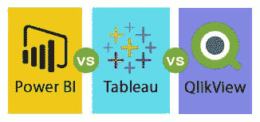

# 数据可视化的注意事项

> 原文：<https://medium.com/nerd-for-tech/dos-and-don-ts-of-data-visualization-3154788f9876?source=collection_archive---------10----------------------->

嘿，你用 BI，Tableau 还是 Qlik？以下是数据可视化的注意事项

当你准备好投入创作时，这些技巧和技术将使你的视觉化变得直观和有趣，从而更快、更容易地消化它，并且清晰地传达预期的信息，给观众留下具体、有用的信息。

**问自己这些问题:**

*   谁是我的观众？
*   他们有什么问题？
*   我能为他们找到什么答案？
*   我想说什么？
*   我的视觉化会激发什么其他问题，或者会产生什么对话？

# Dos:

🔹保持简单！

🔹减少不重要的颜色和其他吸引注意力的东西

🔹将图像/图表的数量限制在 3-4 个

🔹使用正确的数据图表

🔹让您的数据讲述一个故事

1.  将最重要的视图放在顶部或左上角。你的眼睛通常首先被吸引到那个区域。
2.  3D 栏或动画等效果可能会分散观众的注意力，削弱视觉效果的解释力。
3.  有效地、有意识地使用颜色，这将有助于你传达你的信息。如果它与你想传达的信息没有直接联系，就删掉它。
4.  通过数据可视化、不言自明的标题和有意义的图例，帮助观众了解您的思考过程。
5.  大小可以帮助强调尖锐的信息，并添加上下文线索。

交互性可以使一个可怕的混乱的可视化和全明星分析之间的差异。你需要引导故事，鼓励探索，当建立互动时，确保观众知道他们可以参与其中——也许为他们提供微妙的指导。

# 谢弗的 4 C

清晰——容易看到，定义清晰，比美学更重要

干净——彻底、完整、不掺杂

简明—简短但全面

引人入胜——吸引并保持注意力，讲述故事而不做解释

**重要提示:**如果一个视觉化图像不能很好地传达主要信息，但看起来很酷，那就选择另一种形式的视觉化图像来传达信息。好的可视化以一种清晰、简单和容易理解的方式传递关于关键见解的信息。

# 不要:

🔸不要故意歪曲数据

🔸不要使用无法传达信息的视觉化效果

🔸避免混合模式布局

🔸不要使用可能模糊视觉信息的效果

1.  太多的颜色会产生不和谐的声音，而使用单一颜色或一种颜色的太多阴影会导致数据混合。
2.  颜色联想也很重要。使用对浏览者有意义的直观颜色，这样他们可以更快地处理信息。
3.  避免在数字、文本或图表之间使用不均匀或不一致的间隔。
4.  当文字太多或者没有以视觉上令人愉快的方式组织起来时，文字会让人分心。

如果做得好，可视化会讲述一个有趣的故事。它们还可以揭示隐藏的信息和细节，这些信息和细节是你在电子表格、条形图或饼图中无法发现的。