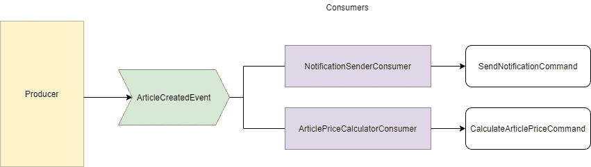
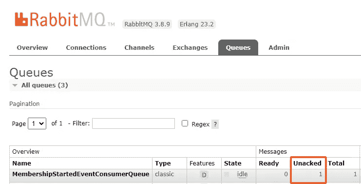
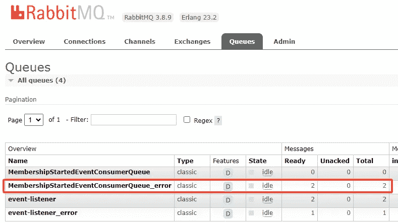
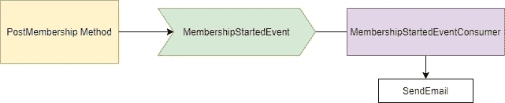

# Dotnet 核心和 RabbitMQ

> 原文：<https://medium.com/nerd-for-tech/dotnet-core-and-rabbitmq-df5e7038e5c5?source=collection_archive---------3----------------------->

RabbitMQ 是一个开源的消息代理。当用文字解释时，可能会令人困惑。我试着用图表来解释。

**生产者:**生产者发布关于事件的消息。生成器是此图中的一个应用程序。当用户发布一篇新文章时，系统创建一篇文章并发布一条消息(ArticleCreatedEvent)。

**消费者:**消费者在听信息。当消息发布时，消费者触发并读取消息上下文。当 ArticleCreatedEvent 消息发布时，NotificationSenderConsumer 和 ArticlePriceCalculatorConsumer 在此关系图中触发。NotificationSenderConsumer 运行 SendNotificationCommand，它向作者的追随者发送通知。

ArticlePriceCalculatorConsumer 运行 CalculateArticlePriceCommand，它计算商品的价格。

我做了一个示例项目来解释这个主题。【https://github.com/emreerkoca/dotnet-core-rabbitmq-sample 

如果想写一个关于 RabbitMQ 的样例代码，可以下载安装 RabbitMQ。

[https://www.rabbitmq.com/](https://www.rabbitmq.com/)

我在这个项目中使用了 MassTransit。面向. NET 的 MassTransit 开源分布式应用框架。

[https://masstransit-project.com/](https://masstransit-project.com/)

我会一步一步地解释这个项目。我猜你安装了 RabbitMQ。

**创建一个 Dotnet 核心 Web 应用程序(Web API)**

将 MassTransit 包添加到您的项目中:

命令:dotnet 添加包 MassTransit

如果你不使用命令，你可以从 Nuget 包管理器安装这个包。

创建 MembershipStartedEvent 类。这是一个事件。它会把你的信息公布出去。

创建 IMembershipService 接口:

创建 MemberShipService 类:

PostMembership 方法只发布事件。我们假设它已经保存了用户的数据。您可以像这样发布一个新事件。

当事件发布时，它通过队列进行处理。消费者消费你的信息并执行你的命令。当它在工作中出错时，您的消息将被发送到错误队列。当错误队列中有消息时，您可以移动和处理它们。

您可以从以下网址打开本地 RabbitMQ 面板:[http://localhost:15672/](http://localhost:15672/)

队列:

**就绪:**等待处理的排队消息数。

**未确认:**已处理的消息数，但不清楚。因此，消费者说“是的，我会消费它们”，但是没有关于过程的信息。当您看到邮件总数减少时，您可以理解他们正在消耗。

错误队列:

现在添加一个新的控制器(MembershipController.cs)

如果你对 IMemberService 感到困惑，你可以搜索“依赖注入”和“依赖注入构造函数注入”

我创建了一个服务类并使用了它。没有业务或数据访问层，因为它不是软件架构教程。

postMembershipRequest 方法将 PostMembershipRequest 对象发送到 PostMembership 方法。

没必要解释每一部分。您可以检查存储库中的请求类、模型类或响应类。

消费阶层是这样的。当消息发布时，它来到这里:

**大众运输配置**

它添加消费者和定义队列名称。

如果您创建了其他部件或者下载了存储库，它就可以运行了。

将断点放在 Consume 方法上，并发送 post 请求。你会看到你的信息将会传达给消费者。

会员后运营图:

我会犯错。因为我不是机器。如果你在这篇文章中看到任何错误，你可以告诉我。希望能有所帮助。