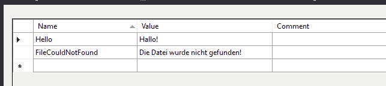
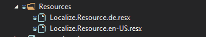

# 点网核心本地化

> 原文：<https://medium.com/nerd-for-tech/dotnet-core-localization-96c88e842219?source=collection_archive---------1----------------------->

我不得不制作一个多语言应用程序。因为有很多种语言，您可能希望面向更多的全球客户。我想在本地化之前写一个简单的例子。我阅读文件，我感到有点困惑。然后，我想分享我的样本代码。

您可以将文本消息存储在资源文件中。资源记录由两部分组成。名称和值。实际上，还有一个部分(评论)但很可能你不会使用这一部分。

资源文件示例如下所示:

您可以为不同的语言创建资源文件。

Resource.resx、Resource.de.resx、Resource.es.resx 等。

如果要正确应用本地化，资源文件中的名称必须相同。当 localizer 没有找到资源内容时，它返回 null。我会一步一步解释这个项目。[https://github.com/emreerkoca/LocalizationExample](https://github.com/emreerkoca/LocalizationExample)

这是一个简单的 Dotnet 核心 Web API 项目。

1.  将资源文件夹添加到项目中。
2.  添加您的资源文件。

3.将一个新文件夹作为“Localize”添加到项目中，并添加一个公共类来本地化文件夹。

如果您愿意，您可以使用不同的名称，但是您的资源名称和您的资源必须是合适的。您将通过这个空类获得资源内容。

资源名称:**Localize**. resource . de . resx

您的类的命名空间是 LocalizationExample。**本地化**，类名为资源。

4.启动配置

将此代码块添加到 Startup.cs 文件的 configure services(iservicecollectionservices)方法中。

它增加了本地化支持的语言。显示您的资源文件并设置默认语言。

将此代码块添加到**Configure(IApplicationBuilder app，IWebHostEnvironment env)** 方法中。

这是为你的本地化自动设置文化信息。您可以通过任何请求头值来设置区域性信息。

5.显示本地化消息

我使用了**is inglocalizer**接口来访问资源文件。你可以在这里看到一个用法的例子。添加依赖项并调用资源字段名。

Get()方法将返回“Hello！”因为英语是默认的区域性，而英语资源值是“Hello！”当您将“culture=de”添加到您的请求 URL 时，您会将文化更改为“de”，并且您会看到“Hallo！”消息。

如果您愿意，您可以从“接受语言”标题中检测当前语言。您可以更改您的配置。

像这样更改 ConfigureServices 配置部分:

它读取“Accept-Language”头值并获取默认语言。在语言变量后放置一个断点并查看值。对于不同的浏览器语言，它是可变的。如果您在阅读 CustomRequestCultureProvider、ProviderCultureResult 等时感到困惑。你可以从微软的官方文档中读到它们。

现在，您不必为请求 URL 添加文化参数。您可以尝试从英语和德语浏览器中获取值。

您可以阅读此文档了解详细信息。

[https://docs . Microsoft . com/en-us/aspnet/core/fundamentals/localization？view=aspnetcore-5.0](https://docs.microsoft.com/en-us/aspnet/core/fundamentals/localization?view=aspnetcore-5.0)

这之后我无话可说了。希望能有所帮助。