# 在 Windows 上下载并安装 MongoDB with Compass

> 原文：<https://medium.com/nerd-for-tech/download-install-mongodb-with-compass-on-windows-eae86f5880f7?source=collection_archive---------2----------------------->

MongoDB 是一个开源的文档数据库和领先的 NoSQL 数据库。MongoDB 是用 C++写的。本教程将让您更好地理解创建和部署高度可伸缩和面向性能的数据库所需的 MongoDB 概念。

在继续本教程之前，您应该对数据库、文本编辑器和程序执行等有一个基本的了解。因为我们要开发高性能数据库，所以如果你对数据库(RDBMS)的基本概念有所了解就好了。

现在让我们看看如何在 Windows 上下载和安装 MongoDB:

# MongoDB 下载

MongoDB 社区服务器可以免费用于开发，所以让我们在 google 中搜索:

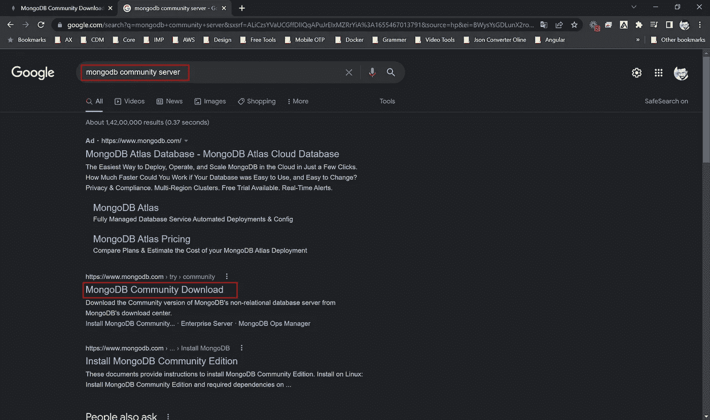

确保屏幕右侧的规格正确。在撰写本文时，最新版本是 5.0.9。确保平台是 Windows，包是 MSI。继续点击下载。

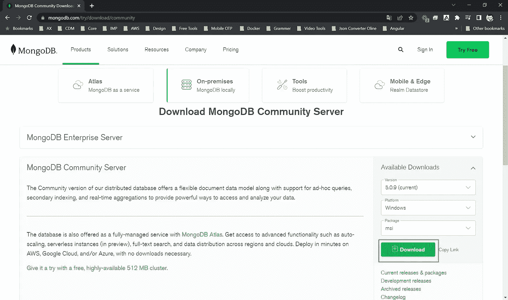

# MongoDB 安装

您可以在下载目录中找到下载的文件。你可以按照上面提到的步骤安装软件。

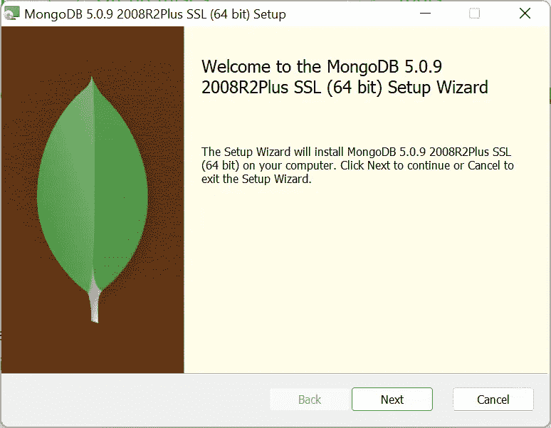

接受许可协议，然后单击下一步。

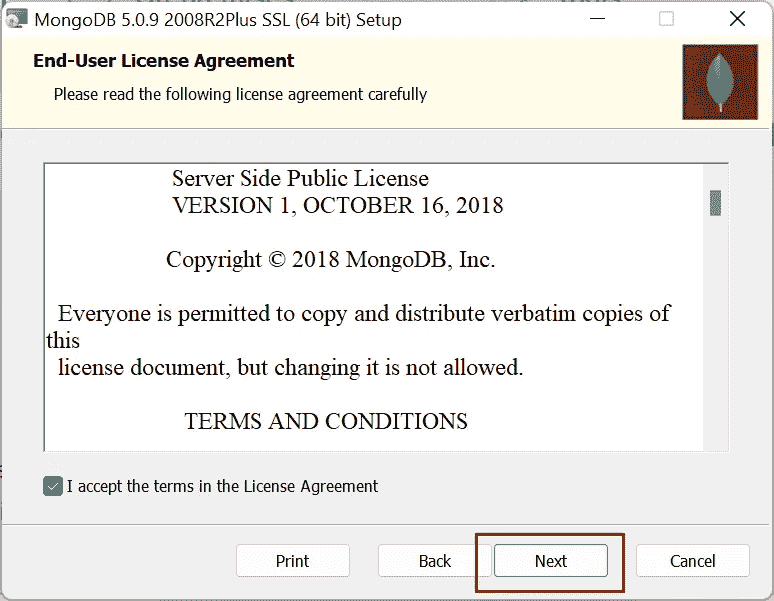

选择完整的设置。

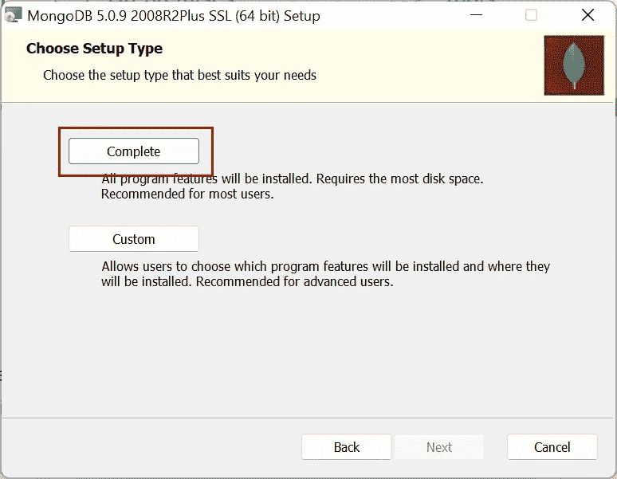

选择“以网络服务用户身份运行服务”并记下数据目录，我们稍后会用到。

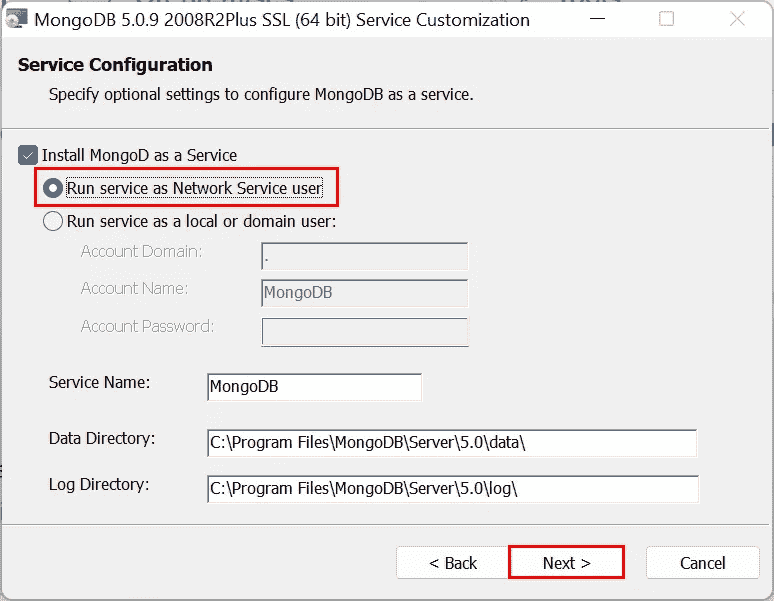

让我们用 Mongo Compass 安装，所以选择它并单击下一步。

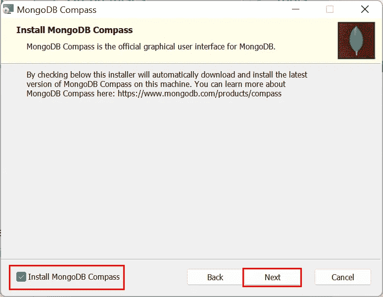

单击“安装”开始安装。

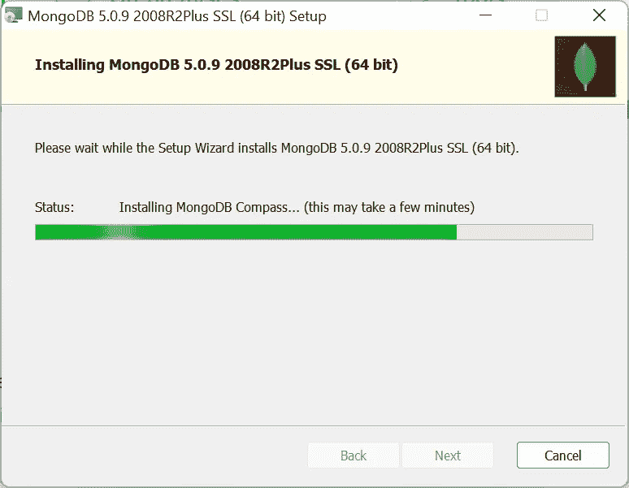

成功完成安装后，您可以看到 MongoDB Compass 的欢迎屏幕:

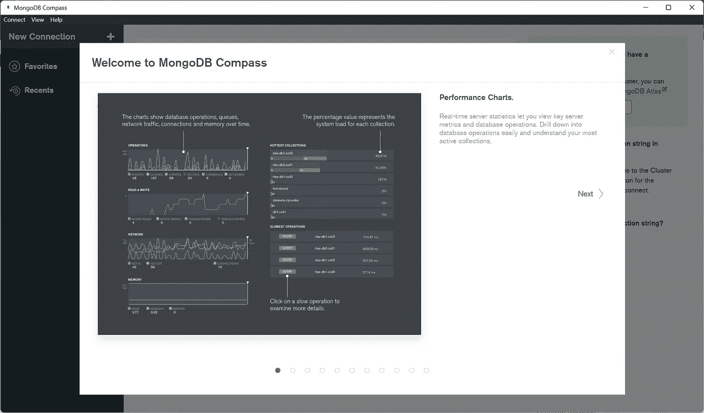

# 常规连接选项卡

**General** connection 选项卡允许您选择一个**连接字符串方案**，并配置用于连接到 MongoDB 部署的主机名或主机。

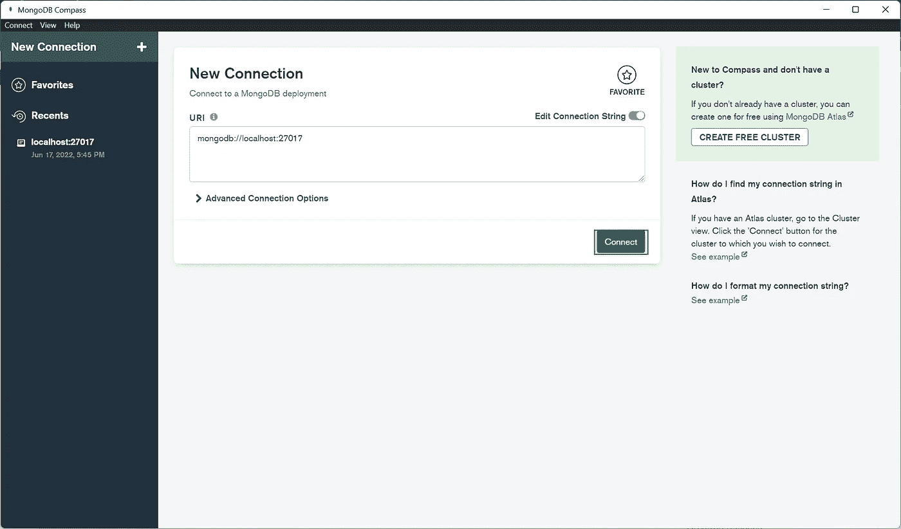

# 指南针主页

Compass 主屏幕提供了关于 Compass 所连接的 MongoDB 实例的详细信息，包括:

*   如果连接是收藏夹连接，则为连接名称，否则为“我的群集”。
*   部署类型(独立、副本集、分片集群)。如果部署是一个副本集，并且在连接窗口中指定了副本集名称，还将显示副本集成员的数量。
*   主机名和端口，以及 MongoDB 的版本。

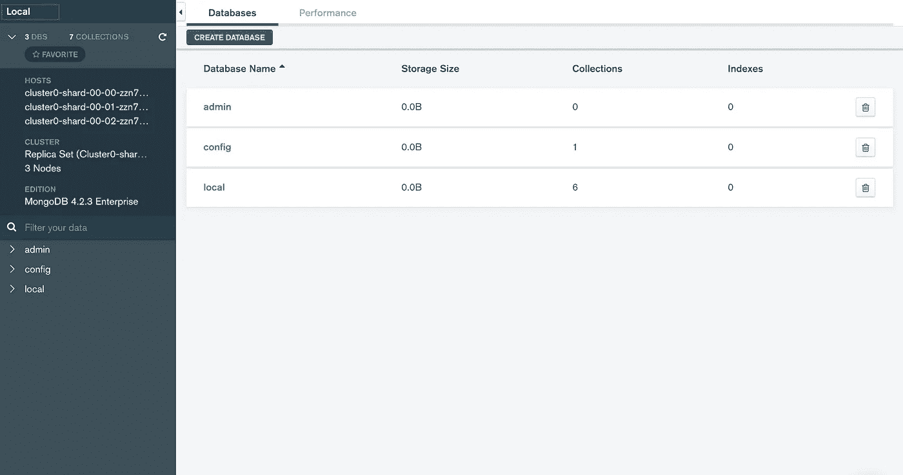

# 数据库选项卡

主屏幕的**数据库**选项卡显示了当前连接上的所有数据库的列表，以及每个数据库的存储大小、集合数量和索引数量。关于 **Databases** 选项卡和查看数据库说明的更多信息
现在让我们在 MongoDB 中创建第一个数据库，单击 Create database 按钮:

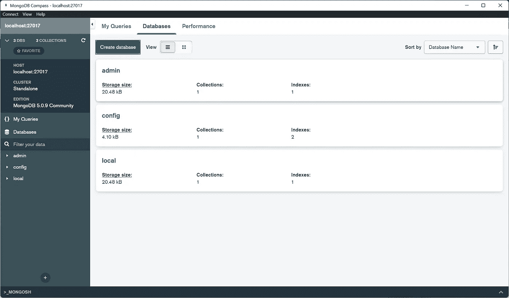

从 [D](https://www.mongodb.com/docs/compass/current/databases/#std-label-database-tab) 数据库选项卡中，点击**创建数据库**按钮，调出**创建数据库**对话框。
在对话框中，输入要创建的数据库及其第一个集合的名称。数据库名称和集合名称都是必需的。

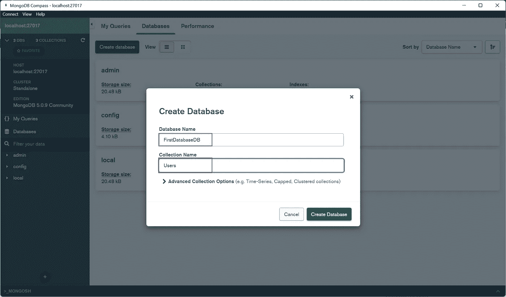

在完成数据库创建成功后，您可以在

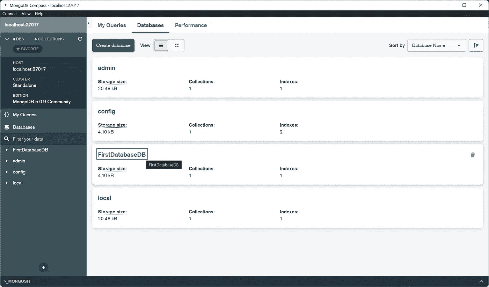

# 收集

集合是 MongoDB 文档的分组。集合中的文档可以有不同的字段。集合相当于关系数据库系统中的表。

这里，我们已经创建了一个带有已创建数据库的集合，因此您可以看到您的集合已创建:

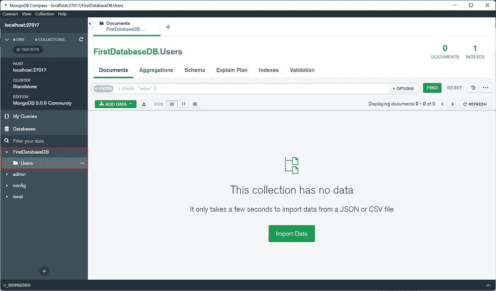

# 管理文档

文档是 MongoDB 集合中的单个记录，是 MongoDB 中数据的基本单位。

从**文档**选项卡，您可以查看、插入、修改、复制和删除所选集合或视图中的文档。

# 插入文档

Compass 提供了两种将文档插入集合的方法:JSON 模式和逐字段编辑器。

JSON 模式(*Compass 1.20 中新增的*)允许您在编辑器中编写或粘贴 JSON 文档。使用此模式将多个文档作为一个数组一次插入。逐字段编辑器提供更具交互性的文档创建体验，允许您选择单个字段值和类型。此模式仅支持一次插入一个文档。

要将文档插入您的收藏:

点击**添加数据**下拉菜单，选择**插入文件**。

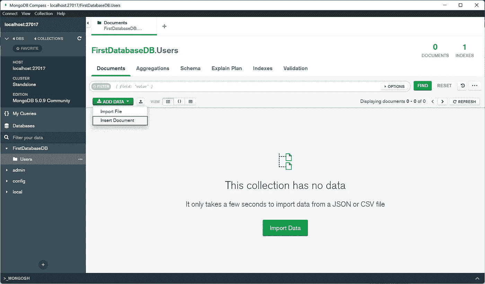

根据您希望插入文档的方式选择适当的视图。

*   点击`{ }`括号查看 JSON 视图。这是默认视图。
*   单击列表图标以显示逐字段模式。

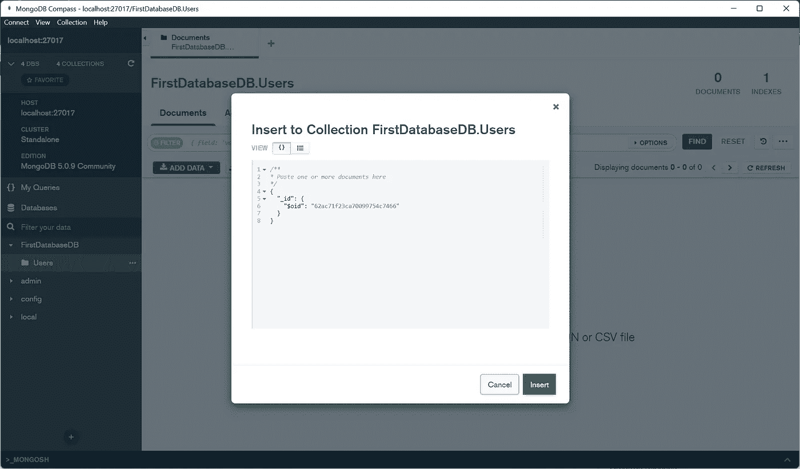

在 JSON 格式中，键入或粘贴要插入到集合中的文档。要插入多个文档，输入一个逗号分隔的 JSON 文档数组，然后单击 **Insert** 。

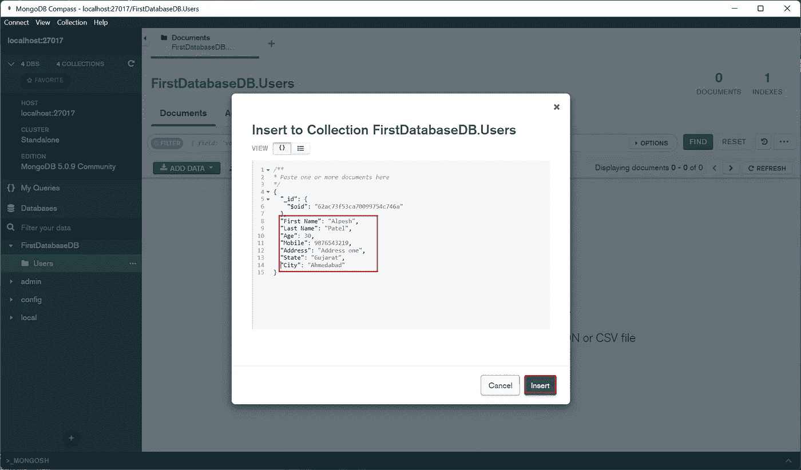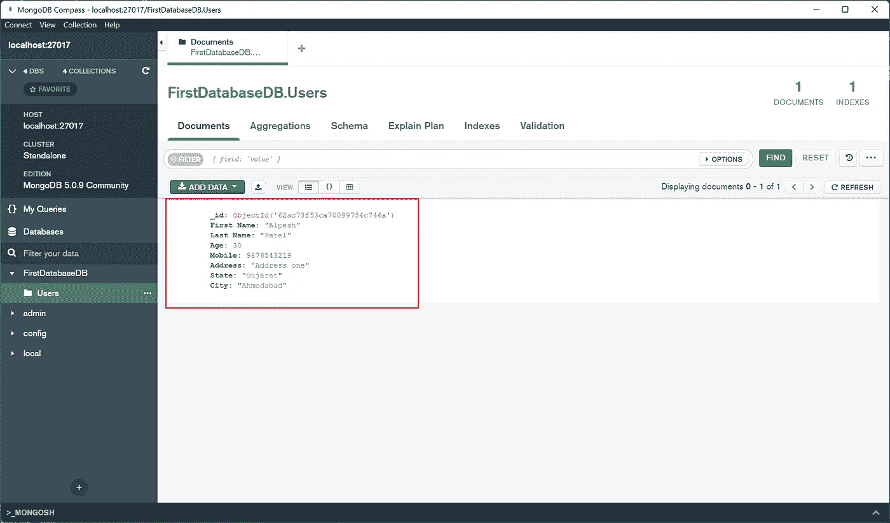

祝贺..！这里是您在 MongoDB 中成功创建的第一个数据库。