# 从 GitHub 资源库下载文件

> 原文：<https://medium.com/nerd-for-tech/downloading-a-file-from-github-repository-39fd114cd121?source=collection_archive---------38----------------------->

[潘云波](https://unsplash.com/@panda2013?utm_source=unsplash&utm_medium=referral&utm_content=creditCopyText)在 [Unsplash](https://unsplash.com/?utm_source=unsplash&utm_medium=referral&utm_content=creditCopyText) 上拍照

你知道 GitHub 吗？我相信你知道。GitHub 是一个可以用来做版本控制，和另一个开发者一起做软件开发的地方。如今，GitHub 变得流行起来，因为它使用起来很友好，而且是免费的！。如果你能很好地做到这一点，一些公司会在面试中给你更多分数。

我认为在 2021 年，有许多“拉栈开发人员”遍布世界各地(做一个拉请求，然后使它看起来像她/他的工作)。但是，作为 GitHub 的新手，我们只知道如何像这样下载大量文件。

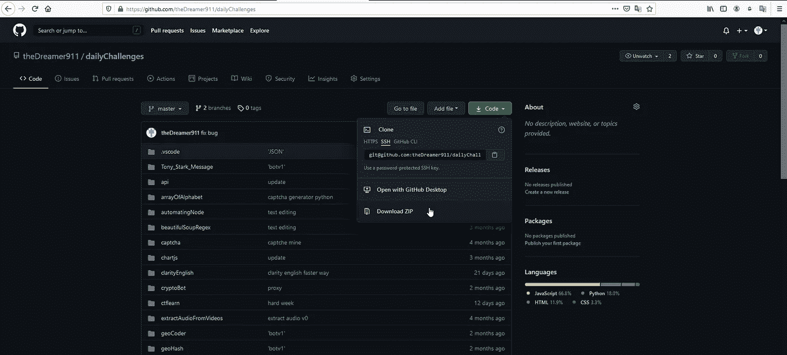

如果开发者项目更大，我们需要下载所有不必要的文件，这是浪费时间和内存。在我的例子中，我将使用我的一个存储库

 [## 梦想 911/每日挑战

### 在 GitHub 上创建一个帐户，为梦想 911/每日挑战的发展做出贡献。

github.com](https://github.com/theDreamer911/dailyChallenges) 

这个库是去年开始的，这是我雄心勃勃的库。我每天都想做些事情，但是坚持是一件事。而我在仓库里没有做到。但是，它仍然是一个很好的例子，因为我们有许多来自它的文件。在这篇文章中，我想从资源库下载 youtubeDownload 文件，它看起来像这样。

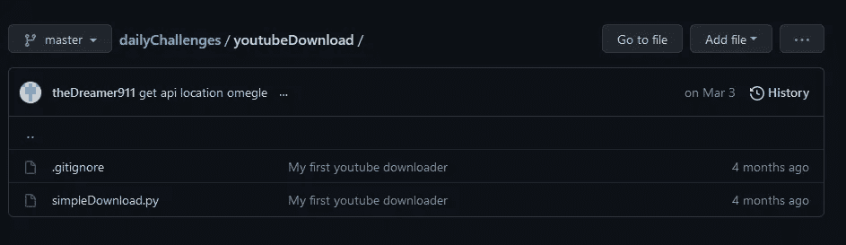

我们有两个回购文件，但是我们只需要下载 simpleDownload.py，对吗？所以，让我给你带路吧

## 打开您要下载的文件，然后单击“Raw”按钮

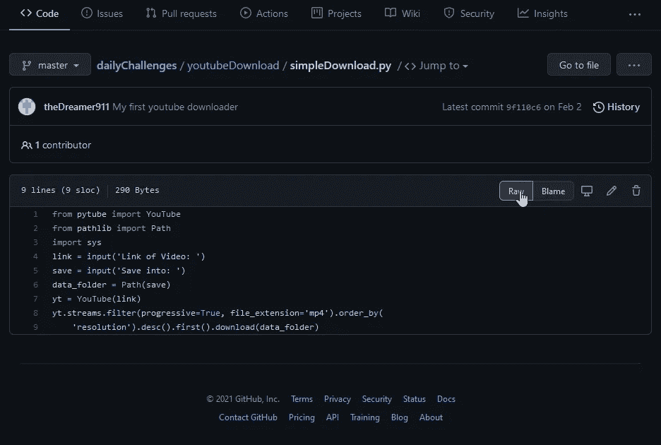

## 在新页面中，右键单击鼠标并选择“页面另存为”

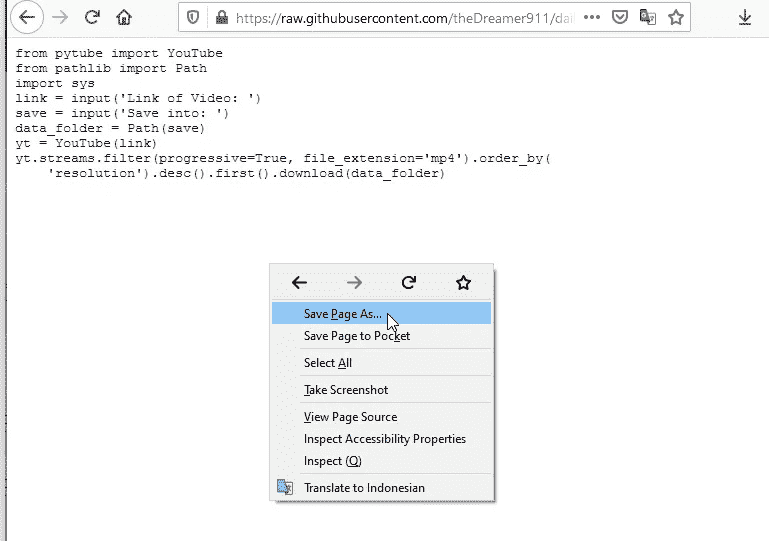

## 用您的扩展名保存文件

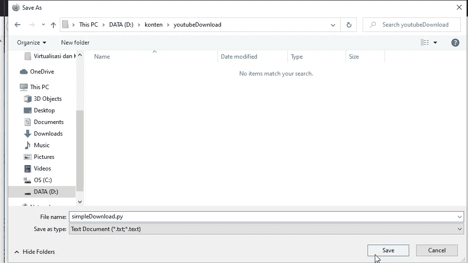

## 完成后，您可以使用您想要的文本编辑器打开它

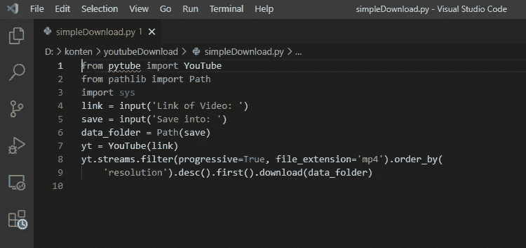

好吧，如果你已经知道那条路，很好。我相信仍然有许多人不了解它，同样在机器学习的发展中，有时我们只需要。ipynb 文件，这是一个包含 Jupyter 笔记本中其他作品的文件。这就是众所周知的笔记本文件。在这种情况下，这篇文章将是有用的。

## 奖金

对于数据科学家，我将分享一个额外的提示给你，实际上你可以使用任何笔记本文件的链接。你所需要做的就是使用[谷歌实验室](https://colab.research.google.com/notebooks/intro.ipynb#recent=true)。当您单击链接并获得此显示时

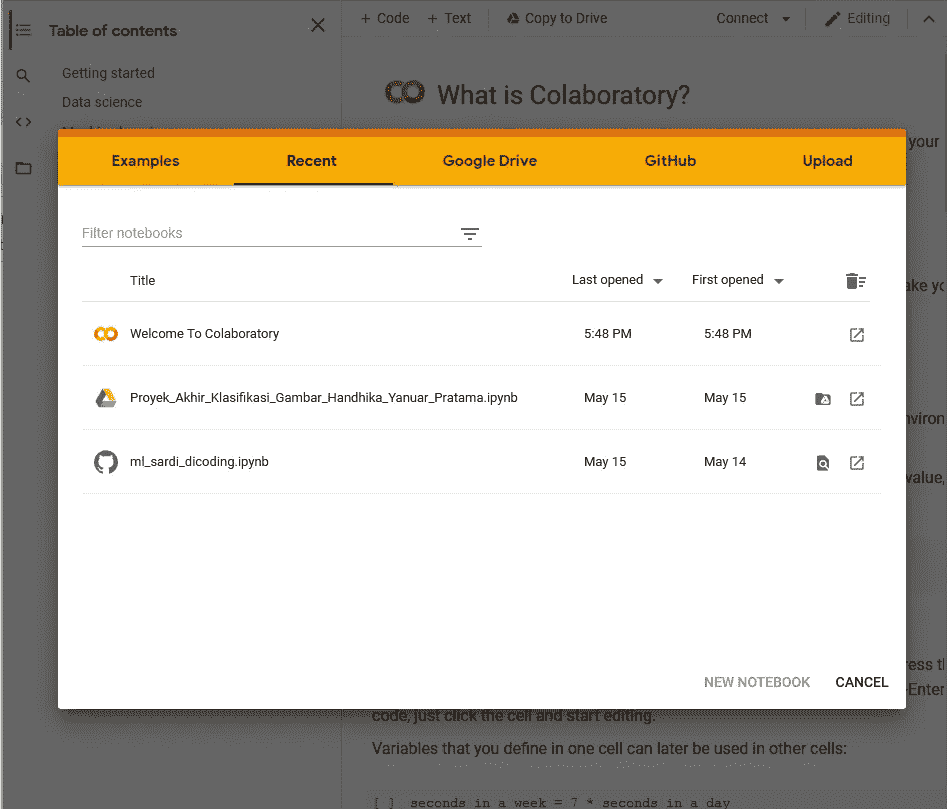

这意味着你已经有了 google colab 帐户。如果没有，你只需要登录你的谷歌。接下来在上图中选择 GitHub。对于这个例子，我使用的是这个存储库

 [## IBM/图像分类-使用-cnn-and-keras

### 这个代码模式演示了图像，特别是文档图像，如身份证，申请表，支票页…

github.com](https://github.com/IBM/image-classification-using-cnn-and-keras) 

该库正在使用 CNN 和 Keras 对图像进行分类，但它看起来像这样。

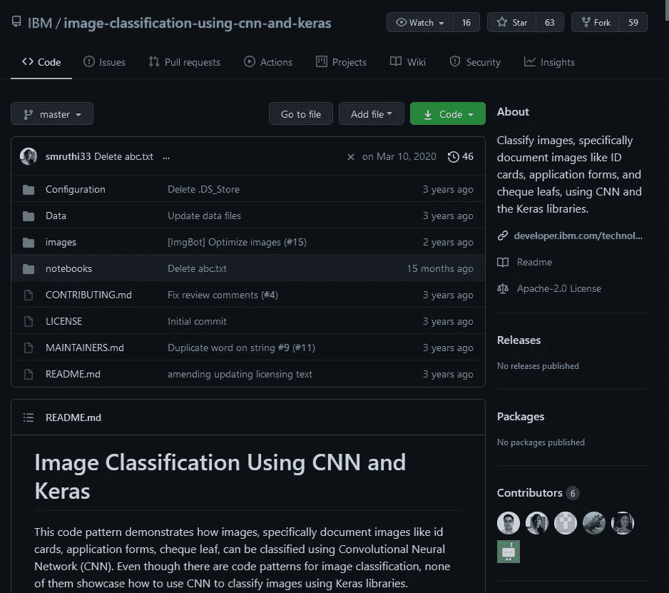

正如我之前说过的，有时我们只需要笔记本，所以转到笔记本目录，您会看到这样的内容

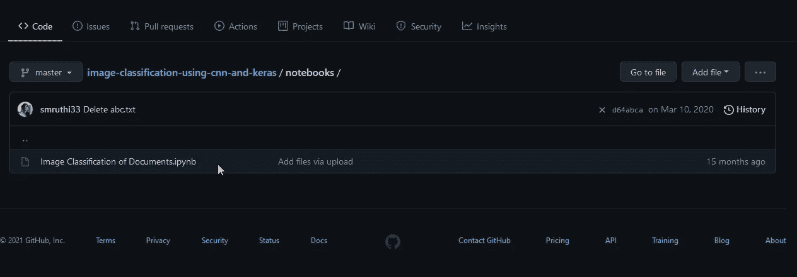

接下来，单击该文件，您将看到如下内容

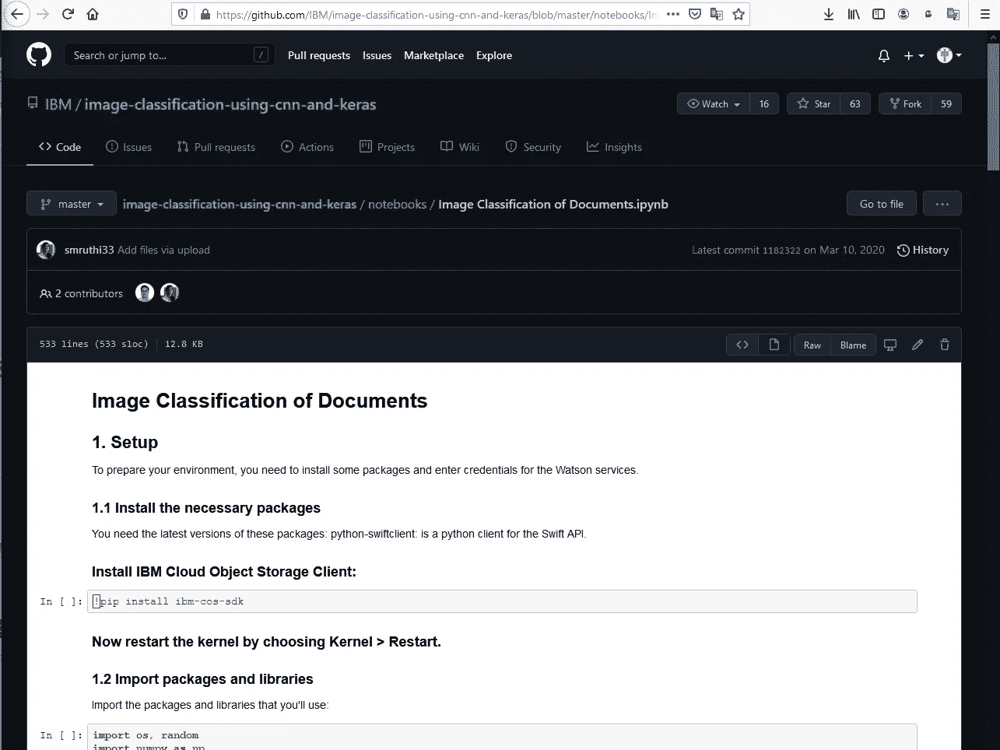

你可以像我以前一样，把它保存为。ipynb 文件，但对于这个奖金你只需要复制链接，并复制到谷歌 colab 像这样

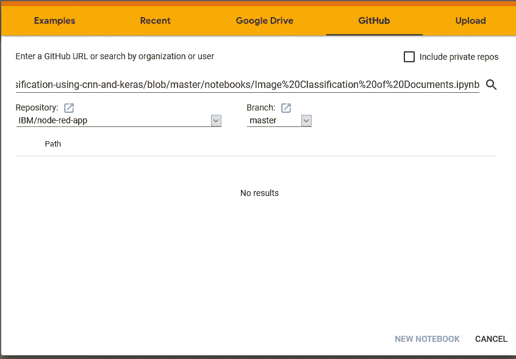

点击“搜索”按钮后，您将可以从 google colab 访问笔记本文件

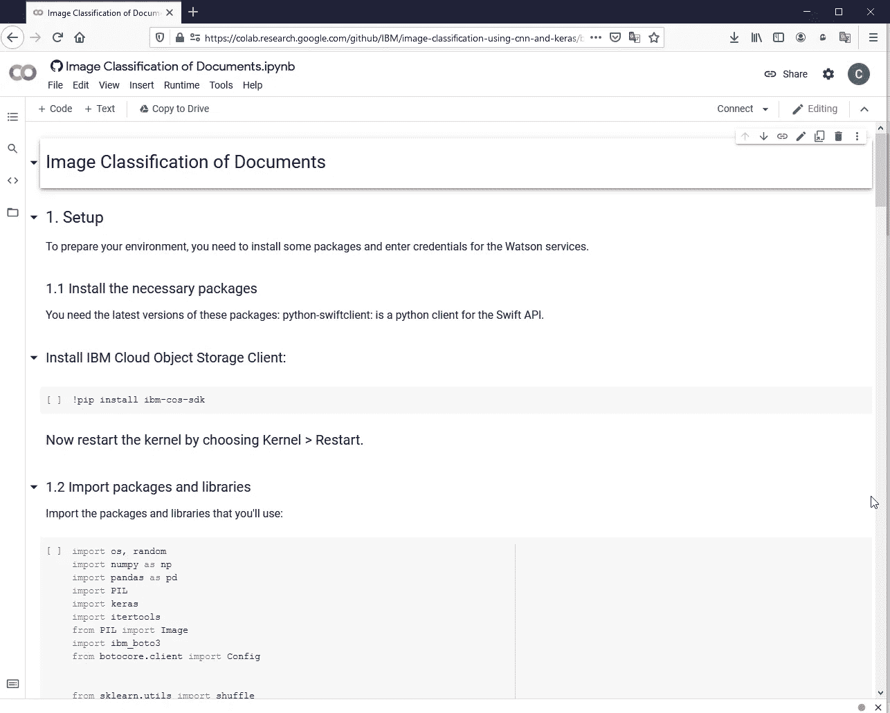

瞧，你已经知道如何从 GitHub 获取一个文件了

## 结论

好吧，我希望这篇文章是你阅读的唯一一篇只从 GitHub 资源库下载文件的文章。感谢阅读。

最后，有一个好的代码