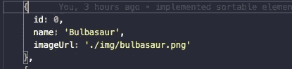
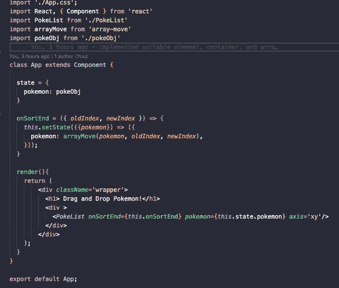
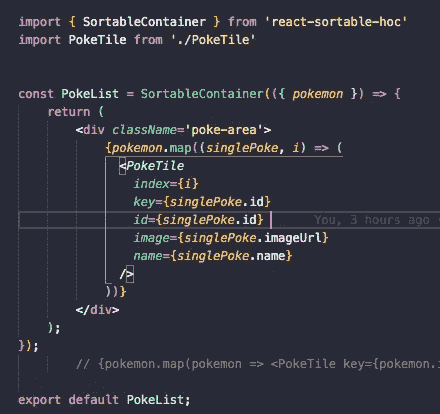
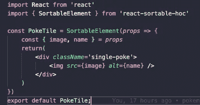

# 使用“反应-可排序-特设”拖放反应

> 原文：<https://medium.com/nerd-for-tech/drag-and-drop-in-react-with-react-sortable-hoc-516c50acd4d1?source=collection_archive---------3----------------------->

多年来，我们都习惯于在网站上拖放项目。既然这是网站上常见的行为，我想作为一名网站开发人员，我应该能够做到。快速搜索之后，我有太多的 react 库可供选择。我最终选择了一种叫做[“反应-排序-特设”的方式这个库和我见过的一些更流行的库的主要区别是，这个库允许你在网格中水平和垂直移动项目。我看到的其他方法大多限制您在容器内垂直或水平移动项目。添加到任何 React 应用程序都非常简单，今天我将向您展示如何添加。](https://github.com/clauderic/react-sortable-hoc)

首先，我们必须确保安装我们将需要的所有依赖项。因此，我们必须运行“npm install react-sortable-hoc”，然后运行“npm install array-move”现在，我们可以得到代码了。

需要注意的是,‘react-sortable-hoc’要求你的组件遵循一些结构规则。您必须使用包中的两个组件；' SortableContainer '和' SortableItem '这些名字很好地说明了它们的用途。在我构建的例子中，3x3 网格是容器，上面有口袋妖怪图像的方块是物品。我选择将它们构建为功能组件，口袋妖怪数据作为道具从“App.js”中传递下来。我们还需要我们的 SortableContainer 有一个名为“onSortEnd”的函数作为道具。这个函数告诉我们的应用程序我们的口袋妖怪的新顺序应该是什么。它可以从“react-sortable-hoc”文档中复制和粘贴，只需确保将“items”更改为您作为道具传递的状态的名称。既然我们谈到了这个主题，请确保您传递的是一个状态片段，而不仅仅是一个数组或对象。因为“onSortEnd”使用“setState”，所以如果您尝试对 State 之外的任何内容进行排序，它将不起作用。我们还必须确保从“array-move”导入“arrayMove ”,因为我们的“onSortEnd”方法调用它。

口袋妖怪数据数组中的第一个索引

组件“PokeList”是我们的 3x3 网格。我传递了 Pokemon 数据数组“onSortEnd ”,并指定了我希望允许的运动轴。轴道具是“react-sortable-hoc”的一部分，您可以在“x”、“y”或“xy”之间进行选择这些决定了项目是否可以水平、垂直或两者都移动。

由于 PokeList 将成为我们的 SortableContainer，我们必须确保导入 SortableContainer 并在其中包装我们的组件，如上所示。这个组件是我们的网格，负责渲染网格中的每个口袋妖怪。因此，在这里我们将作为道具传递的所有口袋妖怪数据的数组映射到我们称为 PokeTiles 的新组件中。您可能已经注意到，我们将 index 作为参数传递给“. map”，这是因为我们必须为每个 PokeTiles 分配一个 index prop，否则 App.js 中的“onSortEnd”方法将不知道 Pokemon 在数组中的移动位置。

我们最后的组件

以上是 PokeTile 组件。类似于 PokeList，我们必须用来自“react-sortable-hoc”的东西包装它。这一次，它有点像元素。我们将它设置为显示我们传递下来的图像，我们可以开始了！

这比我事先想象的要容易得多。但是，请确保您遵循的是在 SortableContainer 中包装要拖动的区域以及在 SortableItem 中包装项目本身的一般模式。不要忘记添加索引，或者将您正在移动的项目保留在状态中。那些错误是我自己打出来的，这样你就不用了:)。

感谢阅读！