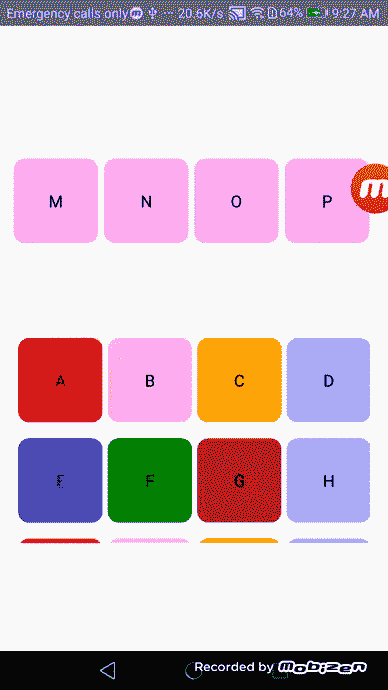

# 本地反应:在两个列表之间拖放

> 原文：<https://medium.com/nerd-for-tech/drag-drop-and-swap-between-two-lists-using-react-native-d864dab43aa9?source=collection_archive---------0----------------------->


我在一个 react 本地应用程序上工作，该应用程序需要实现拖放仪表板，能够通过只改变后端 Json 响应来动态地在 2 个列表之间拖放和交换项目。为了实现，我使用了 [react-native-drax](https://www.npmjs.com/package/react-native-drax) 并需要安装依赖关系[react-native-手势处理器](https://www.npmjs.com/package/react-native-gesture-handler)。在这篇文章中，我将分享我是如何建造它的。

以下是完成后的拖放和交换仪表板的外观:



所以让我们开始行动吧！

## **设置项目:**

您需要做的第一件事是建立项目。我用 react native CLI 来做，你可以从[这里](https://reactnative.dev/docs/getting-started)找到更多信息。

由于功能是动态且简单的，我将在 App.js 中实现它。

下面是初始组件的样子:

**导入依赖项并定义示例后端 Json 响应:**

现在让我们导入依赖项，定义可拖动项目列表和接收项目列表的后端 Json 响应的格式，并将两者分配给两个不同的状态变量。这里我使用了状态钩子来声明状态变量。对于初始实现，我已经在 App.js 中硬编码了 Json 响应。稍后，我们可以有一个后端 API 来获得相同格式的仪表板项目列表，并且我们可以将两个数组分配给状态挂钩。

在可拖动项目列表和接收项目列表数组中，你可以看到我已经将每个项目的所有属性作为数组对象包含在内。

## 接收区组件:

这里状态变量 *receivingItemList* 使用数组映射函数映射到 List，以动态呈现*ReceivingZoneUIComponent*。这里，使用数组索引在 ReceiveDragDrop 函数中的两个列表之间交换项目。我们可以使用*event . draged . payload .*获得可拖动项的数组索引

## **可拖动组件:**

这里状态变量 *dragItemMiddleList* 使用 *DragUIComponent 动态呈现在 *DraxList* 内部。*我们可以使用数组索引作为 dragpayload，这样可拖动的项目就可以在接收区内使用*event . draged . payload*进行访问。

## **完成实施:**

下面是完整的 App.js 组件。最后，我们需要将视图封装在 *GestureHandlerRootView* 中，以使用手势处理程序，样式应添加如下。

```
const gestureRootViewStyle = { flex: 1 };
```

这个帖子到此为止！这个实现很简单，但是您可以在它的基础上构建，使您的拖放和列表之间的交换更加动态，功能更加丰富。

你可以在这里找到完整的源代码。

感谢您的阅读！