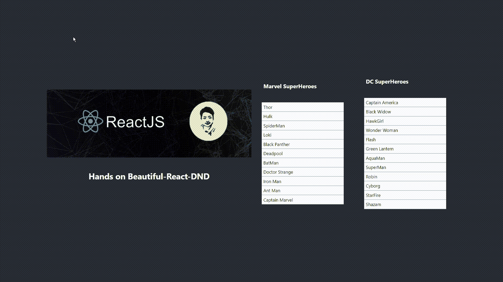
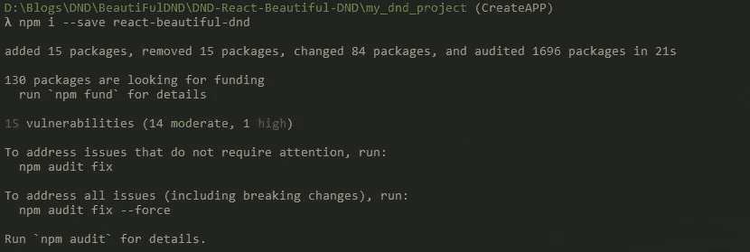
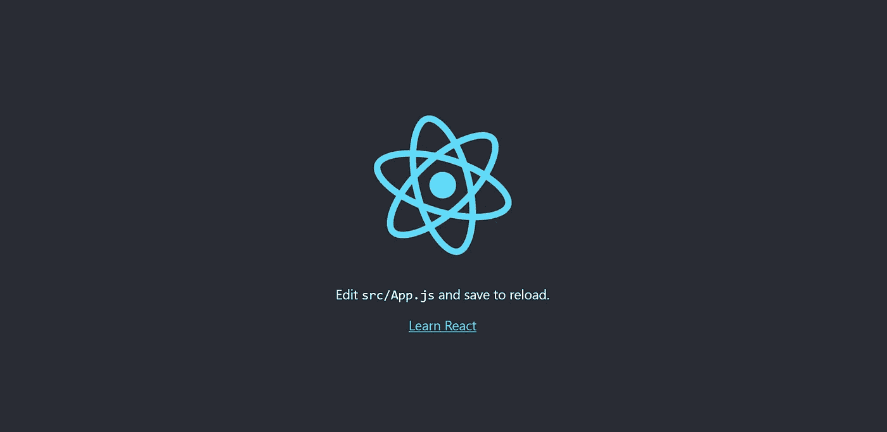
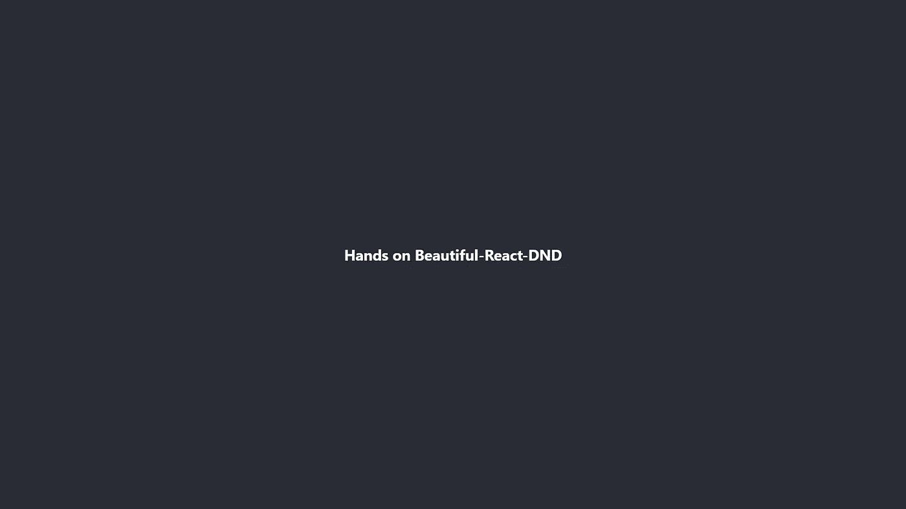
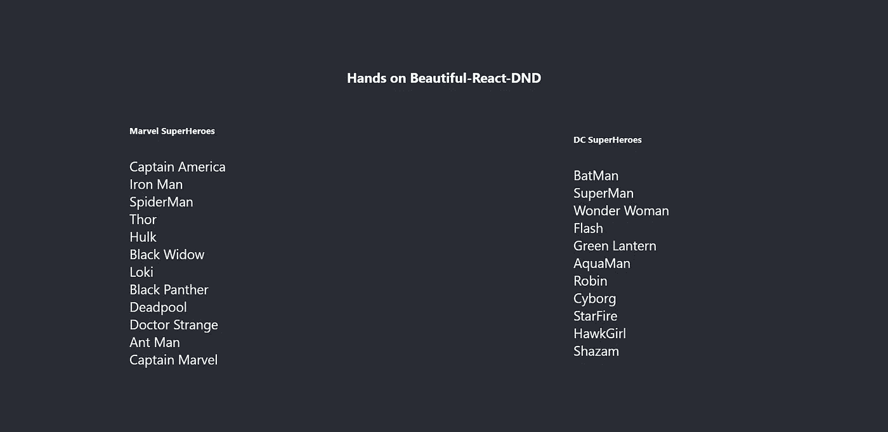

# 实现漂亮的拖放:一步一步反应漂亮的 DND

> 原文：<https://medium.com/nerd-for-tech/drag-drop-react-beautiful-dnd-328e00797f27?source=collection_archive---------1----------------------->


> 构建网络应用不再是什么大事，就像没有轮子的汽车一样无聊。
> 
> 但是让我来帮你用 **REACT-BEAUTIFUL-DND** 让它变得花哨一点
> 
> 现在拖放你的组件，制作一辆有翅膀的汽车，当然还有轮子。

*请忽略👆诗😋😂🤣*



# 内容

1.  对拖放做出反应
2.  React-Beautiful-DND **(介绍和安装)**
3.  创建普通组件
4.  将创建的组件转换为 DND 组件
5.  结果
6.  Github 链接

# 其他 ReactJS 教程的快速链接

1.  [第 1 部分:如何创建一个新的 React 应用](/@ashikthulungrai7/how-to-create-a-new-react-app-3286a37e2189)
2.  [第 2 部分:创建 ReactJS 组件的简单方法](/@ashikthulungrai7/part-2-easy-way-to-create-reactjs-components-7d458b577c67)

# 1.对拖放做出反应

有许多 react 库可以帮助您制作拖放式 React 组件。

> **点击此链接查看 32 个广泛使用的 React DND 软件包:** [**链接**](https://openbase.com/categories/js/best-react-drag-and-drop-libraries?orderBy=RECOMMENDED&)

在这个博客中，我们将使用名为[**react-beautiful-dnd**](https://www.npmjs.com/package/react-beautiful-dnd)**的 react 库来创建 DND 组件。 **React-Beautiful-DND** 是一个最用户友好和易于使用的**拖放(DND)** react 库，由 JIRA 的创作者 Alex Reardon 开发。**

# **2.反应-美丽-DND**

## ****2.1 简介****

> ****我们将把 React-Beautiful-DND 称为 rbd****

**在 **rbd** 库中，DND 组件由 3 个主要组件创建:**

****

**BRD 的三个主要组成部分。图片来源:[链接](https://user-images.githubusercontent.com/2182637/53607406-c8f3a780-3c12-11e9-979c-7f3b5bd1bfbd.gif)**

*   **`**<DragDropContext/>**` = >定义整个拖放操作的区域**
*   **`**<Droppable/>**` = >定义可拖动项目可以被放下的区域**
*   **`**<Draggable/>**` = >定义可以在可拖放区域拖动和拖放的实际项目**

> ****每个 DragDropContext 可以有多个 drop ables，并且每个 drop ables 内部可以定义多个 Draggables。****

****2.2 BRD 图书馆安装****

**首先使用命令`npx create-react-app my_app`创建一个 react 应用程序。**

> ****阅读这篇关于如何创建第一个 react 应用的详细教程:** [**链接**](/@ashikthulungrai7/how-to-create-a-new-react-app-3286a37e2189)**

**创建应用程序后，您可以使用命令`npm i --save react-beautiful-dnd`安装 RBD 库。更多详情，请访问链接[**https://www.npmjs.com/package/react-beautiful-dnd**](https://www.npmjs.com/package/react-beautiful-dnd)**

****

****安装 react BRD 库的命令****

> ****CreateAPP 是一个 git 分支名称。你可以在 Github** [**链接**](https://github.com/ashikrai/DND-React-Beautiful-DND.git) 找到完整的代码**

# **3.创建正常的 React 组件**

****

****React app 在 localhost 本地运行:3000****

**创建新的 React 应用程序后，使用命令`npm start.`运行服务器**

**react 应用程序将在默认端口 3000 的本地浏览器中呈现，如图所示。**

## ****3.1 更改现有代码****

**将文件 appname/src/ **App.js 中的代码改为****

****

**修改后的 App.js**

```
// Filename : App.jsx
import './App.css';function App() {
   return (
      <div className="App">
         <header className="App-header">
            <h4>Hands on React-Beautiful-DND</h4>
         </header>
      </div>
   );
}
export default App;
```

****3.2 添加新组件****

**现在我们将创建一些普通组件，稍后我们将把它们转换成 DND 组件。在文件 **ListComponent.jsx** 中，我们将创建一些列表项，并通过在 **App.js** 中导入该文件来呈现它**

```
**// Filename : ListComponent.jsx**import React from 'react';export function ListComponents({Marvel, DC}) {
return (
  <div style={{ width: '100%', display: 'flex' }}>
      <div style={{ width: '25%', margin: 'auto' }}>
         <ul style={{ listStyleType: 'none', textAlign: 'left' }} >
            <h6>Marvel SuperHeroes</h6>
            {Marvel.map((data, index) => (
               <li key={index}>
                  {data}
               </li>
            ))}
         </ul>
      </div>
      <div style={{ width: '25%', margin: 'auto' }}>
         <ul style={{ listStyleType: 'none', textAlign: 'left' }}>
            <h6>DC SuperHeroes</h6>
            {DC.map((data, index) => (
               <li key={index}>
                  {data}
               </li>
            ))}
         </ul>
      </div>
   </div>)}
```

**漫威和 DC 是正常的常量列表变量。为了在 ReactJS 中呈现这些列表，我们可以使用 **map()** 函数。map() 函数将遍历列表中的每个元素/项目，并以我们想要的方式呈现每个数据元素。为了有效地重新呈现 DOM 元素，我们需要向每个呈现的元素传递唯一的键。**

**为了在 **App.js** 中导入并呈现 **ListComponent.jsx** ，将 App.js 中的代码改为**

```
**// FileName: App.js**
import './App.css';**// importing components from another files**
import { ListComponents } from "./ListComponent";function App() {**// List 1 consisting of all MARVEL super heroes** const list1 = ['Captain America', 'Iron Man', 'SpiderMan', 'Thor', 'Hulk', 'Black Widow', 'Loki', 'Black Panther', 'Deadpool', 'Doctor Strange', 'Ant Man', 'Captain Marvel']**// List 2 consisting of all DC super heroes** const list2 = ['BatMan', 'SuperMan', 'Wonder Woman', 'Flash', 'Green Lantern', 'AquaMan', 'Robin', 'Cyborg', 'StarFire', 'HawkGirl', 'Shazam', '']return (
      <div className="App">
         <header className="App-header">
            <h4>Hands on React-Beautiful-DND</h4>
            <ListComponents Marvel={list1} DC={list2} />
         </header>
      </div>
   );
}
export default App;
```

**在 **ListComponent.jsx** 被导入到 **App.js** 后，输出将如下所示。**

****

# **4.将创建的组件转换为 DND 组件**

**现在我们已经成功创建了两个列表组件，下一步是将它们转换为 DND 组件，以允许**拖放操作。****

> **创建拖放组件的时间😍😍**

**4.1 **创建 DragDropContext****

**我们将从 App.js 中的 react-beautiful-dnd 库导入 **DragDropContext** ，并将整个应用程序包装在这个上下文中。这将包装其他两个组件，可拖放和可拖动的 BRD 组件。定义了诸如 **onDragStart、onDragUpdate 和 onDragEnd** 的属性，但是 **onDragEnd** 足以执行重新排序、添加和删除项目。**

> **添加 **DragDropContext** 后修改 **App.js** 代码**

```
**// FileName: App.js**import './App.css';
import React from 'react';**// importing components from another files**
import { ListComponents } from "./ListComponent";**// imports related to DND**
import { DragDropContext } from 'react-beautiful-dnd';function App() { **// List 1 consisting of all MARVEL super heroes**
   const [list1, setList1] = React.useState(['Captain America', 'Iron Man', 'SpiderMan', 'Thor', 'Hulk', 'Black Widow', 'Loki', 'Black Panther', 'Deadpool', 'Doctor Strange', 'Ant Man', 'Captain Marvel']) **// List 2 consisting of all DC super heroes**
   const [list2, setList2] = React.useState(['BatMan', 'SuperMan', 'Wonder Woman', 'Flash', 'Green Lantern', 'AquaMan', 'Robin', 'Cyborg', 'StarFire', 'HawkGirl', 'Shazam']) **// Function for deleting items from list using index**
   const deleteItem = (list, index) => {
      return list.splice(index, 1)
   } **// Function called when Drag Ends**
   const onDragEnd = (result) => {
      **// getting the source and destination object** const { source, destination } = result
      if (!destination)
         return;
      if (source.droppableId === destination.droppableId) {
         if (source.droppableId === "Marvel_drop_area") {
            let tempList = list1
            const removed = deleteItem(tempList, source.index)
            tempList.splice(destination.index, 0, removed)
            setList1(tempList)
         }
         else {
            let tempList = list2
            const removed = deleteItem(tempList, source.index)
            tempList.splice(destination.index, 0, removed)
            setList2(tempList)
         }
      } else {
         let tempList1 = list1
         let tempList2 = list2
         if (source.droppableId === "Marvel_drop_area") {
            const removed = deleteItem(tempList1, source.index)
            tempList2.splice(destination.index, 0, removed)
            setList1(tempList1)
            setList2(tempList2)
         } else {
            const removed = deleteItem(tempList2, source.index)
            tempList1.splice(destination.index, 0, removed)
            setList1(tempList1)
            setList2(tempList2)
         }
      }
   }return (
      <DragDropContext onDragEnd={onDragEnd}>
         <div className="App">
            <header className="App-header">
               <h4>Hands on React-Beautiful-DND</h4>
               <ListComponents Marvel={list1} DC={list2} />
            </header>
         </div>
      </DragDropContext>
   )
}
export default App;
```

****4.2 创建可拖放组件****

**我们将从 ListComponent.jsx 中的 react-beautiful-dnd 库导入**drop able 和 Draggable** ，Draggagle 必须嵌套在 drop able 内，drop able 应该嵌套在 DragDropContext 内。**

****可拖放**定义了项目可拖放的区域。每个可丢弃组件将有一个**唯一的可丢弃 Id 道具。**可丢弃组件提供变量如:**

*   **`provided.innerRef:`操作 DOM 元素的 react 引用变量**
*   **`provided.droppableProps:`为拖放功能提供默认的 CSS 样式**
*   **`provided.placeholder:`为当前正在拖动的项目在可拖放区域提供额外的空间。**
*   **`snapshot:` `snapshot.isDraggingOver`可以用来获得&的拖放状态来应用有条件的 CSS 样式。**

****可拖动**定义了需要拖动的实际项目。它必须嵌套在可删除组件中。我们必须为以下各项提供价值**

*   **`draggableId` 用于唯一标识被拖动的项目。**
*   **`index:`用于识别当前在源中被拖动的列表中的数据，在目的地中识别列表中被拖动的项目必须放置在其下的数据。**

> **增加了**可下降**和**可拖动**后修改了 **ListComponent.jsx****

```
**// Filename : ListComponent.jsx**import React from 'react';**// imports related to DND**
import { Droppable, Draggable } from 'react-beautiful-dnd';export function ListComponents({ Marvel, DC }) {
   const getListStyle = isDraggingOver => ({
      background: isDraggingOver ? "lightblue" : "darkgrey",
      width: '21%',
      margin: 'auto',
   });
   const getItemStyle = (isDragging, draggableStyle) => ({
      userSelect: "none",
      background: isDragging ? "darkgrey" : "white",
      color: isDragging ? "white" : "black",
      padding: isDragging ? '0%' : '2%',
      paddingLeft: '2%',
      margin: '0%',
      fontSize: '17px',
      borderBottom: '0.5px solid gray',
      // styles we need to apply on draggables
      ...draggableStyle
   }); return (
      <div style={{ width: '100%', display: 'flex' }}>
         <Droppable droppableId="Marvel_drop_area"  >
            {(provided, snapshot) => (
               <div
                  {...provided.droppableProps}
                  ref={provided.innerRef}
                  style={getListStyle(snapshot.isDraggingOver)}
               >
                  <ul style={{ listStyleType: 'none', textAlign: 'left', padding: '0%', width: '100%' }} >
                     <h6 style={{ paddingLeft: '2%' }}>Marvel SuperHeroes</h6> {Marvel.map((data, index) => (
                        <Draggable key={data} 
 draggableId={`${data}${index}`} index={index}>
                           {(provided, snapshot) => (
                              <li
                                 key={index}
                                 ref={provided.innerRef}
                                 ...provided.draggableProps}
                                 ...provided.dragHandleProps}
                                 style={getItemStyle(
                                    snapshot.isDragging,
                                    provided.draggableProps.style
                                 )}
                              >
                                 {data}
                              </li>
                           )}
                        </Draggable>
                     ))}
                  </ul>
                 {provided.placeholder}
              </div>
           )}
        </Droppable>
        <Droppable droppableId="DC_drop_area"  >
           {(provided, snapshot) => (
              <div
                {...provided.droppableProps}
                ref={provided.innerRef}
                style={getListStyle(snapshot.isDraggingOver)}
              >
                <ul style={{ listStyleType: 'none', textAlign: 'left', padding: '0%', width: '100%' }} >
                   <h6 style={{ paddingLeft: '2%' }}>DC SuperHeroes</h6>
                      {DC.map((data, index) => (
                         <Draggable key={data} draggableId={`${data}${index}`} index={index}>
                            {(provided, snapshot) => (
                               <li
                                  key={index}
                                  ref={provided.innerRef}
                                  {...provided.draggableProps}
                                  {...provided.dragHandleProps}
                                  style={getItemStyle(
                                     snapshot.isDragging,
                                     provided.draggableProps.style
                                  )}
                               >
                                  {data}
                               </li>
                            )}
                         </Draggable>
                      ))}
                   </ul>
                   {provided.placeholder}
                </div>
             )}
          </Droppable>
       </div>
    )
}
```

# **5.结果**

****

**使用 React-Beautiful-DND 拖放**

# **6.Github 链接**

> **你可以使用链接在 github 中找到完整的代码:[https://github.com/ashikrai/DND-React-Beautiful-DND.git](https://github.com/ashikrai/DND-React-Beautiful-DND.git)**

# **阅读更多我关于 React 应用程序开发和其他令人敬畏的 React 包的文章**

> **[第 1 部分:如何创建新的 React App | by ki HSA Rai | Medium | Medium](/@ashikthulungrai7/how-to-create-a-new-react-app-3286a37e2189)**
> 
> **[第 2 部分:创建 ReactJS 组件的简单方法|作者 ki HSA Rai | 2021 年 7 月| Medium](/@ashikthulungrai7/part-2-easy-way-to-create-reactjs-components-7d458b577c67)**
> 
> **[Learning ReactJS:双向数据绑定|由 KIHSA Rai | May 年 5 月| Medium](/@ashikthulungrai7/learning-reactjs-two-way-data-binding-5c5ce1ab9b3d)**