# 绘制 ER 和 EER 图&关系映射

> 原文：<https://medium.com/nerd-for-tech/drawing-er-and-eer-diagrams-mapping-4965e2b3cc3e?source=collection_archive---------0----------------------->

## ER & EER 综合介绍

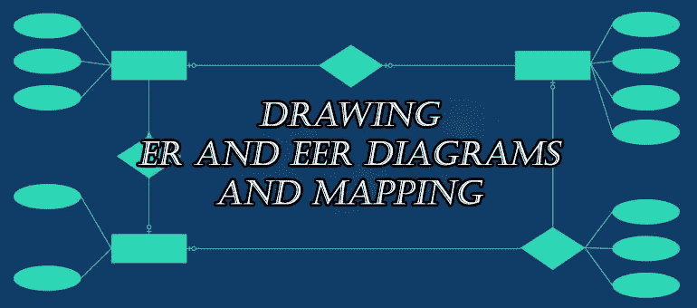

嗨读者们！😍

今天我将告诉你如何为你的数据库绘制 ER 和 EER 图，以及如何将它们映射到关系模式。🤞

在此之前，有些事情你应该知道。

首先让我们看看什么是 ER 和 e ER 图。

## 什么是 ER 图？

**ER 图**是基于 **ER 模型**的数据的可视化表示，它描述了数据库中实体之间的关系。

## 什么是 EER 图？

**EER 图**是数据的可视化表示，基于 **EER 模型**，是原**实体关系** ( **ER** ) **模型**的扩展。

当你读这篇文章时，你会发现这些话。**“实体、属性、关系、基数、参与度”**。🤔好吧，让我们看看这些是什么。

## 实体

**实体**是任何单一的、可识别的和独立的对象。它指的是个人、组织、系统、少量数据，甚至是独特的系统组件，它们本身被认为是重要的。对于**例子**，人、财产、组织、协议等。在 ER 图中，**实体**用矩形表示。

***弱实体***

弱实体是依赖于另一个实体存在的实体。用更专业的术语来说，它可以被定义为一个不能被自身属性识别的实体。

## 属性

**属性**是定义实体类型的属性。对于**示例**，Roll_No、Name、DOB、Age、Address、Mobile_No 是定义实体类型 Student 的**属性**。在 ER 图中，**属性**用椭圆形表示。

***多值属性***

如果一个属性可以有多个值，则称为多值属性。

***派生属性***

基于另一个属性的属性。

## 关系

一个**关系**是描述实体间交互的关联。

***递归关系***

如果同一个实体不止一次地参与一个关系，这就是所谓的递归关系。

**以下是实体、属性和关系的类型。**

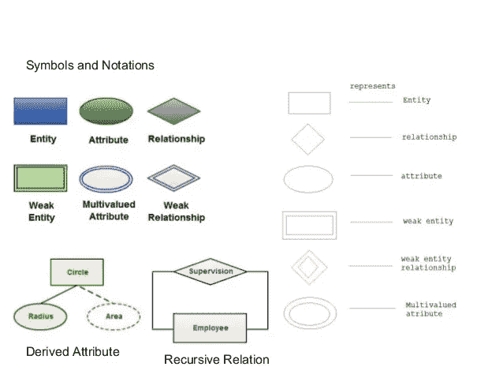

## 基数

***基数*** 是指一个实体中的一个实例可以关联到另一个实体的实例的最大次数。基数有三种类型。

1.  一对一(1 对 1)
2.  一对多(1 对 N)
3.  多对多(多对多)

## 参与

**参与**约束指定当一个实体以**关系**类型与另一个实体相关时，该实体的存在。有两种类型。部分和全部参与。

**全面参与**——关系中涉及的每个实体。全部参与用双线表示。

**部分参与**——并非所有实体都参与关系。部分参与用单线表示。

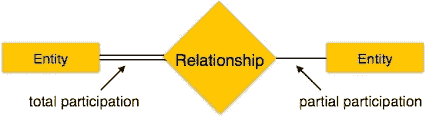

数据库开发有三个步骤。

1.  **需求分析**——通过用户访谈、表格、报告、观察等了解数据问题。
2.  **组件设计阶段**——创建一个数据模型，它是最终将要实现的内容的图形表示。
3.  **实施阶段** - 数据库的实际开发，导致数据库在真实环境中实际使用。

在上述阶段的第一阶段(需求分析)之后，您必须遵循数据库设计阶段。

1.  概念设计
2.  逻辑设计
3.  结构设计

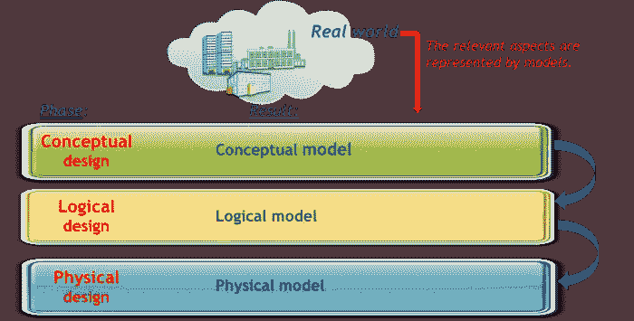

在**概念设计中，**我们识别所有实体，我们定义属性及其特性，我们定义实体之间的关系。

在**逻辑设计**中，我们将概念设计转换为关系型，将实体转换为表，将实体属性转换为表列，并进行规范化。

在**物理设计**中，我们指定内存结构和路径，分配一个或多个索引并调优索引。

在概念设计阶段，我们设计 ER 或 e ER 图。

> 这里有一些绘制 ER 和 EER 图的规则

*   用单数形式书写所有实体
*   用单数形式写出所有关系。
*   用单数形式写出所有的属性。
*   如果要分隔单词，请使用下划线标记。

现在，让我们看看如何绘制 ER 图和 EER 图。

# 绘制 ER 和 EER 图

## 以下几点显示了如何着手创建 ER 图。

1.  识别系统中的所有实体。一个实体在一个特定的图中应该只出现一次。为所有实体创建矩形，并正确命名。
2.  **识别实体间的关系**。用一条线将它们连接起来，并在中间添加一个描述关系的菱形。
3.  **为实体添加属性**。给出有意义的属性名，以便于理解。
4.  **标记实体之间的基数和参与度**。

*这是一个 ER 图的例子。*

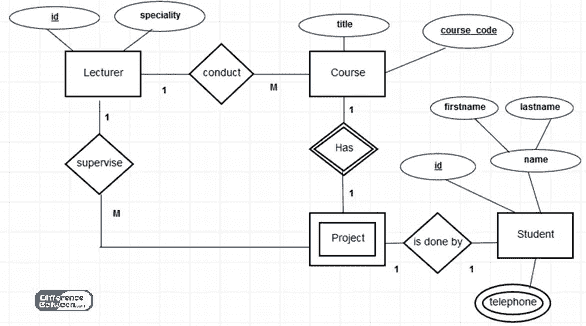

看起来容易？🤩多尝试画复杂的图。

## 现在让我们看看如何绘制 EER 图。

这里我们只需要在上面添加一些东西。

1.就像先画 ER 图一样，我们必须**识别所有实体**。

在我们从场景中找到实体后，您应该检查这些实体是否有子实体。如果是这样，你必须在你的图表中标记出**子实体**。

将实体分成子实体，我们称之为专门化。将子实体组合成一个实体称为泛化。

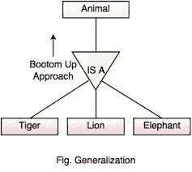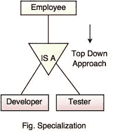

2.然后你必须**识别实体之间的关系**并标记它们。

3.**为实体添加属性。给属性起一个有意义的名字，以便于理解。**

4.**标记基数和参与度**

如果这是一个 EER 图，你必须在你的图上添加一些。

这里我们也必须检查子实体是否完全依赖于主实体。你应该做个标记。

如果超类(主实体)中的所有成员都参与其中一个子类，则称为**总参与度**。它用双线标记。

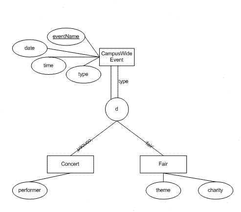

**总参与人数**

如果超类中至少有一个成员不参与子类，则称为**部分参与**。它由一条单线表示。

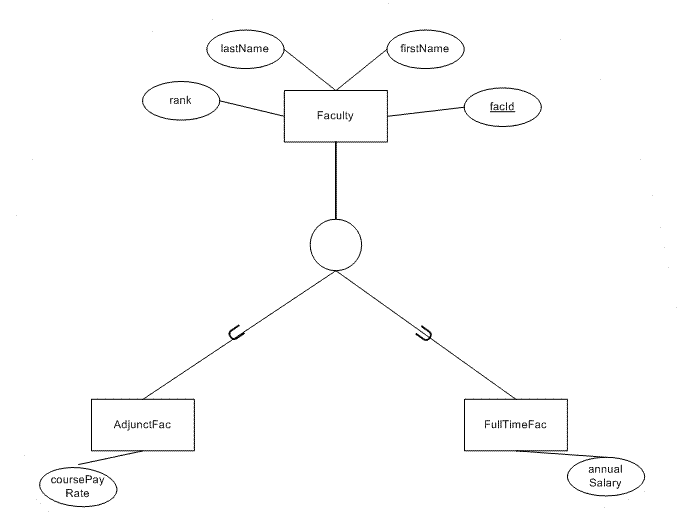

**部分参与**

如果超类中的所有成员只参与一个子类，则称为**不相交**，用“d”表示。如果超类中的所有成员都参与一个以上的子类，则称为**重叠**，用“o”表示。

# 现在它结束了，在完成以上所有步骤后，你就可以得到你的 er 和 EER 图了。😍

**ER 和 EER 图的好处。**

*   易于理解，并且不需要一个人最近接受广泛的培训就能够准确地使用它。
*   容易翻译成关系表，可以用来快速建立数据库
*   可以被数据库开发者直接用作在特定软件应用中实现数据库的蓝图
*   它可以应用于其他环境中，例如描述组织内的不同关系和操作。

现在我们继续。我们的下一个主题是将 ER 和 EER 图映射到关系模式。

# 将 ER 和 EER 图映射到关系模式

首先，我将告诉您如何将 ER 图映射到关系模式中。

# 将 ER 图映射到关系模式

按照步骤一步一步来做。🤞

1.  ***映射强实体。***
2.  ***映射弱实体。***
3.  ***映射二元一一对应关系。***
4.  ***映射二元一对多关系***
5.  ***绘制二元多对多关系。***
6.  ***映射多值属性。***
7.  ***绘制 N 元关系图***

让我们深入举例。

## *1。映射强实体。*

## *2。映射弱实体。*

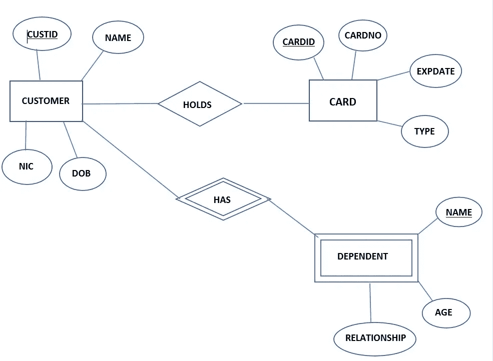

上面显示了一个 ER 图及其关系。您可以看到有两个具有关系的强实体和一个具有弱关系的弱实体。

当你要创建一个关系模式时，首先你必须确定所有的实体及其属性。您必须将属性写在括号中，如下所示。毫无疑问，你必须在主键下画线。在上面的**中，依赖**的是一个弱实体。要使它变得强大，就要经历这种微弱的关系，并识别出与它相连的实体。然后，您已经在弱实体括号内编写了该实体的主键。

然后，您必须将主键映射到您获取的位置，如下所示。

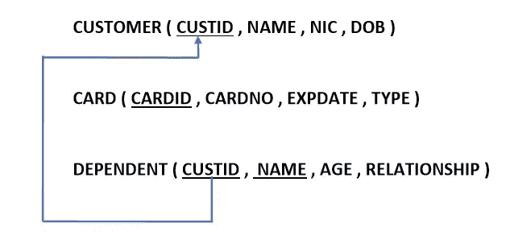

## *3。映射二元一对一关系。*

我们假设客户和卡的关系是一对一的。

根据参与约束，有三种情况发生一对一的关系。

一、双方均有部分参与。

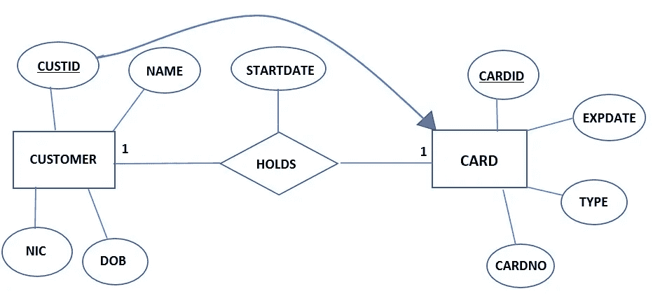

当双方都部分参与时，您可以将实体的任何主键发送给其他人。同时，如果这两个实体之间的关系中有属性，它也会被发送到其他实体，如上所示。

那么，现在让我们看看如何编写关系模式。

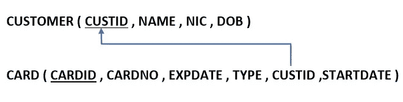

这里你可以看到我在**卡片**表中写了**客户号**和**开始日期**。现在你必须绘制出 CUSTID 的来源。就是这样。🤩

二。一方有部分参与。

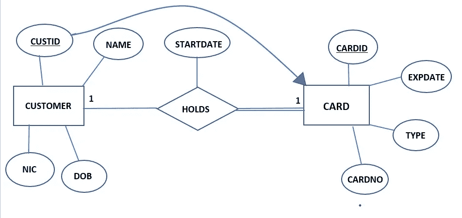

你可以看到在关系和**卡**实体之间它有总的参与。

当有全面的参与时，肯定会有其他人的参与。此外，如果关系中有属性，也会涉及到全面参与方面。

然后你要把它们映射如下。

三。双方都完全参与

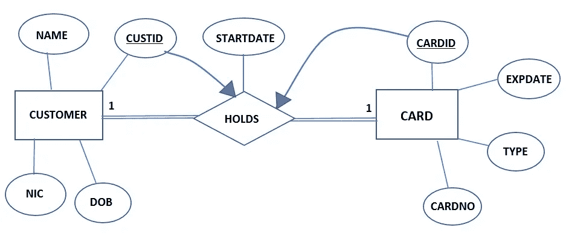

如果双方都参与，你需要用一个合适的名字建立一个新的关系，合并实体和关系。

下面的例子说明了我们应该如何写这个关系。

现在让我们看看如何映射一个到多个关系。

## *4。映射二元一对多关系*

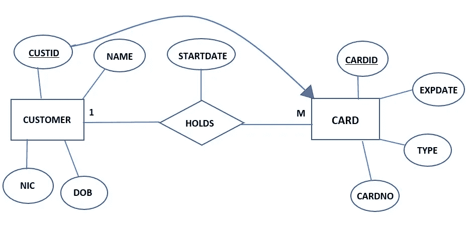

如果是一对多，总是多方，其他实体的主键和关系中的属性都到多方。不管关于参与。然后你必须映射主键。

## *5。映射二元多对多关系。*

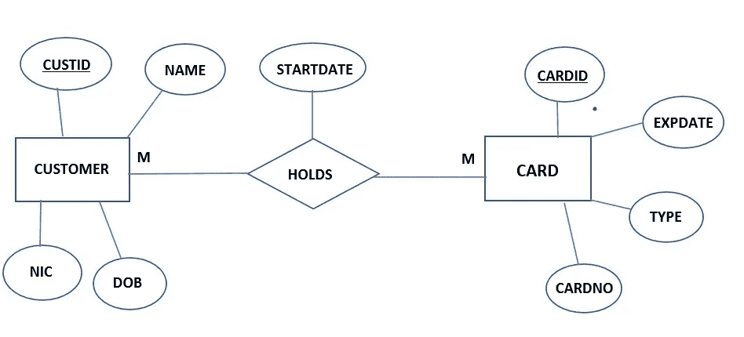

如果是多对多关系，你应该总是用实体间关系的名称来建立一个新的关系。

在这里，您应该编写关系中实体和属性的主键，并将它们映射到缩写，如下所示。

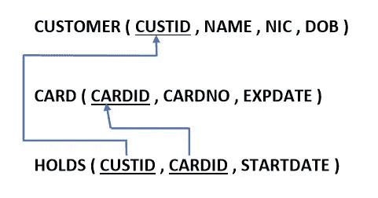

## *6。映射多值属性。*

如果有多值属性，您必须使用合适的名称建立新的关系，并写入属于多值属性的实体的主键以及多值属性的名称，如下所示。

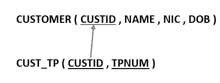

## *7。映射 N 元关系。*

首先，让我们考虑一元关系。

我们把他们分为两类。

一、一对一、一对多关系。

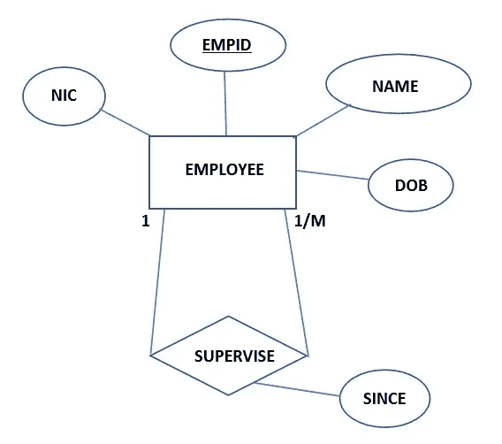

如果它是一元和一对一或一对多关系，您不需要创建新的关系，您只需向当前实体添加一个新的主键，如下所示，并将其映射到初始的。例如，在上图中，员工由主管管理。因此，我们需要创建一个新的主键作为 **SID** ，并将其映射到 **EMPID** 。因为 **SID** 也是一个 **EMPID** 。

二。多对多关系。

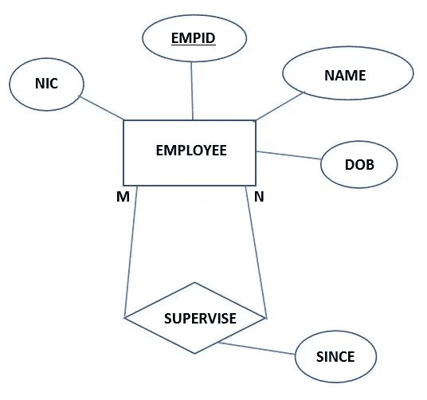

如果是一元和多对多关系，你需要用一个合适的名字建立一个新的关系。然后你必须给它一个合适的主键，它应该映射到它来的地方，如下所示。

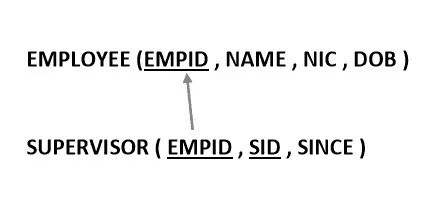

现在让我们看看如何映射两个以上实体的关系。

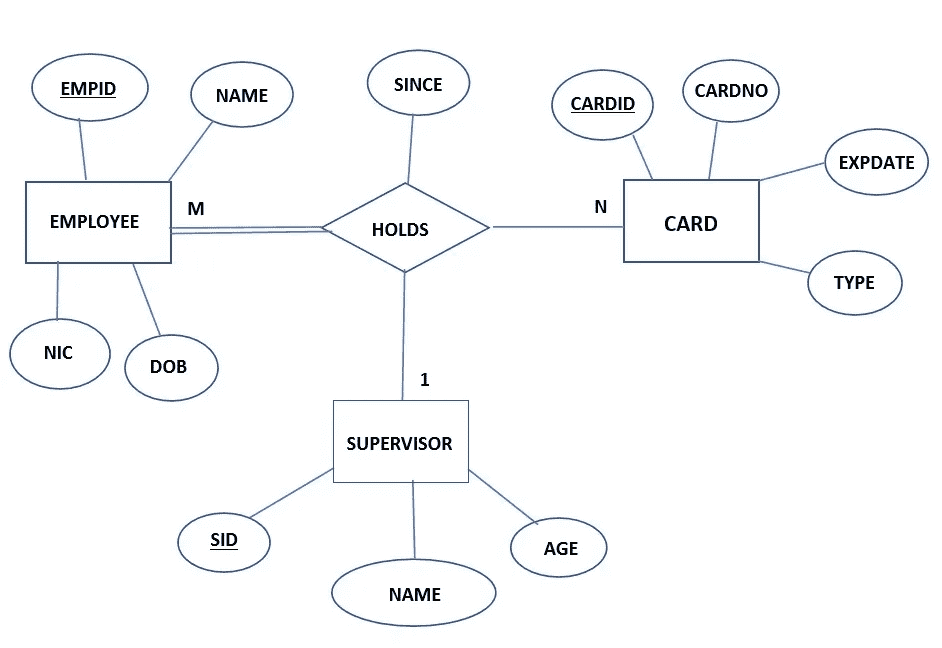

## 如果一个关系有三个以上的实体，你必须做一个新的关系表，并把所有连接实体的主键和所有属性放在关系中。最后，你必须将它们映射如下图所示。

## 👍这就是我们如何将 ER 图映射到关系模式。

现在让我们看看如何绘制 EER 图。

# 将 EER 图映射到关系模式。

让我们看一下下面的图表。

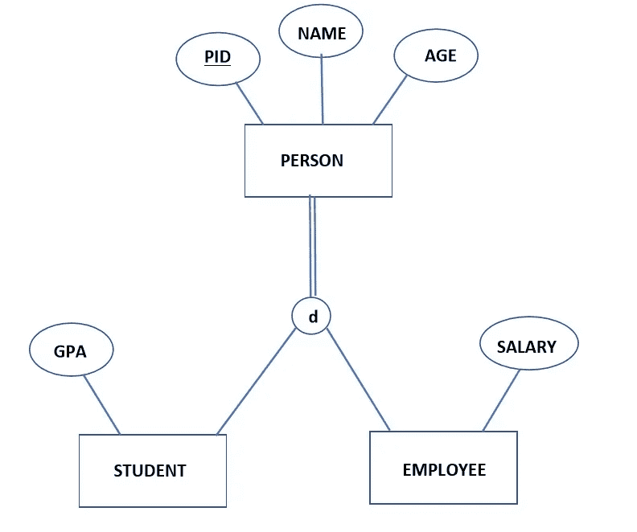

有四种方法来绘制 EER 的关系模式。你要选择最合适的。最后，我会给你如何选择最好和最合适的方法的指导方针。

**第一种方法**

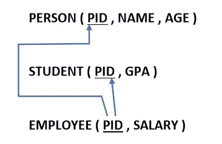

在这里，我们为所有超类实体和子类实体编写单独的关系。这里，我们必须将超类实体的主键写入所有子类实体，然后如上所示映射它们。注意，我们只写属于每个实体的属性。

**第二种方法**

这里我们不写超类实体，但是在每个子类实体中，我们写超类实体中的所有属性。

**第三种方法**

这里我们只写超类实体，写所有属于子类实体的属性。这里的特点是，为了识别**人**是**员工**还是**学生**，我们增加了一列**人员类型**。表格创建后，我们可以标记为**学生**或**员工**。

**第四种方法**

在这里，我们写学生和员工，而不是人员类型。

这是因为有时一个人会同时属于这两类人。

有点困惑吧？🙄不要担心，阅读下面的指南来清除它们。

现在让我们看看如何选择最好和最合适的方法来编写关系模式。

**指引**

*1。如果子实体有更多属性(本地或外来属性)*

选择**第一种或第二种方法**。

从这两个中，

如果 EER 完全专门化->选择第二种方法**。**

**如果 EER 部分专用->选择**第一种方法**。**

***2。如果子实体的属性较少(本地或外来属性)***

**选择**第三种或第四种方法**。**

**从这两个中，**

**如果 EER 不相交->选择**第三种方法**。**

**如果 EER 重叠->选择第四种方法。**

## **👍这就是我们将 EER 图映射到关系模式的方式。**

**越试越想出最好的。**

**希望你得到了明确的信息。**

**感谢阅读！！😍**