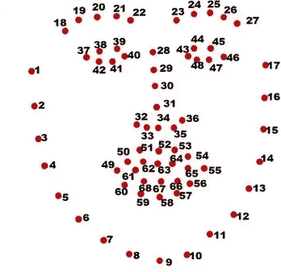
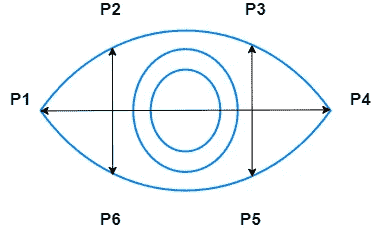
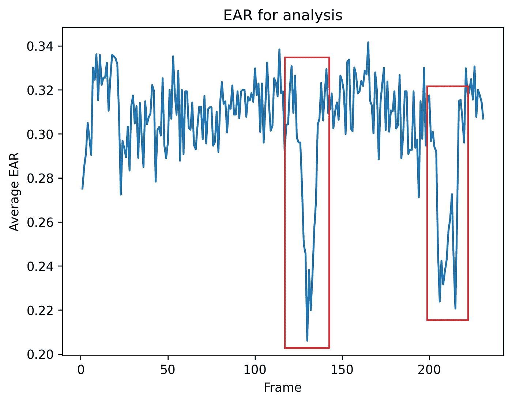

# 使用计算机视觉的驾驶员睡眠检测

> 原文：<https://medium.com/nerd-for-tech/driver-sleep-detection-using-computer-vision-eaee33cb22c4?source=collection_archive---------1----------------------->

一个基于计算机视觉的项目，用于检查车辆驾驶员是否困倦

# 关于项目

该项目的主要思想是保护长途旅行的司机，特别是在夜间，容易感到困倦。

该项目可以部署在 Raspberry Pi 上，并可以与汽车仪表板上的摄像头一起安装。该系统将自动检查该人是否困倦，并在该人似乎困倦时发出警报。

**项目检查两件事。第一部分在**之前已经实施。**我在这里尝试添加打哈欠检测器作为附加功能。**

1.  如果这个人的眼睛一直闭着，那么这个人已经睡着了(或者非常困)，并且发出警报，因为这很关键。
2.  如果这个人在特定时间内打哈欠的次数超过一定次数，这意味着他非常困倦，就会发出警告。

项目的第一部分灵感来自这里的。

# 项目的运作

## 第 1 部分:睡眠检测器

1.  第一步是检测是否可以使用 [dlib](http://dlib.net/) 库识别人脸。
2.  一旦找到一张脸，眼睛的坐标就被选定。下面的[图](https://www.researchgate.net/publication/343699139_A_framework_for_facial_age_progression_and_regression_using_exemplar_face_templates)显示了面部的坐标。

面部坐标

3.一旦眼睛被识别，每只眼睛的眼睛纵横比(EAR)使用下面所示的等式来计算。

EAR = ((P2-P6) + (P3-P5)) / 2(P1-P4)

耳朵

4.取两只眼睛的平均耳朵。

5.如果对于给定的连续帧数，双眼的平均耳朵低于阈值，则发出警报，并且驾驶员可以被唤醒。

6.一个简单的实验就能找到每个司机/人的阈值。

> 1.简单地使用命令“python main.py”运行主程序。
> 
> 2.让这个人睁着眼睛一段时间，然后快速眨一下眼睛，然后让他睁着眼睛，再眨大一点。
> 
> 3.然后按“q”键停止程序。
> 
> 4.打开文件“Graphs\EAR.png”。
> 
> 5.在此图中，您可以看到相对于框架的可视化 EAR，由此，您可以识别和设置 EAR_threshold。
> 
> 6.请在“config.json”中对此进行修改。
> 
> 7.下图显示了一个示例图。红色块代表闪烁事件。

**第 2 部分:哈欠检测器**

7.在类似的基础上，打哈欠探测器也工作并发出我们的警告。这些参数可以在`config.json`中调整。

8.哈欠检测器主要检查一个人是否打哈欠，以及是否根据 MAR 是否超过`MAR_threshold`来检测哈欠。

9.如果在指定数量的帧(由`number_of_frames_yawns`定义)中有超过定义数量的哈欠`number_of_yawns`，则发出警报。

10.在第 6 点定义的类似基础上，可以检测和设置阈值。

耳朵图

# **的先决条件**

1.  **安装 [CMake](https://cmake.org/download/) :因为 dlib 是基于 C 的，所以构建需要 CMake。另外，将 CMake 添加到您的环境变量中。**
2.  **在这里安装 Visual Studio:同时安装额外的软件包`CMake tools for Windows`。**

# **运行代码**

1.  **强烈建议使用虚拟环境。一篇关于此的中型文章可以在[这里](/swlh/create-a-python-virtual-environment-with-built-in-venv-module-109f71dccbdf)找到。**
2.  **点击下载人脸检测[的 dblib 模型。](http://dlib.net/files/shape_predictor_68_face_landmarks.dat.bz2)**
3.  **使用 pip `install -r requirements.txt`安装 requirements.txt**
4.  **为了测试或运行代码，运行命令`python main.py`**

# **附加说明**

# **编码**

**该项目的代码可以在 [GitHub](https://github.com/adnanmushtaq1996/Driver_Sleep_Detection) 上找到。**

# **Python 版本**

**整个项目是用 python 版本`Python 3.7.7`和 pip 版本`pip 19.2.3`开发的。**

# **接触**

**如果有错误，请随时通过 Linkedin 联系我，电话是 [Adnan](https://www.linkedin.com/in/adnan-karol-aa1666179/) 。**