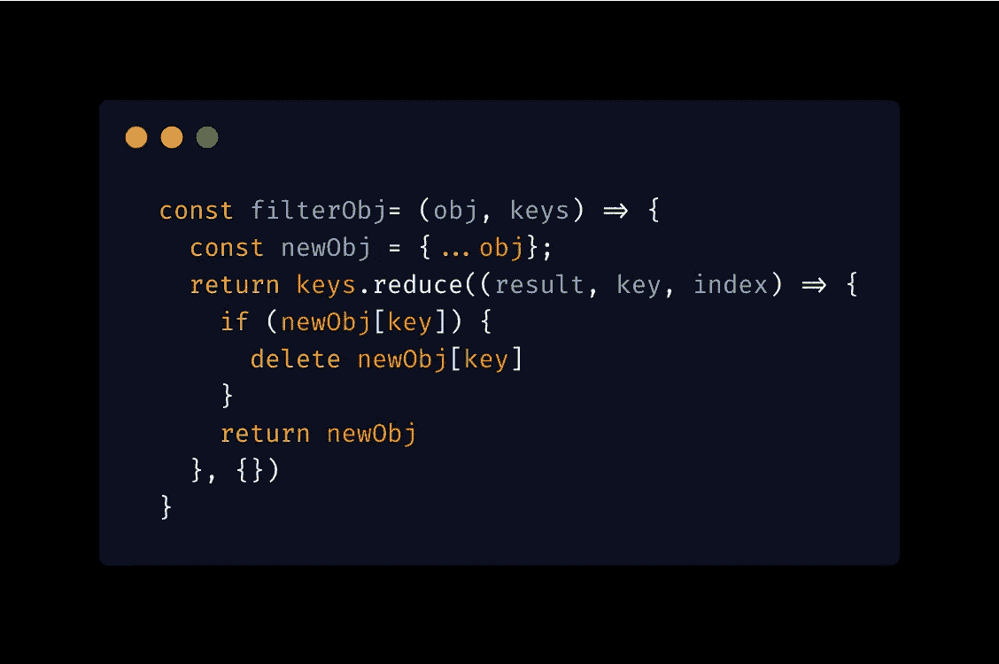
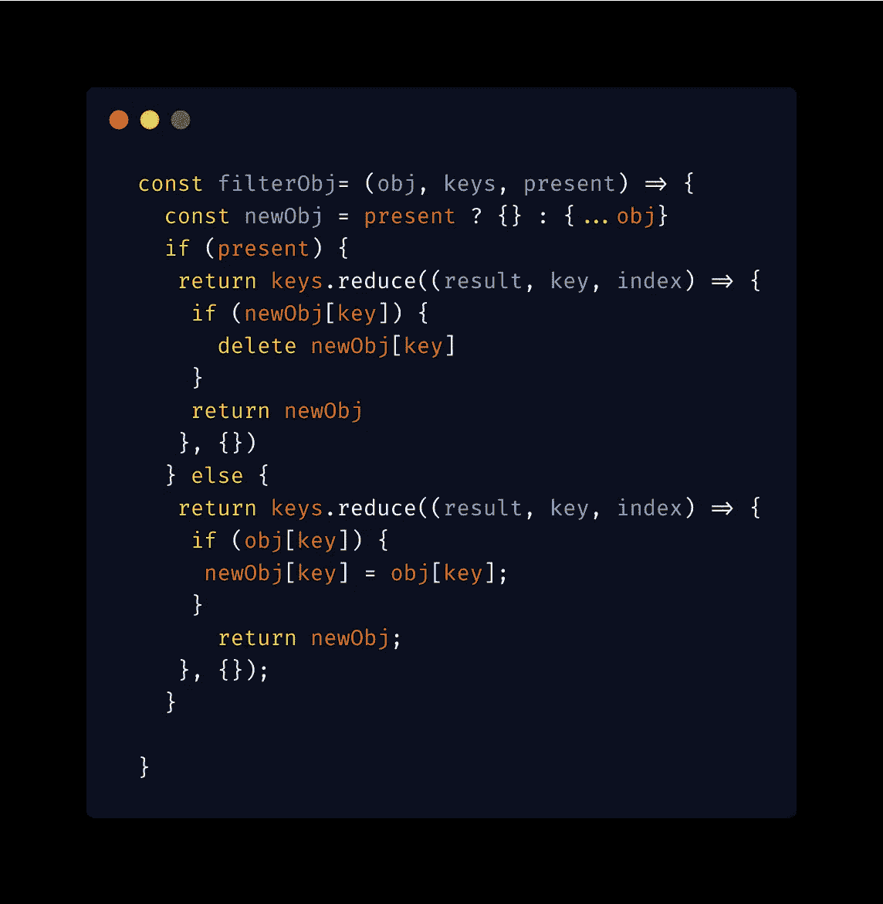
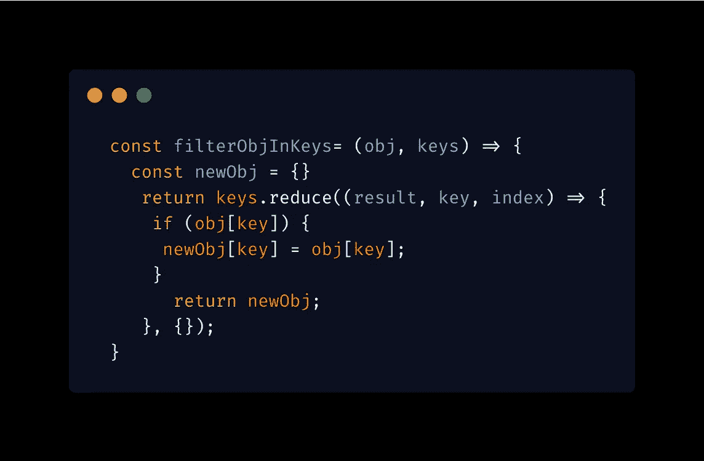
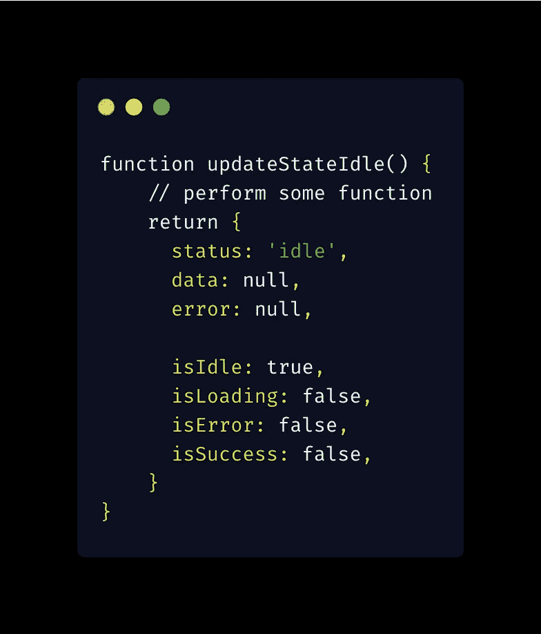
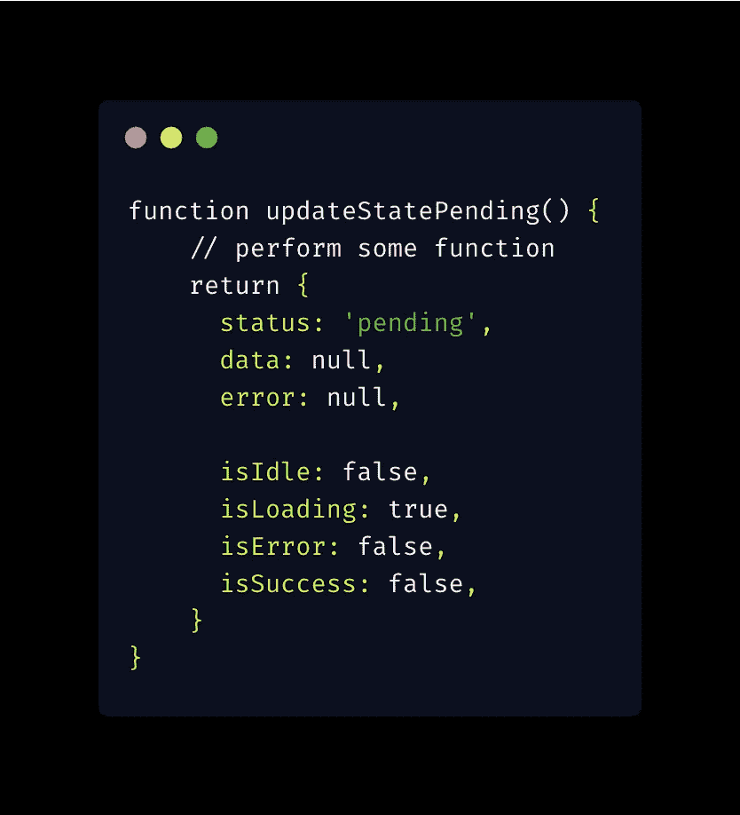
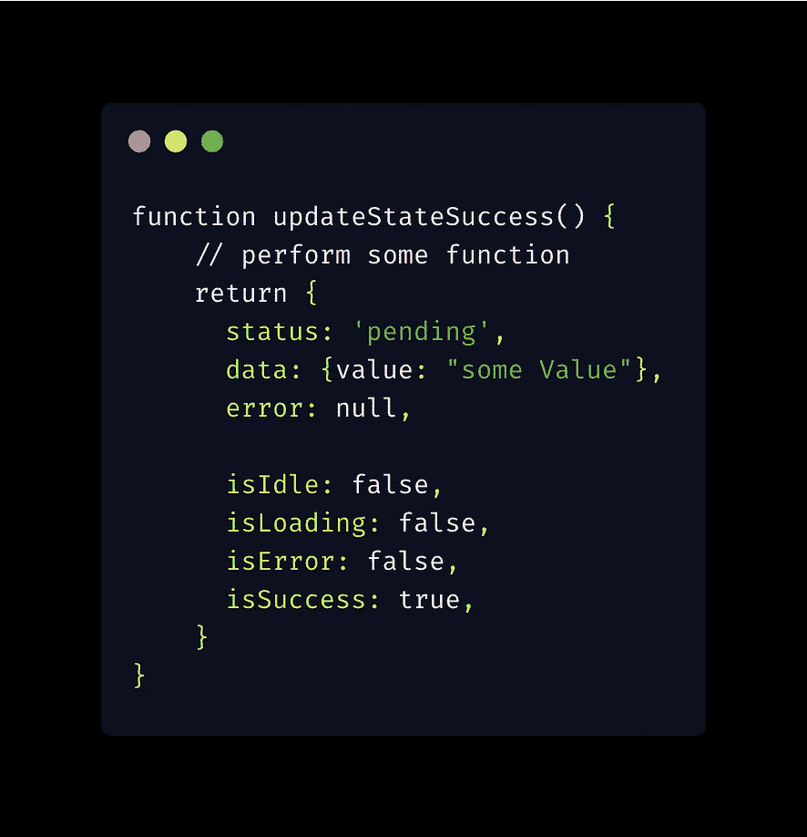
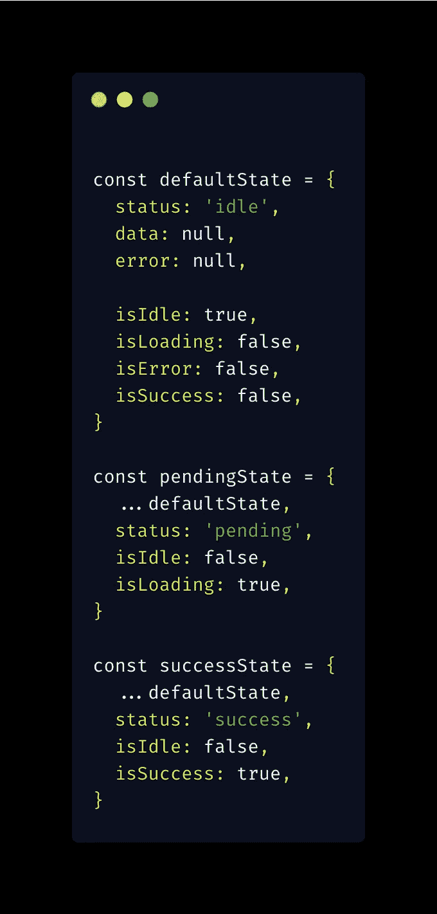

# 干，湿，还是啊哈？

> 原文：<https://medium.com/nerd-for-tech/dry-wet-or-aha-7c2132aaf047?source=collection_archive---------13----------------------->

软件工程是一个不断发展的行业，工程师或程序员面临着各种挑战。其中之一就是编写可伸缩和可维护的代码。

实现可维护代码库的方法之一是代码的抽象和可重用性，以防止代码中到处重复。这就是通常所说的干(不要重复自己)。

让我们考虑一个例子:

筛选关键字不在关键字数组中的对象

这个函数很简单。它接受一个对象和一个键数组，如果该对象持有任何键，则删除该对象条目。

这个函数与这个用例密切相关，可以在我们代码库中的任何地方用来过滤对象。太好了！。

如果我们需要添加另一个用例，函数需要过滤并返回一个新的对象，其中 obj 键出现在 keys 数组中，该怎么办？本着干的精神，我们可能会做这样的事情(当然可以改进，但你得抓住要点)

万岁！！，我们的功能还是干的，可重用的，但是可维护吗？

我们给一个简单的函数增加了另一层复杂性；因此，它没有做好一件事。你可能会说，但这是一个简单的“如果-否则语句”事实是，它不是“一个简单的 if-else 语句”。

考虑到仍然围绕这些函数的其他用例，我们开始到处都有条件，我们创建了一个对每个人来说都是噩梦的怪物函数。

用桑迪梅茨的话说；

> 复制比错误的抽象要便宜得多。—桑迪·梅斯

这就把我们引向了湿(每样东西都写两遍)。

考虑到上面的例子，即使上面的函数是相似的，如果把它们写在需要的地方会更好，因此去掉了不必要的抽象，并且容易维护。

筛选关键字不在关键字数组中的对象

关键字出现在关键字数组中的对象的筛选器

这样，我们就有了两个易于维护和理解的功能，而不会增加额外的复杂性。

一个好的抽象揭示了一个模式，而没有增加太多的复杂性。

对我来说，一个经验法则是，一旦一个 if 语句出现在我的抽象中，我就“把所有东西都写两遍”

啊哈呢？它只是代表“避免草率的抽象”

如果我们在上面的例子中遵循这个简单的术语，我们会很快发现我们在抽象上过于草率，这会导致一个巨大的函数超时。

让我们考虑一个例子:(归功于**肯特·c·多兹**

假设我们在代码库或文件中处处都使用这种典型状态。考虑到我们还有另外两个将状态更新为 Pending 和 Success 的函数。

将状态更新为待定

成功更新状态

我们已经编写了这些函数，正如我上面所说的，一个好的抽象揭示了一个模式。

我们可以提取返回的状态，如下所示:

我们避免了任何草率的抽象，并允许模式在这个用例中显露出来。

希望，当你写你的可重用函数时，你会考虑干的，湿的，还是啊哈？

感谢阅读。