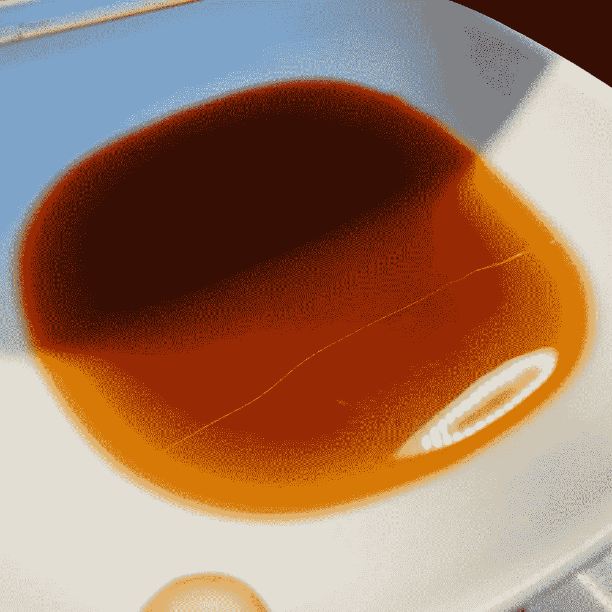
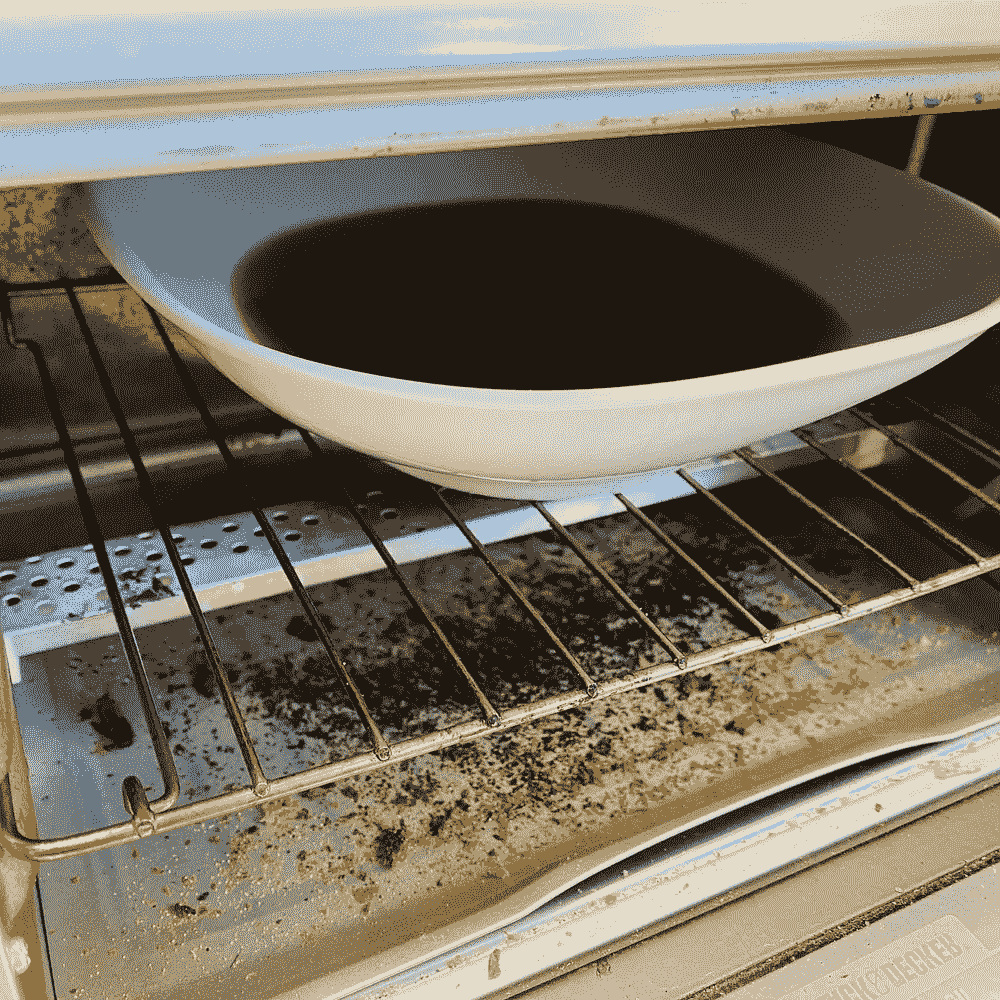
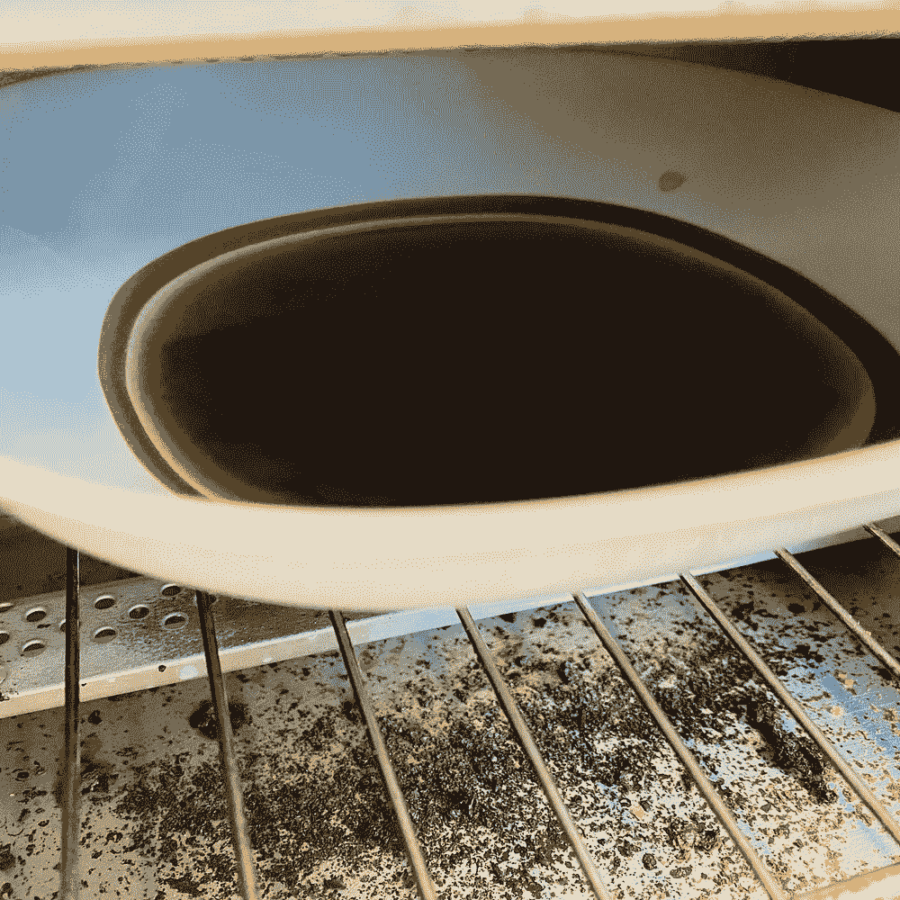
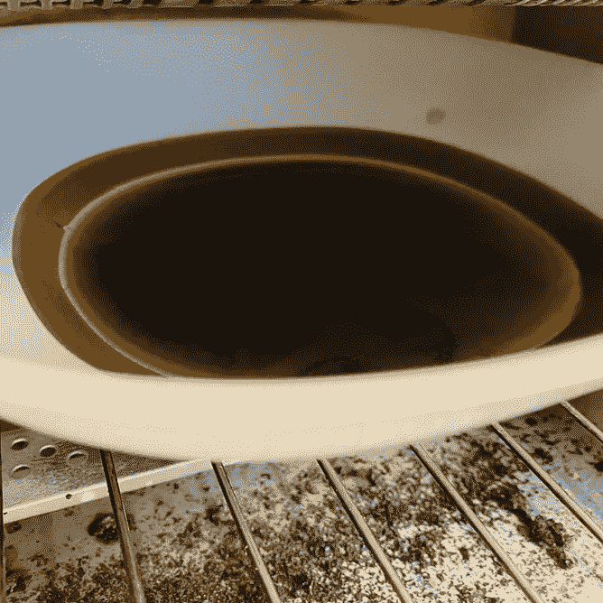
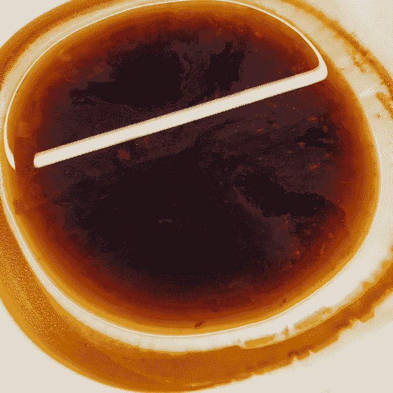
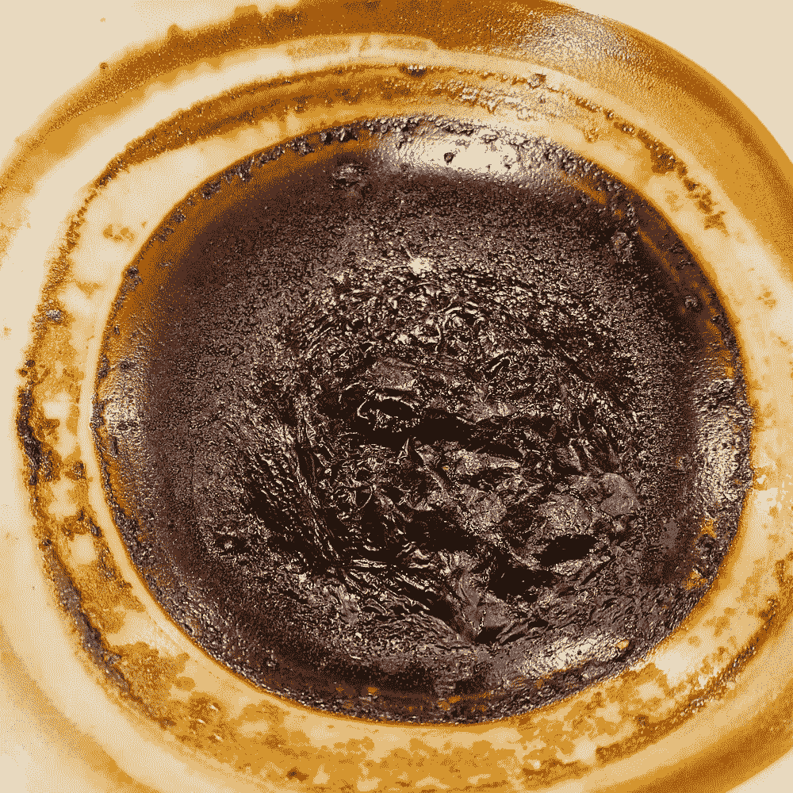
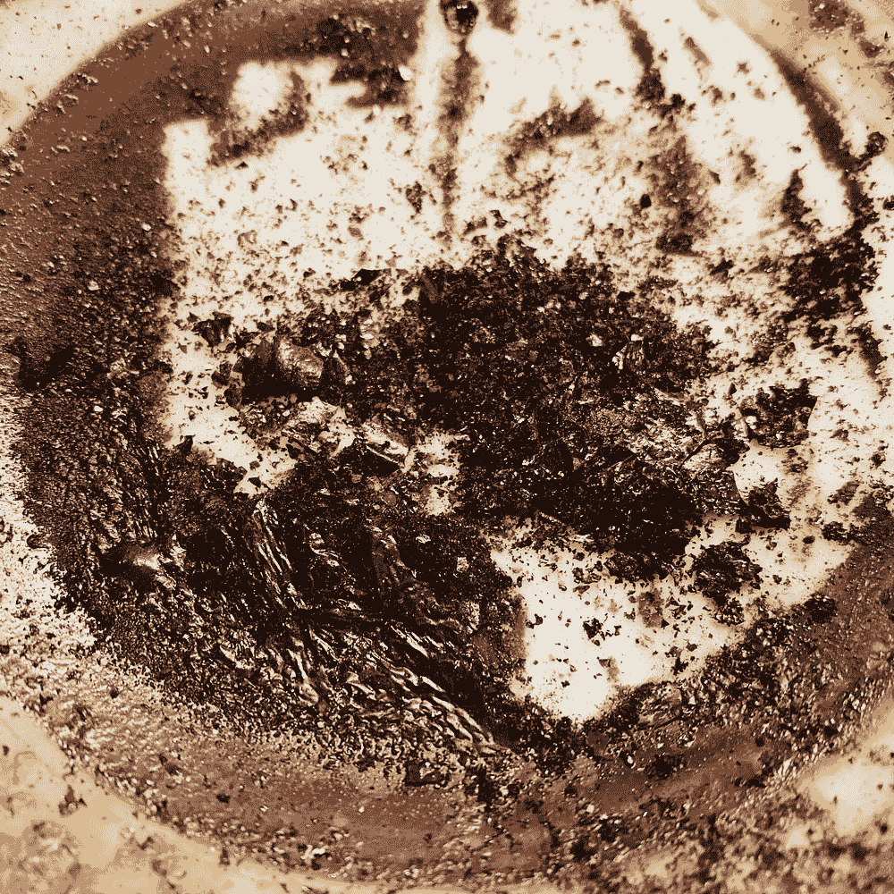
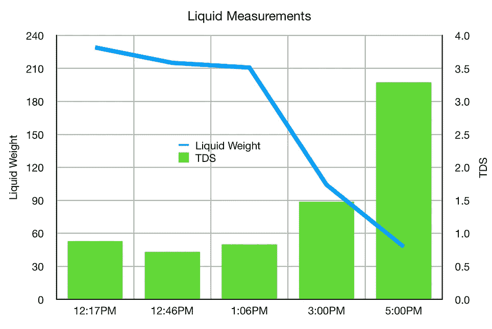
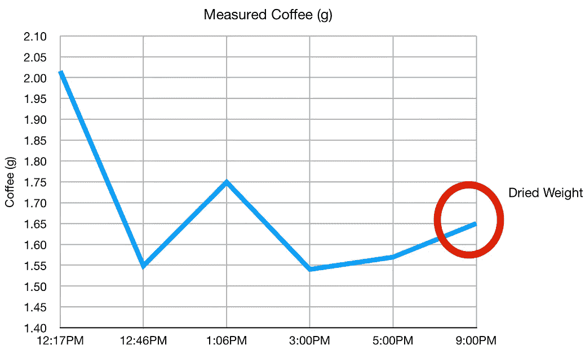
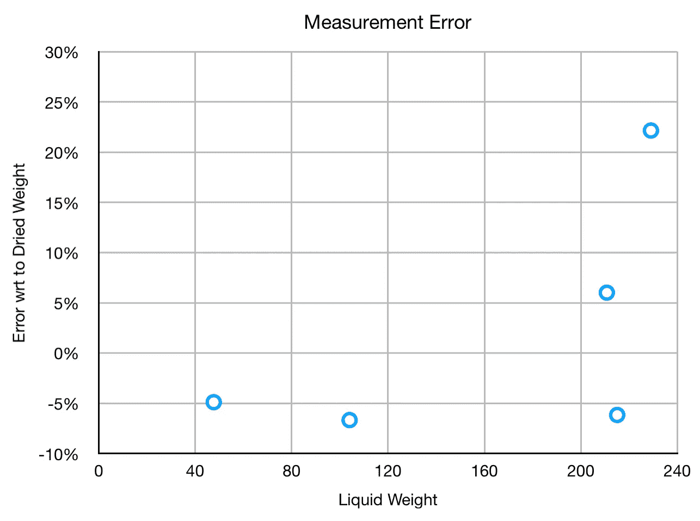

# 烘干一杯浓缩咖啡

> 原文：<https://medium.com/nerd-for-tech/drying-out-an-espresso-shot-8d5e26728d7d?source=collection_archive---------17----------------------->

## 咖啡数据科学

## 一个蹒跚学步的孩子开始的实验

前几天，我那蹒跚学步的孩子拿了一把椅子，开始摆弄我的超级自动浓缩咖啡机。等到机器没水了，一个杯子里还有两个超长镜头。我不想喝它，因为它被稀释了，所以我想为什么不蒸发一些水呢？

> 为什么不测量一下呢？

事实证明，使用烤面包机烘干一个镜头需要太多的时间。

一层缓慢的咖啡残渣开始形成，就像一个干涸的湖泊。

甚至在所有的水分蒸发之前，一层硬壳就已经开始形成了。

# 数据分析

我全程测量了总溶解固体(TDS ),我预计 TDS 会大幅增加，但事实并非如此。它需要一段时间才能完全增长。最后，我得到了固体的干重。与第一次测量相比，误差较大，但在随后的测量中，误差有所下降。

我画出了这些关于液体重量的误差，这是这个镜头中时间进程的倒退。

我怀疑加水会比试图蒸发水更好。

我已经在实验中走得太远了，以至于在失望开始的时候不能退出，但是看到 TDS 测量和实际的干固体之间的误差是很有趣的。我无法很好地解释为什么第一次测量如此之差。这可能是重量的测量误差，但我没想到要取一个以上的样品。

如果你愿意，可以在 Twitter 和 YouTube 上关注我，我会在那里发布不同机器上的浓缩咖啡视频和浓缩咖啡相关的东西。你也可以在 [LinkedIn](https://www.linkedin.com/in/robert-mckeon-aloe-01581595?source=post_page---------------------------) 上找到我。也可以在 [Medium](https://towardsdatascience.com/@rmckeon/follow) 或者 [Patreon](https://www.patreon.com/EspressoFun) 上关注我。

# [我的进一步阅读](https://rmckeon.medium.com/story-collection-splash-page-e15025710347):

[浓缩咖啡系列文章](https://rmckeon.medium.com/a-collection-of-espresso-articles-de8a3abf9917?postPublishedType=repub)

[工作和学校故事集](https://rmckeon.medium.com/a-collection-of-work-and-school-stories-6b7ca5a58318?source=your_stories_page-------------------------------------)

[个人故事和关注点](https://rmckeon.medium.com/personal-stories-and-concerns-51bd8b3e63e6?source=your_stories_page-------------------------------------)

[乐高故事首页](https://rmckeon.medium.com/lego-story-splash-page-b91ba4f56bc7?source=your_stories_page-------------------------------------)

[摄影飞溅页面](https://rmckeon.medium.com/photography-splash-page-fe93297abc06?source=your_stories_page-------------------------------------)

[使用图像处理测量咖啡研磨颗粒分布](https://link.medium.com/9Az9gAfWXdb)

[改进浓缩咖啡](https://rmckeon.medium.com/improving-espresso-splash-page-576c70e64d0d?source=your_stories_page-------------------------------------)

[断奏生活方式概述](https://rmckeon.medium.com/a-summary-of-the-staccato-lifestyle-dd1dc6d4b861?source=your_stories_page-------------------------------------)

[测量咖啡磨粒分布](https://rmckeon.medium.com/measuring-coffee-grind-distribution-d37a39ffc215?source=your_stories_page-------------------------------------)

[咖啡萃取](https://rmckeon.medium.com/coffee-extraction-splash-page-3e568df003ac?source=your_stories_page-------------------------------------)

[咖啡烘焙](https://rmckeon.medium.com/coffee-roasting-splash-page-780b0c3242ea?source=your_stories_page-------------------------------------)

[咖啡豆](https://rmckeon.medium.com/coffee-beans-splash-page-e52e1993274f?source=your_stories_page-------------------------------------)

[浓缩咖啡滤纸](https://rmckeon.medium.com/paper-filters-for-espresso-splash-page-f55fc553e98?source=your_stories_page-------------------------------------)

[浓缩咖啡篮及相关主题](https://rmckeon.medium.com/espresso-baskets-and-related-topics-splash-page-ff10f690a738?source=your_stories_page-------------------------------------)

[意式咖啡观点](https://rmckeon.medium.com/espresso-opinions-splash-page-5a89856d74da?source=your_stories_page-------------------------------------)

[透明 Portafilter 实验](https://rmckeon.medium.com/transparent-portafilter-experiments-splash-page-8fd3ae3a286d?source=your_stories_page-------------------------------------)

[杠杆机维修](https://rmckeon.medium.com/lever-machine-maintenance-splash-page-72c1e3102ff?source=your_stories_page-------------------------------------)

[咖啡评论和想法](https://rmckeon.medium.com/coffee-reviews-and-thoughts-splash-page-ca6840eb04f7?source=your_stories_page-------------------------------------)

[咖啡实验](https://rmckeon.medium.com/coffee-experiments-splash-page-671a77ba4d42?source=your_stories_page-------------------------------------)