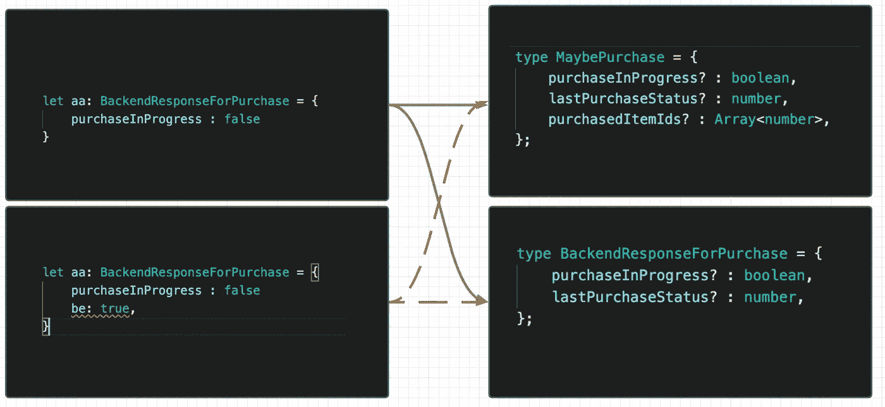
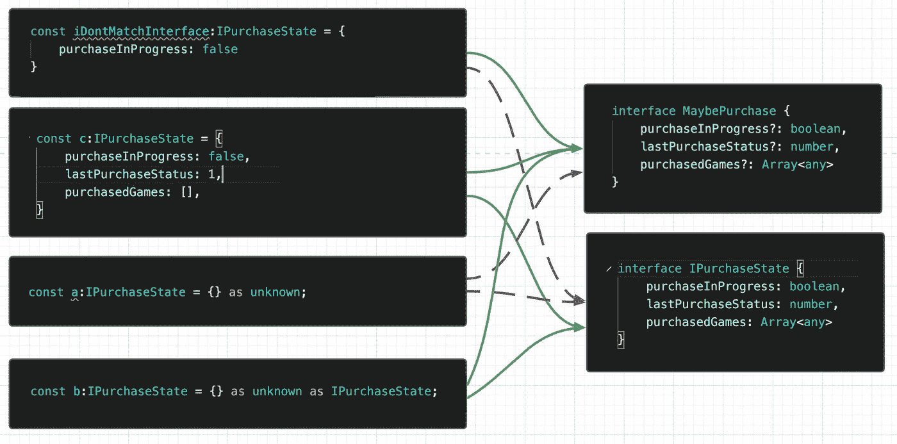

# 在单元测试的 Typescript 中使用“未知”进行鸭式键入

> 原文：<https://medium.com/nerd-for-tech/duck-typing-in-typescript-for-unit-testing-using-the-unknown-4cede781967?source=collection_archive---------12----------------------->

是不是长得像鸭子，叫声像鸭子？

Typescript 使用 duck 类型，因为底层 JavaScript 不支持类的面向对象，而是支持原型。从实际意义上来说，这意味着如果在 Typescript 中定义两个具有相同属性、函数签名的类，这些类将是可互换的。

编译器测试左边的实例是否可以被指定为右边的类型。

请记住，这些检查只是在编译时进行的，这在现实生活用例中仍然很酷，例如，您可以列出后端响应和您的内部状态，如果它们可以互换，您就不需要在转换它们时进行转换或包装。

然而，如果您仍然希望将带有“as”的对象强制转换为“any”和“unknown”类型，Typescript 提供了一些工具，后者是类型安全的，它可以是任何类型。

为什么你想逃离这个安全网？在某些情况下，不是所有的类型信息都可用，或者它的声明会花费不适当的精力。不同之处在于,' any '将接受一切，而 unknown 将不接受任何东西，因此后者您需要在运行时进行调查。因此，使用“未知”有助于为严格做准备。

更多的鸭子支票！

> *通过这种方式，你可以在不牺牲代码质量的情况下进行最少且有意义的单元测试，并且由于提到了真实类型，重构者仍然应该以一种相当舒适的方式学习。*

对于这些确切的例子，您也可以合理地使用[联合](https://www.typescriptlang.org/docs/handbook/unions-and-intersections.html)和[部分实用程序](https://www.typescriptlang.org/docs/handbook/utility-types.html)类型，但是这样我们表示输入将总是给定所有期望的字段。

‘未知’还有什么好处？如果您从文件或服务中获取动态数据，通常 id 是字符串或数字，您可以将其设置为 unknown，直到您确定其类型，从而避免隐藏的类型泄漏。在 [Typescript 发行说明](https://www.typescriptlang.org/docs/handbook/release-notes/typescript-3-0.html)中还有一些例子。

如果你觉得这个有用，请考虑订阅！我保证，我很快会写类似的话题！感谢所有的掌声:)

# typescript # TDD # unittesting # duck typing # til