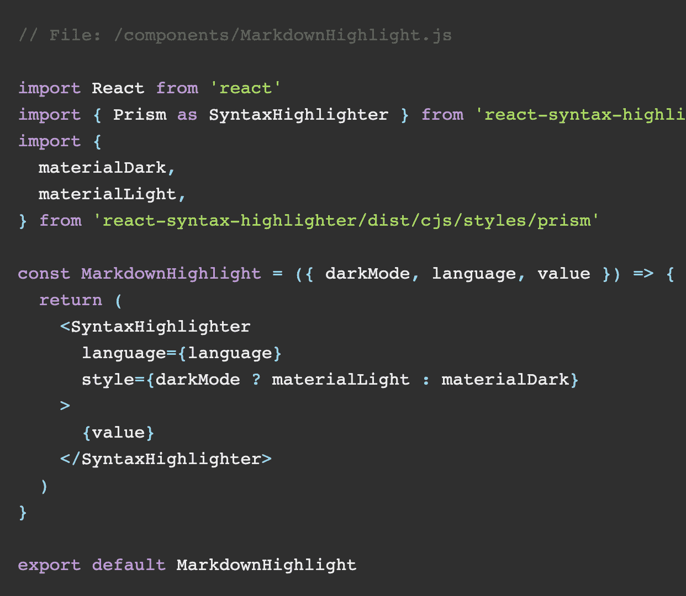

# Next.js/React 的动态降价博客使用灰色物质，反应-降价和反应-语法-高亮

> 原文：<https://medium.com/nerd-for-tech/dynamic-markdown-blogs-in-next-js-react-c0ed10d2d8a2?source=collection_archive---------1----------------------->

你正在寻找一个可持续的、可扩展的解决方案来创建动态博客，无论是为你的网站，还是其他人的网站，那么 react-markdown 就是它的解决方案。显然，这篇博客假设你正在和 Next.js/React.一起工作



首先，创建一个目录，比如“_snippets”，并在该目录中创建一个示例降价文件，比如**“使用 gray-matter、react-markdown 和 react-syntax-highlighter.md 在 Next.js 中动态降价博客”**。特定博客的路由段将从 markdown 文件名本身导出。

这是降价样本，供您复制:

```
---
title: 'Dynamic Markdown Blogs in Next.js/React using gray-matter, react-markdown and react-syntax-highlighter'
excerpt: 'Implementing markdown blogs in Next.js/React with remark-markdown in just 5 minutes. Thinking of using strings? Nah, they are too old, use markdown. Export statically to achieve great perfomance.'
date: '2021-01-06'
---

You are looking for a sustainable, scalable solution to create dynamic blogs whether it be for your website, or someone else's, then react-markdown is the solution for it. This blog assumes, obviously, you are working with Next.js/React.
```

完成内容🚀通过在您的终端上执行以下操作来继续操作:

```
npm i react-syntax-highlighter gray-matter react-markdown
```

安装完毕🚀，继续创建以下组件:

```
// File: /components/MarkdownHighlight.js

import React from 'react'
import { Prism as SyntaxHighlighter } from 'react-syntax-highlighter'
import {
  materialDark,
  materialLight,
} from 'react-syntax-highlighter/dist/cjs/styles/prism'

const MarkdownHighlight = ({ darkMode, language, value }) => {
  return (
    <SyntaxHighlighter
      language={language}
      style={darkMode ? materialLight : materialDark}
    >
      {value}
    </SyntaxHighlighter>
  )
}

export default MarkdownHighlight
```

这个组件将负责突出显示你的 markdown 代码块，无论是 html、css、js 还是 markdown。浏览**react-syntax-highlight er/dist/cjs/styles/prism**探索不同种类的滤镜，如{coy}、{dark}除了{materialDark}、{materialLight}。

下面的代码将处理来自 markdown 文件的博客数据的格式。增加了对每个功能的解释。

```
// File: /lib/markdown.js

import { join } from 'path'
import fs from 'fs'
import matter from 'gray-matter'

// Directory of snippets
const pagesDirectory = join(process.cwd(), '_snippets')

// Form slugs from the markdown names
export function getSlugsFromDirectory(dir) {
  return fs.readdirSync(dir)
}

/**
 * Gets the contents of a file
 * The gray-matter (metadata at the top of the file) will be
 * added to the item object, the content will be in
 * item.content and the file name (slug) will be in item.slug.
 */
export function getBySlug(dir, slug, fields = []) {
  const realSlug = slug.replace(/\.md$/, '')
  const fullPath = join(dir, `${realSlug}.md`)
  const fileContents = fs.readFileSync(fullPath, 'utf8')
  const { data, content } = matter(fileContents)
  const items = {}
  fields.forEach((field) => {
    if (field === 'slug') {
      items[field] = realSlug
    }
    if (field === 'content') {
      items[field] = content
    }
    if (data[field]) {
      items[field] = data[field]
    }
  })
  return items
}

// Returns contents of a page in the _snippets directory
export function getPageContentBySlug(slug, fields = []) {
  return getBySlug(pagesDirectory, slug, fields)
}

// Returns pages in the _snippets directory
export function getAllSnippets(fields = []) {
  const slugs = getSlugsFromDirectory(pagesDirectory)
  const pages = slugs.map((slug) => getPageContentBySlug(slug, fields))
  return pages
}
```

完成创建帮助功能🚀，让我们继续创建动态博客页面:

```
// File: /pages/snippet/[slug].js

import { useRouter } from 'next/router'
import ReactMarkdown from 'react-markdown'
import MarkdownHighlight from '@/components/MarkdownHighlight'
import { getAllSnippets, getPageContentBySlug } from '@/lib/markdown'

const Snippet = ({ page, darkMode }) => {
  const router = new useRouter()
  return router.isFallback ? (
    <div>Loading...</div>
  ) : (
    <div className="container">
      <h1>{page.title}</h1>
      <div className={styles['mt-3']}>
        <div className={darkMode ? 'text-white' : 'text-dark'}>
          <ReactMarkdown
            source={page.content}
            renderers={{
              code: ({ language, value }) => {
                /* Automatically takes in the language & value from the markdown file when: ```<html/css/js>
                  Content here
                  ``` in the markdown file*/
                return (
                  <MarkdownHighlight
                    language={language}
                    value={value}
                    darkMode={darkMode}
                  />
                )
              },
            }}
          />
        </div>
      </div>
    </div>
  )
}

export default Snippet

export async function getStaticProps({ params }) {
  const { slug } = params
  const page = getPageContentBySlug(slug, [
    'title',
    'image',
    'slug',
    'content',
    'date',
  ])
  return {
    props: {
      page: {
        ...page,
        markdown: page.content,
      },
    },
  }
}

export async function getStaticPaths() {
  const posts = getAllSnippets(['slug'])
  const paths = posts.map(({ slug }) => ({
    params: {
      slug,
    },
  }))
  return {
    paths,
    fallback: 'blocking'
  }
}
```

**一切就绪！希望你喜欢:)**