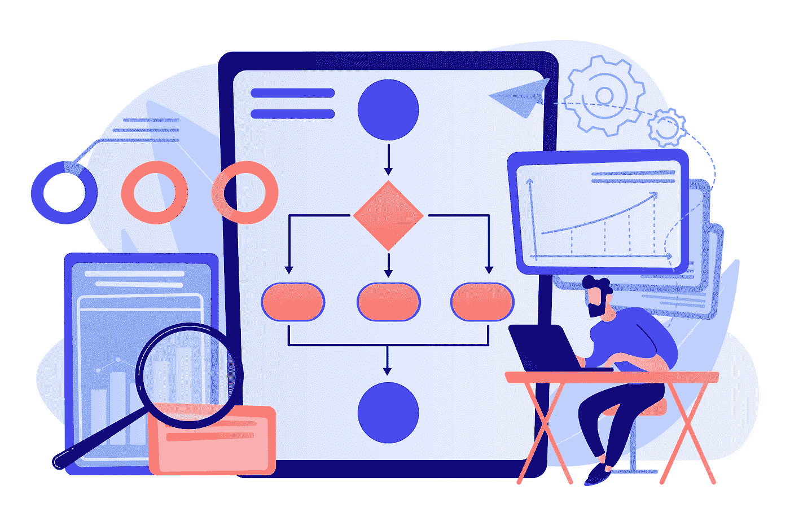
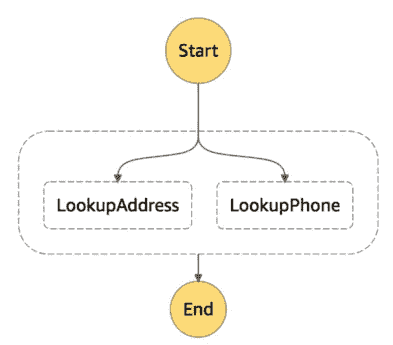
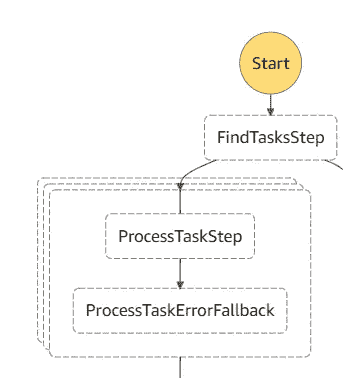
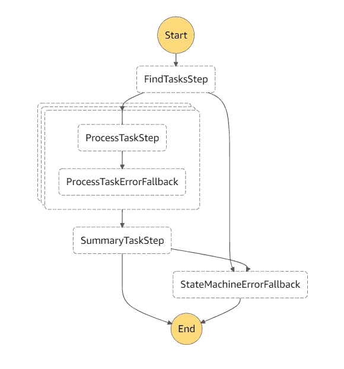
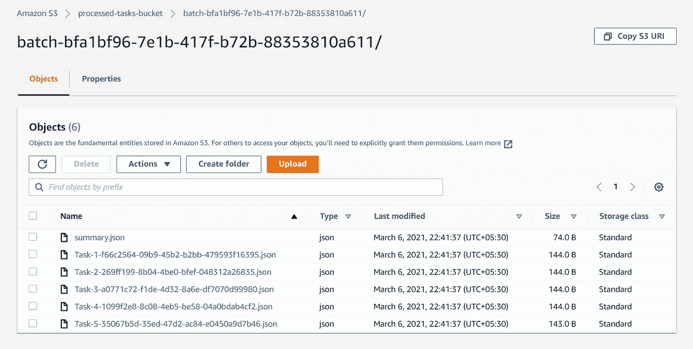

# AWS 阶跃函数中的动态并行性

> 原文：<https://medium.com/nerd-for-tech/dynamic-parallelism-in-aws-step-functions-530f434dd933?source=collection_archive---------2----------------------->

## 使用[无服务器](https://www.serverless.com/)框架的示例



[vector juice 创建的业务向量](https://www.freepik.com/vectors/business)——[www.freepik.com](http://www.freepik.com)

[“步骤功能”](https://aws.amazon.com/step-functions/)是 AWS 提供的无服务器编排服务。它可用于定义和管理工作流。AWS 步骤功能可用于各种其他 AWS 服务，如 AWS Lambda、AWS Batch 和 AWS ECS。步骤功能支持顺序、并行和混合工作流。在本文中，我将介绍阶跃函数中的*【动态并行】*。

在动态并行特性出现之前，AWS Step 函数只有类似“静态并行工作流”的功能，开发人员必须为每个并行分支指定定义。这种静态并行函数在阶跃函数工作流定义中定义为`"Type":"Parallel"`。在阶跃函数定义中，这些定义的分支如下所示。



来源:[https://docs . AWS . Amazon . com/step-functions/latest/DG/Amazon-States-language-parallel-state . html](https://docs.aws.amazon.com/step-functions/latest/dg/amazon-states-language-parallel-state.html)

使用动态并行，您可以开发类似于并行循环的东西。每个并行迭代将完成相同的任务，但根据输入集的不同而略有不同。这样的迭代器在阶跃函数定义中定义为`"Type":"Map"`。这个实现看起来像这样。



“ProcessTaskStep”将在每次迭代中并行执行。

在本文中，我使用 Lambda 函数和阶跃函数定义来演示这个特性。我们的状态机的最终工作流将如下所示。



在这个工作流中，`FindTasksStep`生成一个任务列表。之后，对列表中的每个元素并行执行迭代。在每次迭代中，相应的元素在`ProcessTasksStep`中被处理并保存到 S3 桶中。完成所有迭代后，结果值被收集在`SummaryTasksStep`中，一个汇总文件也被写入同一个 S3 桶。

无服务器. yml 模板

> 这是用于此工作流的无服务器框架的模板。**注意**您可以重用`definition`属性下的所有内容(即从第 43 行到第 83 行)以及 AWS CloudFormation 模板。

定义中最重要的部分是`ProcessTasksMappedTask`。步骤的类型是`Map`,这意味着它是一个映射任务。应该定义`InputPath`和`ItemsPath`来告诉 Map 任务在哪里寻找并行迭代的输入列表。为此，在前面的步骤中，`FindTasksStep`应该返回一个兼容的数据对象。在该步骤的 lambda 处理程序中，我在 Lambda 回调中返回了这样一个数据对象。

使用这个返回的对象，可以在`event-> body-> taskList`路径中找到任务列表。这是在中定义的路径

```
InputPath: "$.body"            
ItemsPath: "$.taskList"
```

阶跃函数定义中的一部分。

列表中每个对象的数据都可以通过`ProcessTaskStep`的 Lambda 处理程序中的`event`参数来访问。处理完每个对象后，可以在`event->results`对象中访问结果列表。这在中有详细说明

```
ResultPath: "$.results"
```

在`ProcessMappedTask`定义中。

然后这个结果列表在`SummaryTaskStep`的 Lambda 处理程序中作为`event.results`被访问。

> 注意，在部署这段代码之前，您需要有一个专用的 S3 存储桶来存储这个步骤函数的结果。

部署后，我们可以开始执行并观察结果。成功执行后，将在指定的 S3 存储桶中以下列方式创建文件。



状态机执行一次后创建的文件

你也可以定义`MaxConcurrency`属性来定义最大并行执行限制。

完整的源代码可从[https://github . com/budvinchathura/server less-AWS-dynamic-parallelism](https://github.com/budvinchathura/serverless-aws-dynamic-parallelism)获得。

在这个例子中，我只使用了带有阶跃函数的 AWS Lambda 函数。您还可以使用 AWS Batch 和 AWS ECS 来创建更复杂的混合工作流。你可以在[https://www . server less . com/blog/deploy-hybrid-server less-cluster-workflows](https://www.serverless.com/blog/deploy-hybrid-serverless-cluster-workflows)中找到这样的教程。

有关动态并行特性的更多解释，请访问 AWS 的这篇博客文章。