# 动态平台| Unity

> 原文：<https://medium.com/nerd-for-tech/dynamic-platforms-unity-28cfe83af90?source=collection_archive---------11----------------------->

## 统一指南

## 关于如何使用 Unity 循环移动平台的快速指南

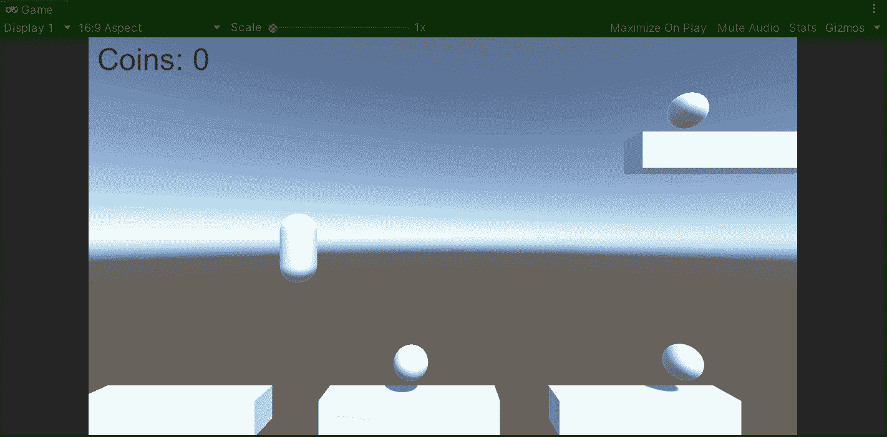

**目标**:实现一种统一循环平台运动的方式。

在上一篇文章中，我介绍了[如何在 Unity 中创建收藏](/nerd-for-tech/creating-collectables-unity-ccb59ea0c191)。现在，是时候为我们的平台游戏引入移动平台了。

# 实施运动

首先，让我们来看看当前的场景和原始的游戏对象。胶囊是播放器，球体是收藏品，修改过的立方体是平台:

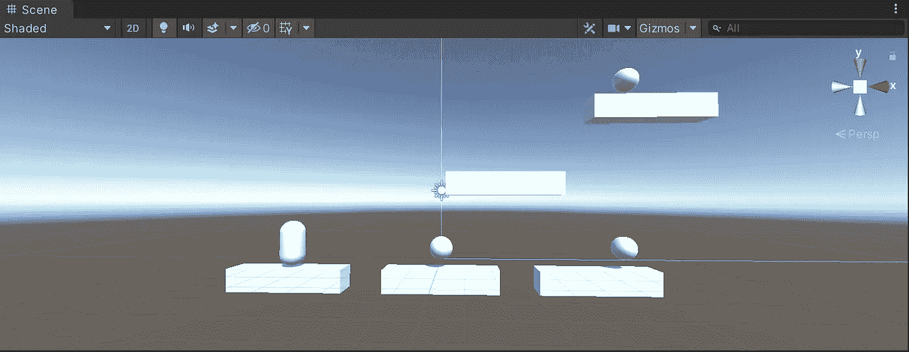

为了实施平台运动，让我们:

*   创建一个新的脚本来处理移动。
*   选择要移动的平台。
*   通过检查器附加相应的脚本。

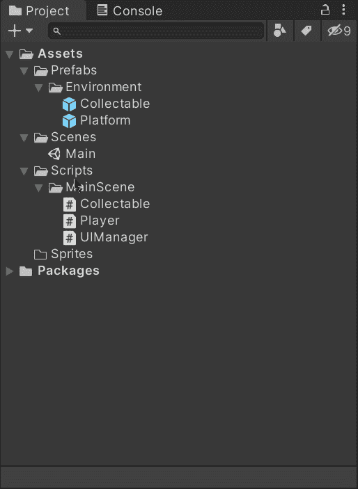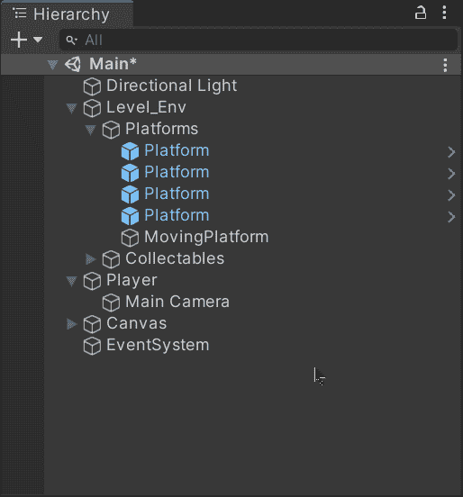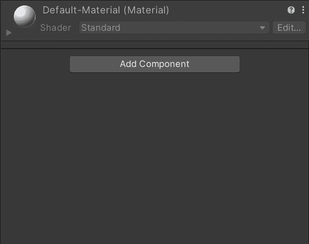

附加脚本后，让我们打开它并创建下一个变量:

*   航点

这个列表将存储来自空游戏对象的转换组件，这些组件将决定在整个平台的路径中要遵循的路点。

*   目标

此变量将存储列表中所遵循的航路点的当前索引。

*   速度

这个变量将决定平台跟随航路点时的速度。

> 注意:不要忘记使用**【序列化字段】**来通过检查器修改值。

然后，在 **Start** 方法中，让我们检查路点列表**的大小是否至少为 2** ，好像这是该实现工作的一个重要条件:

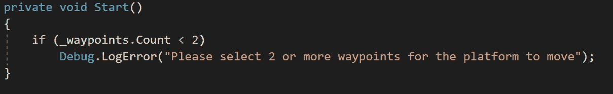

现在，当玩家在动态平台上时，为了处理移动并避免物理问题，让我们使用 **FixedUpdate** 方法。首先，让我们检查平台的位置是否等于航路点的位置，如果是这样，让我们增加目标值以指向列表中的下一个目标:

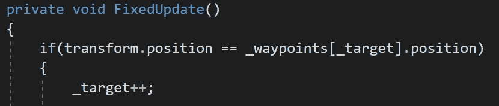

如果您想了解更多关于 **FixedUpdate** 方法的信息，您可以访问 Unity 文档:

 [## 单一行为。固定更新()

### 建议更改感谢您帮助我们提高 Unity 文档的质量。虽然我们不能接受所有的…

docs.unity3d.com](https://docs.unity3d.com/ScriptReference/MonoBehaviour.FixedUpdate.html) 

然后，为了避免出现索引越界异常，让我们检查当前目标值是否指向一个不存在的索引。如果是这种情况，让我们使用航路点列表中的 **Reverse** 方法，指向第二个目标开始后退:

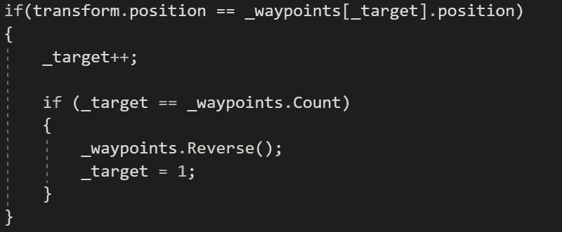

现在，如果平台没有到达航路点，让我们使用**矢量 3。使用定义的速度乘以**时间保持移动平台的方法。****

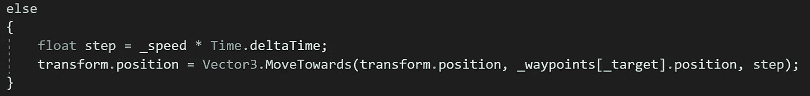

# 创建路径点

现在，为了让平台移动，让我们通过使用空游戏对象来表示它们来创建各自的路点:

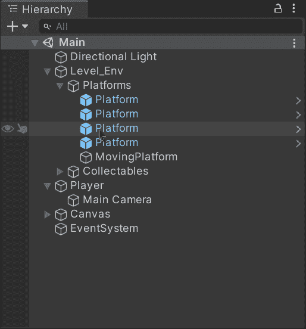

例如，如果我们创建 2 个路点(点 *a* 和点 *b* ，让我们将第二个移动到路径中的下一个位置，并将第一个留在起始位置:

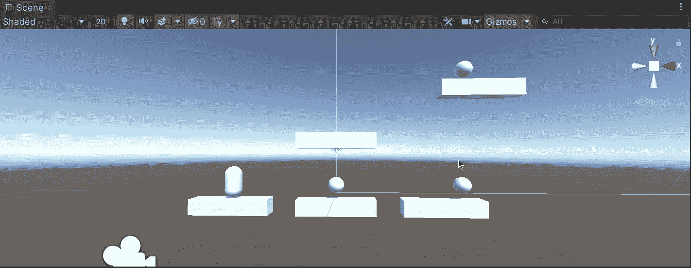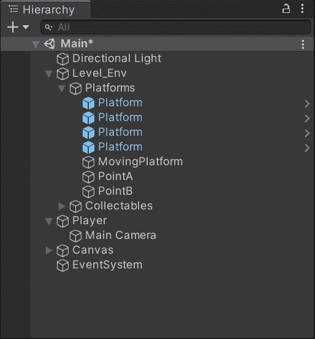

然后，让我们通过检查器将各自的游戏对象依次拖动到脚本列表中。另外，不要忘记选择平台的速度:

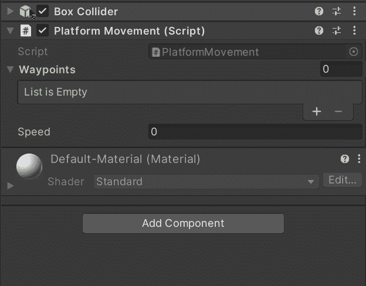

如果我们用 Unity 运行游戏，我们将能够看到平台按照预期从一个航点移动到另一个航点:

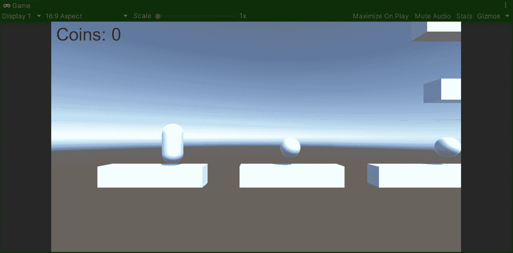

最后，为了避免层次上的混乱，让我们将各自的平台和航路点拖到一个空的游戏对象中来创建一个动态平台的预置:

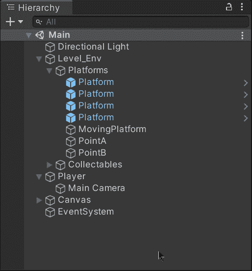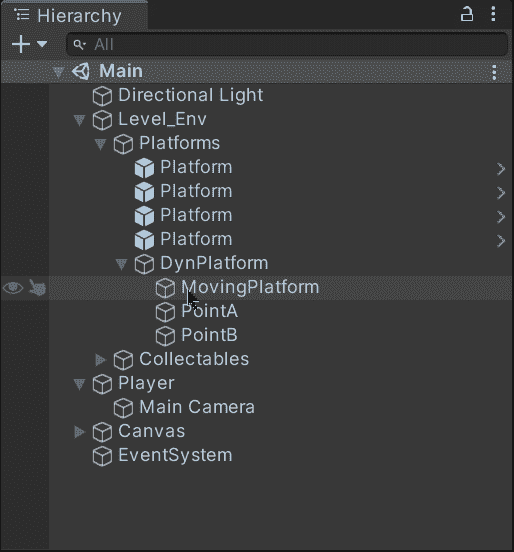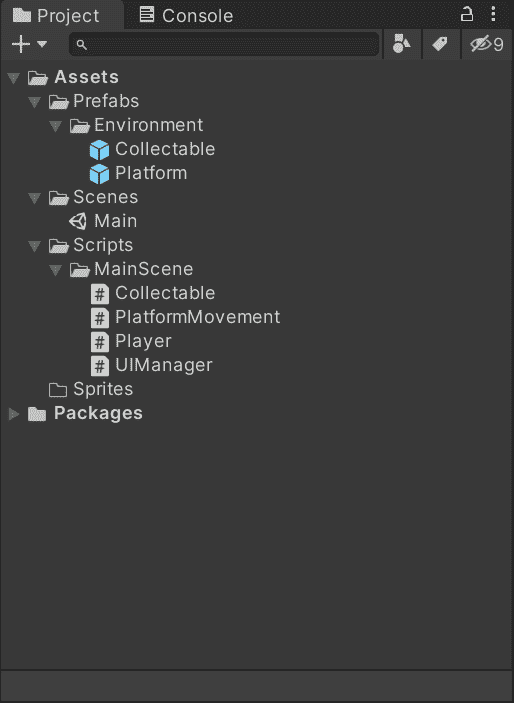

这样，我们还可以通过在列表中添加我们需要的任意多的路点，按照我们想要的路径移动平台:

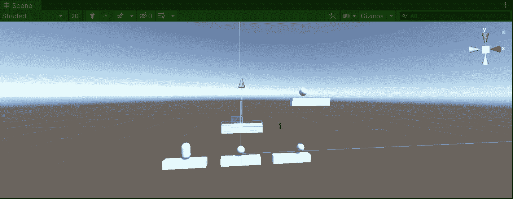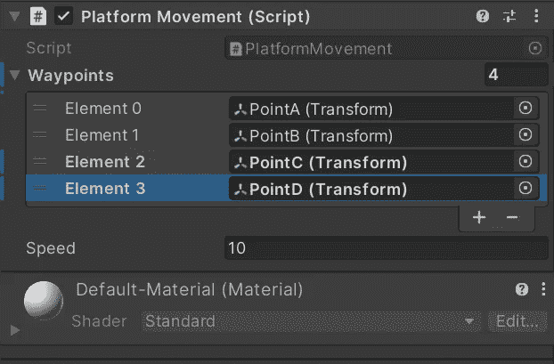

就这样，我们用 Unity 循环了平台的运动！:d .我会在下一篇文章中看到你，在那里我将展示如何引入一个生命系统，并用 Unity 为我们的平台游戏复活玩家。

> *如果你想了解我更多，欢迎登陆*[***LinkedIn***](https://www.linkedin.com/in/fas444/)**或访问我的* [***网站***](http://fernandoalcasan.com/) *:D**