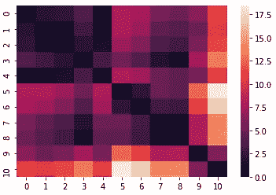
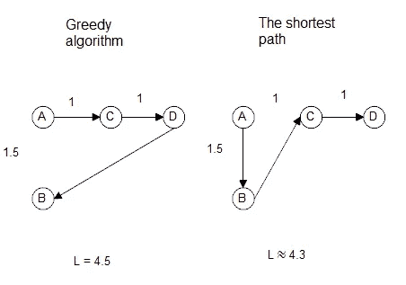
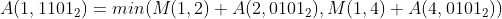
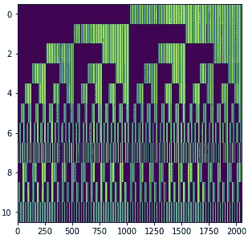
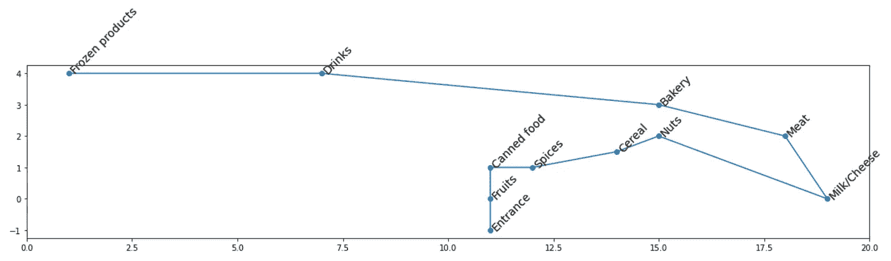
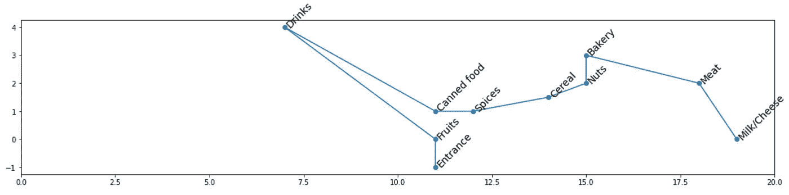

# 用购物清单优化案例解释动态规划。

> 原文：<https://medium.com/nerd-for-tech/dynamic-programming-explained-by-shopping-list-optimization-case-1e5ae31c911f?source=collection_archive---------12----------------------->

长话短说:我决定以这样一种方式自动排序我的购物清单，这有助于我沿着最短的路径穿过商店，按照清单上显示的顺序收集食品。

令人惊讶的是，这个项目帮助我真正理解了动态编程的原理。在这篇文章中，我想告诉你我的经历，我希望它能帮助人们更好地理解它。

所以，这里有一个想法:首先，让我们根据它们的类型(肉，牛奶，饮料，等等)将列表中的所有杂货分组，然后记住要访问的部门，就可以计算出穿过商店的最佳路径，并相应地对列表进行排序。

我使用电报机器人作为接口。在本文中，我将描述它的后端部分。

## 计算最佳路线

让我们创建一个表示商店各部分之间距离的邻接矩阵 M。所以 M(i，j)表示从部门 I 到 j 的距离。如果列表中没有与某个部分相对应的项目，它将从矩阵中删除，因此矩阵中只包含我要访问的部门。



邻接矩阵。主对角线上的正方形完全是黑色的，这意味着各部门到它们自己的距离为零。

首先想到的计算路线的方法是所谓的“贪婪算法”，即总是去最近的点。不幸的是，贪婪算法通常不会返回最佳路径。例如，下图说明了这种算法失败的情况。



要访问从 A 开始的所有点，首先需要访问 B 点，它不是最近的。

所以，动态编程就是答案。动态编程通过将最初的任务分解成更小的任务，使得解决某些任务比暴力更容易。较小任务的解被存储在存储器中，并用于构建越来越复杂任务的解，直到得到初始任务的解。

在这种情况下，较小的任务是通过给定的点的子集找到在某个点结束的最短路径。存储中间结果的最简单方法是将它们写入矩阵 A(i，j ),并使“I”表示中间路线的终点，而“j”将以某种方式对给定路线经过的点的子集进行编码。

下面是我使用的编码点子集的方法:让我们创建一个大小等于点总数的位掩码。现在，位掩码中的 1 表示对应点在子集中，0 表示不在子集中。例如，01011 描述了由 5 个点组成的集合的第 2、第 4 和第 5 个点的子集。这个二进制数可以转换成十进制数，用作矩阵索引。

让我用下面的例子来阐明这个观点。比如说 A(51105)= 10。1105 是二进制的 10001010001，这意味着该路由访问点 1、5、7 和 11，对应于位掩码中的 1。5 是该行的编号，表示路线在点№5 处结束。综上所述，通过点 1、5、7 和 11 并在点№5 结束的路线长度为 10。

这是算法。首先，只包含一个二进制 1 的列被填充—这些是只通过一个点的路线。然后是包含两个 1、三个 1 的列，依此类推。这些列按其位掩码中 1 的数量递增的顺序填充，因为后面的列中的值是基于前面填充的列中的值。

例如，让我们假设在它们的位掩码中包含 1 和 2 的所有列都已经被填充，这允许我们计算第 15 列的第 1 行的值，因为二进制中的 15 是 1101，包含 3 个 1。1101 表示通过点 1、2 和 4 的路线，行 5 表示所述路线在点№5 结束。



这条路线是两个值 M(1，2) + A(2，5)和 M(1，4) + A(4，5)的最小值。我们考虑第 5 列，因为它的位掩码是 0101，这对应于通过除最后一列之外我们需要的所有点的路线。像这样，所有的细胞都被填满了。对应于不可能状态的单元格用无穷大的值填充。



解矩阵。一半的单元代表不可能的状态。

最终，我们对最后一列感兴趣，因为它对应于通过所有点的路线。现在，我们只需找到最后一行中的最小值，并使用矩阵中的值构建路线。

最后一件事，合理的做法是在购物清单的“冷冻产品”部分结束，这样你拿的产品就不会融化。



包含冷冻产品部分的路线



除了冷冻产品，通过相同部分的路线是完全不同的

有趣的是路线是如何根据是否包含“冷冻产品”部分而完全改变的。

## 将杂货分类

例如，我将使用以下列表:

```
- Cheese
- Bananas
- Hazelnuts
- Stakes
- Bread
- Tuna
- Eggs
- Beer
- Cereal
- Apples
- Pepper
- Ketchup
- Soda
- Icecream
```

让我们从绘制部门地图开始。我去了最近的杂货店，做了这样的表:

描述商店的表片段

第一列包含部门的名称，第二列和第三列包含部门的坐标，它们将用于创建邻接矩阵。

第四列包含锚点。主播就是在相应部门可以买到什么的例子。起初，我想在“锚”栏中包含我在相应部门购买的所有商品。这将使将杂货与部门匹配变得容易得多，只需查找与列表中的项目匹配的某个锚点就足够了。不幸的是，所述方法有几个缺点。首先，每次列表中出现一个新条目时，都需要将它添加到锚中。第二，每样东西都可以用不同的方式提及，比如茄子可以被称为 aubergine。我决定使用单词嵌入，而不是将所有的可能性都填入“锚”列。

单词嵌入是一个非常有用的工具，它允许用向量代替字符串。向量代表单词的意思，例如，要了解两个单词的意思有多接近，可以简单地计算代表它们的向量之间的距离。“啤酒”和“饮料”向量之间的距离远小于“啤酒”和“面包店”向量之间的距离，这意味着啤酒更有可能在“饮料”部分中找到。

我使用俄罗斯 Navec 嵌入，因为我用俄语编写我的购物清单，但也有许多可用的英语嵌入。

现在算法看起来是这样的:对于列表中的每个条目，我们需要测量到第四列中每个锚点的距离。该项目属于具有最接近锚的类别。所述方法解决了以前从未发生过的物品的问题以及同一产品的不同名称的问题，因为“茄子”和“茄子”的单词嵌入几乎相同。

所以，现在列表看起来像这样:

```
{
'bakery': ['Bread'],
'breakfast': ['Cereal'],
'milk/cheese/eggs': ['Cheese', 'Eggs'],
'meat': ['Stakes'],
'Beverages': ['Beer', 'Soda'],
'Fruits':['Apples','Bananas'],
'Nuts':['Hazelnuts'],
'Canned food':['Tuna'],
'Spices':['Pepper', 'Ketchup'],
'Frozen products':['Icecream'],}
```

我想指出的是，榛子最终被归入了“坚果”一类，尽管榛子并不属于这一类。

我们就快到了，现在剩下的是根据最佳路线对各组进行排序。

```
- Apples
- Bananas- Tuna- Pepper 
- Ketchup- Cereal- Hazelnuts- Cheese 
- Eggs- Stakes- Bread- Beer 
- Soda- Icecream
```

所以，结果就是这样。对于那些感兴趣的人，这里有一个到 GitHub 的链接。