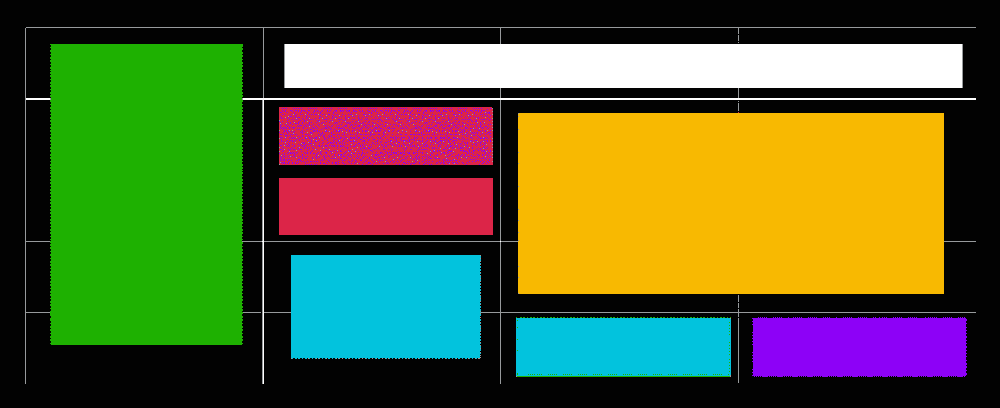
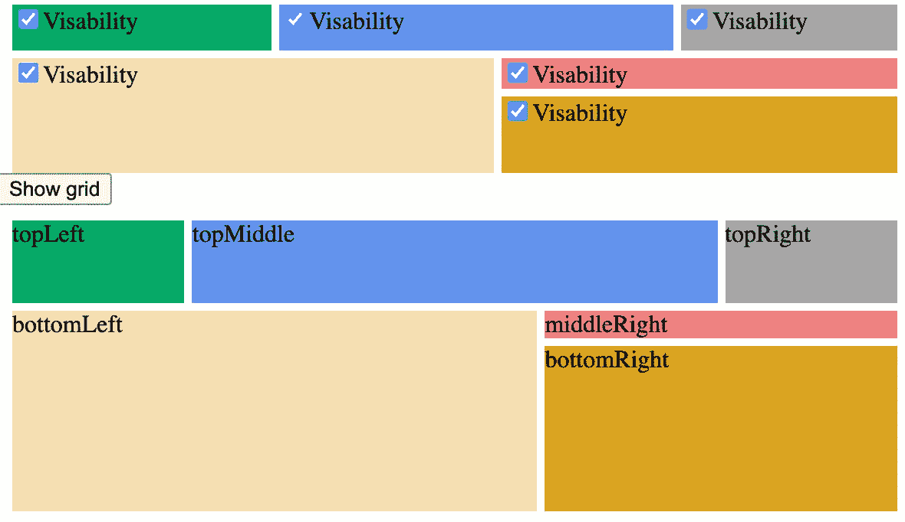
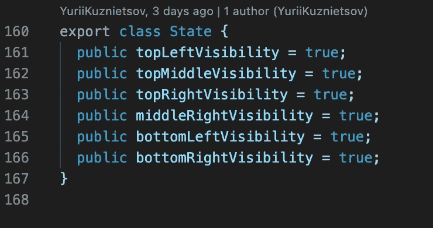
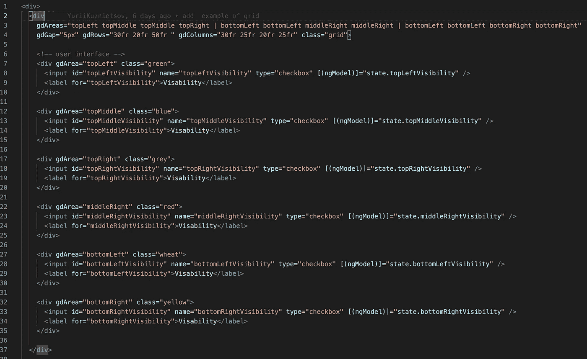
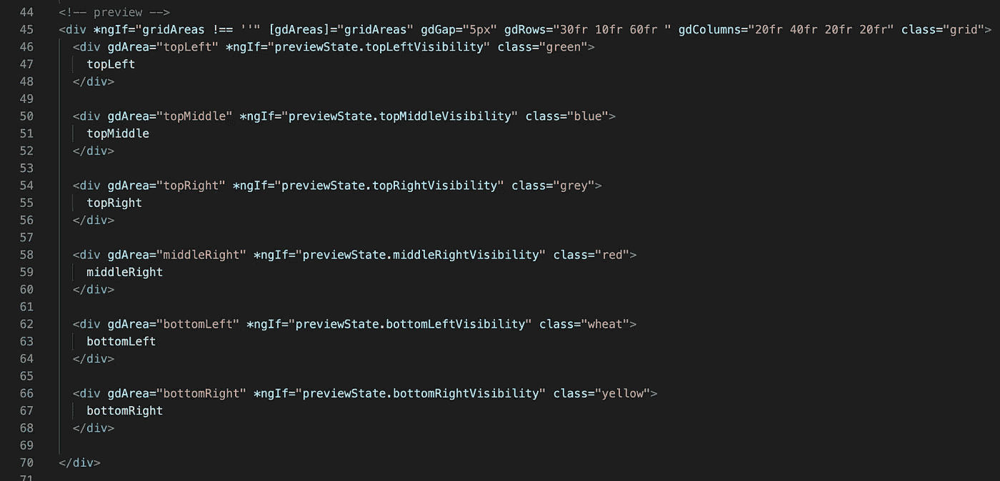
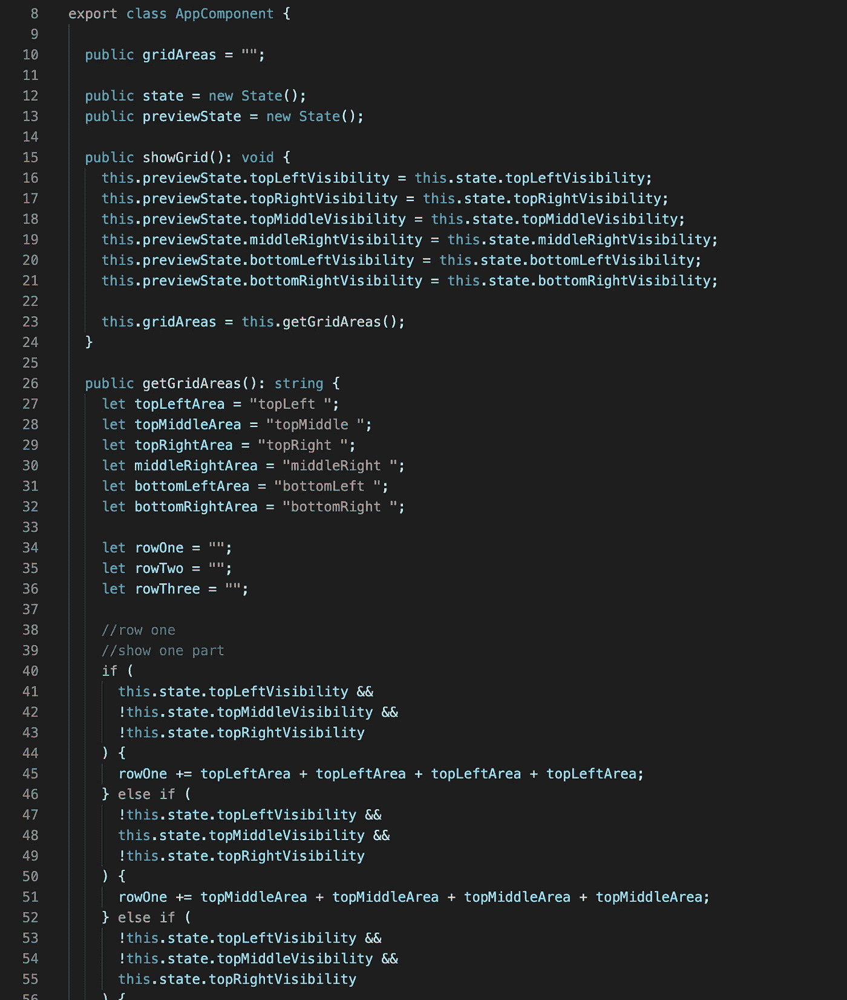
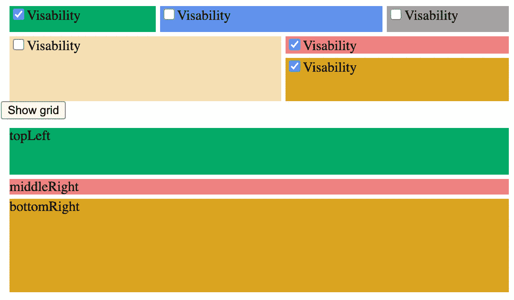
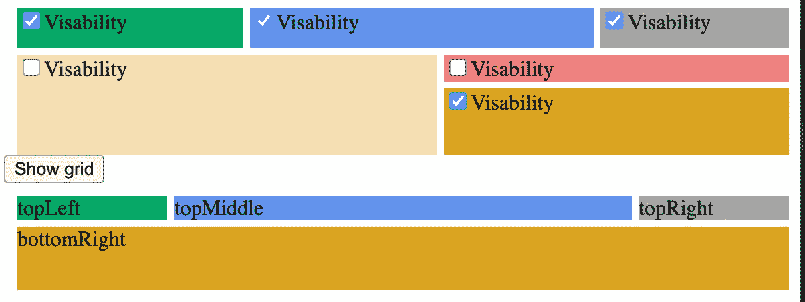

# 使用 FlexLayout 的动态 CSS 网格布局

> 原文：<https://medium.com/nerd-for-tech/dynamical-css-grid-layout-with-flexlayout-af97bcbd2a17?source=collection_archive---------14----------------------->

## 角度示例

css 网格布局是一种通过使用 CSS 样式在网格中放置 html 代码的方法。基本上，我们创建一个网格并用我们的内容填充它。

今天我们将使用:

grid-areas——是我们网格的一个模式。
grid-rows —行的大小，
grid-columns —列的大小，
grid-gap —单元格之间的距离。

为了制作一个动态的 css 网格，我们需要使用 FlexLayout。我们需要在主模块中安装并导入它。

NPM I-s @ angular/flex-layout @ angular/CDK

从“@angular/flex-layout”导入{ FlexLayoutModule }；

在本例中，我们将有三个网格行、四个网格列和六个网格区域。

我们的 UI 尽可能简单。

我们将有两个网格，第一个用于设置可见性设置。第二个代表我们的可见性选择。行和列的大小和数量是相同的。我们将只更改一个参数—网格面积。

一切都将从一个模型开始。在我们的模型中，我们存储可见性状态。

在 HTML 中，我们有带复选框的 div。当然，我们使用 FlexLayout 中的设置，如 gdAreas、gdGap、gdColumns、gdRows。GdAreas 定义了我们的网格，我们可以随意混合这个参数。在这个参数中，我们将区域名称按正确的顺序排列

第 1 列第 2 列第 3 列第 4 列
顶部左侧顶部中间顶部中间顶部右侧| //第 1 行
底部左侧底部左侧中间右侧| //第 2 行
底部左侧底部左侧底部右侧底部右侧е //第 3 行

在 ts 文件中，我们将 visibility 属性设置为底部网格，并设置 gdAreas。方法 getGridAreas 比较所有的可见性并给出一个网格字符串。这个方法非常庞大。它对每种情况都有逻辑。

因此，我们有一个动态的网格。

如果你需要仔细看看这个项目[，这里有链接。](https://github.com/8Tesla8/dynamical-css-grid-FlexLayout)

*原载于 2021 年 6 月 6 日 http://tomorrowmeannever.wordpress.com**的* [*。*](https://tomorrowmeannever.wordpress.com/2021/06/06/dynamical-css-grid-layout-with-flexlayout/)