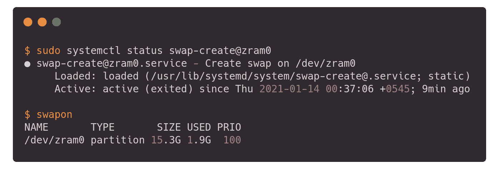
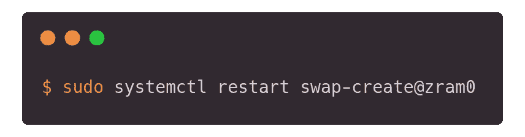

# 在 Linux 中动态增加交换(ZRAM)大小

> 原文：<https://medium.com/nerd-for-tech/dynamically-adjust-swap-zram-size-in-fedora-linux-78cd712808f2?source=collection_archive---------2----------------------->

内存不足？没问题！

资料来源:GIPHY & Creazilla

# 介绍

SWAP 内存有用，但是慢了就没人喜欢了。在 Linux 中，当物理内存(RAM)已满时，就会使用交换。如果系统需要更多的内存资源并且 RAM 已满，内存中的非活动页面将被移动到交换空间。

Fedora 多年来一直默认使用 [swap-on-zram](https://en.wikipedia.org/wiki/Zram) ，并且默认安装在 Fedora Workstation 上。ZRAM 在 RAM 中创建一个数据块设备，将原本要写入交换区(磁盘/ssd)的页面首先压缩，然后存储。这允许更快的交换 I/O，并且数据压缩提供了大量的内存节省。

zram 设备(通常为`/dev/zram0`)在早期引导期间创建时由 zram 生成器根据其配置文件设置大小。使用的内存不是预先分配的。它可以按需动态分配和释放。由于压缩，一个完整的`/dev/zram0`使用的内存是其大小的一半。

系统将正常使用 RAM，直到它满了，然后开始分页到 swap-on-zram，与传统的 swap-on-drive 相同。

# 按需动态增加交换区大小

如果您使用 Fedora Linux，您应该已经安装并运行了 zram0。您可以运行以下命令进行验证:

现在，编辑位于`/usr/lib/systemd/zram-generator.conf`的 zram-generator 配置文件

并根据需要增加交换区的大小，例如:将其增加到 RAM 大小的 1 倍。

最后，重新启动服务以使新配置生效。

通过运行以下命令，验证交换大小是否已增加:

# 参考

*   [https://fedoraproject.org/wiki/Changes/SwapOnZRAM](https://fedoraproject.org/wiki/Changes/SwapOnZRAM)