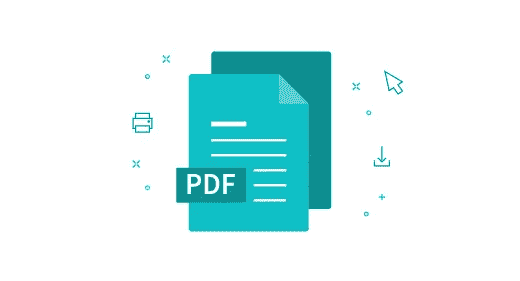

# 使用 jspdf 和 pdf-lib 在 Angular 或 NodeJS 中动态创建和合并 pdf

> 原文：<https://medium.com/nerd-for-tech/dynamically-create-and-merge-pdfs-in-angular-using-jspdf-and-pdf-lib-aa82ae35f1e3?source=collection_archive---------1----------------------->

图片来源—[https://smallpdf.com/pdf-reader](https://smallpdf.com/pdf-reader)

最近，我试图从我的 angular 应用程序创建一个 pdf，基于用户输入的的**一些数据。我遇到了 jspdf，它可以**在按钮点击或其他用户事件上创建动态 pdf**。我开始写代码，然后我想在旅途中将一些现有的 pdf 文件合并到我新创建的 pdf 文件中。在这里，我意识到 jspdf 不允许我们这样做，pdf-lib 允许，但是我已经习惯了 jspdf 和它从顶部到底部添加内容的方式，这与 pdf-lib(从底部到顶部)的情况不同。**

我按照下面的步骤分别使用两个文件 **jspdf & pdf-lib** 到**创建和合并**pdf。

> 相同的实现在 Angular 前端应用程序或 NodeJS 服务器中运行良好。

# jspdf

这里有一些使用 jspdf 的技巧，你可以在[https://mrrio.github.io/jsPDF/](https://mrrio.github.io/jsPDF/)找到基本的例子

*   **使用 **npm 安装 jspdf** 在 angular 应用程序中安装 jspdf** ，然后使用**从‘jspdf’导入 js pdf 将其导入到组件文件中；**
*   创建一个新的 **jspdf 文档**来处理**(使其全局化，但在函数中初始化，以便在每次按钮点击/事件时生成一个新的 pdf，并且还可以通过不同的函数使用)**:

> ***this . doc = new jsPDF()；***

*   设置高度，并在每次您在文档中写入一些文本时增加高度，以给出新的一行。

> ***this . height = 20；***

*   设置字体样式，然后编写文本:

> ***this . doc . set fontsize(11)；
> this . doc . set font(" Helvetica "，"粗体")；
> this.doc.text('某文'，15，this . height)；*** *// 15 是左边距*

*   您也可以使用将图像添加到 pdf

> ***this . doc . addimage(this . img，145，10，57，30)；***

*   为了获得上述步骤的图像

> ***this . http . get('/assets/images/logo . png '，{ responseType: 'blob' })
> 。subscribe(RES =>{
> const reader = new FileReader()；
> reader . onloadend =()=>{
> this . img = reader . result . tostring()；
> }
> reader . readasdataurl(RES)；
> })；***

*   当**当前页面已满**时，您需要创建一个新页面，然后继续添加内容，否则**内容将从第一页溢出**而不可见。为此，编写一个函数给**检查当前高度**(即 this.height)，一旦超过页面高度(即~280) **在文档中创建一个新页面**，使用

> ***this . doc . add page()；***

*   添加完所有内容后，您可以保存文档，这将**将 pdf 文件**下载到用户的设备中。

> ***this . doc . save(' sample . pdf ')；***

*   如果您想将其他 pdf 合并到上面生成的 pdf 中，请跳过上述步骤。创建当前 pdf 的输出数组

> ***arrayB = This . doc . output(' array buffer ')****//这将被* ***pdf-lib(下)***

# pdf 库

要将现有的 pdf 合并到您创建的 pdf(使用 jspdf，如上所述，或者 pdf-lib)，请在您的组件文件中导入 pdf-lib

> ***从‘pdf-lib’导入{ pdf document }；***

*   创建新文档

> ***const pdf doc = await pdf document . create()；***

*   加载您创建的 pdf

> ***const first doc = await pdf document . load(arrayB)；*** *//arrayB 来自上面 jspdf 的* ***最后一步。***

*   将**第一个文档**转换为页面，并在 **pdfDoc** 中复印每一页

> ***const first page = await pdf doc . copy pages(first doc，first doc . getpage indexes())；***
> 
> ***first page . foreach((page)=>pdfdoc . add page(page))；***

*   现在，从您的资产/服务器获取现有 pdf 后，按照相同的步骤操作。

> ***const second pdfbytes = await fetch("/assets/pdf/"+pdf _ name)。然后(RES =>RES . array buffer())；***
> 
> ***const second doc = await pdf document . load(second pdfbytes)；***
> 
> ***const second page = await pdf doc . copy pages(second doc，second doc . getpage indexes())；***
> 
> ***second page . foreach((page)=>pdfdoc . add page(page))；***

*   现在你的 pdfDoc 已经有了第一个 pdf 的所有页面和第二个 pdf 的所有页面，你可以下载最终的 pdf 了。

> ***const pdf bytes = await pdf doc . save()；***
> 
> ***let file = new Blob([pdf bytes]，{ type:' application/pdf ' })；***
> 
> ***var fileURL = URL . createobjecturl(文件)；***
> 
> ***window . open(fileURL)；***

**搞定！**完成上述步骤后，您已经成功地在 Angular 应用程序中创建和合并了用户事件的 pdf 文件，并将其下载到了用户的设备上。

如果你认为有一些不正确的信息或者我错过了什么，或者如果你有任何疑问，请在下面评论。

# 谢谢大家！