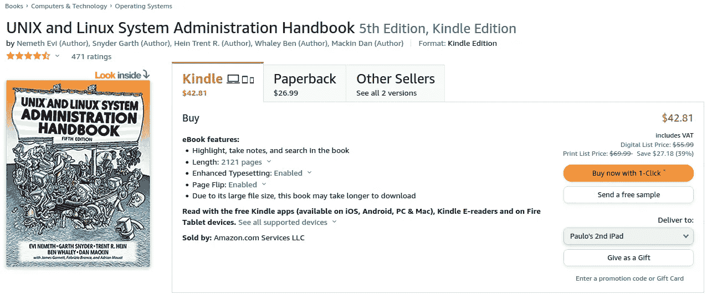

# 电子书 vs 纸价；出版商能有多白痴？

> 原文：<https://medium.com/nerd-for-tech/e-books-vs-paper-prices-how-idiotic-can-publishers-get-5df52f889661?source=collection_archive---------6----------------------->

## 回答:可悲的商业行为是没有限制的…

作者图片。截图自 2022 年 1 月 Amazon.com 网站。

电子书的价格应该和纸质书一样，减去印刷纸张并分发给你的成本。以数字方式存储和交付文件所需的基础设施开销非常小。尽管如此，也没有办法花费…