# 电子商务客户满意度预测

> 原文：<https://medium.com/nerd-for-tech/e-commerce-customer-satisfaction-prediction-abc9bd31d70f?source=collection_archive---------1----------------------->

> **科学预测电子商务客户评论评分**


【https://images.app.goo.gl/6gPjPaZkrNxc59Qc6 号

# 目录:

1.  介绍
2.  商业问题
3.  商业问题的 ML 公式
4.  业务限制
5.  可能的指标
6.  数据概述
7.  探索性数据分析
8.  特征工程
9.  ML 模型
10.  未来的改进
11.  部署
12.  参考

# **1。简介:**

电子商务是我们日常生活的必需品。电子商务是一个平台，卖家可以销售产品，客户可以购买产品。这意味着电子商务平台通过在线方式将大量卖家与客户联系起来。为客户提供更好的服务是电子商务卖家成功的主要关键之一。
*如何衡量服务的好坏？*
答案是:服务的好坏是建立在顾客满意的基础上的。如果顾客对销售者提供的服务不满意，那么销售者必须注重服务质量来吸引顾客，从而改善业务。因此，基本上客户反馈在电子商务业务中起着至关重要的作用。

# 2.业务问题:

在目前的系统中，电子商务平台将在产品交付后向客户发送反馈邮件。顾客可以给出 5 分制的评分，也可以写下一些关于他/她所购买产品的评论/评论。使用这些评论和评级，电子商务平台将对产品进行评级，这有助于其他人了解产品的质量。但从卖家的角度来看，这些评论将对改善业务起到至关重要的作用。但很多时候，客户不会给任何评级或评论。如何预测客户可能给出的点评分数？这就是电商业务中的问题。此外，该问题可以扩展为“在客户实际给出评价之前，是否有可能预测他可能给出的评论评价？”。如果这个问题得到解决，那么也有可能预测客户没有给出任何评级的评级。在本案例研究中，我的目的就是试图解决这个问题，即预测电子商务客户满意度。
在这个案例研究中，我采用了巴西电子商务平台 [Olist](https://www.kaggle.com/olistbr/brazilian-ecommerce) 给出的[数据集](https://www.kaggle.com/olistbr/brazilian-ecommerce)。Olist 通过一份合同将巴西各地的小型企业与客户联系起来。Olist 提供了超过 10 万条 2016 年至 2018 年间的订单信息。与所有其他电子商务平台类似，Olist 也在预计交付日期后向客户发送反馈表，以获得评论和评级。现在，Olist 希望通过使用客户满意度信息来改善业务并为客户提供更好的服务。为此，它需要在用户给出实际评级之前预测评论评级。所以，我的方法是使用数据科学来解决这个业务问题，这是解决这个业务问题的科学方法。

# 3.商业问题的 ML 公式:

为了使用数据科学来解决商业问题，需要将该问题作为经典的机器学习问题来提出。首先，由于数据有目标变量，所以是有监督的 ML 问题。此外，我们需要预测客户的满意度，也就是预测评级。等级从 1 到 5 不等。因此，这是一个多类分类问题。我们有 5 个类标签，所以，我们可以把这个问题看作 5 类分类最大似然问题。

我们的目标是在用户给出评分/评论之前预测评分。因此，我们不应该考虑关于评论消息、评论等的数据。作为功能

# 4.业务限制:

*   没有严格的低延迟要求。但是模型不应该花费太多的时间来预测，因为我们应该在用户给出之前得到预测。
*   像 1、2、3 这样的低评分对于业务改进非常重要。因此，低评级的错误分类会导致客户流失。因此，错误分类是至关重要的。

# 5.可能的指标:

*   多类混淆矩阵
*   宏观 F1 分数
*   多级原木损失
*   平衡精度

# 6.数据概述:

数据取自 ka ggle:[](https://www.kaggle.com/olistbr/brazilian-ecommerce)**。*数据有 9 个 csv 文件，分别是 *olist_customers_dataset，olist_geolocation_dataset，olist_order_items_dataset，olist_order_payments_dataset，olist_order_reviews_dataset，olist_orders_dataset，olist_products_dataset，olist_sellers_dataset，product _ category _ name _ translation*。
这些文件包含有关客户、客户位置、订单、产品、付款、卖方、卖方位置的信息。我们可以使用 pandas 将这些文件加载到 python 中，如下所示:*

```
*#loading all csv files 
import pandas as pdcustomer = pd.read_csv(“olist_customers_dataset.csv”)
geo_location = pd.read_csv(“olist_geolocation_dataset.csv”)
items = pd.read_csv(“olist_order_items_dataset.csv”)
payments = pd.read_csv(“olist_order_payments_dataset.csv”)
reviews = pd.read_csv(“olist_order_reviews_dataset.csv”)
orders = pd.read_csv(“olist_orders_dataset.csv”)
products = pd.read_csv(“olist_products_dataset.csv”)
sellers = pd.read_csv(“olist_sellers_dataset.csv”)
translation = pd.read_csv(“product_category_name_translation.csv”)*
```

*我们需要合并这些文件来获得整个数据集。为了合并所有文件，数据贡献者给出了数据模式，如下所示。*

**

*[**数据模式**](https://www.kaggle.com/olistbr/brazilian-ecommerce)*

*因此，根据数据模式，我合并所有数据文件以创建数据集。*

*合并数据帧的形状是，*

*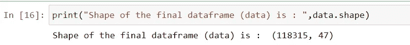*

*但是，我们应该在数据集中检查空值和对我们的问题无用的列。*

```
*All the column names in the data : 
 Index(['order_id', 'payment_sequential', 'payment_type',
       'payment_installments', 'payment_value', 'customer_id', 'order_status',
       'order_purchase_timestamp', 'order_approved_at',
       'order_delivered_carrier_date', 'order_delivered_customer_date',
       'order_estimated_delivery_date', 'review_id', 'review_score',
       'review_comment_title', 'review_comment_message',
       'review_creation_date', 'review_answer_timestamp', 'customer_unique_id',
       'zip_code_prefix_customer', 'customer_city', 'customer_state',
       'geolocation_lat_customer', 'geolocation_lng_customer',
       'geolocation_city_customer', 'geolocation_state_customer', 'product_id',
       'product_category_name', 'product_name_lenght',
       'product_description_lenght', 'product_photos_qty', 'product_weight_g',
       'product_length_cm', 'product_height_cm', 'product_width_cm',
       'order_item_id', 'seller_id', 'shipping_limit_date', 'price',
       'freight_value', 'zip_code_prefix_seller', 'seller_city',
       'seller_state', 'geolocation_lat_seller', 'geolocation_lng_seller',
       'geolocation_city_seller', 'geolocation_state_seller'],
      dtype='object')* 
```

*这些是合并数据集中的要素。但是根据我们的问题，我们必须在他/她给出评价之前预测顾客的评价。为此，我们应该只考虑产品交付给客户之前的信息来预测评审分数。因此，从合并的数据集中，我将删除 review_comment_title '，' review_comment_message '，' review_creation_date '，' review_answer_timestamp '，review_id '。*

*我们必须检查数据集中的空值。*

```
*#Checking for null values
data.isnull().sum()order_id                            0
payment_sequential                  0
payment_type                        0
payment_installments                0
payment_value                       0
customer_id                         0
order_status                        0
order_purchase_timestamp            0
order_approved_at                  15
order_delivered_carrier_date     1254
order_delivered_customer_date    2588
order_estimated_delivery_date       0
review_score                        0
customer_unique_id                  0
zip_code_prefix_customer            0
customer_city                       0
customer_state                      0
geolocation_lat_customer          317
geolocation_lng_customer          317
geolocation_city_customer         317
geolocation_state_customer        317
product_id                          0
product_category_name            1709
product_name_lenght              1709
product_description_lenght       1709
product_photos_qty               1709
product_weight_g                   20
product_length_cm                  20
product_height_cm                  20
product_width_cm                   20
order_item_id                       0
seller_id                           0
shipping_limit_date                 0
price                               0
freight_value                       0
zip_code_prefix_seller              0
seller_city                         0
seller_state                        0
geolocation_lat_seller            265
geolocation_lng_seller            265
geolocation_city_seller           265
geolocation_state_seller          265
dtype: int64*
```

*我们在一些特征中有一些空值。但是空值的数量不是很大。因此，让我们删除这些空实例，看看我们从中抛出了多少数据。此外，我只考虑交付产品的预测。不应删除交付状态不是*已交付*的任何实例。所以在这个过程之后，*

```
***Total number of orders which are not delivered :  2587
percentage of orders which are not delivered :  2.187 %***# % of data that we have drooped*
print("Percentage of data that we have dropped is : ",round((num_tot_rows-data.shape[0])*100/num_tot_rows,3),"%")**Percentage of data that we have dropped is :  4.062 %***
```

*我们只丢失了 *4%* 的数据，剩下 *96%* 的干净、非空的有用数据。与此同时，我检查了重复的条目，并删除了重复的行。有 3 个实例的分期付款值为 0，这很奇怪，我删除了这 3 个实例。
经过预处理后，我们剩下 *113105* 个实例。
之后，我将翻译数据集与合并后的数据集进行映射，以获得产品类别的英文翻译。在这里，我发现有两个类别在翻译文件中没有翻译，即“porta teis _ cozi NHA _ e _ preparadores _ de _ alimentos”和“pc_gamer”。使用谷歌我找到了这些词的英文翻译，并用于映射翻译文件。
现在，最终数据集已准备好进行分析。我们最终的数据集是这样的形状，*

```
*Shape of the final dataset is : (113105, 38)*
```

# *7.探索性数据分析:*

*EDA 是任何数据科学项目中最重要的部分。EDA 将给出关于数据集和每个特征的正确理解，以便我们可以得到进一步进行特征工程和应用模型的途径。而 EDA 要根据目标变量来做，这里是复习分数。所以第一步我们会看到复习分数是如何分布的，这样就知道数据平衡了。*

*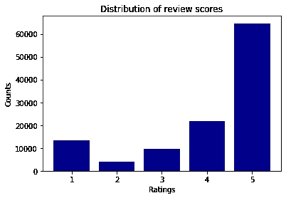*

*评审分数分布*

*我们可以清楚地看到，数据是不平衡的。审查分数为 5 的实例数量非常高，而审查分数为 2 的实例数量非常低。分布呈 **J** 型。电商客户评分研究说点评评分在任何电商平台都会呈 **J** 形分布。
这里也可以看到相同的趋势，评级 5 的数量非常高，其次是评级 4，然后是评级 1，评级 2 和评级 3 与其他评级相比数量较少。
我们要记住，我们的问题是 ***不平衡多类分类*** 问题。让我们进一步分析。*

*我们有 37 个特征需要分析。*

*从数值变量的相关热图可以看出，没有一个特征与复习得分高度相关。*

*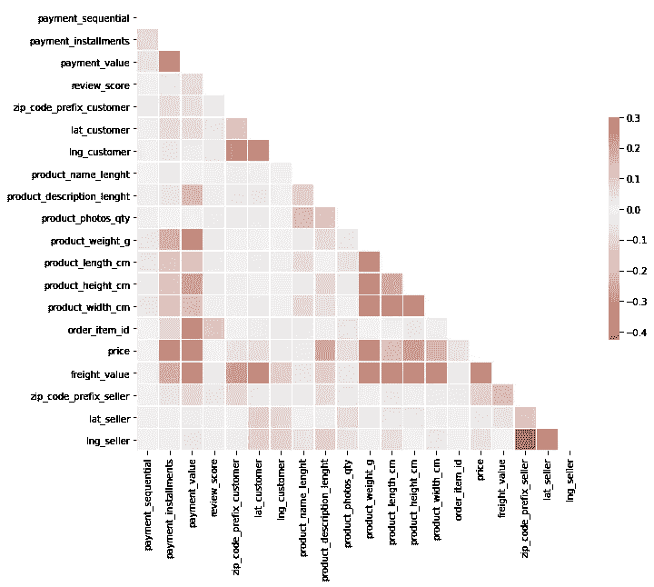*

*相关热图*

*此外，要素之间存在多重共线性。所有特征之间的相关性较小。现在让我们对每个特征进行单变量分析。*

*我们可以看到，支付型信用卡是最常见的(73.8%)，baleto 是 19%。其他支付类型非常少。*

```
*credit_card    0.737854
boleto         0.194580
voucher        0.053225
debit_card     0.014341*
```

*我们还可以看到付款类型在每个审核分数中的分布。*

*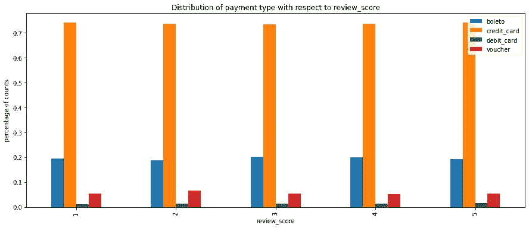*

*不同支付类型在每个评审得分中的分布几乎相同。*

*我进行了卡方检验，以检查支付类型和审查分数是否相关。*

**零假设:* **缴费类型和审核分数独立** *备选假设:* **缴费类型和审核分数相依***

```
*#reference: [https://machinelearningmastery.com/chi-squared-test-for-machine-learning/](https://machinelearningmastery.com/chi-squared-test-for-machine-learning/)
from scipy.stats import chi2_contingency,chi2#creating contengency table
table = pd.crosstab(data[“payment_type”],data[“review_score”],margins=False)#chi_square test using scipy.stats library
chi_2,p_value,dof,expected = chi2_contingency(table)alpha = 0.05
print("Level of significance : ",alpha)
print("p-value is : ",p_value)if p_value < alpha:
    print("Reject null hypothesis")
else:
    print("Failed to reject null hypothesis")
print("*"*30)    
#interpreting test statistic    
prob=0.95
critical = chi2.ppf(prob, dof)print("Critical value is : ",critical)
print("chi2(test statistic) value is : ",chi_2)if chi_2>=critical:
    print("Reject null hypothesis")
else:
    print("Failed to reject null hypothesis")***Level of significance :  0.05
p-value is :  0.00027649502286312483
Reject null hypothesis
******************************
Critical value is :  21.02606981748307
chi2(test statistic) value is :  36.42753432616247
Reject null hypothesis****
```

*因此，我们可以得出结论，审查分数对支付类型的依赖性在统计上是显著的。*

*对分期付款进行分析，并绘制关于每个审核分数的分期付款 pdf。*

*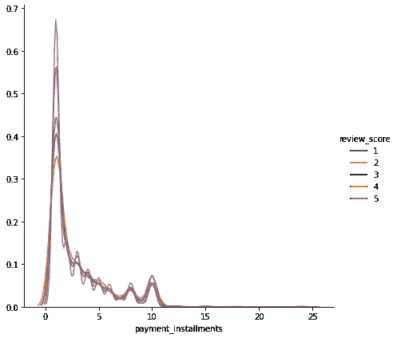*

*从分布可以看出，地块并不是明显可分的。因此，我们不能从中得出多少有用的推论。同样，我分析了 pdf 的支付价值，支付顺序。复习成绩之间也没有明显的区别。*

*谈到客户状态分析，我问大多数客户来自哪 5 个州。*

```
*(data[“customer_state”].value_counts(normalize=True)*100)[:5]**SP    42.284603
RJ    12.943725
MG    11.682949
RS     5.551479
PR     5.109412***
```

*SP 是拥有 42%客户的州。与 SP 相比，所有其他州的客户都较少。所以我分析了复习分数在州 SP 是如何分布的。*

*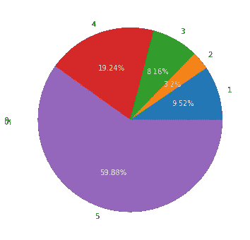*

*SP 中复习分数的分布*

*与总数据集中一样，在 SP 中，审查分数 5 也很高，其次是 4、1、3、2。*

*在第二高的州 RJ，复习分数分布略有不同。得分 5 最高，其次是得分 1、4、3、2。*

*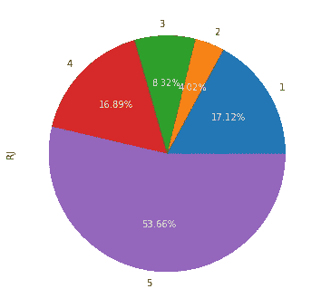*

*RJ 的评论分数分布*

*从客户状态中还可以得出一些有趣的观察结果:*

*   *在所有评估得分中，州 SP 拥有更多客户，SP 拥有%以上的客户份额。*
*   *此外，60%的 SP 客户表示满意，并给出了 5 分。大约 19%的顾客给了 4 级。*
*   *SP 更满意的客户背后的原因目前还不清楚。我们需要更多的分析来获得这方面的信息。*
*   *没有一个州有超过 20%的客户不满意并给出 1 级。*
*   *与其他评级相比，在所有州中，给予 5 级评级的客户比例明显更高。这个结论是因为我们分析的州中，只有不到 50%的客户给出了 5 分的评价。*

*大部分客户来自 SP，大部分卖家来自 SP。*

```
***# seller state shares
SP    0.707873
MG    0.078918
PR    0.078414
RJ    0.043756
SC    0.038371*****- State SP has the highest number of customers(42%), aas well as highest sellers(58.5%). 
- This could be the reason for most of the customers from state SP are satisfied and gave rating 5, and most of the sellers got rating 5.
- review rating 5 is dominant in all the customer states as well as seller states. 
- General trend is star: 5 >> star 4 >= star 1 > star 2 >= star 3.****
```

*现在我们必须分析产品类别。在这里我问的是每个评论分数前 10 名的类别。*

```
*# code for top 10 categories in review score 5
rate_5[“product_category_name”].value_counts([:10].plot.bar(figsize=(10,5),color=”green”).legend()
plt.xlabel(“product category name”)
plt.ylabel(“Counts”)
plt.title(“Top 10 product categroy in review score 5”)
plt.show()print(“Percentage cover of top 10 categories in review 5 : “)
print((rate_5[“product_category_name”].value_counts(normalize=True)[:10].sum()*100).round(3),”%”)*
```

*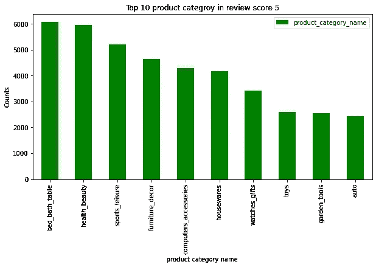*

*类似地，我在每个评论得分中标出了前 10 个类别。而床浴表在所有复习评分中出现的频率更高。*

*所以我根据评论分数分析了这个类别。我得到的推论如下。*

*   *床 _ 洗澡 _ 桌子类别是所有评论得分中出现频率最高的类别，也涵盖了所有评论得分中超过 60%的类别*
*   *52%的次数 bed_bathing_table 得到评论分数 5。14%的情况下，它的评论得分为 1。*
*   *健康美容是在评论等级为 5 的类别中具有几乎相同%份额的类别之一。在得分 4 的情况下，它也是第二个最常见的类别。*
*   *61%的情况下 health_beauty 得分为 5，18%的情况下得分为 4。大多数顾客对这类产品非常满意。只有 10%的情况下它会得到 1 分。*
*   *很少有类别的评论得分超过 20%。这些类别的订单也很少。*
*   *在所有类别中，评论分数为 5 的百分比较高，评论分数为 4 和评论分数为 1 的百分比次之。得分 2、3 在所有类别中都很少。*
*   *当然，在整个数据集中，评论分数为 5 的百分比非常高。但是在分析了产品类别之后，我们没有发现任何重要的产品类别比其他产品类别得分高。*

*以同样的方式，我分析了所有的特征，在这个分析结束时，我没有得到任何单独区分评论分数的特征。一些特征倾向于在评论分数中显示一些分离，但是没有明显的分离。*

*现在我考虑选择特征的配对图来分析双变量行为。*

*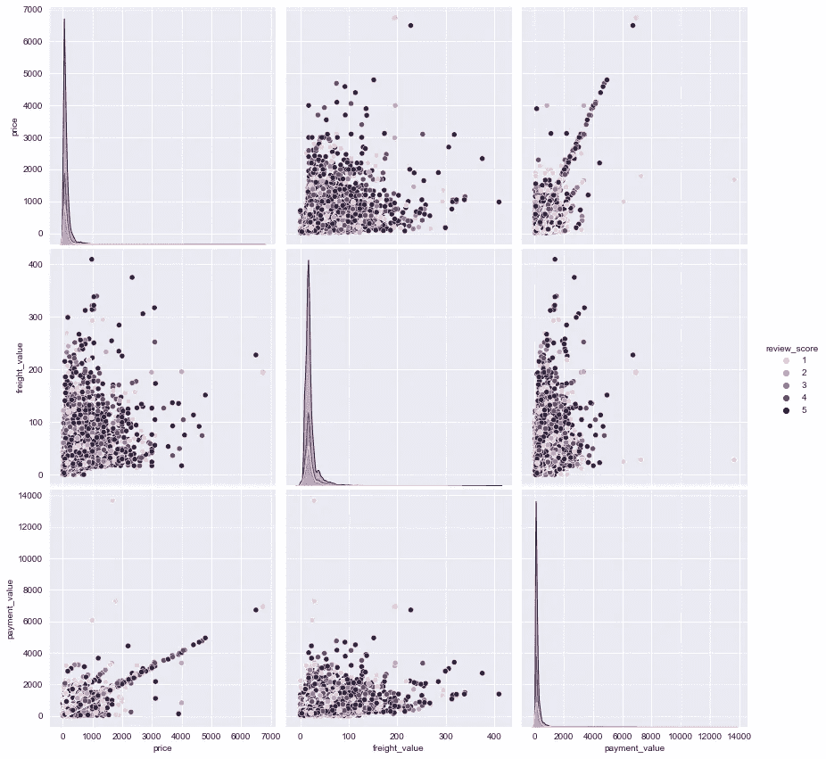*

*成对的特征也不能清楚地分类评论分数。从配对图中可以看出一些相关性。*

*现在来看时间戳特性，我分析了购买时间戳和交付时间戳。在这些时间戳中没有如此显著的趋势。*

```
*df[df[“purchased_year”]==2018].groupby(“purchased_hour”[“review_score”].value_counts(normalize=True).unstack().plot(
 kind=’bar’,figsize=(17,9))plt.show()*
```

*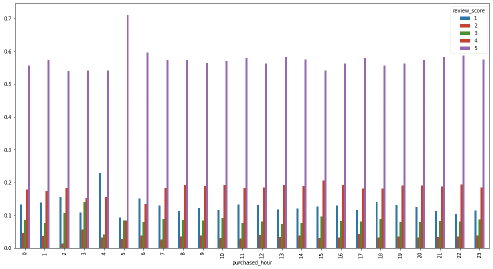*

*2018 年一天中每个小时的复习分数分布*

*这种类型的观察是使用时间戳发现的，但是没有这样有用的观察来帮助清楚地分类复习分数。*

*   *从 EDA 部分来看，可以肯定的是数据集中存在高度的类不平衡。此外，评论分数 1、2、3 非常重要，因为它们的错误分类会导致卖家的客户流失。所以假阳性应该是这里的关注点。*
*   *在这里，每个类的精确度和召回率是很重要的。4，5 类的精度更重要，1，2，3 类的召回非常重要。因此，我们可以使用 F1 分数，这是精确度和召回率的组合，因为每一个对我们都很重要，我们可以考虑宏观 F1 分数..*
*   *基于这种观察和商业问题，我选择宏观 F1 分数作为衡量标准。我还想检查多类混淆矩阵，这样我们可以很容易地观察到错误分类。*

****度量选择，
*宏 F1 分数
*多级混淆矩阵****

*从详细的 EDA 中，我了解到，没有任何现有的特征对分类复习分数有很大的帮助。所以我们必须创建一些非常有用的特性来构建一个好的模型。 ***让我们转到特色工程。****

# *8.特征工程:*

*特别是在这种情况下，特征工程起着非常关键的作用，因为给定的特征对实现目标没有多大用处。在这里，我根据可能影响客户对产品和服务满意度的因素，创建了一些基本功能和高级功能。*

***基于时间的特性:** 电商最重要的是配送时间。如果产品没有在承诺的时间内交付，那么客户很可能不满意。此外，如果承诺的时间太长，客户也会不高兴。如果顾客比预计时间提前拿到产品，那么给予评价的顾客就有可能获得高分。
因此，基于这项研究，我正在创建一些基于数据帧中给出的时间戳的特征。*

```
*# let us define time based features
1\. estimated_time 
       = order_estimated_delivery_date - order_purchase_timestamp2\. actual_time
      = order_delivered_customer_date - order_purchase_timestamp3\. diff_actual_estimated
     = order_delivered_customer_date - order_estimated_delivery_date4\. diff_purchased_approved 
     = order_approved_at - order_purchase_timestamp5\. diff_purchased_courrier
     = order_delivered_carrier_date - order_purchase_timestamp # codes of some of the time based features#Time of estimated delivery
data[“estimated_time”] = (data[“order_estimated_delivery_date”]-data[“order_purchase_timestamp”]).apply(lambda x: x.total_seconds()/3600)data[“delivery_day”] = data[“order_delivered_customer_date”].apply(lambda x: x.weekday())
data[“delivery_date”] = data[“order_delivered_customer_date”].apply(lambda x: x.day)
data[“delivery_month”] = data[“order_delivered_customer_date”].apply(lambda x: x.month)
data[“delivery_hour”] = data[“order_delivered_customer_date”].apply(lambda x: x.hour)data[“purchased_day”] = data[“order_purchase_timestamp”].apply(lambda x: x.weekday())
data[“purchased_date”] = data[“order_purchase_timestamp”].apply(lambda x: x.day)
data[“purchased_month”] = data[“order_purchase_timestamp”].apply(lambda x: x.month)
data[“purchased_hour”] = data[“order_purchase_timestamp”].apply(lambda x: x.hour)*
```

*现在让我们分析一下这些创造出来的特征。*

*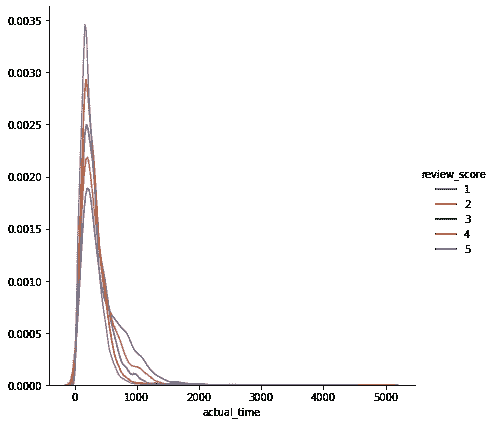**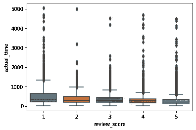

实际时间* 

*我们可以看到，随着实际交付时间的增加，获得低评审分的机会也就越多。
*这里我们可以看到，对于更高的实际次数，评审分数 1 的 pdf 处于更高的高度。其中，审核分数低于 1 分，3 低于 2 分，4 低于 3 分，5 低于 4 分。
*这实际上是一个好现象，因为在实际时间特征情况下，评论分数没有高度重叠。
*对于较低的实际时间值，评审分数为 5 的 pdf 为高峰值。其次是 4，3，2，1。
*与审核分数 1 的 pdf 相比，审核分数 5 的 pdf 在右侧急剧下降。*

*类似地，对于特征 diff_actual_estimated，*

*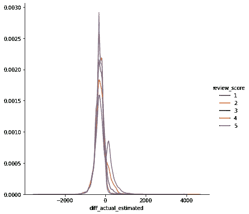*

*我们可以看到，如果产品交付较晚，那么很有可能获得较低的评论分数，如果产品在预计时间之前交付，那么客户可能会给出较高的评级。这意味着评级取决于预计交货时间和实际交货时间的差异。*

*因此，我们可以说，新创建的特征在对评论分数进行分类方面有些帮助。*

***基于距离的特征:** 我们观察到，大部分客户来自国有 SP，大部分卖家来自 SP。SP 用户销售的大多数产品都获得了 5 级评价。
所以，我认为，销售者和顾客之间的距离可能是影响顾客满意度的一个方面。也就是说，如果距离更大，那么客户可能会不满意，并给出更低的评价分数。
基于这一假设，我正在创建新功能“距离”,这是卖家位置和客户位置之间的距离，以公里为单位。*

```
*#[https://scikitlearn.org/stable/modules/generated/sklearn.metrics.pairwise.haversine_distances.html](https://scikit-learn.org/stable/modules/generated/sklearn.metrics.pairwise.haversine_distances.html)
X = [] # list to store customer latitude and longitude
Y = [] # list to store seller latitude and longitudefor i in range(len(data)):
    X.append([radians(data.lat_customer[i]),radians(data.lng_customer[i])])
Y.append([radians(data.lat_seller[i]),radians(data.lng_seller[i])])

#converting to numpy array 
cust_loc = np.array(X)
seller_loc = np.array(Y)distance=[]
for i in range(len(data)):
 #calculating distance and multiplying by radius of earth(6371) to get distance in km
 dist = haversine_distances([cust_loc[i], seller_loc[i]])*6371
 distance.append(dist[0,1])

data[“distance”] = distance*
```

*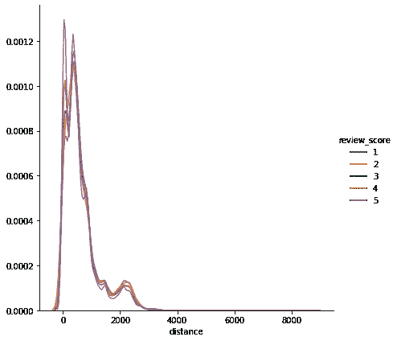*

*因此，从距离特征，我们可以看到，对于非常小的距离，评论分数 5 是非常尖峰的，而对于大的距离，评论分数 5 的密度小于其他分数。*

*类似地，我创建了一些更基本的特征，如，
速度=(距离/实际时间)
大小=(长度*宽度*高度)
一些二进制特征，如延迟发货、同一州、同一城市。*

*这些工程特征似乎有助于我们的目标。*

*在高级功能工程中，我创建了卖家共享、客户共享、项目卖家共享、项目客户共享。利用这 4 个共享特征，我计算了卖家和客户之间的相似度。这些功能的代码如下所示。*

```
*#groupby order item_id
order_seller = data.groupby(“order_item_id”)[“seller_id”].value_counts().unstack()
order_seller.fillna(0,inplace=True)total_order_id = np.sum(order_seller,axis=1).to_dict()
total_seller_id = np.sum(order_seller,axis=0).to_dict()#creating feature
seller_share = []
bs_share = []
for i in range(len(data)):

     seller_share.append((order_seller.loc[(data["order_item_id"][i],data["seller_id"][i])]/total_order_id[data["order_item_id"][i]]))

     bs_share.append((order_seller.loc[(data["order_item_id"][i],data["seller_id"][i])]/total_seller_id[data["seller_id"][i]]))data["seller_share"] = seller_share
data["bs_share"] = bs_share
**********************************************************user_order = data.groupby("order_item_id")["customer_unique_id"].value_counts().unstack()
user_order.fillna(0,inplace=True)user_total = np.sum(user_order,axis=0).to_dict()
order_total = np.sum(user_order,axis=1).to_dict()cust_share = []
bu_share = []
for i in range(len(data)):

    cust_share.append((user_order.loc[(data["order_item_id"][i],data["customer_unique_id"][i])]/order_total[data["order_item_id"][i]]))

    bu_share.append((user_order.loc[(data["order_item_id"][i],data["customer_unique_id"][i])]/user_total[data["customer_unique_id"][i]]))

data["cust_share"] = cust_share
data["bu_share"] = bu_share
********************************************************#calculating similarity
similarity = []
for i in range(len(data)):
     similarity.append((np.dot([data["seller_share"][i],data["bs_share"][i]] , [data["cust_share"][i],data["bu_share"][i]])))

data["similarity"] = similarity***
```

*这种相似性特征似乎非常有用，*

*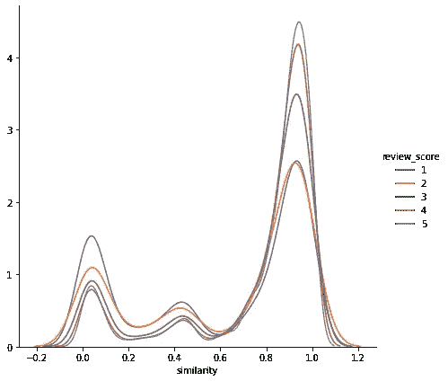*

*我们可以看到，对于低相似性得分，得分 1 密度较高，而对于高相似性得分，得分 5 的密度较高。这个特性肯定会增加解决我们问题的价值。
同样，我也使用产品类别创建了相似性特征。
还有一个特性是每个卖家的客户总数，以及客户购买的卖家总数。*

*现在，我们已经使用现有功能创建了许多新功能。让我们继续前进。*

# *9.ML 型号:*

*在应用分类模型之前，我们必须将数据分为训练和测试，并且我们必须处理分类特征、数字特征。*

***训练测试分割:** 我用分层分割进行训练测试分割，75%用于训练，25%用于测试。*

```
*#train test split with test size 25% and 75% of data as train
Y = data["review_score"]
X = datax_train,x_test,y_train,y_test = train_test_split(X,Y,test_size=0.25,stratify=Y,random_state=10)**Dimensions of the splitted data :
Train:  (84828, 45) (84828,)
Test:  (28277, 45) (28277,)****% Distribution of class labels in the total data :
5    57.15
4    19.21
1    11.71
3     8.46
2     3.47
Name: review_score, dtype: float64
**************************************************
% Distribution of class labels in the train data :
5    57.15
4    19.21
1    11.71
3     8.46
2     3.47
Name: review_score, dtype: float64
**************************************************
% Distribution of class labels in the test data :
5    57.15
4    19.21
1    11.71
3     8.46
2     3.47
Name: review_score, dtype: float64
*****************************************************
```

*培训、测试中的复习分数分布与原始数据中的相同。这看起来不错。*

*现在我使用 CountVectorizer()将分类特征转换成向量。*

```
*#payment_type 
vec = CountVectorizer()vec.fit(x_train[“payment_type”].values)x_tr_pay_type = vec.transform(x_train.payment_type.values)
x_te_pay_type = vec.transform(x_test.payment_type.values)print(x_tr_pay_type.shape)
print(x_te_pay_type.shape)**(84828, 4)
(28277, 4)***
```

*如上所示，我使用 CountVectorizer()处理了所有的分类特征。现在我将数字特征标准化如下。*

```
***def scaling**(train_data,test_data):
 “””This function will standardize the numerical data”””
 norm = StandardScaler()norm.fit(train_data.values)x_tr_num = norm.transform(train_data.values)
 x_te_num = norm.transform(test_data.values)return x_tr_num,x_te_num*
```

*现在，我堆叠了所有的矢量化特征，现在我们可以使用这一训练和测试数据来尝试 ML 模型。*

## *基本型号:*

*在第一步中，我尝试了一些简单的基本 ML 模型，以检查模型如何处理这种不平衡的数据。在第一步中，我尝试用一个 vs rest，KNN，决策树进行逻辑回归。我用这些模型做了五重交叉验证。*

```
***def kfold**(k,model):
 “””This function will do stratified k-fold cross_validation”””
 kf = StratifiedKFold(n_splits=k)

 cv_f1_score = []
 for tr_ind,cv_ind in kf.split(train,y_train):

 x_tr,x_cv,y_tr,y_cv = train[tr_ind],train[cv_ind],y_train[tr_ind],y_train[cv_ind]

 model.fit(x_tr,y_tr)
 pred_cv = model.predict(x_cv) 
 cv_f1_score.append((f1_score(y_cv,pred_cv,average=”macro”,labels=[1,2,3,4,5])))

 return np.mean(cv_f1_score)*
```

*但基本款的表现不佳。宏 f1 分数较少。*

```
***Logistic Regression**
Train F1 score at 0.01 is :0.2861577232898543
**************************************************
test F1 score at 0.01 is :0.28496554797465007**KNN**
Train F1 score at 5 is :0.5327880988341782
**************************************************
test F1 score at 5 is :0.33440577518222214**SVM**
Train F1 score at 1e-05 is :0.1455032757226727
**************************************************
test F1 score at 1e-05 is :0.14546436528118462**Decision Tree**
Train F1 score at 20 is :0.6045559359203161
**************************************************
test F1 score at 20 is :0.34712098753895826*
```

*因此，从结果中我们可以看到，KNN，决策树模型过度拟合，性能也不好。逻辑回归没有过度拟合，但是分数很少。SVM 是所有基本模型中最差的模型。*

*现在尝试了一些高级的模型像 Random forest，LGBM，XGBoost。*

```
***RandomForest**
Train F1 score at 200 is :0.996856561806245
**************************************************
test F1 score at 200 is :0.47516460218276235**LightGBM** Train F1 score at 2000 is  :0.9864296931649594 
**************************************************
test F1 score at 2000 is :0.5028071813038997**XGboost** Train F1 score is  :0.5387918992086534 
**************************************************
test F1 score is :0.35880636075112976**RUSBoost** Train F1 score is  :0.29295160471254406 
**************************************************
test F1 score is :0.2951101278199316*
```

*从这些模型中我们可以看到，尽管测试宏 f1 分数增加了，但是模型过度拟合得非常厉害。RUSBoost 是一种针对不平衡数据的欠采样算法级方法。但是这样也不好。*

*这个糟糕的结果可能是由于数据中的高等级不平衡。因此，让我们尝试随机过采样来处理不平衡数据。*

```
*from imblearn.over_sampling import RandomOverSampler
om = RandomOverSampler(random_state=10) 
x_res , y_res = om.fit_resample(train,y_train)print("class distribution BEFORE SMOTE in train data: \n",y_train.value_counts())
print("class distribution AFTER SMOTE in train data: \n",y_res.value_counts())**class distribution BEFORE SMOTE in train data: 
 5    48477
4    16293
1     9931
3     7180
2     2947
Name: review_score, dtype: int64
class distribution AFTER SMOTE in train data: 
 4    48477
3    48477
5    48477
2    48477
1    48477
Name: review_score, dtype: int64***
```

*在随机过采样之后，我尝试了之前尝试过的相同模型。*

```
***Logistic regression**
Train F1 score at 10 is :0.3030978235390651
**************************************************
test F1 score at 10 is :0.28286350316755565**Decision Tree**
Train F1 score at 20 is :0.7016532041986847
**************************************************
test F1 score at 20 is :0.34301458062753587**Random Forest** Train F1 score at 500 is :0.9985973924070967
**************************************************
test F1 score at 500 is :0.5136173216792821**XGBoostRF** Train F1 score at 0.001 is  :0.35404401698400156 
**************************************************
test F1 score at 0.001 is :0.30375644020951065**LightGBM**
Train F1 score is  :0.7637536506482032 
**************************************************
test F1 score is :0.39361553077802675*
```

*现在我们可以看到，随机过采样后，模型性能并没有得到改善。所以随机过采样在不平衡数据中不起作用。*

*这种直截了当的方法没有奏效。所以我尝试了另一种方法。方法如下。*

****模型 1:首先我们把分数 5 看作一个类(1)，其他所有分数都看作其他类(0)。我们对此进行二元分类。如果我们得到输出 1，那么类标签直接是 5。另外，我们在类别 1、2、3、4 之间建立另一个多类别分类算法模型。由于不平衡在这种情况下并不多，我们可以期待更好的结果。****

*现在，首先使用这种方法，我在第 5 类和其余类(1，2，3，4)上尝试了二元分类模型。*

```
***Logistic Regression**
Train F1 score at 0.01 is :0.6143489348445506
**************************************************
test F1 score at 0.01 is :0.6085867692979023**SVM**
Train F1 score at 0.01 is :0.363654776640036
**************************************************
test F1 score at 0.01 is :0.36375161899674946**KNN**
Train F1 score at 3 is :0.8161479646108369
**************************************************
test F1 score at 3 is :0.6114315717337961**Decision Tree**
Train F1 score at 15 is :0.7252478785857026
**************************************************
test F1 score at 15 is :0.6208240044481035**RandomForest**
Train F1 score at 500 is :0.9989050920209032
**************************************************
test F1 score at 500 is :0.6790110979361804**LightGBM**
Train F1 score at 2000 is  :0.9254666480999973 
**************************************************
test F1 score at 2000 is :0.6443430798206108**XGBoost**
Train F1 score at 1 is  :0.8070625906785363 
**************************************************
test F1 score at 1 is :0.6287153755871924*
```

*因此，在这里，模型与二元分类配合得非常好，这意味着模型能够预测第 5 类，并获得不错的分数。但是 LightGBM，RF，KNN，DT 模型都过拟合。逻辑回归没有过度拟合，得分几乎与其他模型相同。*

*现在我试着选择特征来避免过度拟合，但这也不起作用。*

*为了提高分数，我尝试了随机抽样。*

```
*om = RandomOverSampler(random_state=10) 
x_res , y_res = om.fit_resample(train_features,y_train)**class distribution BEFORE SMOTE in train data: 
 1    48477
0    36351
Name: binary_target, dtype: int64
class distribution AFTER SMOTE in train data: 
 1    48477
0    48477
Name: binary_target, dtype: int64** **Logistic Regression**
Train F1 score at 10 is :0.6097127688974593
**************************************************
test F1 score at 10 is :0.6048836027921374**Decision Tree**
Train F1 score at 15 is :0.7207902073616186
**************************************************
test F1 score at 15 is :0.6245482973145802**RandomForest**
Train F1 score at 500 is :0.9990614105433693
**************************************************
test F1 score at 500 is :0.6866765711400296**LightGBM**
Train F1 score is  :0.7112466091857768 
**************************************************
test F1 score is :0.6320387076110848*
```

*从结果可以看出，随机过采样并没有提高模型性能。*

*但是从这种方法来看，模型对于类别 5 和作为二元分类的其余类别表现良好。而 Logistic 回归是这一步的最佳模型，没有过拟合，得分与其他不相上下。所以我选择逻辑回归作为这个方法的模型 1。*

```
***Logistic Regression**
C=[0.00001,0.0001,0.001,0.01,0.1,1,10]f1_scores = []
for i in C:
 model = None
 model = LogisticRegression(C=i,class_weight=”balanced”)
 k_fold_score = kfold(5,model,train,y_train)
 f1_scores.append(k_fold_score)
 print(“Macro F1 score at C={} is {} “.format(i,k_fold_score))print(“*”*50) 
plt.plot(C,f1_scores,color=”darkblue”)
plt.xscale(“log”)
plt.grid()
plt.title(“Cross Validation F1 score for each C”)
plt.xlabel(“hyper parameter ©”)
plt.ylabel(“F1 score”)
plt.show()best_param = C[np.argmax(f1_scores)]model = None
model = LogisticRegression(C=i,class_weight=”balanced”)
model.fit(train,y_train)print(“*”*50)
print(“Train F1 score at {} is :{}”.format(best_param,
f1_score(y_train,model.predict(train),labels=model.classes_,average=”macro”)))
print(“*”*50)
print(“test F1 score at {} is :{}”.format(best_param, f1_score(y_test,model.predict(test),labels=model.classes_,average=”macro”)))#plotting confusion matrix
predicted = model.predict(test)
plot_confusion_matrix(y_test,predicted)Macro F1 score at C=1e-05 is 0.6063750815874365 
Macro F1 score at C=0.0001 is 0.6095742704086244 
Macro F1 score at C=0.001 is 0.610961119057039 
Macro F1 score at C=0.01 is 0.6129262895423754 
Macro F1 score at C=0.1 is 0.6128481022485971 
Macro F1 score at C=1 is 0.6128756224346488 
Macro F1 score at C=10 is 0.6126459838606673 
***************************************************
```

*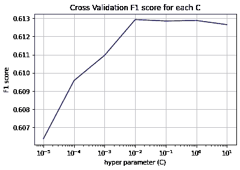*

*交叉验证曲线*

```
***************************************************
Train F1 score at 0.01 is :0.6143489348445506
**************************************************
test F1 score at 0.01 is :0.6085867692979023*
```

*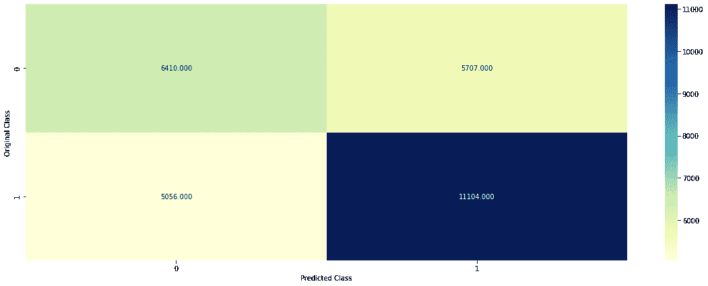*

*混淆矩阵*

*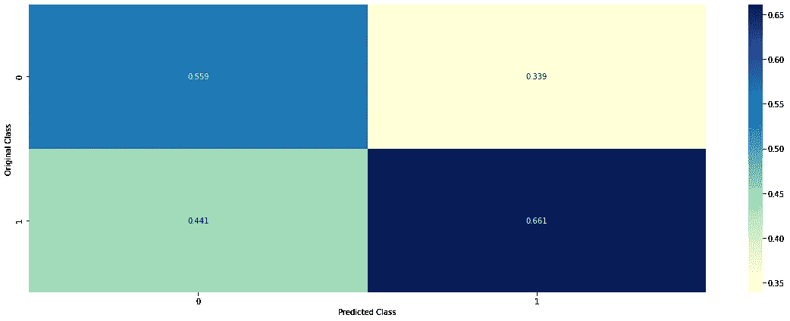*

*精度矩阵*

*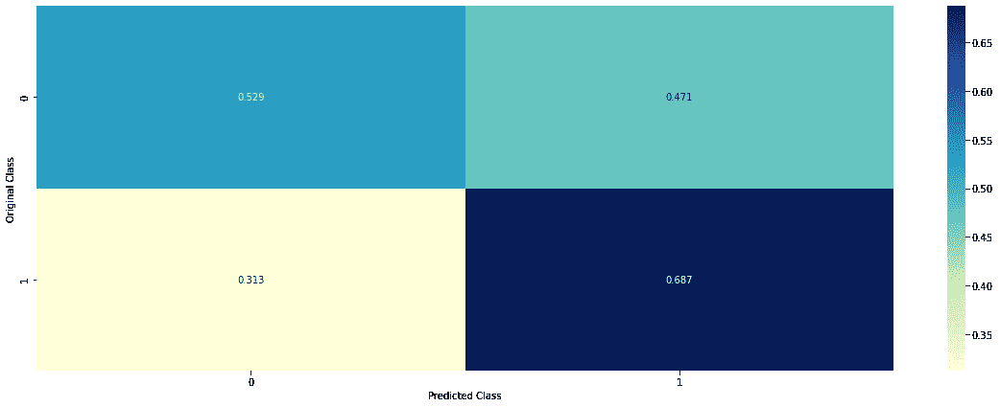*

*回忆矩阵*

*现在，我们必须在分数 1、2、3、4 之间进行多类分类。*

*现在，我尝试了不同的模型，但分数并不太好，而且模型高度过度拟合。*

```
*% Distribution of class labels in the total data :
4    44.82
1    27.32
3    19.75
2     8.11
Name: review_score, dtype: float64
**************************************************
% Distribution of class labels in the train data :
4    44.82
1    27.32
3    19.75
2     8.10
Name: review_score, dtype: float64
**************************************************
% Distribution of class labels in the test data :
4    44.82
1    27.32
3    19.75
2     8.11
Name: review_score, dtype: float64
***************************************************
```

*这是复习分数 1，2，3，4 的分布。*

*简单模型在这种多类分类中不起作用。所以我创建了一个定制的整体模型。*

****训练数据将被分成 50-50 个 d1 和 d2 集合。从 d1 集合中随机取样替换的点，并取 k 个样本。用 k 个样本训练 k 个模型。并通过将 d2 传递给 k 个模型中的每一个来预测 d2 集合。现在我们得到了 k 个预测。****

****现在使用 k 个预测作为输入建立元分类器，这意味着使用 k 个预测训练元分类器。在训练时，目标变量应该是 d2 集中的复习分数。元分类器的输出将被认为是预测的评论分数。*** 这就是我如何创建定制的合奏模型。*

```
***def custom_ensemble**(x_tr,y_tr,x_te,n_estimators,estimator,meta_clf):
 “””This function creates the custom ensemble model and returns predicted target variable of test set”””

 ########### SPlitting train data into 50–50 as d1 and d2 
 kf = StratifiedKFold(n_splits=2)

 d1 = x_tr[list(kf.split(x_tr,y_tr))[1][0]]
 d1_y = y_tr[list(kf.split(x_tr,y_tr))[1][0]] d2 = x_tr[list(kf.split(x_tr,y_tr))[1][1]]
 d2_y = y_tr[list(kf.split(x_tr,y_tr))[1][1]]
 ####################################################################
 d1_y = np.array(d1_y)
 d2_y = np.array(d2_y)
 ####################################################################
 ## Creating base learners and training them using samples of d1 ##

 models=[]

 for i in range(n_estimators):
 ind = np.random.choice(19387,size=(20000),replace=True)
 sample = d1[ind]
 sample_y = d1_y[ind] 

 estimator.fit(sample,sample_y)
 models.append(estimator)

 ########### Predictions from base learners for d2 set ######
 predictions = []
 for model in models: 

 pred = model.predict(d2)
 predictions.append(pred)

 predictions = np.array(predictions).reshape(-1,n_estimators)

 ########## meta classifier on predictions of base learners ####

 meta_clf.fit(predictions,d2_y)
 train_pred = meta_clf.predict(predictions)

 ####################################################################
 ######################## TEST SET ########################

 pred_test = []
 for model in models:
 pred_test.append(model.predict(test))

 pred_test = np.array(pred_test).reshape(-1,n_estimators)
 test_y_predicted = meta_clf.predict(pred_test)

#### Return train predictions on d2, test predictions and actual labels of d2 ####return train_pred,test_y_predicted,d2_y*
```

*现在，我可以在这个函数中调用任意数量的任意模型，以获得该基本模型的集合。*

*我用不同数量的基础学习者尝试了逻辑回归、决策树、随机森林、XGboost、LGBM，因此基础模型的数量被视为超参数。*

```
***Logistic Regression**
Train Macro F1 score for n_estimator=150 is : 0.27057451737250016
Test Macro F1 score for n_estimator=150 is : 0.23298332333913324
**************************************************************Decision Tree**
Train Macro F1 score for n_estimator=100 is : 0.2554723104438191
Test Macro F1 score for n_estimator=100 is : 0.22523027867967155
**************************************************************Random Forest**
Train Macro F1 score for n_estimator=200 is : 0.27199880277608407
Test Macro F1 score for n_estimator=200 is : 0.2287252929706321
***************************************************************LGBM** Train Macro F1 score for n_estimator=50 is : 0.24091801912897187
Test Macro F1 score for n_estimator=50 is : 0.22058180580346975
**************************************************************LGBM with GOSS**
Train Macro F1 score for n_estimator=25 is : 0.23258597383182883
Test Macro F1 score for n_estimator=25 is : 0.20645592800527962
**************************************************************XGBoost**
Train Macro F1 score for n_estimator=50 is : 0.24604171363035154
Test Macro F1 score for n_estimator=50 is : 0.23023241796944321*
```

*因此，我选择了逻辑回归定制系综。
虽然性能得分不好，但过拟合问题减少。为了提高分数，我们必须进一步努力，在 1，2，3，4 这一课上创造更多的特色。现在我选择了 LR 定制套装。*

```
*n = [10,15,25,50,75,100,120,150,175,200]
test_f1 =[]
train_f1 = []for i in n:

 train_pred,test_pred,d2_y = custom_ensemble(train,y_train,test,i,LogisticRegression(class_weight=”balanced”),
 LogisticRegression(class_weight=”balanced”))

 train_score = f1_score(d2_y,train_pred,average=”macro”,labels=[1,2,3,4])
 test_score = f1_score(y_test,test_pred,average=”macro”,labels=[1,2,3,4])

 train_f1.append(train_score)
 test_f1.append(test_score)

 print(“*”*60)
 print(“Train Macro F1 score for n_estimator={} is : {}”.format(i,train_score))
 print(“Test Macro F1 score for n_estimator={} is : {}”.format(i,test_score))
 print(“*”*60)

plt.plot(n,test_f1,label=”test”)
plt.plot(n,train_f1,label=”train”)
plt.legend()
plt.xlabel(“Number of base learners(n)”)
plt.ylabel(“Macro F1 score”)
plt.title(“no. of Base learners v/s Macro F1 score”)
plt.show()best_n = n[np.argmax(test_f1)]train_pred,test_pred,d2_y = custom_ensemble(train,y_train,test,best_n,LogisticRegression(class_weight=”balanced”),
 LogisticRegression(class_weight=”balanced”))

train_score = f1_score(d2_y,train_pred,average=”macro”,labels=[1,2,3,4])
test_score = f1_score(y_test,test_pred,average=”macro”,labels=[1,2,3,4])

print(“*”*60)
print(“Train Macro F1 score for n_estimator={} is : {}”.format(best_n,train_score))
print(“Test Macro F1 score for n_estimator={} is : {}”.format(best_n,test_score))
print(“*”*60)plot_confusion_matrix(y_test,test_pred)*************************************************************
Train Macro F1 score for n_estimator=10 is : 0.2275975085298737
Test Macro F1 score for n_estimator=10 is : 0.22768654176316655
************************************************************
************************************************************
Train Macro F1 score for n_estimator=15 is : 0.23294871450254453
Test Macro F1 score for n_estimator=15 is : 0.2202721123645503
************************************************************
************************************************************
Train Macro F1 score for n_estimator=25 is : 0.22863676451490095
Test Macro F1 score for n_estimator=25 is : 0.21830870779971911
************************************************************
************************************************************
Train Macro F1 score for n_estimator=50 is : 0.2392766892756102
Test Macro F1 score for n_estimator=50 is : 0.2192628608297082
************************************************************
************************************************************
Train Macro F1 score for n_estimator=75 is : 0.2605528481876316
Test Macro F1 score for n_estimator=75 is : 0.21871970743696173
************************************************************
************************************************************
Train Macro F1 score for n_estimator=100 is : 0.25442330900194493
Test Macro F1 score for n_estimator=100 is : 0.2106638150334702
************************************************************
************************************************************
Train Macro F1 score for n_estimator=120 is : 0.25863560405190616
Test Macro F1 score for n_estimator=120 is : 0.21821822503158228
************************************************************
************************************************************
Train Macro F1 score for n_estimator=150 is : 0.2701955250061928
Test Macro F1 score for n_estimator=150 is : 0.23056390517919373
************************************************************
************************************************************
Train Macro F1 score for n_estimator=175 is : 0.26995816705602926
Test Macro F1 score for n_estimator=175 is : 0.22545213261796726
************************************************************
************************************************************
Train Macro F1 score for n_estimator=200 is : 0.2725679232221619
Test Macro F1 score for n_estimator=200 is : 0.21870631179230154
**************************************************************
```

*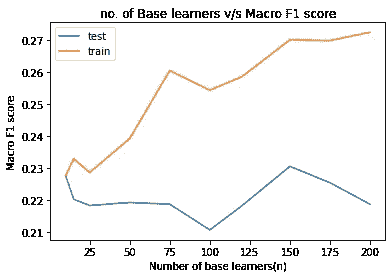*

```
***Train Macro F1 score for n_estimator=150 is : *0.27057451737250016*****Test Macro F1 score for n_estimator=150 is : *0.23298332333913324****
```

*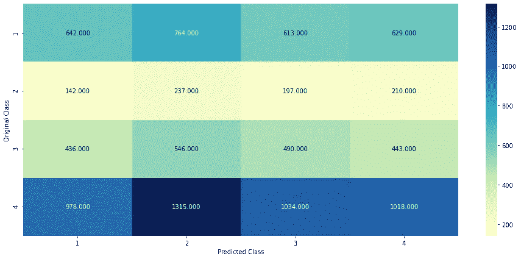*

*混淆矩阵*

*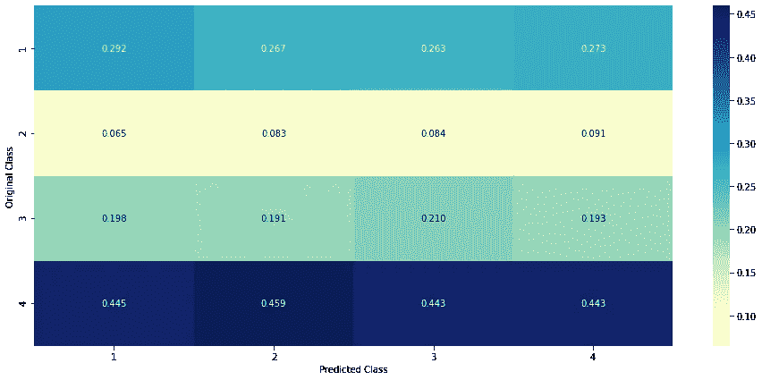*

*精度矩阵*

*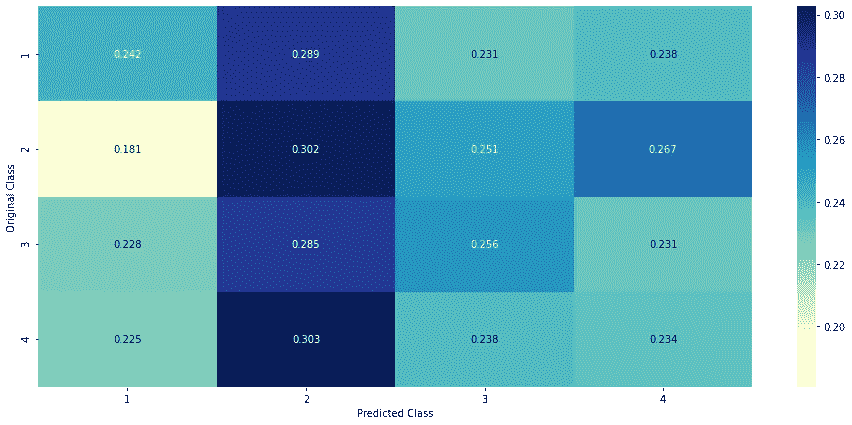*

*回忆矩阵*

*分数不是很好。但是为了增加分数，我们必须在功能工程上多下功夫。*

# *10.未来的改进:*

*现在，我考虑这个宏观 F1 分数，但在未来的工作中，我将通过更多的功能工程来增加分数。我尝试了大部分处理职业不平衡的技术，但是都没有达到预期的效果。但是在第二种方法(二进制+多类)中，如果我们做更多的特征工程，我们可以提高分数。此外，如果我们获得更多数据，如客户的人口统计细节(年龄、性别、财务状况等。)那就更好了。*

# ***11。部署:***

*我已经使用 Flask 部署了模型。这里 可以看到 [**部署的演示**](https://youtu.be/4KlVL-yA_Js)*

*整个项目，摘要，代码在我的[**github**中给出](https://github.com/praveen-hegde/E-commerce-customer-satisfaction-predicton)*

**随时欢迎对成绩的改进提出建议。**

> **你可以在*[***LinkedIn***](https://www.linkedin.com/in/praveen-hegde-5bb6121b7/)[***Praveen Hegde***](https://www.linkedin.com/in/praveen-hegde-5bb6121b7/) *MSc Statistics* [*pgh3337@gmail.com*](http://pgh3337@gmail.com)*

# *12.参考资料:*

*   *现有解决方案:[https://www . ka ggle . com/andresionek/predicting-customer-satisfactio](https://www.kaggle.com/andresionek/predicting-customer-satisfaction)n*
*   *重复电子商务买家预测[https://www.kdd.org/kdd2016/papers/files/adf0160-liuA.pdf](https://www.kdd.org/kdd2016/papers/files/adf0160-liuA.pdf)*
*   *LightGBM 分类器:[https://papers . nips . cc/paper/2017/file/6449 f 44 a 102 FDE 848669 BDD 9 EB 6b 76 fa-paper . pdf](https://papers.nips.cc/paper/2017/file/6449f44a102fde848669bdd9eb6b76fa-Paper.pdf)*
*   *重击技术:[https://arxiv.org/pdf/1106.1813.pdf](https://arxiv.org/pdf/1106.1813.pdf)*
*   *关于欠采样、过采样、SMOTE、集成模型的博客:[https://xang1234.github.io/louvain/](https://xang1234.github.io/louvain/)*
*   *RUSBoost 算法:[https://www . research gate . net/publication/224608502 _ RUSBoost _ A _ Hybrid _ Approach _ to _ submitting _ Class _ unbalanced](https://www.researchgate.net/publication/224608502_RUSBoost_A_Hybrid_Approach_to_Alleviating_Class_Imbalance)*
*   *[https://machine learning mastery . com/针对不平衡分类的随机过采样和欠采样/](https://machinelearningmastery.com/random-oversampling-and-undersampling-for-imbalanced-classification/)*
*   *[https://www . research gate . net/publication/323111412 _ The _ effects _ of _ customer _ satisfaction _ with _ e-commerce _ system](https://www.researchgate.net/publication/323111412_The_effects_of_customer_satisfaction_with_e-commerce_system)*
*   *[https://towards data science . com/using-data-science-to-predict-negative-customer-reviews-2 abbdfb 3d 82](https://towardsdatascience.com/using-data-science-to-predict-negative-customer-reviews-2abbdfbf3d82)*
*   *[https://www . ka ggle . com/golden dime/data-cleaning-viz-and-stat-analysis-on-e-com](https://www.kaggle.com/goldendime/data-cleaning-viz-and-stat-analysis-on-e-com)*
*   *[https://www . ka ggle . com/jsa guiar/e-commerce-explorative-analysis](https://www.kaggle.com/jsaguiar/e-commerce-exploratory-analysis)*