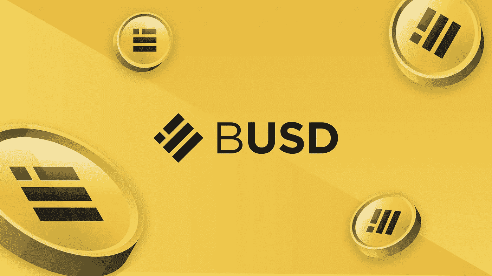
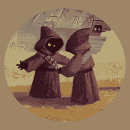
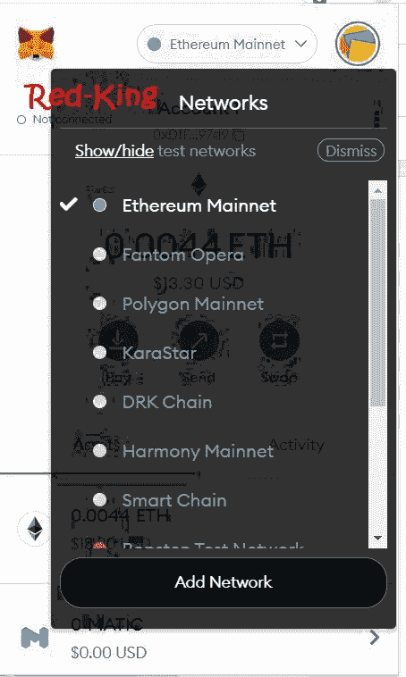

# 使用版本 3，每天赚取 4%的利润

> 原文：<https://medium.com/nerd-for-tech/earn-4-daily-with-version-3-d4dba9cae187?source=collection_archive---------0----------------------->

## 获得复利奖金。初始赌注已锁定。

贾瓦人阵营的开发团队已经有了两个迭代，他们刚刚推出了 [**【贾瓦人阵营 V3**](https://redkingcrypto.com/jawav3) ！

为了确保这个版本 3 项目的可持续性和持久性，该合同实现了一个特性，即鼓励或强制用户持续复合他们的利润。

用户必须复利一定次数才能提现。如果用户选择不进行复利提取，他们将被收取 90%的反馈税，这将成为合同的一部分。

我们最近已经看到相当多的项目采用这种方法，作为对抗那些试图快速耗尽项目 TVL 的人的一种方式。

此外，为了进一步鼓励社区重新雇用或复合，**将为用户采取的每个复合动作**提供 2%的奖励。**该奖励最多可累积 6%或 3 天。**

推荐的最佳策略是**复租或复合 3 天，然后每周卖出 1 天黄金。这将增加用户的投资和他们的每日收益。**

这种策略已经尝试过了，并被证明是有效的。用于最初雇佣贾瓦人拾荒者(包括重新雇佣)的资金不能撤回，但您的贾瓦人将继续工作，并为您无限期开采黄金。

[**查看贾瓦人阵营第三版**](https://redkingcrypto.com/jawav3) 。

## 审计

由 George Stamp 审核，获得了 84 的**总分，这是很高的分数。审计中还有以下意见…**

*“此合同被认为是安全的投资，免责声明这是一个 ROI miner 应用程序，用户的投资不能撤回，用户通过撤回投资利息赚回他们的资金。”*

这个团队是众所周知的，并且已经发布了两个版本的贾瓦人阵营

## 费用

存款和取款都要收 4.8%的手续费。

## 总额

最低存款额:每个钱包 10 BUSD，最高存款额:每个钱包 10000 BUSD

**= * = * = * = * = * = * = * = * = * = * = * = * = * = * = * = * = * = * = * = * = * = * = * = * = * = * = * = ***

*也可以看看这个目前表现不错的 BNB 机会:*

 [## 烤豆的新叉子每天支付高达 8%(可持续发展的动态 APY)

### 由 George Stamp 审核。4%的低收费。

medium.com](/blockchain-biz/new-fork-of-baked-beans-pays-up-to-8-daily-dynamic-apy-for-sustainability-25a5342c646f) 

**= * = * = * = * = * = * = * = * = * = * = * = * = * = * = * = * = * = * = * = * = * = * = * = * = * = * = * = ***

## 投资回报率

估计为每日 4%，相当于年利率的 1460%

a

## 防渗漏机构

贾瓦人 V3 营致力于通过一系列措施确保项目的长期稳定和成功。这些包括最大存款限额，以及截止和提款冷却时间。截止时间是您的奖励完全累积所需的时间。一旦你的奖励达到最大值，累积将停止，直到你在游戏中采取行动。这有助于防止鲸鱼长期囤积奖励，并避免给人一种错误的印象，即合同价值在增加，而实际上大部分是鲸鱼等待提取的奖励。

**以下是主要的防鲸/排水/倾倒机制:**

➤的最高存款额设置为 10000 美元

➤36 小时黄金开采截止时间(如果玩家没有在游戏中采取行动，他的奖励将停止增加)

➤ 3 强制性化合物

➤对提前提款征收 90%的税

这些限制将保证 TVL 的稳定增长，并防止鲸鱼耗尽合同余额。

## 它是如何工作的？

[去平台](https://redkingcrypto.com/jawav3)和 BUSD 一起购买虚拟的“贾瓦斯”(你需要向下滚动页面)。贾瓦人的价值是基于他们目前的采矿效率，这是由游戏中贾瓦人拾荒者的总体供求关系决定的。

当一个玩家购买了贾瓦人的，他们立即开始工作，以产生投资回报(像“采矿”在大多数其他 dapps)。就像金融市场一样，贾瓦人的价值会随着时间的推移而波动，这取决于对它们的需求水平。当需求高时，贾瓦人的价值和收益会增加，当需求低时，它们的价值和收益会减少。

这个矿工平台和传统金融市场的一个关键区别是玩家不能直接出售他们的贾瓦人。相反，他们只能出售贾瓦人产生的价值。随着玩家复合收益并进行新的存款，游戏的整体效率将保持相对恒定。然而，如果玩家开始销售超过他们的复利，为了保持平台的寿命，效率将开始下降。

我希望你喜欢这篇文章，希望你能从中发现一些价值，让我知道你的想法。记住永远只使用风险资本。

*   我最近的两篇文章是关于 [**收益率机器人**](https://redkingcrypto.com/yieldrobot)——在这里阅读:[https://medium . com/区块链-biz/stable-fund-clone-pays-2-daily-b 38 ccce af 5 FB](/blockchain-biz/stable-fund-clone-pays-2-daily-b38ccceaf5fb)

还有 [**豆机**](https://redkingcrypto.com/beanmachine) —看这里:

[https://medium . com/@ Red-King/new-fork-of-baked-beans-pays-up-to-8-daily-dynamic-apy-for-sustainability-25a 5342 c 646 f](/@Red-King/new-fork-of-baked-beans-pays-up-to-8-daily-dynamic-apy-for-sustainability-25a5342c646f)

*   *我最近最好的投资一直是****t***[***他在动物庄园里存钱罐***](https://redkingcrypto.com/animalfarm) ***。***
*   你可以 [**这里**](https://t.me/redkingcrypto) 加入我的电报群，在 [**这里**](https://twitter.com/RedKingDefi) **与我联系。**
*   你可以在这里看到我所有的文章。
*   我不是财务顾问。这不是一个财务建议，无论你在我的文章中读到什么，都完全是出于教育目的。
*   这些 defi 项目都是高风险高回报，只用风险资本，小心谨慎。
*   这篇文章包含附属链接。

# 觉得这有帮助吗？

我希望这篇文章对你有所帮助。如果你喜欢这个故事，请给它一些掌声(最多 50 个)并在下面留下评论！这对我真的很有帮助。

我的文章没有通过媒介获得报酬。

[关注我**中**](/@Red-King) 如果你想了解更多**加密货币，被动收益，玩赚游戏，产量养殖。**

# 没有元掩码？下面是如何设置它

你要做的第一件事是建立一个元掩码钱包(如果你还没有这样做)。只需打开 Chrome 或 Brave 浏览器，进入 *metamask.io* ，点击*添加 Chrome 扩展*。

然后，你需要将币安智能链添加到你的 Metamask 钱包中。

点击钱包里的*以太坊*，然后向下滚动到*添加网络*。

单击该按钮，并添加以下详细信息:

网络名称:智能链

新的 RPC 网址:[https://bsc-dataseed.binance.org/](https://bsc-dataseed.binance.org/)

ChainID: 56

象征:BNB

阻止浏览器网址:[https://bscscan.com](https://bscscan.com/)

**免责声明:** *这不是财务建议，本文中的信息仅用于教育目的。永远不要投资你输不起的东西。我否认任何根据我文章中讨论的信息、想法或策略行事的人所承担的任何责任或损失。自己做研究。*